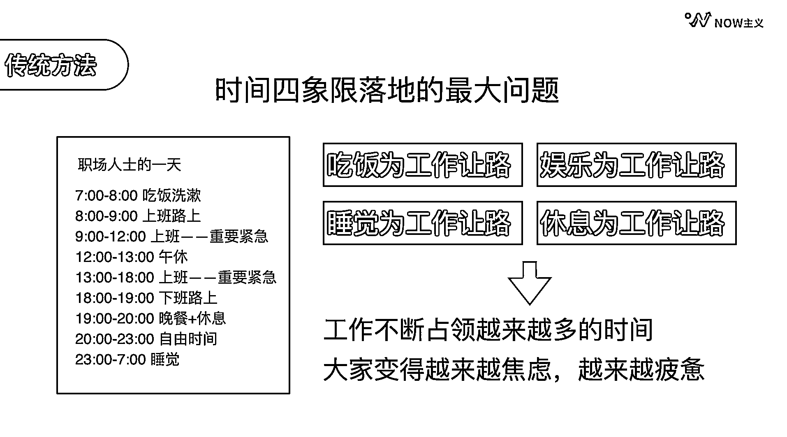
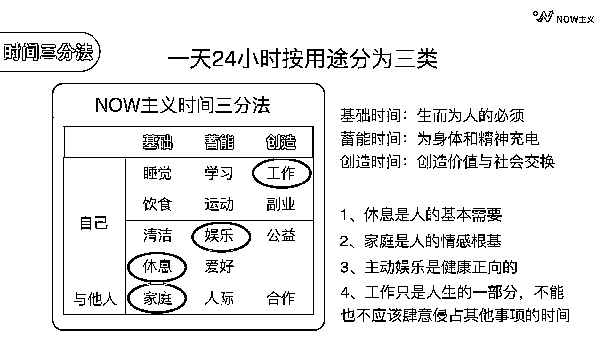
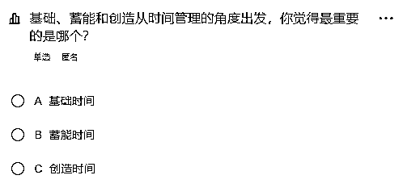
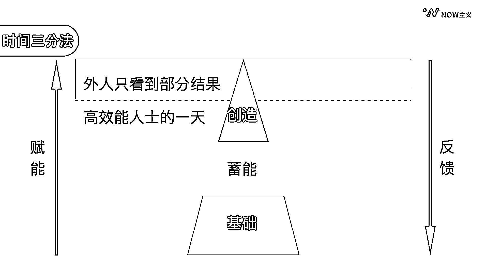
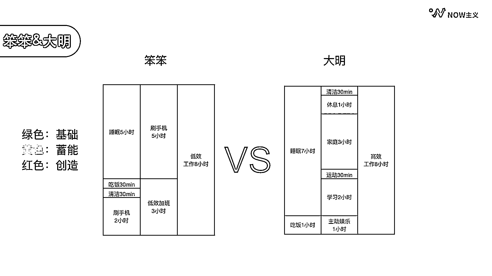
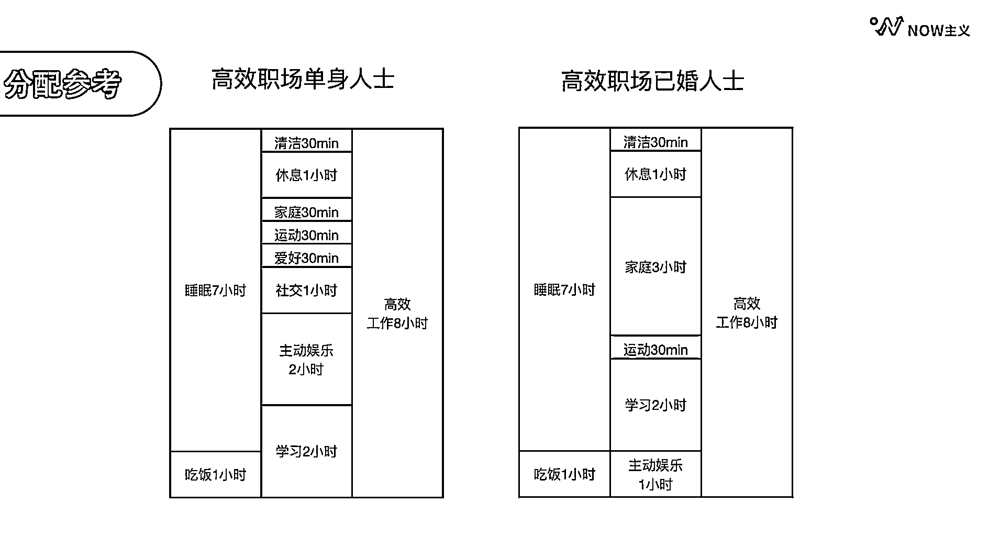
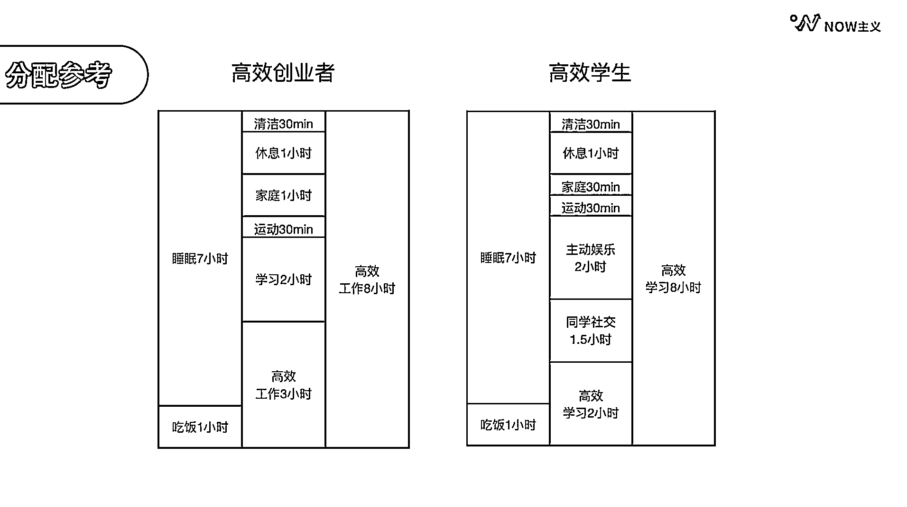
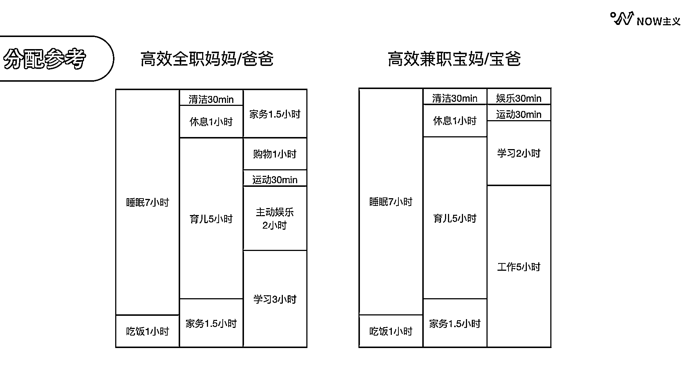

# 2.3.2 NOW 主义时间三分法

以上这个经典的时间分配方法，相信很多小伙伴在用了，也有一定的成效。也有小伙伴会觉得对自己的四象限管理比较困难，比如无法很好地分轻重缓急，或者事项总在增多等等。那么也可以尝试圈友 @车纯的高效人生 的分配方法：NOW 主义时间三分法。

首先，时间管理四象限是以事件为标准的，使用的过程中，很容易发现这四个象限永远可以往里面填无穷无尽的事情。然而事件无限，时间却是有限的。每个人每天只有 24 个小时，如果列事项的时候没有考虑到这一点，很容易列很多其实没时间去做的事。

其次，读书、运动都属于重要不紧急的事。但不紧急这个说法给大家的感觉就是今天不做没关系，慢慢的就变成每天都不做，甚至再也就没做过了，相信大家应该都有这样的经历。

第三，娱乐和放松都被划到不重要也不紧急的事情当中。但这恰恰就是人的天性。想一想，几乎每个人都可以一天不读书，但他绝对不可能一天不玩手机。

最后，不重要但紧急的事，时间管理四象限建议我们授权别人去做，但并不是每个人都有这个条件，而且很多事情别人也真的无法代劳。

在下图中我列出了职场人士的一天，你会发现这其中称得上重要紧急的事情，几乎都是发生在上班的场景里。长此以往，你会发现，我们吃饭为工作让路，娱乐为工作让路，睡觉为工作让路，休息为工作让路。最后导致的结果就是工作不断占领越来越多的时间，大家变得越来越焦虑，也越来越疲惫。

所以时间管理四象限是个非常棒的方法，但它比较适合只用来管理和工作相关的事项。在今天这个工作和生活边界越来越模糊的时代，只使用时间管理四象限，容易让我们把工作和生活对立起来，两边互相抢夺时间，造成焦虑内耗。

当我发现这一点之后，我就换了一个思路。我想，与其去纠结永远做不完的事情，不如从有限的时间出发，认真地盘点一下，我们一天的 24 个小时到底都用来做什么了。

不列不知道，一列吓一跳。我们一天当中要刷牙、洗脸、吃饭、通勤、上班、午休、刷手机，也许还要运动、看书、见朋友、和家人聊天，以及做自己感兴趣的事情。按照这个思路，我们把一天 24 个小时按照用途，其实可以归为三类：

第一类：睡觉、饮食、清洁、休息，这些是我们生存的基础，叫做基础时间。

第二类：学习、运动、娱乐、爱好，这些是让我们身体和精神得以充电的时间，叫做蓄能时间。

第三类：我们的主要工作、副业、做公益，本质上都是在创造价值，所以叫做创造时间。

而人毕竟是社会性动物，还有一些需要与他人合作的事情，在基础部分是关爱家庭，在蓄能部分是建立人际关系，在创造部分是与人合作。

我将这种时间分类的方法命名为 NOW 主义时间三分法：基础时间是生而为人的必须；蓄能时间是为身体和精神充电；创造时间是创造价值，与社会交换。这样的分类还能帮助我们更清楚地认识到每件事情的价值，避免无意义的精神内耗。

比如休息是属于基础时间，其实它是人的基本需要。不要为了自己想休息而感到焦虑或者羞耻，也不要为了其他的事情而拼命压榨自己的休息时间。

家庭是人的情感根基，无论是谁都需要花时间在家庭上，这是一个底层的精神需求，也是一个人幸福的根源，不是一句很忙没时间就能骗过自己的。

娱乐真的是被大家误解最多的事情。主动娱乐是健康正向的，也是人非常基本的需求。所以不要因为刷短视频而感到愧疚，你可以主动安排每天刷多长时间的短视频，在这个时间里面充分去享受这种快乐。

从下面这个表当中你可以清晰地看到，工作只是人生的一部分，不能也不应该肆意侵占其他事项的时间。

接下来问题来了，基础、蓄能和创造从时间管理的角度出发，为这 3 项的重要性排序，你会怎么排？

可能很多圈友下意识地就选择了 “创造时间” ，因为这个时间是用来工作赚钱的，赚钱难道不是最重要的事吗？

但其实，我们要赚钱，首先得有一个健康的精力充沛的身体以及身心健康的状态，所以基础时间做的事，吃饭、睡觉、清洁和家庭，才是我们最基本的生存需要，才是真正最重要的。

而第二重要的其实是蓄能时间，因为到了创造时间，你已经必须要直接拿出成果了。没有一个老板在招人的时候，是想让你在他那里学习，他们希望你能够直接给公司创造价值。但很多人现实中，却忽略了专门安排时间学习、运动，给自己充电，不断提升专业技能的重要性。

所以现实当中我们常常会看到，一个人在工作 5 年之后，他的身体很疲惫，知识储量几近枯竭，很难支撑他下一步在职场当中的发展。这就是因为弄错了这三者的重要性的排序，从基础到蓄能到创造，这是一个赋能的过程，反过来则是一个反馈的过程。

一个高效能人士的一天必然是符合这样的安排。然而我们往往只能看到外界的部分结果，误以为他所有的精力都用来工作。

我们再来看看前面笨笨和大明的例子，他们俩为什么会有如此不同的状态。这时候答案就显而易见了：笨笨的基础时间太少了，所以他没有办法维持一个好的精力，而他的蓄能时间又都是非常单一的，娱乐低效工作更是占据了他太多的时间。

但是大明有足够的基础时间让他精力充沛，而蓄能时间也安排得丰富多彩，工作时间牢牢地控制在 8 小时之内。相信这样大明即便偶尔加班，也能够很快的自我调整，回到自己满意的工作和生活平衡的模式。

这里我也给大家准备了一些不同情况下时间分配的参考。比如同为高效的职场人士、单身人士和已婚人士，在基础时间的大部分以及创造时间方面是不会有太大的差别的。关键在于蓄能时间的安排，单身人士会用更多的时间来发展自己的社交爱好。对于已婚人士来讲，这个时间可能有一部分给了家庭。

同样的，作为创业者，创造时间比 8 小时再多出 3 个小时也是非常正常的。但不管创业多忙，都一定要留时间陪伴家人。缺失了亲密关系的人生，赚再多钱都难以获得真正的幸福。高效的学生通常也要比别人花更多的时间用来学习，此外还会安排圈友社交以及娱乐等等。

再来看看全职父母这个群体，他们大部分的时间都花在经营家庭上了。我特别列出了基础部分的购物 1 小时，这也属于全职父母在家非常重要的一项工作。对比来看，在做兼职的宝爸宝妈，为了能有足够的工作时间和学习时间，也许会和家人协调，将家务时间缩短，也会主动减少自己的娱乐时间。

这里的每一张高效人士时间表的背后，都是一个用心努力经营着自己工作和生活的人。

每一个人一天都是 24 个小时，当我们处在人生的不同阶段，我们的分配比例会有所不同，这些都是非常正常的，关键在于有觉知地主动去安排和协调。

