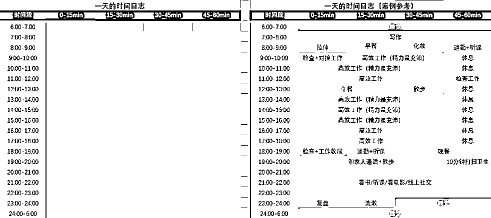

# 2.4 【练习】开启时间记录与优化分配

现在，我们已经了解了如何记录和复盘，也知道了时间分配的方法，那么现在就可以行动起来，做一个自己的时间日志啦，从记录和复盘开始时间管理。

第一步：时间记录

你可以下载块时间 App 来辅助记录，也可以用工具包里的时间日志表格来进行记录，方便后续整体复盘。时间日志模板下载：《时间管理 | 实战工具包》

时间日志表格模板概览：

第二步：优化时间分配

时间日志做好之后，结合记录的内容，我们可以完成下面这个小练习，开启时间分配的初步优化：

💡模板
第一步：我一天的 24 小时，按照【基础 - 蓄能 - 创造】进行划分，会包括以下事项：1、基础：2、蓄能：3、创造：
第二步：我的时间分配，可以这样优化：1、2、3、
给自己的一句话加持 / 鼓励：
参考案例：我一天的 24 小时，按照【基础 - 蓄能 - 创造】进行划分，会包括以下事项：
1、基础：睡眠、饮食、清洁、休息、通勤、打扫、化妆、和妈妈通话 2、蓄能：读书、散步、拉伸、看漫画、刷微博、链接朋友 3、创造：规划、IP、引流、产品、内容、运营
我的时间分配，可以这样优化：1、人际方面时间分配较少，开始每天上午 11:30 - 12:00 之间，链接一个朋友 2、睡眠时间从 12：00 调整到 11：303、固定早上起床后到 10 点为输出时间
给自己的一句话加持 / 鼓励：慢慢来，比较快

你也可以在工具包的表格中 - 第二个子表格找到该模板，下载使用：《时间管理 | 实战工具包》

