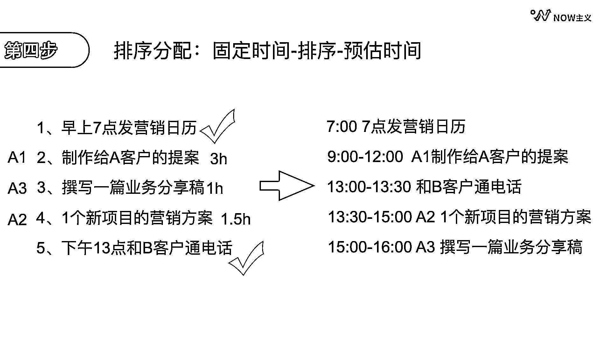

# 3.1.4 第四步：排序分配@车纯的高效人生@ T_T

我们先来看碰到的问题：每天本来就有常规任务，还有许多新增任务放在一起，经常不知道该先做哪件事，怎么办？

很简单，三步走：先排时间，再排重要程度，最后根据预估的时间安排进日程中。

举个例子：我今天的工作一共有 5 项，分别是早上 7 点发营销日历，制作给客户的提案，撰写一篇业务文章，搞一个新项目的营销方案下午 1 点和 B 客户通电话。因为时间是硬性条件，所以我会把固定时间的事情先排列出来，分别是 7 点发营销日历和 1 点到 1 点半和 B 客户通电话。

剩下的三件事，我按照重要程度排序为 A1、 A2 和 A3。我预估 A1 需要 3 个小时， A2 需要 1.5 个小时， A3 需要 1 个小时。 A1 是最重要的，所以我把它排在上午 9 点到 12 点的时间，接下来 1 点半到 3 点的时间完成 A2， 3 点到 4 点的时间完成 A3 。

排好这些事情之后，我们可能还要应对一些新增的事项。例如一些突发的紧急情况、计划外的紧急事件或者对我们产生内外干扰，却又不那么重要或紧急的事件。

这里要特别注意，有些的新增事项不一定非要自己做。如果判断不是自己的事情，可以果断地拒绝；如果判断可以授权他人去做，那就分出去。

对于需要自己做的， 2 分钟能完成，顺手就把它做了。2 分钟如果完不成，就把它放入事项清单，和其他事项一起比较，看看需要立即做，还是安排其他时间做。

综上所述，我们可以把工作中不同的事件分为：A / B / C 类来看

•A 类事件：我们确定必须自己亲自执行的重要事件，是已安排的计划内事件，包括重要紧急和重要不紧急的事件。

•B 类事件：突发的紧急情况，计划外的紧急事件

•C 类事件：其他时间，对我们造成内外产生干扰，却又不那么重要或者紧急的事件

把事项分类好后我们要坚持处理事项的顺序，参考如下原则：

首先保证 A 类事项被执行，记录推迟或委托 B 类事件，能不自己干的尽量找人干，C 类事情不做，只做文字记录。

我们第二个重要的意识形态，每天要确保 A 类事件（要事）在高能量时间段去执行，即高能要事。

一个人每天的效率高峰值通常在早上醒来的时间段内，一般 2-3 小时，我个人的话 一般早上 9 点开始 1-2 小时，下午 2 点后 1-2 小时，是精力最能集中的时间段，如果紧急程度都差不多的话，我会把 A 类里面最难的事项安排在这些时间段里面，如果是紧急事情，优先处理紧急事项。

但有没有一种可能，就是两个任务，我分辨不出来它的优先级？其实从来没有两个任务会有相同的优先级。只要放在一起比较，总有一个更重要。只要你能把当天要做的事情都列出来，应该先做什么后做什么，结果就一目了然了。

大家可以根据自身的高能时刻做调整。有的人深夜时刻恰恰是思维最清晰的时刻。

内容来源：《高能要事：如何通过时间分类来提高时间管理效率》

