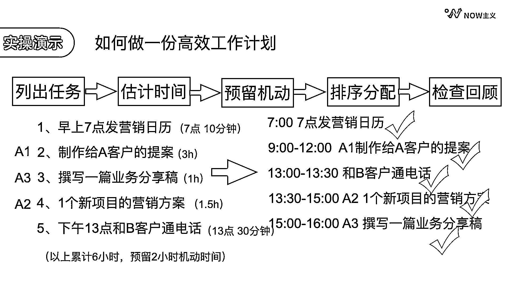

# 3.1.5 第五步：检查回顾

又一个常见的场景出现了：有时候一天下来感觉也挺忙碌的，但快到了下班时间，我们才发现待办清单上还有好几件事都没有完成，这是为什么？

我们的大脑很难同时记住很多事情，所以列了清单之后一定要多次回顾。简单来说就是一日三省。

•前一天晚上：在日复盘当中列出明日计划

•早上到办公室的第一件事：检查当日待办清单

•下午上班前：检查上午的事项完成情况，并调整下午的计划

•下班前：检查今日事项的完成情况

这样，到了下班之前就已经做了 4 次今日事项的检查了，基本上不会有遗漏或者耽误的情况。

总结一下，做一份高效工作计划的流程是这样的：首先，列出当日的全部任务。其次，预估每件事需要的时间，然后预留出机动时间。接下来对刚才的任务进行排序分配，先排固定时间的，再按照优先级排剩下的工作。最后，每天至少要有 3 次的检查回顾，确保任务完成。

这 5 个步骤常看常新，一定要经常练习，才能真正的完全掌握。记得学完就练，才能知行合一。

