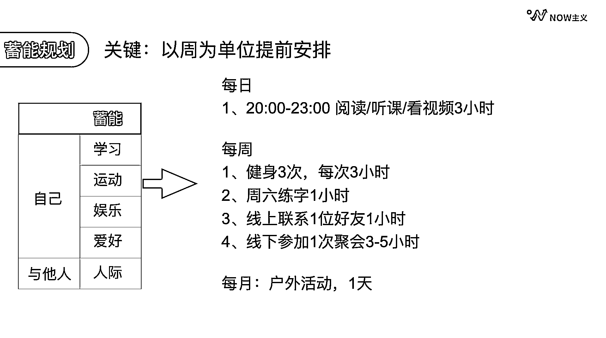

# 5.2 规划的 3 个步骤

蓄能时间主要有三步：第一，做计划；第二，估算大致时间；第三，以周为单位提前安排。

以我个人为例，我的蓄能时间主要包括学习、运动、娱乐、爱好和人际。做规划的时候就会先列出我想做的每类事情，具体有什么，再去估算每一项的时间。比如：

学习：我要阅读一本《影响力》，大概需要 8 - 9 个小时。运动：我要健身三次，每次健身 2 小时加 1 小时路上和清洁的时间，总共需要 9 个小时。娱乐：我想看一部 2 个小时的电影，一部 30 分钟的纪录片，每天还想刷 15 分钟的漫画，刷 30 分钟的微博。爱好：我希望能够在周末有 1 小时的练字时间，如果有超过一天的空闲时间，可以去户外爬山或者徒步。人际：我希望每周能够线上联络一位好友，线下有一次社交。

而且大家也一定都经历过这样的时刻：中午吃饭的时候想看综艺，结果打开电脑挑了半天，饭都吃完了综艺还没找到，或者晚上终于有时间，想看书。结果找了半天，都没决定看哪本书，时间也就这样过去了。

所以我们在做计划的时候，一定要提前把具体读的书、看的电影、做的运动都敲定下来，避免临时决定浪费时间。

所以我的常规蓄能时间可以这样安排：

这样的一个基础模型定下来之后，后续的蓄能就可以来参考安排了。

