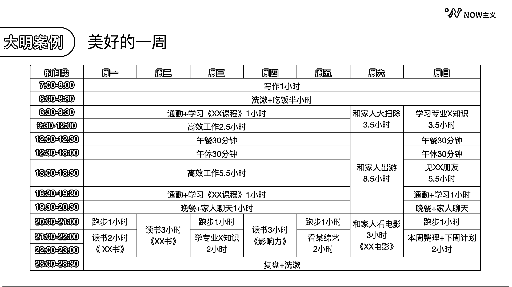

# 5.3 蓄能时间规划的注意点

以周为单位提前安排

在做蓄能规划的时候需要明白：不可能有完美的一天，但可以有完美的一周。

看看按照这样基础和蓄能规划的方式，美好的一周到底长什么样。我们来看看大明的一个星期都是怎么安排的。

看图可知，大明的每天早上都很规律，周末跟工作日的作息是一样的，这样整个人的生活状态会更规律，也更健康。而且因为已经提前安排好了具体的内容和需要花费的时间，所以基本上都是能够践行下来的。

像这样的一周是不是充实、丰富且愉快？相信只要我们持续地记录复盘，合理的规划践行，也是能够拥有这样完美的一周的。