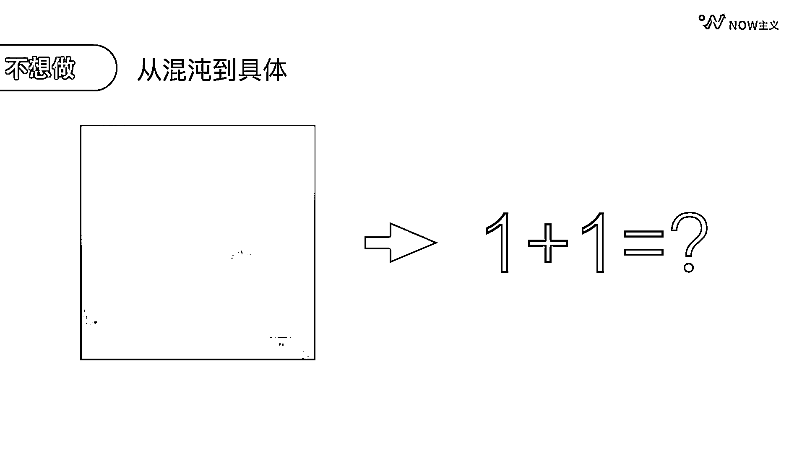

# 6.1 如何提高单位时间的产出

想要提高单位时间的产出，就要弄明白我们效率低下的根本原因。主要有三个：

第一，不想做

不想做的原因也有很多，比如受情绪干扰，这部分会在下面的情绪管理部分具体去讲解，这里先整体概括一下。

这种不想做的感受其实可以用「混沌」两个字来形容，不管是情绪还是做事，好像都有一层迷雾阻挡着。破解的办法就是要从混沌到具体，看下方的图片你就明白了。

左图会给你一种模糊的、迷茫的感觉，就好像我们面对一个复杂任务，但思绪混乱，无从下手的状态。

但看右边时大脑马上就会下意识反应出 1+1=2，这就是具体的力量，它能帮你绕开情绪的混沌，带领大脑直接开始思考解决方案。

大家在做事情的时候会不会发现，自己只要开始做了，越做就越来劲。这是因为越做事情就越具体，就变得更加自信。而越不开始做，事情就会变得越来越混沌，导致你逐渐被焦虑淹没。所以从不想做到开始行动，你只是缺一个开始。

给大家分享一句非常好用的咒语：我就先做 5 分钟。

不管问题有多难多复杂，先尝试做 5 分钟看看。一旦开始接触具体的事情，我们的注意力就会从焦虑转移到解决方案上，自然而然地开始行动了。

第二，想做但是不会做或者思路不清楚

开始做了之后，也会遇到一个新的问题：可能不会做，或者思路不清楚，同样也会导致低效。

这个时候我们可以大事化小。具体拆解路径主要有三步：

第一步：确认目的

第二步：确认有多少时间

第三步：确认做这件事情的标准是什么？

举个例子：领导现在让你做一份 PPT，你需要怎么做？一定要在接下工作的第一时刻就按步骤逐一和领导确认：

1\. 确认这份 PPT 的目的：原来是制作一份清晰简明的介绍公司的 PPT。2\. 明天下午就有客户来参观，所以你只有截止到明天中午前的 8 个小时来完成。3\. 内容方面是在原有的版本上加入最新的信息，并且要求 PPT 尽量简洁，大纲分成三节，每节的内容不能超过 4 个。4\. 领导还特别要求里面要有足够的案例，并且尽可能图示化格式，使用通用的 Powerpoint 就可以了。

了解了这些需求之后，我们再根据做 PPT 的流程以及所需的时间做进一步的拆解。

第一步：已有 PPT 资料整理，需要花费 1 个小时。第二步：撰写大纲文案需要花费 1 个小时。第三步：制作 PPT 加匹配图片、图示图表，大概需要花 4 个小时。第四步：添加动画转换格式检查 PPT 大概需要半个小时。剩下的 1.5 小时是预留的机动时间。

这样我们就把一个大任务变成了一项小任务，再结合我们当前的实际情况，就可以排进事项清单了。

在这里就有一个新的问题，面对一个新任务，如何快速掌握拆解逻辑？给大家一个解题思路。

1\. 公司原有的工作流程学习和使用。

2\. 通过网络搜索去学习别人的拆解流程。

3\. 直接找身边懂得的人请教。

这里的关键是，千万别花时间去原创，一定要去拿别人的模板来改。因为很多你第一次做的事情，已经有无数人做过并且总结经验了，不要去重新发明。车轱辘会做了就能提高效率吗？也不见得。

第三，会做但集中不了注意力导致效率低

无法集中注意力的原因，大致可以分为两大类，一类是被外部打扰，另一类是自己不够专注。

沟通是大家协同工作必须做的事情，但又因为这些沟通的部分，我们经常在工作中面临随时被打断的困境，而且一旦被打断，又很难回到工作状态里，很影响工作效率。这里教大家非常好用的一招：设置自己的防打扰时间。

举几个例子：

从部门协调的角度上来讲，财务部可以发布一个这样的通知：各位亲爱的同事们上午好，因公司发展良好，业务繁忙，最近财务部工作量陡增。现计划将每天上午 10：00-12：00 设定为财务部内部处理工作时间。有业务对接的同事，请在早上 9：00-10：00 以及 13：00 以后这两个时间段集中联系我们，谢谢大家的配合财务部。

如果你是甲方，想要催稿可以这么说：白云早上好，我是 A 公司负责与您对接文案内容的黑土，我们的文案需求已经发给您了，麻烦您在今天 13：00-15：00 之间这个时间段将文案的初稿发给我，我会在 16：00 之前与您确认，谢谢。

领导面试可以这么说：请将我的面试时间统一安排在周三 13：00-16：00 的时间段，如果有意外情况，我会提前通知。

工作对接我们可以这么说：收到，我上午要处理 A 项目这份文件，下午 3：00 之前我给到您，您看可以吗？

自由职业的朋友可以这样和身边的人告知：大家好，上午的时间我一般会用来集中输出内容，回复消息会比较慢，请尽量在下午 1：00 之后与我联系。

当所有的事情都杂糅在一起的时候，我们的效率是最低的。但如果你主动出击，提前和他人约定好沟通的时间，就可以帮助自己把每天的工作时间分为专注工作时间和专注沟通时间。这样该集中注意力做工作的时候就做自己的工作，该对外沟通的时候就在一个时间段里统一完成。这样两部分的时间就都是高效时间了。

所以其实预防打扰的秘诀就是先发制人，提前和对方约定时间，既能方便他人，也能解放自己。这也是《孙子兵法》中“致人而不致于人”的智慧。

除了被外界打扰之外，我们自己也会容易走神。经过多年的实践，我发现以下几个方法是真的很管用：

第一个，设置自己的专注环境。

专注环境还要分为信息环境和工作环境。在信息环境中，我们要尽可能的关闭所有非必要的软件提醒，这样你就不会被一些八卦消息或者不是很重要的新闻报道打断工作了。

越来越多的信息纷杂的微信群，也是隐藏的专注力炸弹。对于无法退出的微信群，我们可以设置成消息免打扰，过多的群还可以选择折叠该群聊。如果担心错过群里的重要信息，可以挑选「关注重要的群成员」，这些人在群里发信息才会提醒你，比如群主、班主任等。这样整理一波，你会发现真正有价值需要关注的群消息其实非常少。

工作环境：桌面不一定要完全整洁，但是工具要备齐，别刚开始没多久就发现缺少东西，导致工作中断。

第二，工作时要不要听歌？要具体判断。

如果你把听歌作为屏蔽外界噪音的屏障，听歌就是有用的。但如果你所在当前的环境非常的安静，听歌只是为了放松心情，那大概率它会让你走神，比如听到熟悉的歌忍不住跟着哼起来，或者听到不喜欢的歌还得打开手机切换等等。建议大家做有挑战性的工作时，关掉音乐，聚精会神。在做比较熟悉，游刃有余的工作时，可以打开音乐，在一个轻松的状态下工作。

当然了，即使不听歌，在办公室里挂上耳机，其实本身就是在告知他人别来打扰我，对自己也会有一种我要开始认真工作的心理暗示作用。

第三，可以给自己设置一些个性化的工作启动仪式，比如接一杯水放在桌上。

除了打造专注的信息环境和工作环境，我们还可以做一件事来主动监测和提升自己的注意力。具体怎么做，我们可以选择一个有倒计时功能的软件，开启 50 分钟倒计时。在接下来的过程当中，每当我们下意识地去看手机时，我们就记录一下屏幕上显示的时间，继续回到工作中，等 50 分钟倒计时结束，再来看看自己分心了几次。

这个办法多次练习，可以在短期内提升自己的专注度。它起作用的关键是能够在自己注意力不集中时，第一时间觉察并中断我们想要刷手机的潜意识，提醒我们尽快返回工作状态。

类似的倒计时工具有很多，这里特别推荐一款简单好用的 APP：Forest

