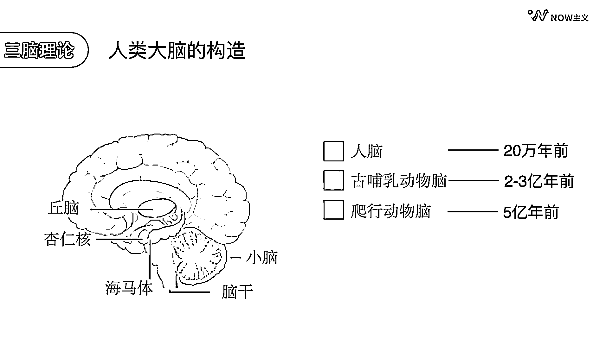
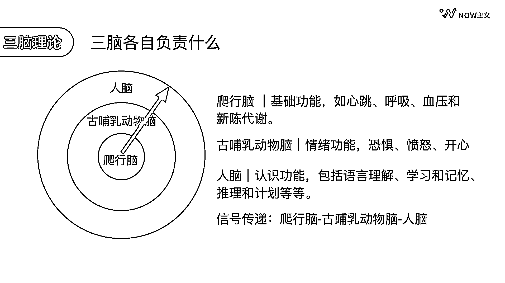

# 8.1 情绪的原理

假设我们处在理性的思考状态中，但在现实落地的时候，很有可能情绪一上来就什么都忘了。每一个人每一天都多多少少会遇到情绪的问题。为什么会这样？我们要从人类大脑的构造说起。

人类大脑的形成是一个非常漫长的过程，最内层的爬行动物脑是在 5 亿年前形成的，第二层的古哺乳动物脑大约在 2 到 3 亿年前形成；最外层的人脑是在 20 万年前才形成的，这就是著名的三脑理论。截至 2023 年 2 月，最新的情感神经科学的研究，已证明三脑理论由于过于简单，并不真的科学。但它还是揭示了大脑中情绪与理性最基本的关系，所以在这里，我们沿用这个极简模型，帮助自己理解和应对负面情绪。

三层大脑分别负责不同的功能。最内侧的爬行脑负责我们身体的基础功能，比如心跳、呼吸、血压和新陈代谢。第二层的哺乳动物脑负责情绪功能，包括恐惧、愤怒、开心。最外层的人脑负责认知功能，包括语言理解、学习和记忆、推理计划等等。

在我们的大脑中，信号的传递方向是从爬行脑到哺乳动物脑，再到人脑。我们将三层大脑的功能简化一下。可以这么看，最内侧的是负责生理基础，第二层负责情绪，第三层负责理性。这样的构造使得我们人类先有情绪，后有认知，而且情绪的作用远比认知的作用大。更重要的是，这是生理结构导致的，所以每个人都是一样的。既然每个人都有情绪，那如何做到情绪更稳定呢？

