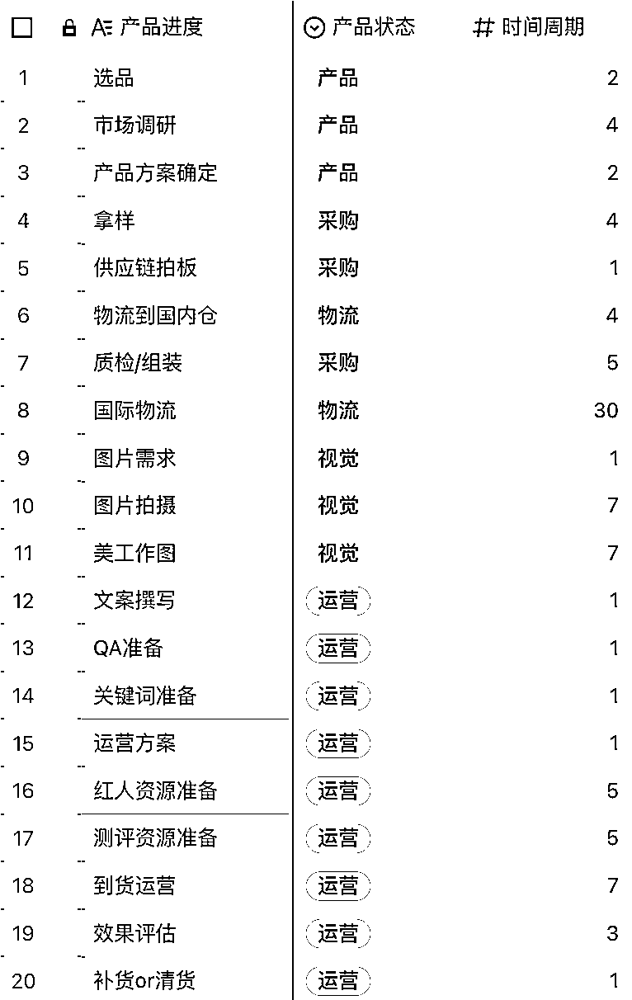
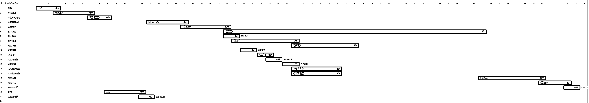
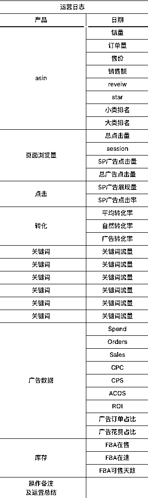
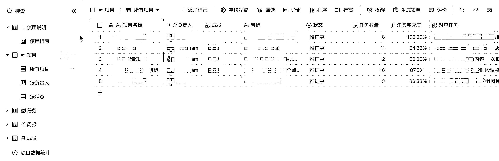
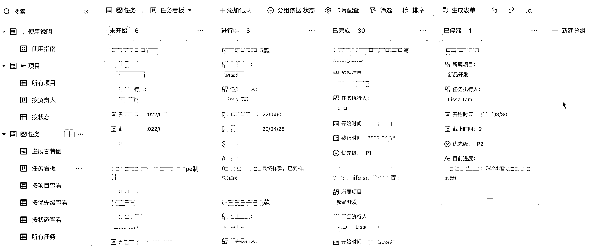

# 10.2 Lissa Tam：亚马逊创业者的时间管理

当亚马逊跑通后，我的流程基本上是：选品、拿样、确定产品方案、采购、拍摄、修图、剪视频、运营、补货。

大约是 2-3 周一个循环，偶尔遇到选品瓶颈期，则往后顺延。可以给大家看一下 21 年刚创业的时候做的进度甘特图。

选品是最让我觉得 “好像每天都没有产出、无所事事” 的一个环节，这部分就是以 “选出来一个产品” 为里程碑。

因为周期着实有些长，这让我感受不到什么反馈。

后来我就尽可能把量化颗粒度做细一点，比如说一天要海选出 XX 个产品、一周做 X 个产品方案、一个月确定 X 个可量产的产品方案。

除了工作流程外，重要还有数据分析和汇总。通过三方工具进行数据整理，自己再用 Excel 做个数据分析看板，用来追踪各个节点达成率。推新品也会有专门的推新记录表格。记录每日的销售数据、关键词排名、产品数据、流量转化率、新品日志等等，便于后续的复盘，以及推新策略的可复制。

大部分的时间，我都花在选品上，预估是占 65% 。产品花的心思比较多，在运营这一块，时间花费相对就少一些。在运营端，我目前只做效率最高、ROI 最漂亮的事情：投广告。像 post 这些，之前招了人我是全部给运营在做的。这个对于我而言，是需要花时间、ROI 还不错的事情，但我没有那么多时间和精力去做，遂排名靠后，时间不够我就不做。

新品我会每天都盯着，老品则时间节奏拉得比较长。新品每天看排名、看销量、看广告数据，进行调整；老品一般一周看一次，统一进行调整。然后再一周统计一次销售数据，对齐销售目标。

看起来很多很琐碎的事情，拆分到天，其实也没有那么忙。比方说最近一段时间，我会睡到 8 点起床，在星巴克从 9 点呆到 12 点，回办公室从 1 点呆到晚上 10 点。推进了上个月的两个要开模的产品，同时毙掉了上个月和这个月选出的品，目前正在为这个月的产品 KPI 发愁。

至于每天做的事儿，我偶尔在事情多的时候，会用印象笔记记录下来我要干的事儿，然后对照着做（实际上大部分我都没办法当天完成）。更多的时候，我则按心情做事儿。

我是个拥有人类缺点“拖延”、“懒散”、“情绪化”的人，我没有办法 100% 克服，而正因如此，这才塑造了我的样子。我属于“时间管理能力其实挺菜”，但我用“加班来凑”的人……

自由职业者贵在自律。自律使人自由，诚不欺我。

在我的时间管理方法里，我个人的理念是：时间管理旨在提高单位时间利用率，而不是时间总长度的花费。

我更倾向于“结果导向”+“聚焦”，这也会结合到精力管理。只有精力管理好了，时间利用率和效率才会变高。

这个方法也是在生财学到的，来自易仁永澄老师的时间管理 https://t.zsxq.com/03MrB2Zb6 和 CC 老师的精力管理 https://t.zsxq.com/03ZrfiybY。

然后我会再用飞书，每个月初，我会制作好当月 OKR / KPI ，然后再分拆为多个小计划，进行达成。

飞书的模板功能太好了好嘛！强烈建议大家都用上！同款链接：[《项目管理模板》](https://vzzx5hov90.feishu.cn/base/bascns3tNXQ7OjZB0RF9jQKPwsd?table=tblrpPfle2ObsJQP&view=vew9vIz0jN)

作为创业者来说，时间维度是需要拉长来看的，至少得半年往上。创业是个长期的事儿，很多时候往往放弃，是源于坚持不下去了，而非破产倒闭。

如果时间放长到周、乃至月，那么我一般是这样安排的：

•按照亚马逊项目流程进行工作，一般是平均工作 60 小时 / 周

•每周会文字复盘一次，2000 字的文章，时间花费在 1 - 2 个小时；6000 字及以上的文章，时间花费在 8 个小时

•每周至少锻炼 2 次，一般是跑步 / 刘畊宏 / 健身房 / 羽毛球，一般是平均 3 小时 / 周

•每周休息一天，大部分时间追剧、看书，偶尔画油画；每 2 周 / 月会自嗨一次，一般是花一个小时愉快地唱歌

•每月 / 2 个月偶尔出去玩一次，一般是海边 / 爬山

•每周喝 2 杯奶茶，一般是为了缓解焦虑（乱入）

生活是看起来似乎平淡又枯燥，但也正常地运转着。要是说我有什么遗憾，我觉得最大的在于：我没有充分利用好自由职业者的“自由”——空间自由和时间自由。随时随地的办公，去任何想去的地方旅行，做自己想做的事情。

内容来源：《Lissa 林氧氧裸辞创业的复盘--我是如何度过亚马逊创业这一年（经历/营收/时间管理/日常）》

