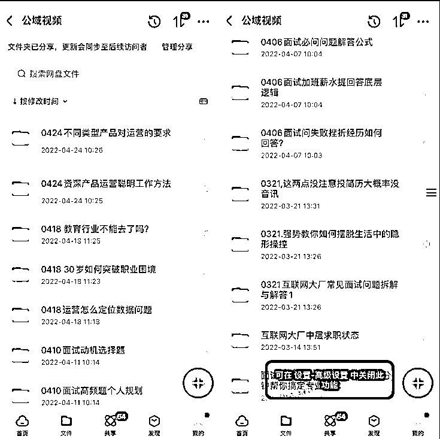

# 10.6 运营女超人子渝：职场博主如何做好工作、家庭和副业的时间分配？

我日常工作非常忙，家庭也需要照顾。做博主副业的时间是白天零碎化的时间 + 晚上下班后 9 - 12 点的时间组成。平时白天我会抽午休、甚至上厕所的时间，看一些最新的内容找找灵感，并记录下来。

下班时间我会整理灵感成为内容，周末录制。我还参加了 2 个学习班来丰富自己，希望增加内容的表现力。我会用周未等孩子上补习班或者收拾房间的时候来学习。确实是比较紧张忙碌的状态。

我管理时间基本都是用 SOP 流程化思维，以及花钱外包一些基础工作。

•流程化，就节省了很多重新计划、安排的时间，是提高效率的好手。

我会搭建好选题的排期，在周末和假期的时候集中输出录制，存在百度网盘中在碎片化时间进行剪辑。

•小钱节省时间

很多时候忙，是因为各种零碎的事情太多，而这些事情其实是可以外包出去的，把自己的时间更多留在核心的事情上。最近我找了小助手帮我剪辑视频和做图文，我只要专注于内容生产即可。虽然会然收入有所减少，但我认为有效的分工的方式能让我更好的坚持，并能专注于内容和视频表现的精进，:我觉得这是增强自已核心能力的部分。

内容来源：《中年宝妈“996”下班后当职场博主 聊聊我小红书从 0-1 到变现的过程》

