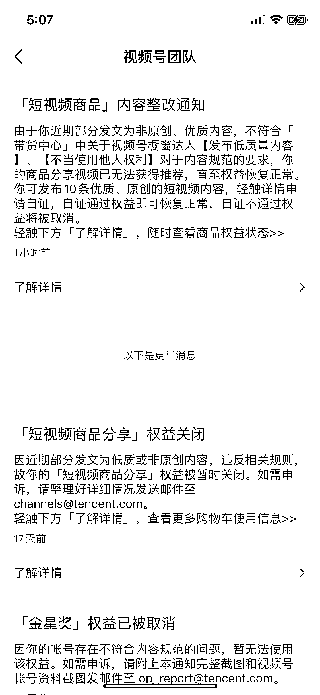

# 1.1 视频号现状

先定个基调：视频号不再像前两年那样，遍地红利，进来就是捡钱的时代。反而是进入了一个正规化、规则逐渐严苛、完善的阶段当中。

2022 年 3-5 月，随便搬运就可以爆视频，可以无人直播，半无人直播，店铺店群铺货模式。2022 年 6-8 月，简单混剪还可以爆视频，严打无人直播，半无人经常吃低质量。店铺开始打击刷量、重复铺货。2022 年 8 月份之后，搬运和混剪就更考验速度和技巧了。店铺需要达到一定要求才能入池。2022 年 11 月，新号扶持时间缩短，后端店铺开始清理微信小商店第三方后端店铺（有赞、爱逛、魔筷、微盟、微店等）2022 年 12 月 1 日，视频号仅支持带货「优选联盟」（视频号小店）的产品。2023 年 1 月，店铺评分系统和达人橱窗评分系统上线，后期评分会影响带货流量和选品机制。2023 年 2 月，对产品要求更严格，审核时间增长，对视频内容的原创度提高审核和扶持。2023 年 3 月，视频号直播可以直跳企业微信和微信客服链路，缩短转化路径。2023 年 4 月，微信视频号预约领券功能开放范围更新，「优选联盟」准入及清退规则更新。2023 年 5 月，群视频号功能内测，微信群可以开通群视频号，这将把社群和视频号打通。

现在的视频号纯靠搬运视频，已经非常难能有正反馈，更多的是通过二创视频，原创视频才能获取不错的播放量，进而获取不错的收益。

目前视频号短视频带货的主流玩法基本上都是：选品 - 创作视频 - 视频爆了 - 开直播成交。

这里会涉及到直播，大家不用担心，一是不直播纯靠视频引导至橱窗成交的玩法也一直存在，只不过转化率没有直播来的高，另一方面，现在的视频号直播转化还是比较简单，不需要高大上的直播间，只需要简单的回答商品相关的问题即可，没有什么太大的难度。

前文有提到视频号目前的规则逐渐完善，对于内容的审核力度也逐渐加大，可能你辛苦制作的视频发出去都是 0 播放，不用失望，这都是正常现象，继续打磨下一个作品就好。毕竟视频号现在是少有的付出时间就能有较大概率赚到不错收益的项目。

总的来说，视频号仍有 3 大红利：

•流量红利，没有抖音标签准和稳，但起号起流量还是相对容易。

•利润红利，抖音大部分行业比较卷，视频号普遍价格比抖音高 1 - 3 倍。

•人群红利，三四线城市和中老年触网少，信任度高，退换货较少。

除此之外，作为最早入局视频号的圈友 @盗坤 在 2022 年 7 月份的时候，也对目前的视频号局面做了一个分析，内容非常诚恳和客观，这里分享给大家：《视频号带货的真实世界》

内容来源：3 月 3 日《如何在视频号平台高效做带货》@李诚 Sonic；《2023 如何玩转视频号带货》@李诚 Sonic

