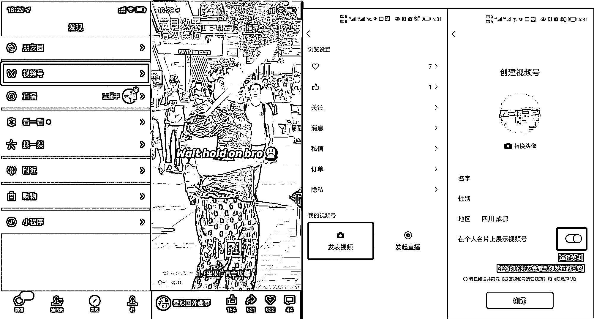

# 2.1.1 账号注册 @航海手册

如图所示，走完以下 6 步，就能完成视频号的创建：

1\. 在微信「发现」页面点击「视频号」；

2\. 在「视频号」页面点击右上角「人像」图标，进入视频号主页；

3\. 在视频号主页点击「发表视频」，进入创建页面；

4\. 在创建页面填写账号信息（头像、性别等），并勾选“我已阅读并同意《微信视频号运营规范》和《隐私声明》”；

5\. 如果不想让账号好友看到你发布的内容，关闭「在个人名片上展示视频号」；

6\. 创建完成。

内容来源：《8 月初阶视频号航海实战手册》

