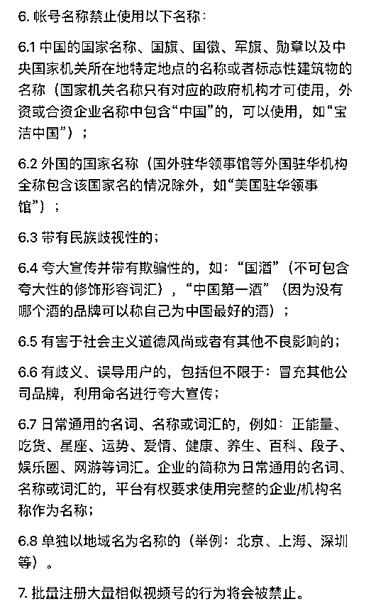
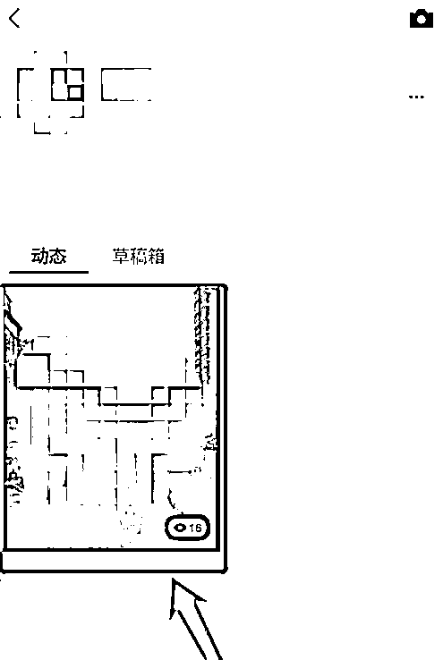
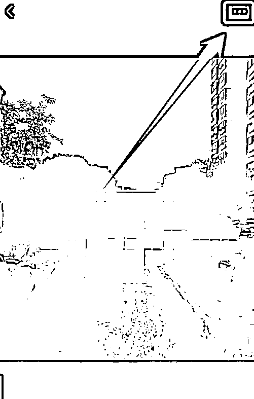

# 2.2.2 怎么包装自己的账号

1\. 账号名称

先来看官方给出的【账号名称】注意事项：

根据自己要做的账号类型确定名称，一个好的名字是可以自带搜索流量的。

最常用的办法，就是采用相关关键词的组合搭配方式，比如国学、书籍、认知等等。选择使用关键词组合是因为，这样在别人搜索关键词的时候容易被搜索到。

不过，有些朗朗上口的名字已经都被抢注了，所以注册名字的时候需要多准备几个，尝试下哪个可以注册。

一年最多能更改 5 次账号名，没有想法的时候可以参考各平台同类型账号的取名方式，也可以取通用的名称，例如【xx - 同款在橱窗】等。

•关于昵称修改@麦洛
•昵称一年只能更改 5 次。所以我们建议先设置一个通用的昵称，比如：xx-同款商品在橱窗•简介在视频号创建完成后可修改。修改路径为：视频号主页头像 → 右上角 … → 头像 → 简介•简介最好放 3 行文字，多了会被折叠•简介可以放一些引导成交内容，例如：同款商品在👇🏻下方购买。建议不要轻易放微信号，因为引导到微信成交的效率很低，精力浪费极大

内容来源：《视频号带货建议指南》

2\. 头像

一个好的视频号头像可以让我们更容易被他人记住。

视频号的头像可以是纯文字（名字缩写），也可以是图文形式，如果你不知道什么样的头像比较好，可以去搜索看下，你定位内容的视频号大 V 他们一般是怎么设置头像的。

制作方式：可以使用图怪兽等网站来进行头像的制作，又或者找些无版权的图片。

•图怪兽：[`818ps.com/`](https://818ps.com/)

•可画：[`canva.com/`](https://canva.com/)

•创客贴：[`www.chuangkit.com/`](https://www.chuangkit.com/)

注意事项：注意避免使用容易侵权的商标类图片，也建议不使用个人头像，容易和账号定位不符。

3\. 个人简介

简介是随时可以修改的，要结合账号的定位去进行修改，这个完全可以参照已有的大号的方式去进行编辑。

作为带货号，最直接有效的简介就是引导大家如何购买，比如可以写：

视频同款，在👇🏻下面【商品】购买

微信号可留可不留，如果简介想留微信，虽然是腾讯自家地盘，但是为了以防万一，可以用隐晦的方式提及。但建议最开始不要加， 可能被同行举报。等账号成熟粉丝多了可以再改，比如：

•+v:

•更多 xx 联系领取：

•商务合作请联系：

4\. 置顶视频（在后续开始更新后）

一个账号最多可以设置 2 条置顶视频，置顶的先后顺序也需要注意一下。

一般来说，置顶第一的视频可以选爆了或近期热点的视频，第二置顶选一个最看好的带货视频。

对于带货号来说还有一个小技巧，置顶视频可以放教用户如何下单的引导视频：

[p.mp4](https://search01.shengcaiyoushu.com/upload/doc/U4hgduUC2oyyl6xt72rcuxnDnEg/Cq0YbZSc3oj82hxuEUccpfn8nCd)

如何置顶呢？

找到需要置顶的视频→点击视频页面右上角的【···】→选择下方弹框的【置顶】→完成置顶

内容来源：《8 月初阶视频号航海实战手册》

