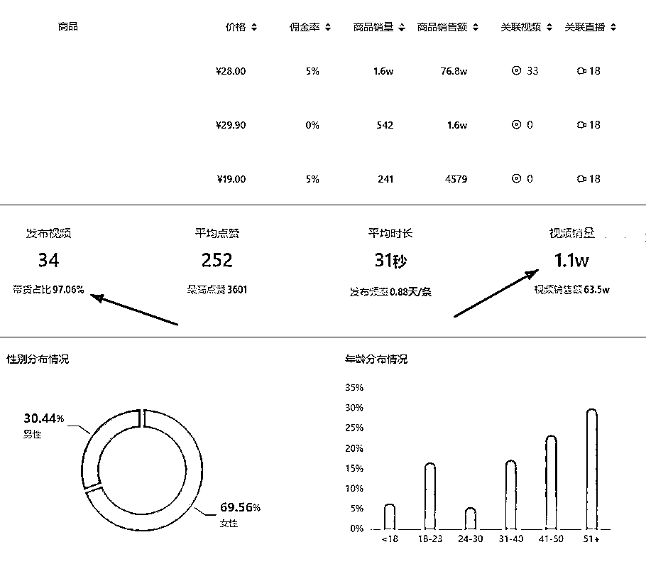

# 3.2 视频号选品技巧 @黄老师

因为号主会在各个平台分发视频，所以选好商品或者视频后一定要去视频号查看是否没被搬运。

先搜搜名字查看，再根据视频文案，选择有特点的几个字去视频号搜索。确定视频没有被搬运，或者没有被过多二剪。如果在实时这个窗口下找到太多的同行，就会放弃这个品。

1、选择商品（抖音快手等平台），从上到下依次不断淘汰

•商品价格是否满足要求

•商品销量是否满足（销量的判断根据商品利润自己抉择）

•查看商品粉丝画像（视频号主要人群为 40＋）

•一键搜图查看一手货源价格（商品利润是否满足）

•查看商品视频对应的博主

•带货博主数量为一（或者几个账号明显可以看出是一家）

•博主的视频和直播情况（带货视频的销量要平均，如果是靠一个视频爆了带来的销量，我就会放弃，运气这东西模仿不来。直播带货是否是多场每场都有销量，而不是一次直播直接带出来这么多销量，在每次逛数据平台我发现好多都是假数据，我发现好多商品的销量都是刷的，按以上方法应该可以杜绝好多问题。)

2、选择账号（抖音快手等平台）

进入蝉妈妈，考古加等平台按账号涨粉情况，花时间一个一个去看。（你会看得到直接带货的账号）

需要注意的是，目前视频号是没有第三方工具的，只能看抖音快手的账号，比如用蝉妈妈考古家看抖音对标账号的内容、数据、选品作为基础参考，然后放到视频号测试。

•账号的商品越少越好（这样的帐号视频内容都比较垂直）

•博主涨粉情况 —— 近 3 个月新起账号（比如粉丝 30 万，近三个月涨粉 30 万，账号涨粉比较稳定，而不是一个或者两个视频涨起来的）

•视频更新频率 —— 90 天更新的视频，视频的点赞和商品转化是否比较平均，视频更新越多越好。（有时候不要觉得别人视频很垃圾，我们是给 40+ 人群去看的，审美不同，它能卖的动，说明他的粉丝是有需求，我们去搬运也是一个道理）

•视频内容 —— 内容比较垂直，基本都是带货视频为主

•有直播能力的可以具体分析查看账号直播内容（这种账号直播间都比较简单，后期视频有流量，买回样品可以直接开播）

分析上图账号，单月总发布视频 34 个，33 个关联第一个商品，剩余两个商品都是靠直播带出去的，三个商品有些许关联，大家可以看看生财的一篇文章《淘宝单店方法论：烤红薯——淘宝小白做店 27 天，月利润 10 万的思考》，淘宝烤红薯理论，就是这个道理。账号粉丝画像也满足视频号要求。账号粉丝目前也不算多，看点赞就看的出来，纯带货。这种账好做的点就在于商品单一，可以自己带货自己上品，后期无论时间和精力花费都很少。

内容来源：[《如何做到条条视频上推荐的》](https://vb2bp8p65o.feishu.cn/docx/doxcnRNRukckLnpSaPkIVloM1pT)

