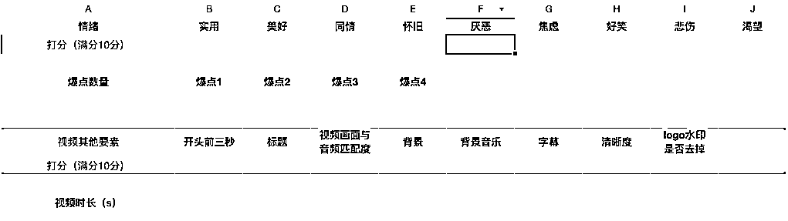

# 5.1 短视频爆款思维

1、热点思维

为什么要注重热点？一是平台会给流量倾斜，二是粉丝爱看。实在不知道怎么追热点，那就看抖音热榜，什么热就追什么。

2、爆点丰富度

什么是爆点，爆点就是让视频火的元素，一个视频爆点越多，那么视频火的概率就越大。

3、黄金前三秒

重视黄金前三秒，也就是视频开头的前三秒，做短视频必须要在前 3 秒就能够吸引大家的注意力，如果前 3 秒吸引不了用户，那用户又怎么会把整个视频看完呢。过了 3 秒以后，讲的故事需要能够吸引人，让人能够持续的看下去，最后几秒的时候，让大家情绪爆发，继而转发/评论。

下面以一个上了推荐的视频举例：

这个是参加咱们视频号小航海第一次上推荐的视频，很典型，并且也很有纪念意义，所以就用这个视频举例了。（后面我其他账号的很多点赞 10w+ 的视频跟这个视频的逻辑都是一样的）

热点思维方面：

阿里巴巴被罚 182 亿，这是个当时很热的事件，在各个平台都是个大热门，有极高的曝光。

爆点丰富度方面：

爆点 1：阿里巴巴被罚 182 亿，这个是一个热点事件，热点事件本身就是一个爆点；

爆点 2：马云本身就是一个爆点，本身就具有很高的知名度，受关注程度也很高；

爆点 3：内容是马云讲公司越大压力越大，听起来仿佛是马总在狡辩，必然会在评论区引起讨论；

爆点 4：背景音乐制造了一个紧张的情绪，情绪被带动起来了；

爆点 5：在下面的标题设置了疑问，希望能在评论区引起回答。

黄金前三秒方面：

1：在上面设置了标题，使用户一下子就了解到了这个事情，并且把被罚 182 亿元进行了重点展示，这样用户一进来就看到这个被罚 182 亿元，马上被抓住眼球；

2：开头就是马云，前面给大家讲了，马云也算是个爆点。

4、爆款视频打分表

新手要是对自己做的视频实在没有把握的话，可以参考我这个表格对自己的视频进行打分，如果得分越高，视频爆的概率越大。

