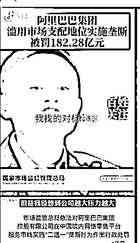

# 5.3.1 拆解爆款视频

找到可学习的同行后，对同行的爆款内容进行拆解：视频内容，文案，标题，bgm，评论……拆解的越细越好，这样才能找到这条视频会火的原因，并且学习复制他。

下面以一个我们曾经参考的同行视频举例如何分析这条视频火的原因。

1、视频内容层面

阿里巴巴被罚 128 亿是当时一个新鲜出炉的大热点，热点是所有平台和用户都喜欢的内容；而且阿里巴巴集团本事就是一个自带流量的集团，他的任何风吹草动都会备受关注；配图是马云，马云也是自带流量；被罚 128 亿数目巨大，而且用户很喜欢看高高在上的东西突然倒塌。

2、背景音乐

背景因为为紧张激动的配音，而且是新闻类常用的热门配音。

3、评论区

评论区里面全是对马云和淘宝的假货的各种调侃甚至谩骂，由此可见，马云和淘宝是可以再进行加工的话题。

