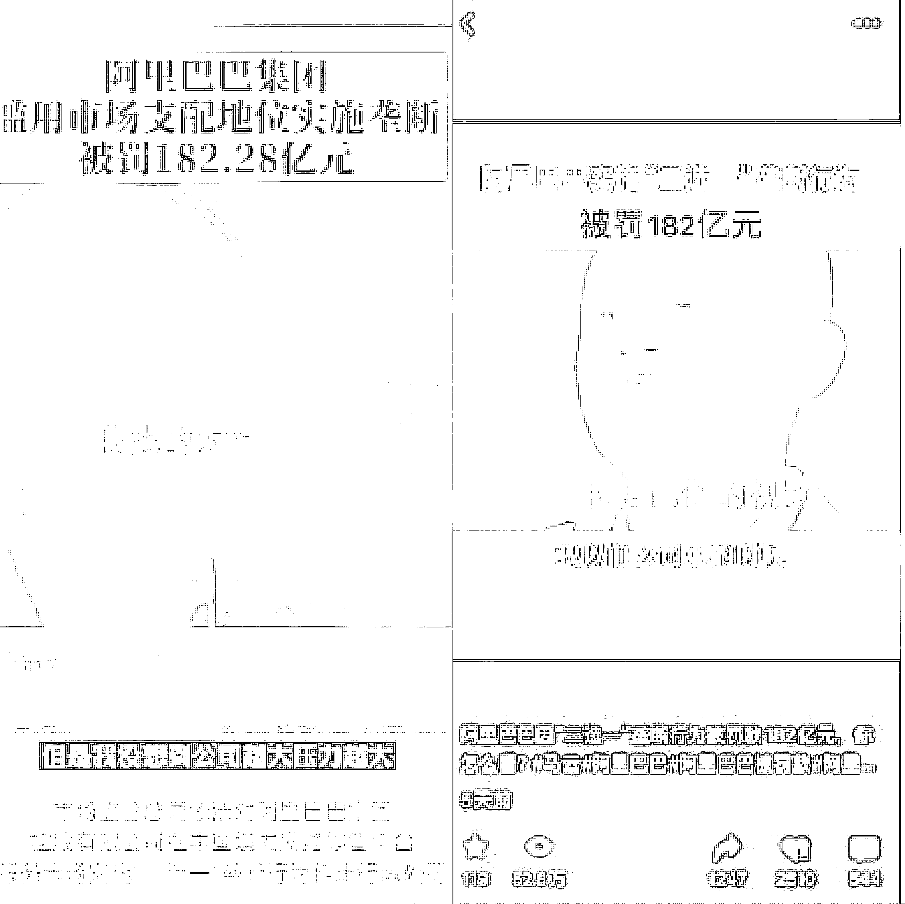
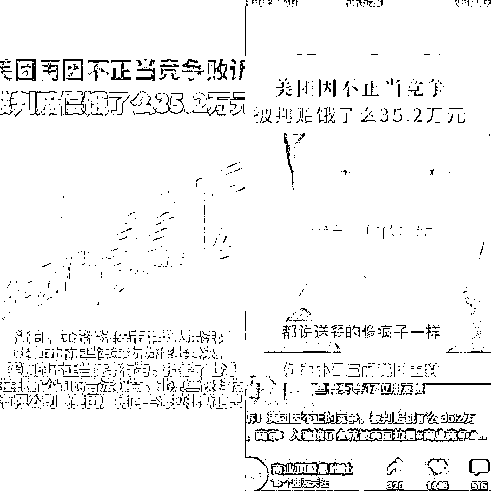

# 5.3.2 模仿学习爆款视频

从同行那里找到对标视频以后，进行内容升级。比如他原来有一个爆点，那么你就再增加一个或者两个爆点，增加的越多越好；视频的画面清晰度也可以进行优化。下面以我两个获得推荐的视频举例如何后超越。

视频一：

左图为对标视频，右图为我自己做的视频

我跟对标视频的演讲内容没有任何差别，但是我对标题进行了优化，把上面的标题由三行调整为两行，之前三行有点太多了，我一眼看不完那我可能就滑走了；并且把被罚 182 亿元进行了重点展示，这样用户看到我的视频，一眼就会看到重点信息，马上被我抓住。而且我视频的画质清晰度明显比对标视频更好。

视频二：

左图为对标视频，右图为我自己做的视频

对标视频是一个美团被判赔偿饿了么的一个新闻类型的 ppt 展示，我觉得爆点不够，就找了美团有关的其他视频，最终用了一个外卖小哥三问美团创始人王兴，视频内容是外卖骑手送餐速度以及超时赔付的一些行业痛点，这必然会在评论区导致一些争议，使视频有更高的概率获得推荐，果然这个视频就被推荐了。

有小伙伴给我讲，他以前刷到过这个外卖小哥三问王兴，没想到还可以这么用，是的，可以拿来嫁接，就是这么神奇。

