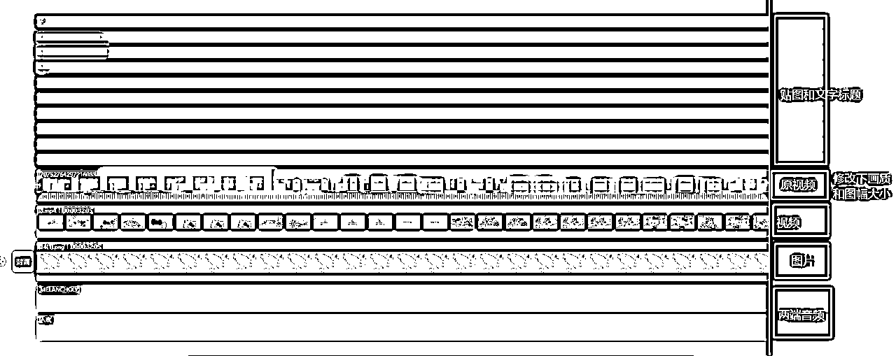
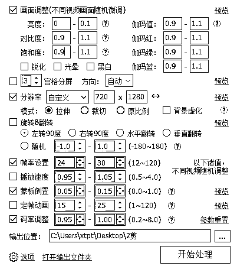
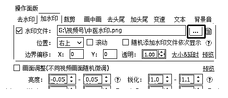
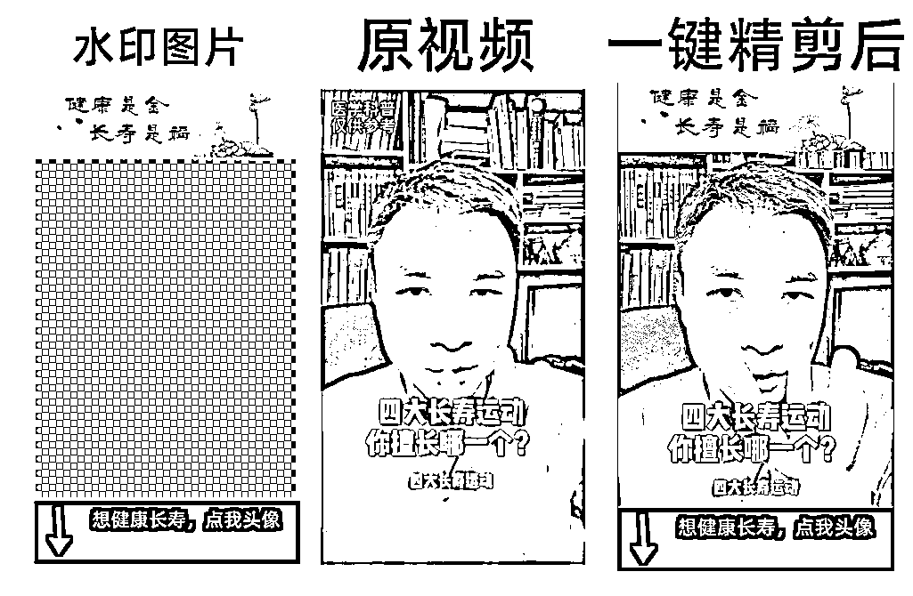
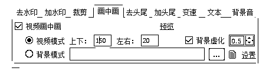

# 5.4.2 制作并使用视频模板

软件：剪映（电脑端）

原视频去水印后，去剪映里二次编辑

通过 1 个视频画中画 + 1 个图片画中画 + 4 个贴图素材 + 2 段音频+重新编辑的标题等一系列操作来完成视频的二次剪辑去重。

也可以按照下图的逻辑来二次剪辑

原视频位放背景图，素材置于背景图之上，加上画中画 + 边框 + 贴图 + 音频等素材完成二次剪辑去重。

内容来源：《8 月初阶视频号航海实战手册》

制作好视频模版后，可以帮助我们大大提升后面的视频制作效率，除了这种方法制作模版以外，圈友 @figo 还分享了另一种方法：如何批量去重、批量制作内容，这里摘录部分内容，完整内容可以见这里：《如何剪辑视频和制作剪辑模板》

1、利用 CRVideoMate 软件完成基础混剪，详细参数如下（可自定义）

2、制作水印 PNG 图片，使用软件所带水印功能

↓添加水印效果如下↓

3、如果直接加水印会遮盖住原视频的重要部位，可以压缩原视频高度，参数如下

注意：此处“上下数值”高度应该大于等于我们水印的图案高度，这样画面才不会被水印遮住。我设置的 150 ，你们可以更高或者更低。

压缩后的效果如下↓

PS：软件支持制作多款水印，实现一个品类一张水印的效果，并且可以导出参数，对应不同类型剪辑。

CRVideoMate 软件下载地址：

[`www.cr-soft.net/crvideomate.html`](http://www.cr-soft.net/crvideomate.html)

内容来源：《利用批量剪辑软件 CRVideoMate，一键完成视频号精剪去重，可带个性化图案》

