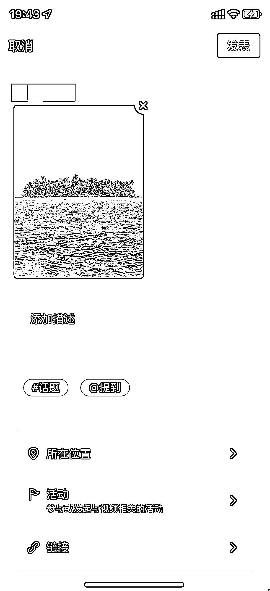

# 6.1 手机端视频发布视频

发布的流程很简单，有一些小的注意事项会在后面提到

•描述：添加跟商品相关的文案

•话题：添加流量高的话题。假设你卖的是芒果，那可以加上垂直的 #芒果 话题，类目的 #水果 话题等

•提到：我们不会添加这个。对于我们带货来说，暂时没有想到场景

•所在位置：可以添加你附近的位置。位置对分发也会起到一定效果

•活动：我们一般不会添加。发起一个活动后，可以在活动里面编辑一些信息（比如直播活动，私域引导等），每个视频都可挂这一个活动，增加曝光量

•链接：上一篇文章里面提到过，我们主要在这里面添加带货链接

