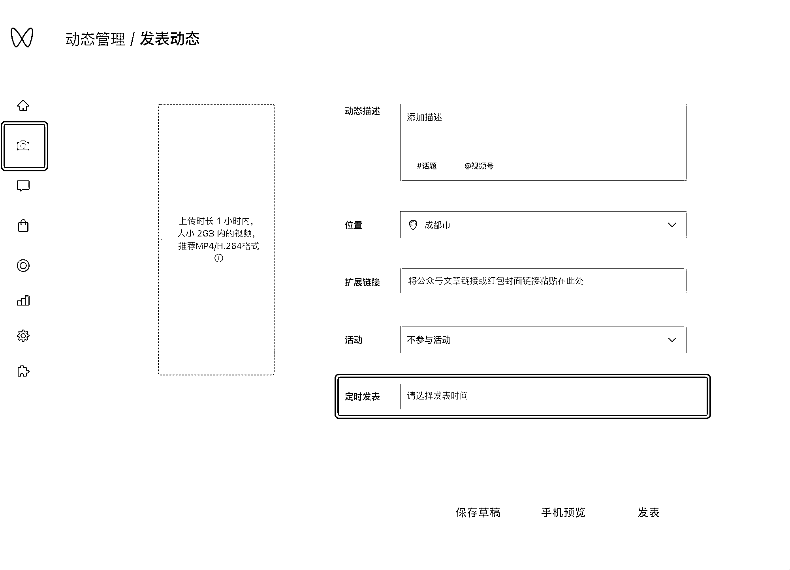

# 6.2 电脑网页端发布

[`channels.weixin.qq.com/`](https://channels.weixin.qq.com/)

我们除了使用手机端 App 发布视频，也可以使用视频号助手发布，优势有以下几点：

1\. 网页端可定时发布视频

2\. 网页端可绑定视频号运营者

3\. 更方便的管理视频评论

定时发布视频

比如一个账号需要发 10 个视频，视频发布频率为 1 小时 1 条。当你管理的视频号太多，用手机发布视频就会很累，并且可能会出差错。所以，1 个账号传 10 条视频，使用定时发表就会方便很多

期少量定时发布，不会影响视频的分发，不会影响视频流量

💡注意：•用网页和 App 发视频效果一样，不会影响流量•话题很重要！话题很重要！话题很重要！一定要加•一个账号每天建议发布 10 条左右的视频。不要发太多，间隔时间不要太短

