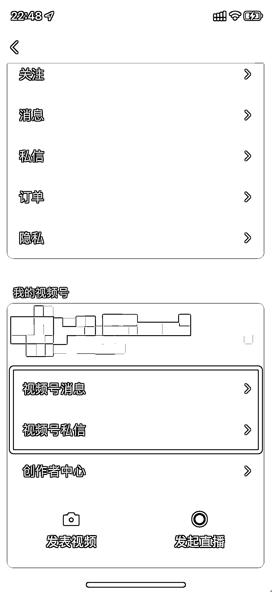

# 6.3.1 评论、私信、打招呼消息回复 @麦洛

一定要去回复，回复的目的是要引导去下单，回复的内容要围绕他们的问题，不要自说自话

不要因为一两条的「不好评论」不开心，跟别人吵起来，大可不必：

吵架不会让你赚钱，持续的进步和做事才可以。

遇到这种评论，你可以完全不理会，或者删除，或者可以在视频号助手里面进行「精选评论」操作，不让「不好评论」露出

内容来源：《视频号带货建议指南》

