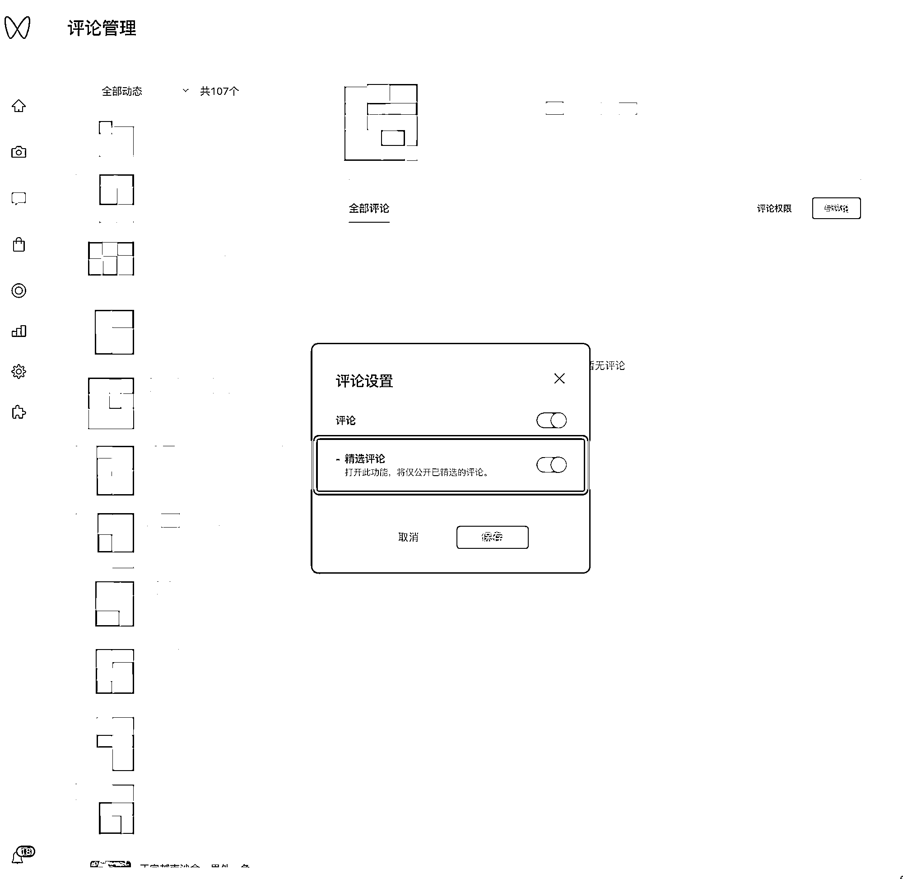

# 6.3.2 如何管理多账号评论 @麦洛

如果你的手机正在直播，或者你几个账号切换麻烦，但是又想要通过评论回复引导大家去橱窗购物

那你可以通过「绑定视频号运营者」，然后统一管理几个账号的评论

如果评论里面有大量的「不好的声音」，也可以打开「精选评论」，放出想要其他浏览者看到的内容：

这一步相对简单很多，视频号助手的其他功能大家可以自己摸索。

发视频注意间隔时长拉长一点，就没有问题。

如果视频没有流量（0 播放），可能的原因很多，比如：

•账号被判定为营销

•视频内容已经被搬运过

可以一步一步的排除问题在哪里：

•如果视频号发布其他内容，存在流量，那是视频内容的原因。换视频内容即可

•如果账号发什么内容，都没有流量，那可能是账号的原因。如果用其他账号测试发布相同内容存在流量，那我们注销视频号即可

从现在的反馈和实际操作来看，官方对搬运视频的打击越来越严格，我们在后续的「6.6 零播诊断及解决方案」中会展开讲讲。

内容来源：《视频号带货建议指南》

