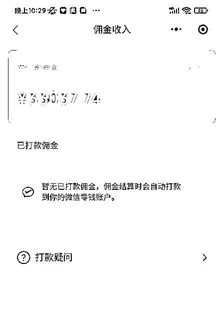
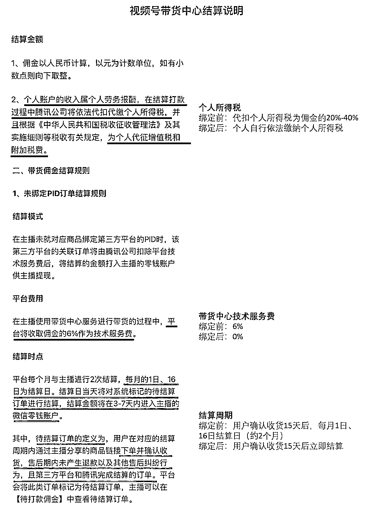

# 6.8 如何查看视频号带货数据

创作者中心 → 带货数据 → 今日数据 → 佣金

需要注意的是，提现需要手续费。

不同渠道商品的提现手续费不一样：

•小商店联盟：6%

•小商店导购：6%

•爱逛：16%，如果绑定了爱逛小店直接去爱逛小店提，则是 10%

•魔筷：6-10%，必须交 990 元才能提现

目前，打款日并不十分固定，不同渠道的提现周期也不同，具体可以参考这份官方说明文档：[《小商店带货结算规则 | 微信开放社区》](https://developers.weixin.qq.com/community/business/doc/00064631af05c0783d8b3e9955b00d)

如果带货数据不如人意，我们需要考虑如何进行优化迭代，这点我们在「八、如何优化内容」中展开讲。

