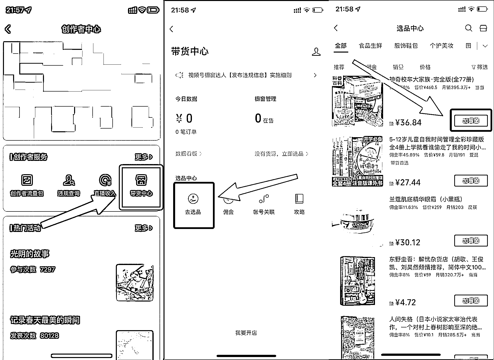
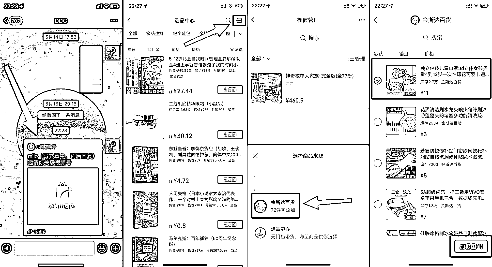

# 7.1 个人主页挂商品

个人主页展示商品橱窗（对粉丝数无要求，需要先在选品中心添加商品进橱窗）

1\. 创作者中心点击「带货中心」

2\. 带货中心点击「去选品」

3\. 在选品中心可以搜索你想要带货的商品，点击「加橱窗」即可

但是在「选品中心」添加商品到橱窗你能会发现以下问题：

•没有想要的商品：在选品中心找不到我们想要带的商品（钱就这么溜走了）

•佣金率低：帮其他商家带货赚不到钱

•僵尸商品：其他商家随便挂的商品，已经不会发货了

•商品被选品中心下架：其他商家的商品在选品中心被下架，已经发出的带货视频作废，无法再出单

•转化率低：其他商家不太会去处理从商品进入的咨询

•退货率高：其他商家发货时间慢，导致客户等不及退货

所以更建议的方式是，把商品上在你值得信赖的人的小商店（后面解释为什么需要「值得信任」）

操作方式如下：

1\. 小商店管理员给你发送关联视频号邀请

2\. 在选品中心点击右上角「橱窗管理」（如何进入选品中心：创作者中心 → 带货中心 → 去选品）

3\. 选择我们绑定的小店

4\. 选择要带货的商品，点击「添加橱窗」

5\. 完成（截图店铺只是作为演示，其中商品不构成带货建议）

为什么要值得信任：小商店管理员可以控制商品佣金率，如果带货爆了，无良商家可能会修改佣金率为 0 ，导致你第二日之后出的单拿不到一分钱。大家留一个心眼。

同时需要特别注意的是：根据 7 月 21 日新规，新的视频号无法再绑定小商店，无法添加小商店商品进入橱窗。

如果想更安全平稳的运营好自己的橱窗，建议大家先浏览这些官方的规则合集：

[《视频号橱窗带货规则总则》](https://support.weixin.qq.com/cgi-bin/mmsupportacctnodeweb-bin/pages/axzzmpdhcPsqWfJB)

[《【视频号橱窗】管理规则合集（可对外）》](https://docs.qq.com/doc/DTnVBdlZYRFJKTXJi)

[《视频号橱窗达人违规管理规则》](https://support.weixin.qq.com/cgi-bin/mmsupportacctnodeweb-bin/pages/GnthDa5G3By6vyDL)

[《视频号橱窗开放类目一览表 -2022 年 5 月 17 日发布版》](https://docs.qq.com/sheet/DTURoVFZiVXdRQlJj?tab=BB08J2)

