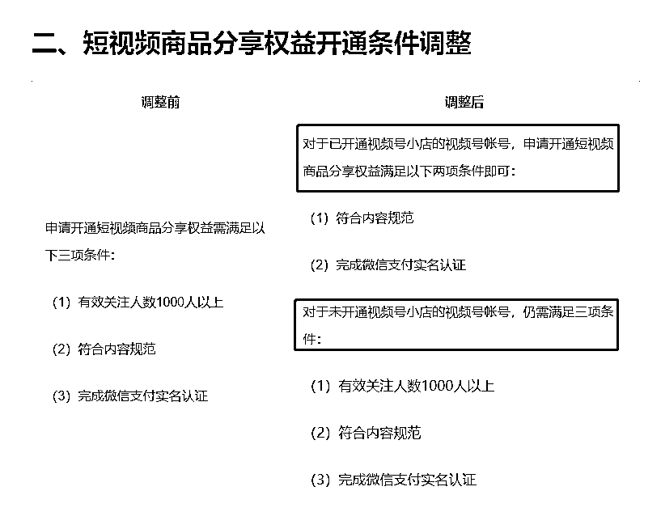
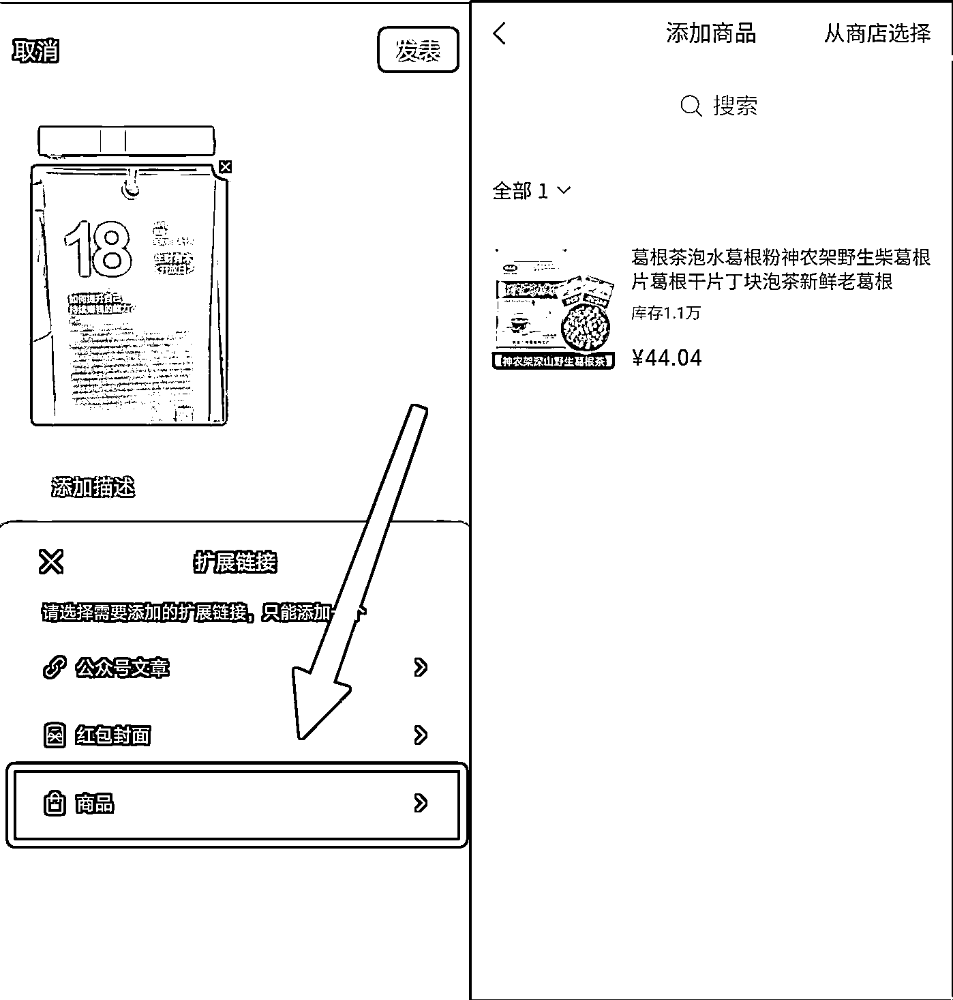

# 7.2 发视频挂商品 — 挂商品链接

方法一：挂商品链接

但目前已无法绑定小店，只能从选品中心选。

方法二：通过购物车挂商品橱窗内的商品

发视频通过购物车挂商品，第一道门槛就是需要获得购物车。

目前视频号关于账号开放购物车的权限进行了调整，详见[《视频号短视频商品分享权益、加热商品功能调整公告》](https://support.weixin.qq.com/cgi-bin/mmsupportacctnodeweb-bin/pages/xMfOwhhPENOpYAK4)。

针对已经开通视频号小店的视频号账号，条件是：

•账号的内容符合规范（重点）

•完成微信支付实名认证

针对未开通视频号小店的视频号账号，条件是：

•账号粉丝大于 1000

•账号的内容符合规范（重点）

•完成微信支付实名认证

简单来说，开通视频号小店的账号，不需要千粉了，普通账号还是需要千粉才行。

此外，“符合内容规范”这一点非常玄学，导致大多人没法获得购物车，只能在市场上直接购买带有购物车的视频号账号，目前一个账号价格 3000 元左右不等。如果想要快速入局，先上手试试手感的圈友，可以通过直接购买的方式来获得购物车。

如果不想承担这个成本，可以看下圈友 @肖肖 的复盘：《1 个月拿到 28 个视频号购物车的经验复盘》

因为已经通过上面的步骤把商品挂到橱窗了，所以在发布视频时，我们按照以下步骤操作即可：

1\. 拓展链接选择「商品」（也就是我们说的购物车）

2\. 在橱窗里面选择该条视频需要带的商品（我们在前面提到过怎么把商品加入橱窗喔）

3\. 完毕

内容来源：《视频号带货建议指南》

