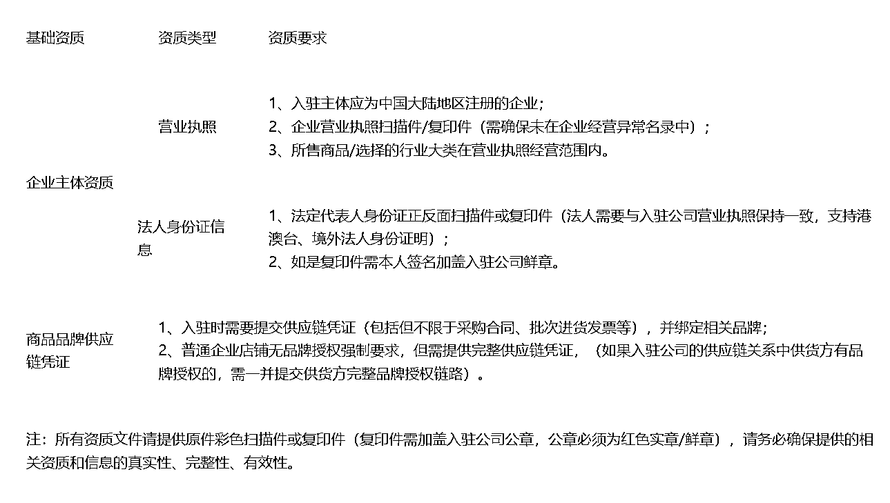
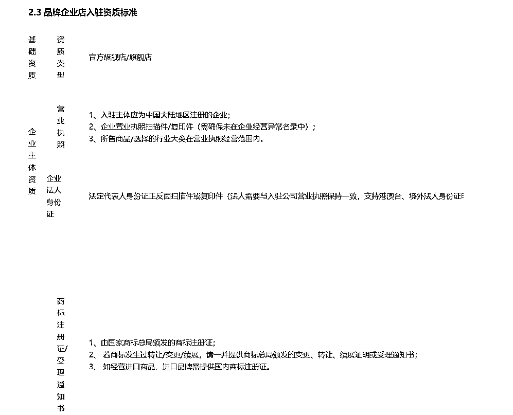

# 7.4.1 开通视频号小店 @李诚

除了带别人的货，如果有条件，我们也可以开自己的「微信小商店」带自己的货，当自己的小店达到进入优选联盟的标准时，就可以把商品放在联盟里让达人带货了。

目前，视频号小店为 1 个号开 1 个店。首先我们先来了解一下开通一个小店都需要什么资质：

那么当我们符合资质后，如何申请小店？需要哪些材料呢？如何维护店铺呢？可以查看这些官方教程：

[《【视频号小店教程】企业&个体工商户 - 开店指引（对外）》](https://docs.qq.com/doc/DTlRNT3FkTFdJTUVI?u=02a70d2f53a049fe8bcb3a37f3bee0b9)

[《【视频号小店教程】企业&个体工商户 - 店铺运营》](https://docs.qq.com/doc/DTmVJZmZtS1lIUGFP?_t=1658400048949)

[《【官方】视频号小店保证金标准》](https://support.weixin.qq.com/cgi-bin/mmsupportacctnodeweb-bin/pages/XirwVKy6kfyQvG0E)

[《【官方】视频号小店开放类目与资质要求》](https://developers.weixin.qq.com/doc/channels/Operating_Specifications/Category_and_aQualification.html)

[《【官方】视频号小店结算规则说明》](https://developers.weixin.qq.com/doc/channels/Operating_Specifications/Store_Operation_Rules/Settlement_Rules.html)

[《【官方】商家违规管理规则》](https://developers.weixin.qq.com/doc/channels/Operating_Specifications/Store_Operation_Rules/Business_violation_management_rules.html)

[《【官方】视频号小店命名规则》](https://developers.weixin.qq.com/doc/channels/Operating_Specifications/Store_Operation_Rules/name.html)

[《【官方】视频号小店招募规则》](https://developers.weixin.qq.com/doc/channels/Operating_Specifications/Store_Operation_Rules/recruit.html)

[《视频号小店-常见问题汇总》](https://developers.weixin.qq.com/community/develop/article/doc/00002895cf0db887a42ef873d56c13)

