# 7.4.2 如何入池优选联盟？@牧歌 @李诚

上架自己产品给别人带，是需要企业营业执照开通视频号小店的，并需要达到优选联盟要求，达到后申请开通，次日可以入优选联盟选品库。

入池条件如下：

•店铺商品品退率 <= 行业标准

•店铺商品纠纷率 <= 行业标准

•入驻视频号小店 > 15 天

•商家累计销量 > 100 件

•商家累计 GMV > 2 万

优选联盟相关信息，可以点击官方的文档进行查看：

[《视频号带货中心小程序联盟商品优选计划》](https://developers.weixin.qq.com/community/develop/doc/0006e6475ace406e451e3aa1c5bc01?highLine=%25E8%25A7%2586%25E9%25A2%2591%25E5%258F%25B7%25E5%25B8%25A6%25E8%25B4%25A7%25E4%25B8%25AD%25E5%25BF%2583%25E5%25B0%258F%25E7%25A8%258B%25E5%25BA%258F%25E8%2581%2594%25E7%259B%259F%25E5%2595%2586%25E5%2593%2581%25E4%25BC%2598%25E9%2580%2589%25E8%25AE%25A1%25E5%2588%2592)

【官方】[《微信视频号「优选联盟」准入及清退规则》](https://szsupport.weixin.qq.com/cgi-bin/mmsupportacctnodeweb-bin/pages/u1hpGXn4BYFW57yE)

[《微信视频号优选联盟各类目开放禁入明细》](https://docs.qq.com/sheet/DSVlGRFh3V2FiZGVQ?tab=BB08J2)

但由于视频号小店相关规则近期变化较快，大家需及时关注相关新消息，根据新规则来进行入池准备。航行期间大家如果有相关的问题，可以在航海大群内提问。

入池操作步骤：

1\. 登录微信小商店：[`shop.weixin.qq.com/`](https://shop.weixin.qq.com/)

2\. 点击推广中心--小程序联盟：

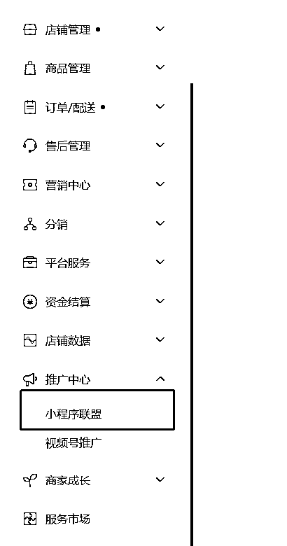

3\. 点击进入小程序联盟 ：

4\. 点击右上角的头像——退出登录：

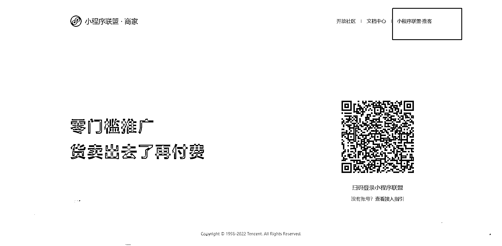

5\. 点击右上角的小程序联盟推客端——扫码登录。

6\. 登录后点击商品推广——商品库：（见红色框）

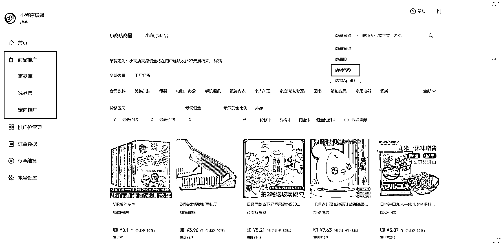

7\. 然后选择 蓝色框：店铺名称

输入你的店铺名称后，会出现如下图：

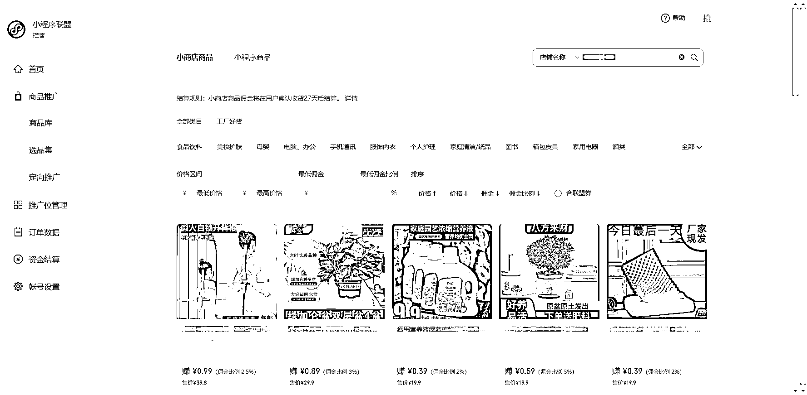

点击商品——点击推广：

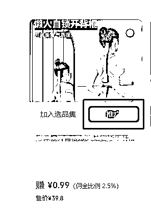

推广位随意选择，默认带货中心。

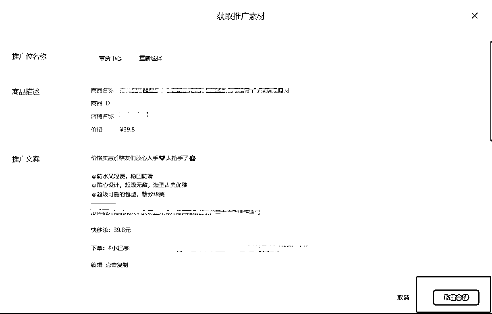

点击「下载全部」

8\. 打开下载的文件：

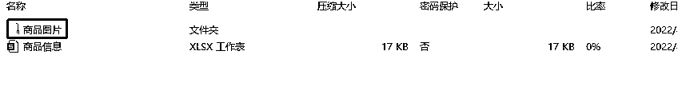

找到商品小程序码：

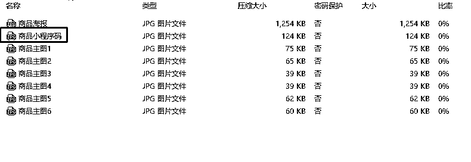

到这里，步骤就完成了。

9\. 下单则全部通过扫码下单，具体操作上，我们返回至第三步：

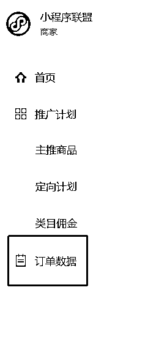

点击订单数据：

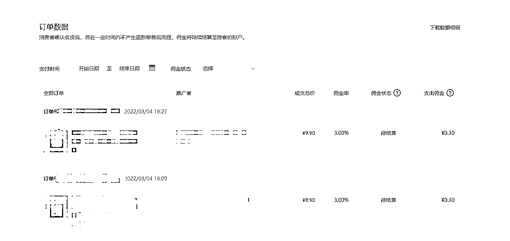

确保里面有大于 30 单即可。

这样就满足通过联盟渠道下单

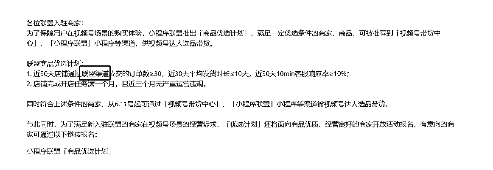

几个 Q&A ：

•小程序联盟运营规范：

[`developers.weixin.qq.com/doc/ministore/union/specification/introduction.html`](https://developers.weixin.qq.com/doc/ministore/union/specification/introduction.html)

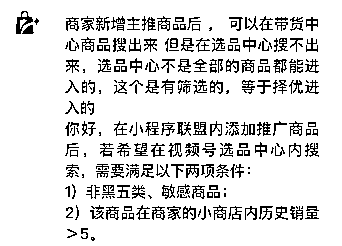

•请问登陆了小程序联盟——推客，搜索店铺搜不到商品怎么办呢？

答：微信小商店未满一个月，商品不达标，或者上架时间短。

•绑定小程序资金账户失败，显示带货中心绑定银行账户 [37022] ， 这个问题如何解决？

答：手机端搜索：小程序联盟绑定

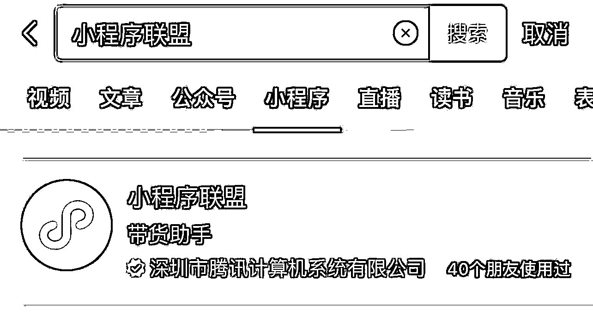

•每个商品都需要人工干预 30 单才能进入选品中心吗？

答：操作一次即可。

•30 单是分开 30 单，还是一个人可以拍 30 单呢？

答：两种都行，但是建议 30 个人会好一点。

•这些订单需要发货吗？还是不管？

答：需要发货，可以直接填写之前买过的订单号。

•大概什么时候可以入池呢？

答：今天创建计划，明天下单完成入池标准，后天入池。

内容来源：[《商品如何进入选品中心》](https://f6uz5wrpjh.feishu.cn/docx/doxcnMc6i3irGmSjFteSU69ieNb)

