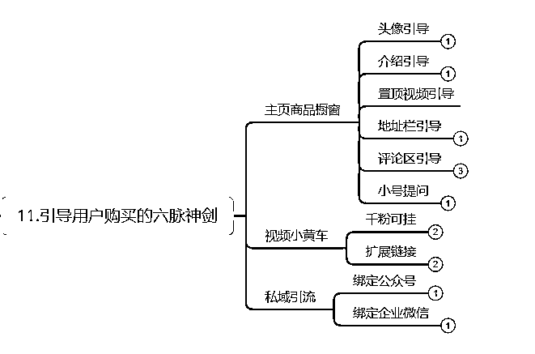
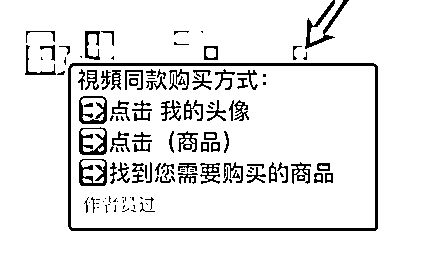
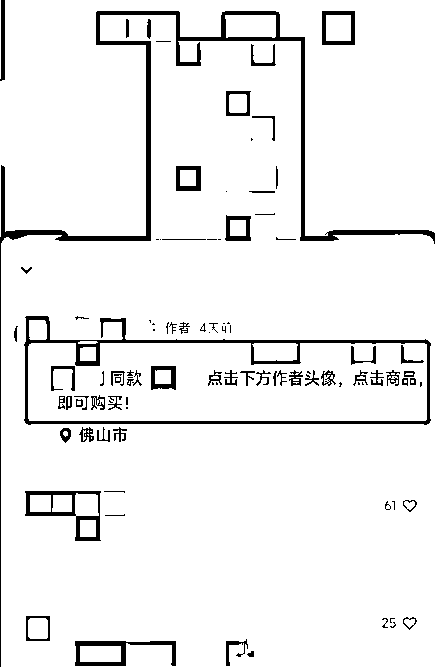
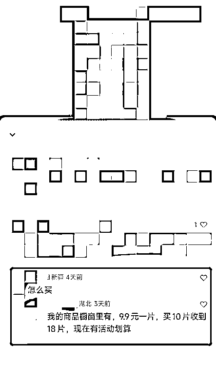
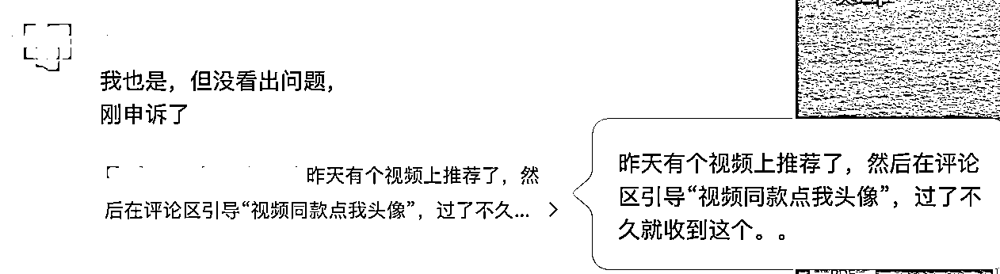
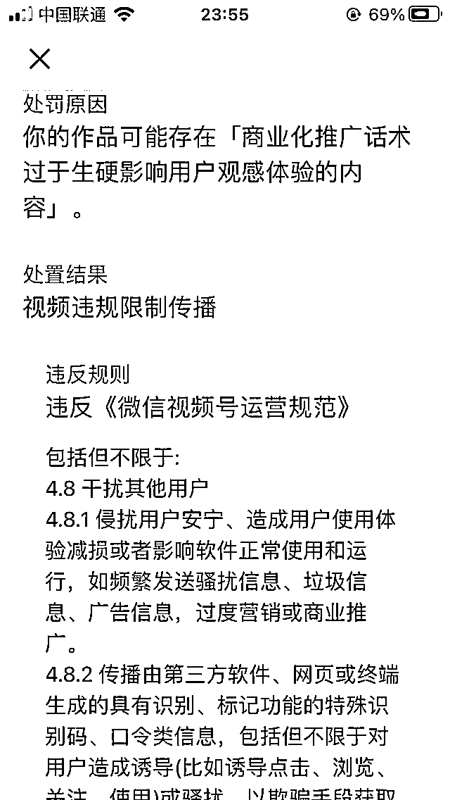
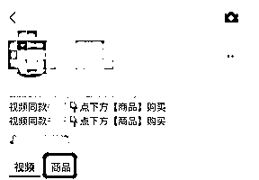
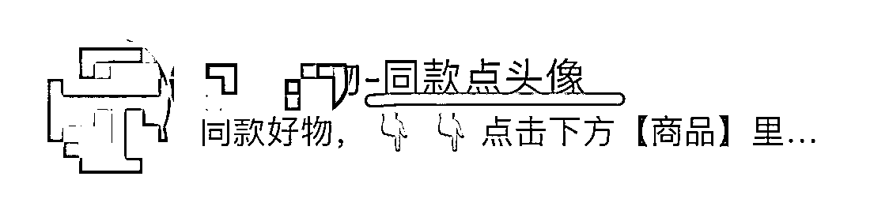
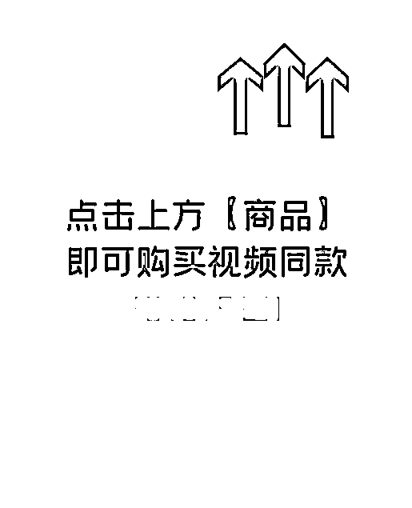
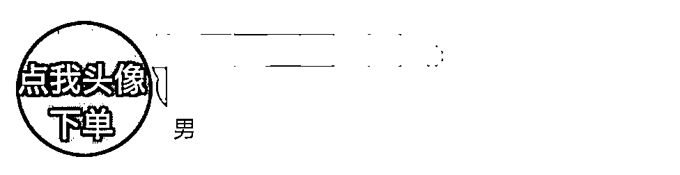

# 8.1.3 优化视频

1\. 增加去重手段

如果是二次剪辑的话，需要尽可能提升视频的独特性，增加去重的手段，进一步避免因视频内容重复度过高而被限流。

可用的去重方法有：

•去水印、修改分辨率、加片头片尾

•调整帧率、滤镜、播放速度、背景音乐

•镜像、滑动、画中画、视频蒙版、图片蒙版、背景颜色、背景图片、背景视频、模糊拓边等

2\. 提升视频画质

挑选清晰的视频，不要挑选模糊的视频作为二次剪辑的素材，本来很模糊，二次剪辑中就更模糊不清了，这样就容易被抖音判断为劣质视频，那么平台肯定就不会给你流量。

视频素材来源：

视频号同行、抖音、快手、小红书、微博、微视、西瓜、国外抖音 TikTok、国外油管 YouTube。

最推荐两个渠道：

抖音、快手。

3\. 利用热门话题或引流视频造势

新号没粉丝基础量，但是一般都会有新号流量扶持，可以先不直接发带货视频，先找一下最新的热门话题或者引流视频，前提是这个视频的观众画像符合你的账号粉丝画像定位的。

发 1-2 条这样的粉丝，吸引一些基础粉丝，把账号的权重提升一下，然后再发带货视频，基础的播放量可能会比直接新号怼带货视频好一些。

比如有位圈友，前一天下午发布容易引起争论的引流视频之后带来 50 多万播放，增加了一些粉丝，后面的视频播放量就好一些。隔天早上发的一条视频就小爆了一下，出了几十单。

4\. 引导用户成交

如果视频数据不错，但带货数据不理想，可能是在引导用户成交上做得不够。

一般来说，我们会通过以下方法引导客户购买：

下面介绍几种重点方式：

1\. 评论区引导

参考话术：

•点击 【我的头像】——点击 【商品】——找到您需要购买的商品

•xxx 同款，点击下方作者头像，再点击【商品】，即可购买。

•小号提问，再用原账号回复，参考话术如下：小号：xx 怎么买？原账号：点击头像后，再点击【商品】即可购买视频同款

•需要注意的是：随着视频号规则不断变化，审核标准也在逐渐严苛，部分船员已经遇到「评论区引导购买致违规限流」的问题。

大家在评论区引导用户购买的时候不要太直接，尽量避免直白的，如「视频同款点我头像」等字眼。

•延展一点，评论区的留言也需要筛选，删除不利于成交的言论。

2\. 主页简介引导

参考话术：

视频同款🔸点下方【商品】购买

视频同款🔸点下方【商品】购买

3\. 账号昵称引导

参考话：XX 好物 - 同款点头像

4\. 视频置顶页封面引导

参考话术：点击右上方商品，即可购买视频同款 xxx

（视频置顶引导-参考图片）[视频置顶引导-参考视频.mp4](https://search01.shengcaiyoushu.com/upload/doc/U4hgduUC2oyyl6xt72rcuxnDnEg/XVD2bY7PdoxM3sxaBEIcEvahn5f)

5\. 头像引导

直接在头像引导下单，参考话术如下图：

