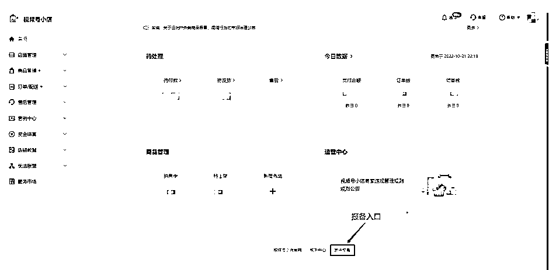
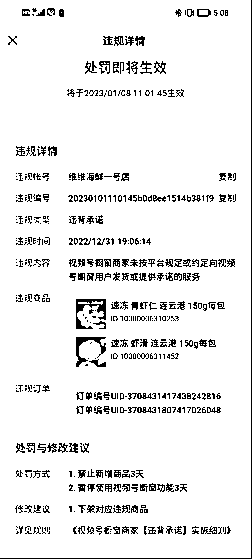
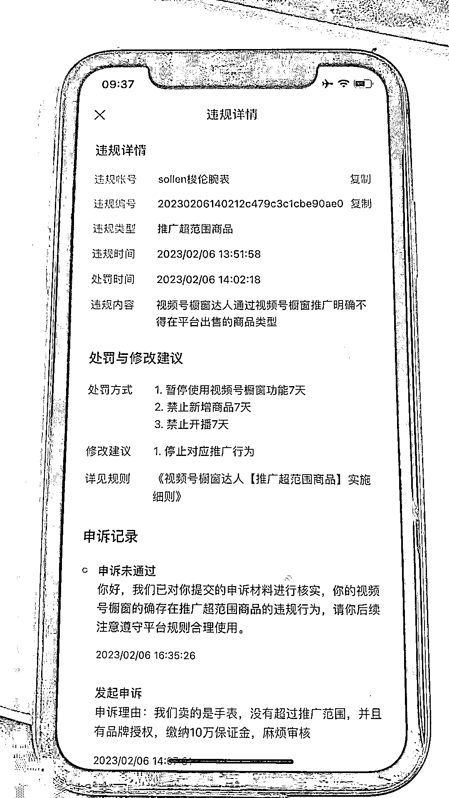
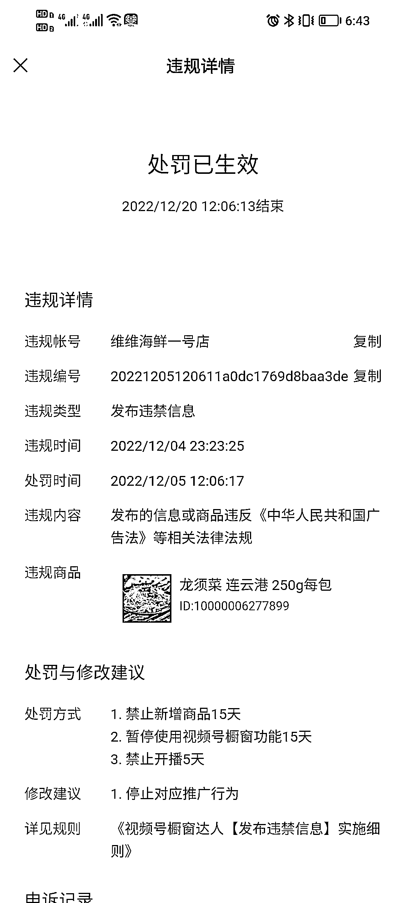
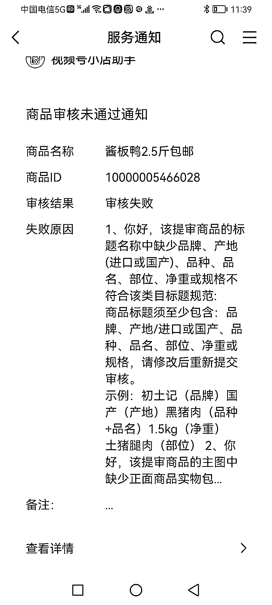

# 情况一：产品售后违规

1）违背承诺【延迟、无法发货】：视频号橱窗商家未按平台规定或约定向视频号橱窗用户发货或提供承诺的服务。处理结果一般是禁止使用橱窗 3 天跟下架对应商品。

应对策略：如果确实由于各种原因未能及时发货，及时要向平台进行报备或与客户沟通取消订单。报备是直接在小店后台进行报备即可（如下图），还有一种则是给平台官方发送报备邮件（weixinlive-JF@tencent.com）。只要有报备，理由是正当的，后续如有误判，找官方小二沟通，大概率还是能撤消处罚恢复开播。

注意，报备最多可报备 15 天，超过报备期限就必须重新报备，否则将会按照违背承诺处罚。

具体细则，详见：[《视频号橱窗商家【违背承诺】实施细则》](https://support.weixin.qq.com/cgi-bin/mmsupportacctnodeweb-bin/pages/nkTpiypd1bKfg6Xz)[《关于延迟、无法发货报备的指引公告》](https://support.weixin.qq.com/cgi-bin/mmsupportacctnodeweb-bin/pages/IUPaL12CZdMSb1YQ)。

2）推广超范围商品： 视频号橱窗达人通过视频号橱窗推广明确不得在平台出售的商品类型。即售卖平台禁售商品，或商家无对应资质开通类目的商品，包括超低价商品等。

例如，售卖皮色料（属于珠宝玉石禁售）/无资质赠送手表（商家无资质售卖的商品）/售卖莫桑钻商品（平台明确限制出售的商品）/售卖平台禁售商品低价珍珠饰品（推广平台明确限制出售的商品）。

应对策略：了解平台开放、不开放、定向准入的产品，且了解部分定向准入产品的销售底价。一般情况下直播间只能售卖绑定小店开通类目的商品，其它类目商品想在直播间售卖或以赠品的方式送出去都需要先查下相关规则文档，确认不在平台禁售范围内。

具体细则，详见：[《相关商品橱窗类目准入规则》](https://docs.qq.com/sheet/DTURoVFZiVXdRQlJj?tab=BB08J2)[《视频号橱窗类目、商品资质总览》](https://developers.weixin.qq.com/doc/channels/Operating_Specifications/Category_Product_Qualification.html)。

3）发布违禁信息：发布的信息或商品违反《中华人民共和国广告法》等相关法律法规。

主要有两方面，第一方面是食药同源或者滋补品，容易在直播中被判处夸大功效；

第二方面是主播或直播团队被全网拉黑或违规违法团体。

例如，

口播吃亚麻籽油可以疏通血管，养护大脑，存在虚夸普通食品功效而被处罚；

拍 A 发 B 售卖‘幸福小丸子’（壮阳物品）而被处罚；

主播话术：男人加油站；懂得懂，一个小时打底，因而处罚；

主播口播售卖的古玺堂精油炙疗腿疼、颈椎膝盖难受等症状，为夸大护肤品医疗的功效而被处罚。

以上这些情形的处理结果是禁播 15 天。

应对策略：主播话术要规避极限词，虚假文案和欺骗言语。同时需要熟悉平台规定的违规场景。

具体细则，详见：[《视频号橱窗达人【发布违禁信息】实施细则》](https://support.weixin.qq.com/cgi-bin/mmsupportacctnodeweb-bin/pages/DfeesuVilkvupzuI)。

4）发布虚假宣传信息：视频号橱窗达人违规使用极限词，虚假限时文案，欺骗，误导视频号橱窗用户的情形。

判罚的逻辑大概有以下几类：货不对板；质量问题；用户投诉；纠纷单量大；物流问题。

例如，因该账号的商品品质与宣传描述不符（少件），给消费者带来不良体验，举报与投诉数据较多；

因该账号的商品品质与宣传描述不符，且带有物流异常问题，给消费者带来不良体验，举报与投诉数据较多；

主播口播宣传该商品具有祛斑作用，但所提供相关的特殊化妆品证明中的名称与商品名称不一致， 固无法判定该证明上的名称为此商品。

应对策略：虚假宣传是非常容易出现的判罚，其中核心是直播间货品与实际货品质量不一致，导致用户投诉或引起纠纷，会被判处虚假宣传。且承诺物流发货快或几日内送达，如果达不到，遭到举报，也会被判处虚假宣传。

故而要注重产品的品质，直播样品与正品是一致的，同时主播要注意话术，不可为了逼单在直播间给出过多的承诺，最后是一定一定要做好售后服务，客服要能及时响应客户的咨询跟处理售后服务。

具体细则，详见：[《视频号橱窗描述不符/虚假宣传纠纷处理判责标准》](https://support.weixin.qq.com/cgi-bin/mmsupportacctnodeweb-bin/pages/pHLzoZgWNYFLH19M)[《视频号橱窗交易纠纷处理规则》](https://support.weixin.qq.com/cgi-bin/mmsupportacctnodeweb-bin/pages/i7p71W687JAavsYw)。

5）发布不合规信息：主要是商品重要信息缺失跟类目乱挂。

例如，商品名称没有重量，或玉石材质，镶嵌类的商品无品牌无重量；

商品标题缺少品牌信息；

翡翠手绳类目错挂在翡翠手镯上和翡翠吊坠上 ；

正红菇干货类，应挂在食品饮料>粮油调味>南北干货>类目，而商家最终是错挂在生鲜-蔬菜-根茎类上等等。

应对策略：不合规信息针对的大部分是定向准入商品或较为特殊的商品（需要有产地、品牌、重量等），部分关键信息的缺失，会被判处发布不合规信息。

具体细则，详见：[《视频号橱窗达人【发布不合规信息】实施细则》](https://support.weixin.qq.com/cgi-bin/mmsupportacctnodeweb-bin/pages/LymgRTubihsg7ElD)。

