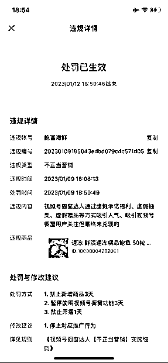
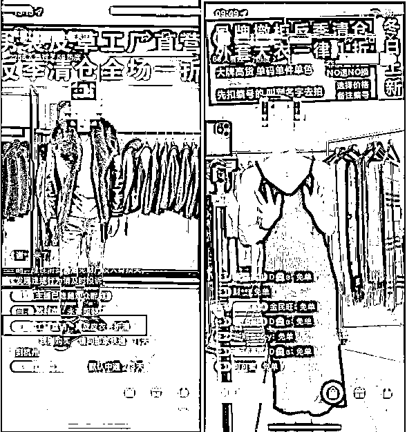
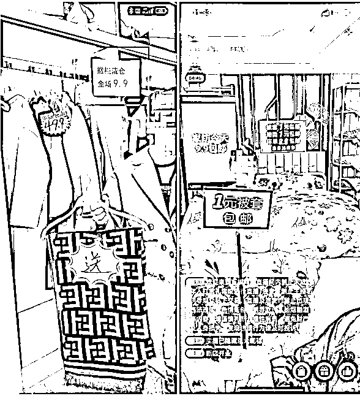
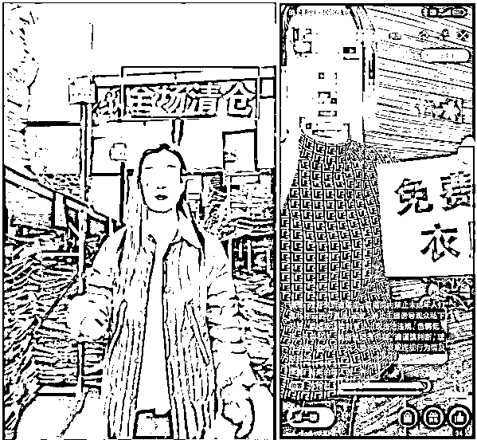
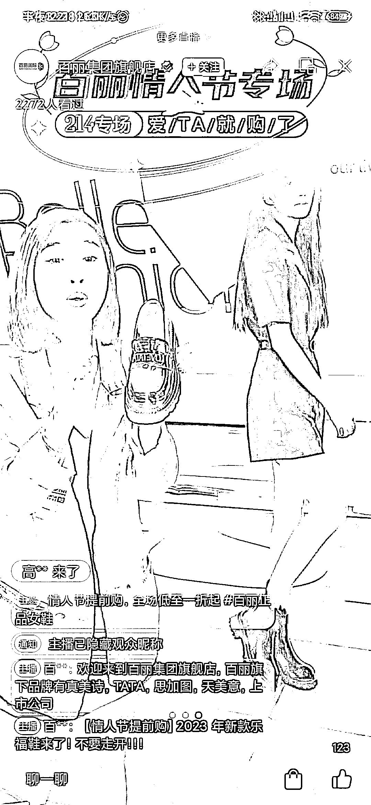
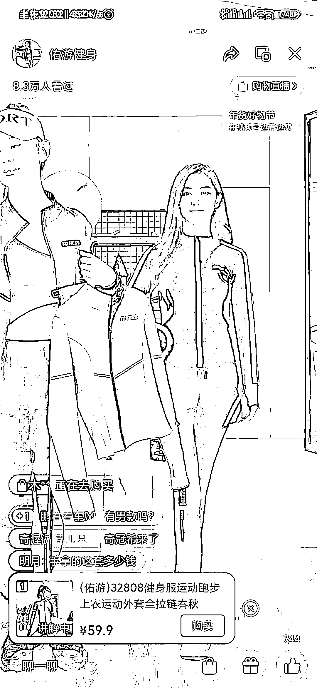

# 情况二：直播间违规

1）不正当营销：视频号橱窗达人通过虚假承诺福利，虚假抽奖，虚假赠品等方式吸引人气，吸引视频号橱窗用户关注但最终未兑现。

例如：

①直播宣传：涉及全场 1 折，1 折清仓，全场 X 元/折起，免费送 XX，xx 品牌商品个位数，全场清仓，全清，清完走人，专柜 x 折，特殊材质商品个位数，扣 xx 免费送，新人免费送.....

②直播间物料/举牌：直播间人员或背景出现 1 折、X 元、免费送等字样（包含但不限于字纸印刷物、电子显示屏、灯牌、第三方推流贴图等）。

③低价商品高运费：售卖商品明显低于市场价、成本价，同时收取高额运费的引流方式。

④打击场景：直播间口述、视频号昵称、简介、直播主题、公屏互动等。例如，工厂直销一折优惠；标题宣传全场 9.9，涉及低价引流；直播间直接展示产品免费试用；直播间新人，每人送 2 份见面礼字样；直播中使用低价商品进行引流（1 元），实际商品价格高于宣传价格。

应对策略：不正当营销是目前平台处罚最多的判罚规则，主要是所有涉及到低价或者赠送或者福利品都会被判处为不正当营销，目前的视频号规则不允许通过低价进行引流，而且价格不能低于 9.9，折扣也不能过低，在官方看来属于恶意竞争打价格战，所以抖快的直播习惯和套路并不完全适用于视频号。

具体细则，详见：[《视频号橱窗达人【不正当营销】实施细则 》](https://support.weixin.qq.com/cgi-bin/mmsupportacctnodeweb-bin/pages/f1CGl0U4bOXqGABK)。

2）低质量内容：无人直播，录播。画面属于录播素材，非实时直播。除非有特殊申请，不然目前平台是不允许这两种方式的直播。这里要特殊说明一点是，平台是允许绿幕直播的，只是不允许在绿幕直播时，背景是放一个视频一直在循环播放。

但在今年 2 月份开始，平台对背景视频播放有放开一种场景，就是服装直播间，背景是可以放置模特走秀的视频，要求清晰，全屏即可，目前仅限这种形式被允许。例如有两个帐号是目前一直在开播，百丽集团旗舰店跟佑游健身，大家可以关注看看。

具体细则，详见：[《视频号橱窗达人【发布低质量内容】实施细则》](https://support.weixin.qq.com/cgi-bin/mmsupportacctnodeweb-bin/pages/3YNfDmg53I7Zsldl)。

3）在以下场景：直播间封面、背景、头像、主题、评论区、昵称等不要出现“扣 xxx 送 xx，新人送 xx，关注送 xx，免费送 xxx”等【虚假福利或不正当营销行为】。

例如：

扣 1，分享朋友圈送手镯

关注送项链

扣 666 免费送梳子

新人免费领大礼包

进来免费送、0 米送

等等引导用户在直播间互动给礼品的种种方！

其他敏感词详见[《视频号直播敏感词汇注意事项》](https://docs.qq.com/doc/DWEZSUmdDaXNkS1dh)《视频号直播违禁词大全》。

另外，在各个品类也有各自的一些违规规则。

如生鲜类直播间，第一，直播间内必须展示实物商品，包装商品需拆开包装展示内容实物，不可以用绿幕代替商品展示。也就是说不能只展示内容物，要连包装一起展示在直播间；

再比如卖生鲜肉的直播间，需同时展示带包装产品，不能只展示肉本身；

再比如售卖冰冻鱼的，不可只在直播间展示新鲜鱼，需展示冰冻包装鱼，防止误导消费者。第二则是商品标题、商品实物包装名称、直播间展示实物，三者需一致。

最后，分享大家一个经验，如果直播过程中，后台有两次弹出直播处理通知，需要马上下播，重新开一场新直播。这个规则在于如果有第三次弹窗通知，处罚至少禁播 1 天起。但新开播又是重新计数了，这样可以减少一点禁播风险。

内容来源：3 月 8 日《视频号直播违规避坑》@宏

