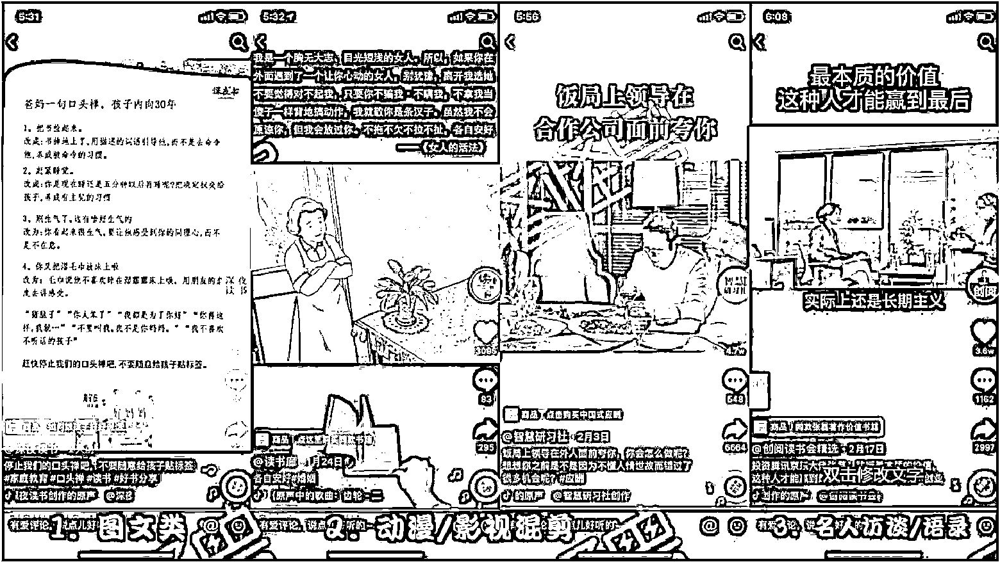

# 10.1.3.1 非真人出镜类

•图文类（静态图片+bgm）

拍摄一张书籍的图片（或者网上找），添加文案文本，搭配着 BGM；

•动漫/手绘/影视混剪类（主流操作）

通过剪辑动漫/影视视频，搭配文案和背景音乐，就可以做出来；

•名人访谈/演讲/语录

找一些名人书籍上面的段落，或者是名人讲话时说的话，变成文本，搭配名人视频/图片；

找名人/明星演讲或者访谈的视频或者音频，混剪书籍实拍（有一定的侵权风险）；