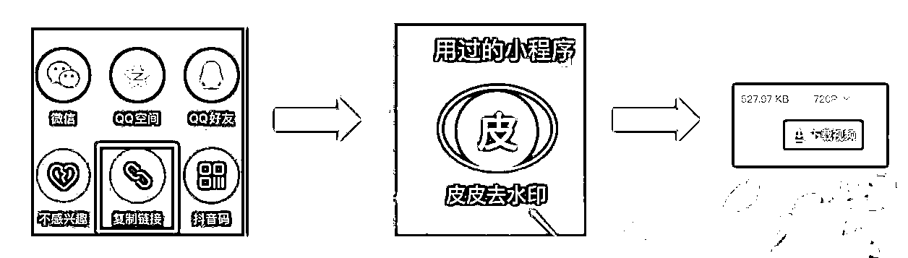
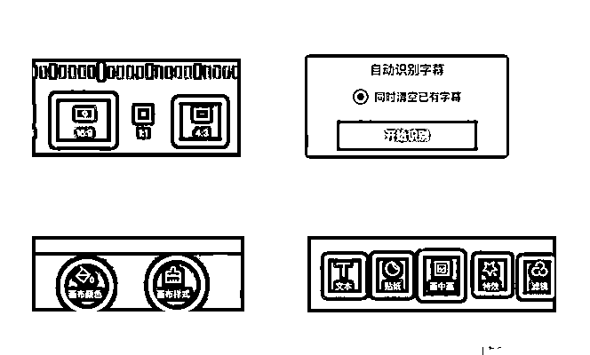

# 10.1.4.4 剪辑（仅供新手参考）

先找素材，复制视频链接，然后去水印，下载视频（工具：微信小程序“皮皮去水印”）

导入剪映，裁剪，添加背景样式

•裁剪：选好一个固定的比例 16:9 或 4:3

•识别字幕：切记断句，检查有无错别字

•添加背景颜色、背景样式：保持一致

•文本：标题，字幕

•贴纸：引导点赞，关注（可以添加 gif ）

•适当添加特效，滤镜：使画面看着舒服

•画中画：可用于去重

