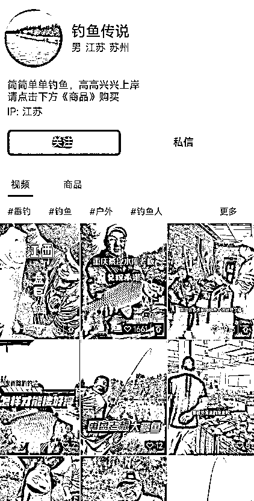
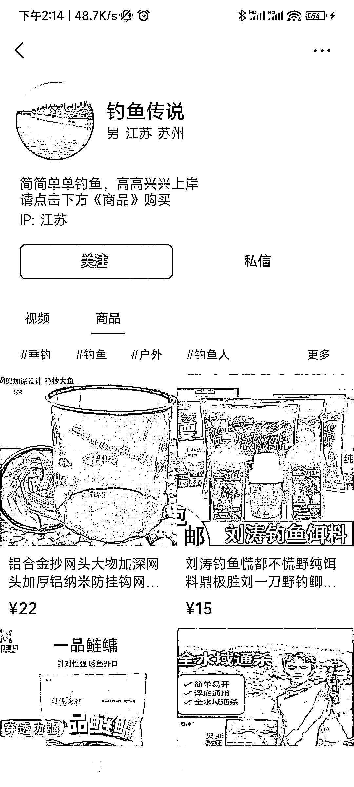

# 【案例一】账号：钓鱼传说

案例主页：

1\. 流量怎么来

【内容形式】钓鱼现场出水结果 + 产品展示

【渠道】平台自然流量

【方法】账号名称及介绍突出标签，介绍资料区引导去橱窗购买产品，介绍页面没有留微信和私域引导

2\. 变现产品是什么

【形式】实物产品

【品类】渔具、户外装备、鱼饲料、渔网等

【货源 / 渠道】买自己的货（开微信小商店）

【价格】价格区间为 10 - 1200，工厂做货，成本未知

3\. 变现怎么做

【载体】平台成交

【方法】

【工具】微信视频号橱窗，暂无直播