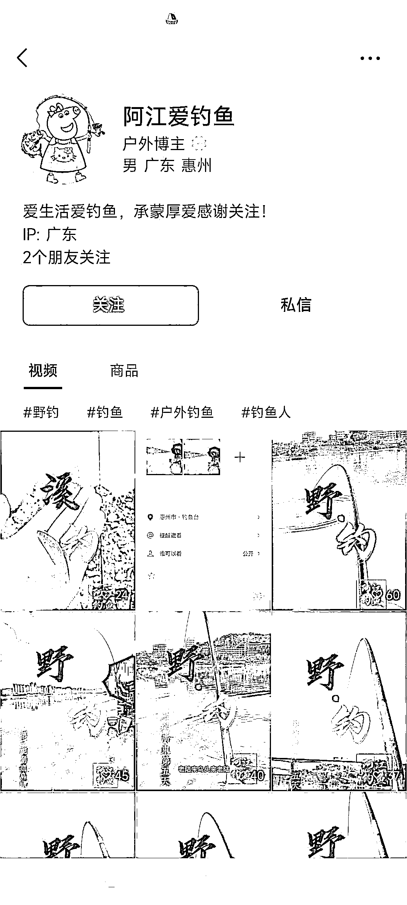
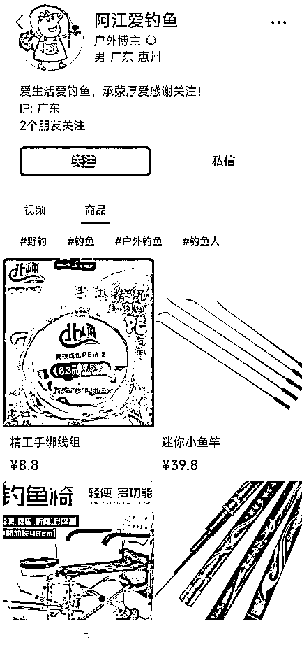

# 【案例二】账号：阿江爱钓鱼

账号属性：金 V 达人认证，户外博主

案例主页：

1\. 流量怎么来

【内容形式】野钓现场出水结果 + 产品展示 + 钓鱼相关小知识分享

【渠道】平台自然流量；视频号直播（抖音快手小红书找过渔具类型账号，同名账号【阿江爱钓鱼】和视频号归属地不同，且抖音号只有 3 个素材内容）

【方法】账号名称及介绍突出标签，视频最后会引导点赞关注，介绍资料区相对比较简单，没有引流到私域和引导下单

【特点】每个视频加了自己的水印

2\. 变现产品是什么

【形式】实物产品

【品类】渔具、户外装备、鱼饲料、渔网等

【货源 / 渠道】卖第三方的货，第三方合作店铺（微信小商店、魔筷、有赞店铺都有）

【价格】渔具售价区间 5 - 500 元，佣金约 30% - 40% 居多

3\. 变现怎么做

【载体】平台成交

【方法】

【工具】微信视频号

