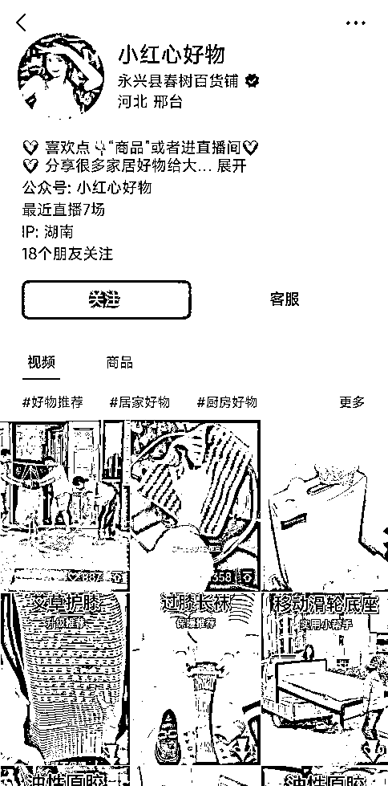
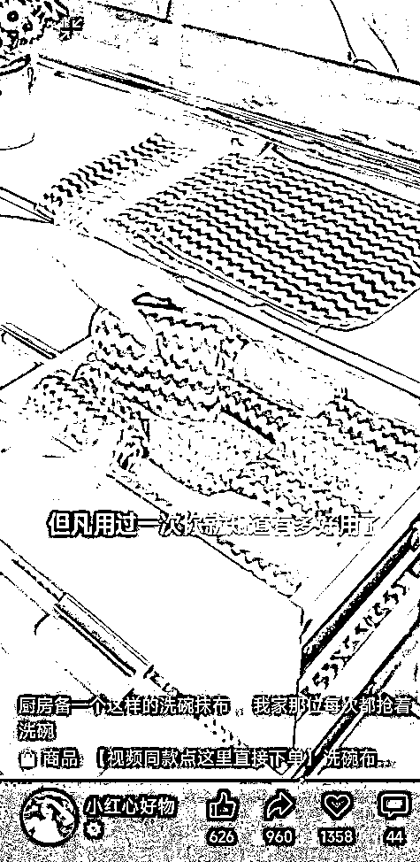
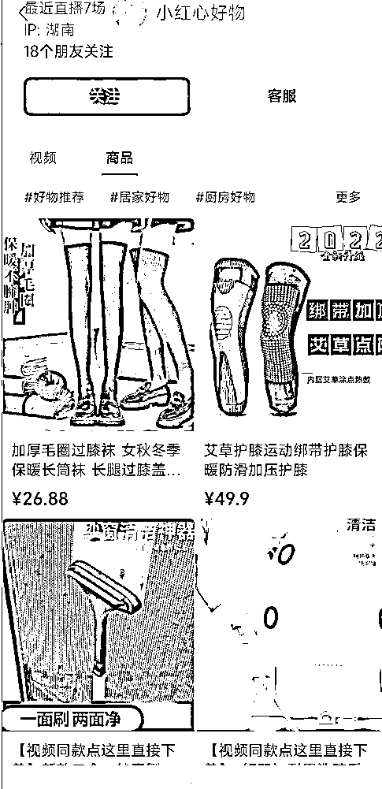

# 【案例三】账号：小红心好物

账号属性：蓝 V 企业认证

归属地：河北邢台

案例主页：

1\. 流量怎么来

【内容形式】好物视频混剪 + 热门视频引流直播间

【渠道】平台自然流量

【方法】账号名称及介绍突出标签，介绍资料有引导用户购买，留了公众号的入口

【特点】添加了企业微信客服入口

2\. 变现产品是什么

【形式】生活好物相关产品直接卖货

【品类】洗碗抹布、洗窗纱工具、加热护膝、枕巾等

【货源 / 渠道】卖第三方的货，第三方合作店铺（微信小商店、魔筷、有赞店铺都有）

【价格】客单价 9.9 - 59.9 ，佣金 20 - 30%

3\. 变现怎么做

【载体】平台成交

【方法】

【工具】微信视频号橱窗，企业微信

【第三方工具】蝉妈妈、考古家、飞瓜等