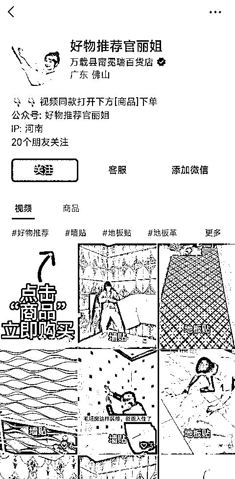
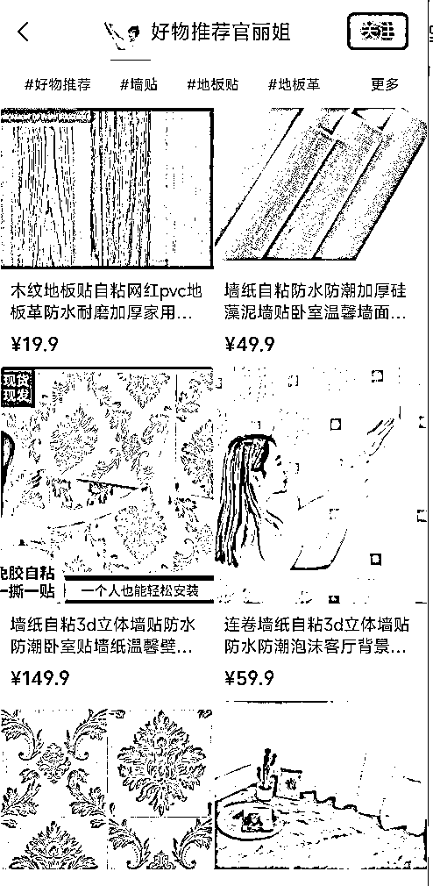
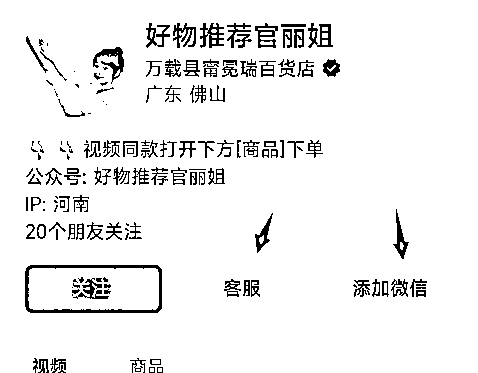
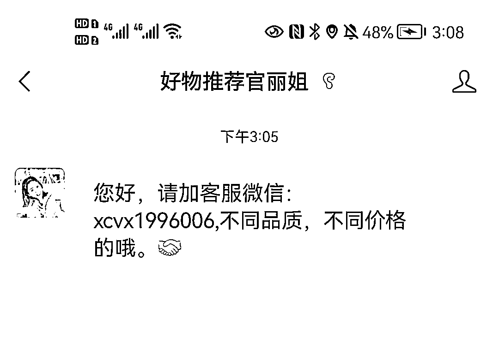
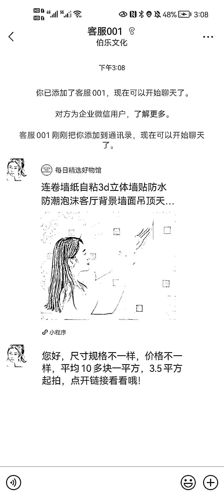
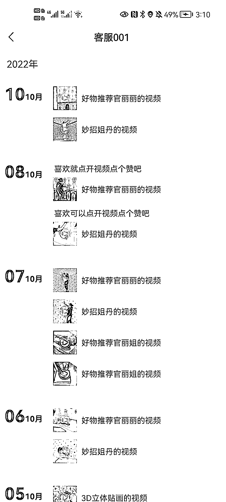

# 【案例四】账号：好物推荐丽姐

账号属性：蓝 V 企业认证

归属地：佛山

案例主页：

1\. 流量怎么来

【内容形式】地垫、墙纸等视频混剪 + 热门视频引流

【渠道】平台自然流量

【方法】账号名称及介绍突出标签，介绍资料有引导用户去橱窗购买；引导去橱窗购买的视频置顶

【特点】蓝 v 认证、添加了企业微信客服和添加微信两个引导

2\. 变现产品是什么

【形式】直接卖货

【品类】3D 墙纸

【货源 / 渠道】卖第三方的货，第三方合作店铺（微信小商店、魔筷、有赞店铺都有）

【价格】客单价 30 - 59.9+ ，佣金 30%+，定制化产品佣金偏高

3\. 变现怎么做

【载体】平台成交、私域定制成交

【方法】

【工具】微信视频号橱窗，企业微信

【第三方工具】蝉妈妈、考古家、飞瓜等

