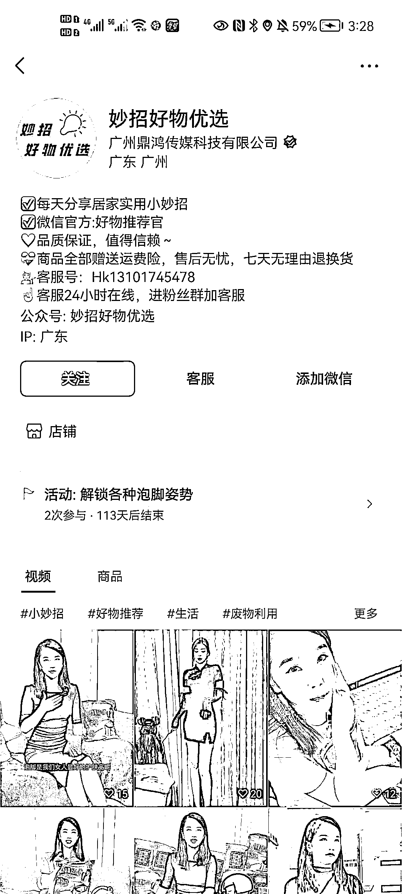
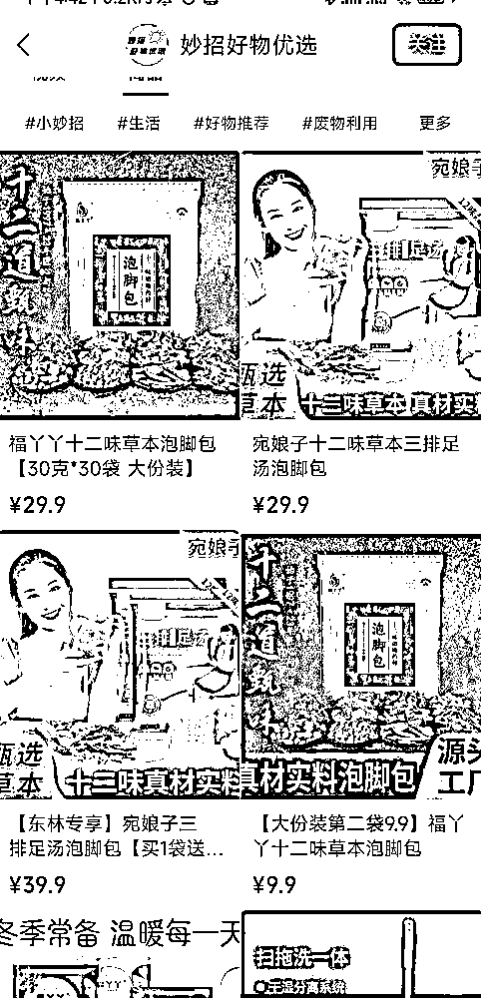

# 【案例六】账号：妙招好物优选

账号属性：蓝 v 企业认证

归属地：广州

案例主页：

1\. 流量怎么来

【内容形式】好物视频混剪

【渠道】平台自然流量为主

【方法】账号名称及介绍突出标签，介绍资料有引导用户去橱窗购买，主页展示了店铺入口

【特点】添加了企业微信、客服两个引导，挂了公众号

2\. 变现产品是什么

【形式】直接卖产品

【品类】泡脚包

【货源 / 渠道】卖第三方的货

【价格】客单价 9.9 - 59.9，佣金 40%+

3\. 变现怎么做

【载体】平台成交

【方法】

【工具】微信视频号橱窗，企业微信

【第三方工具】蝉妈妈、考古家、飞瓜等

