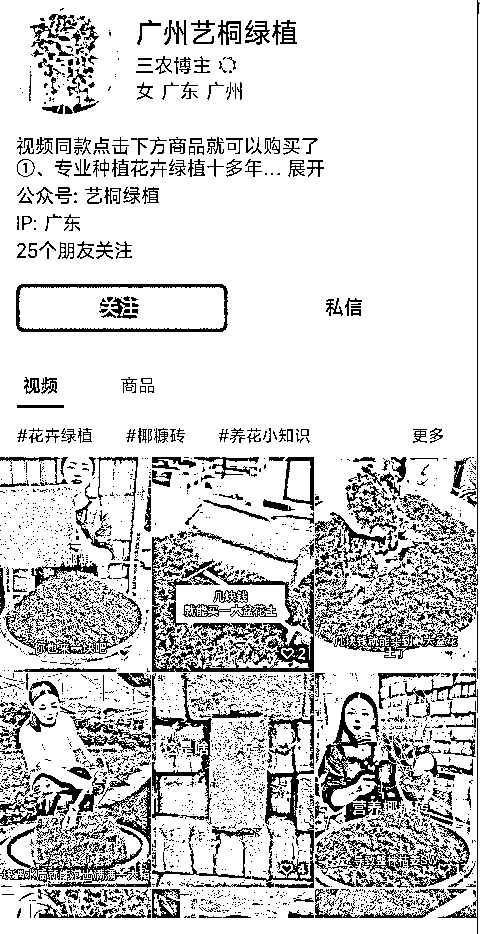
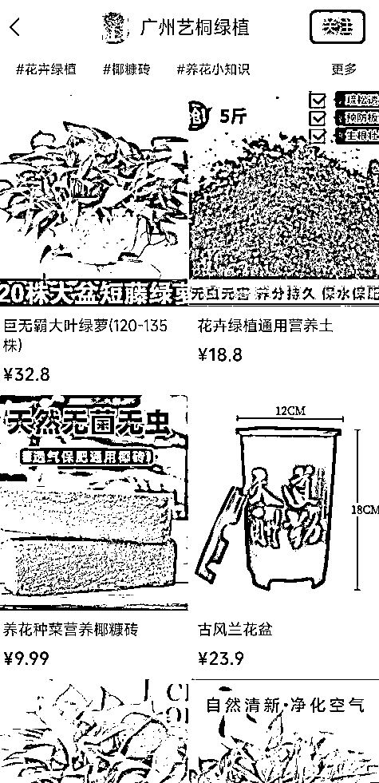

# 【案例七】账号：广州艺桐绿植

账号属性：蓝 v 企业认证

归属地：广州

案例主页：

1\. 流量怎么来

【内容形式】绿植相关物品使用展示视频 + 绿植养护干货

【渠道】平台自然流量

【方法】账号名称及介绍突出标签，介绍资料有引导用户去橱窗购买

【特点】企业微信认证、挂了公众号

2\. 变现产品是什么

【形式】绿植直接变现带货

【品类】绿植产品、营养液、营养土、花瓶等

【货源 / 渠道】自有货源和第三方产品

【价格】客单价 9.9 - 59.9

3\. 变现怎么做

【载体】平台成交

【方法】

【工具】微信视频号橱窗，企业微信

【第三方工具】蝉妈妈、考古家、飞瓜等