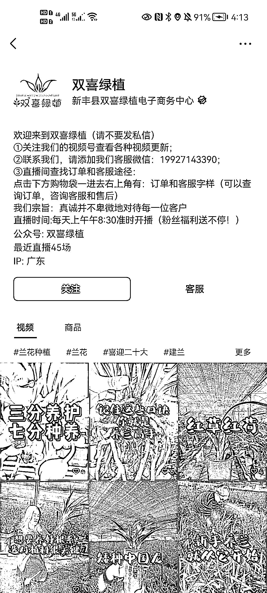
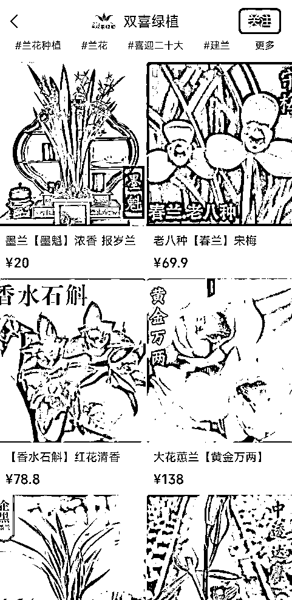

# 【案例八】账号：双喜绿植

账号属性：蓝 v 企业号

归属地：广东新丰

案例主页：

1\. 流量怎么来

【内容形式】苗圃视频实拍

【渠道】平台自然视频流量 + 直播 + 参与花卉活动

【方法】账号名称及介绍突出标签，介绍资料有引导用户去橱窗购买，直播间引导购买

【特点】企业微信客服，蓝 v 认证，挂了公众号

2\. 变现产品是什么

【形式】直接带货

【品类】石斛、蕙兰等绿植产品

【货源 / 渠道】自己货源

【价格】客单价 20 - 100

3\. 变现怎么做

【载体】平台成交

【方法】

【工具】微信视频号橱窗，企业微信

