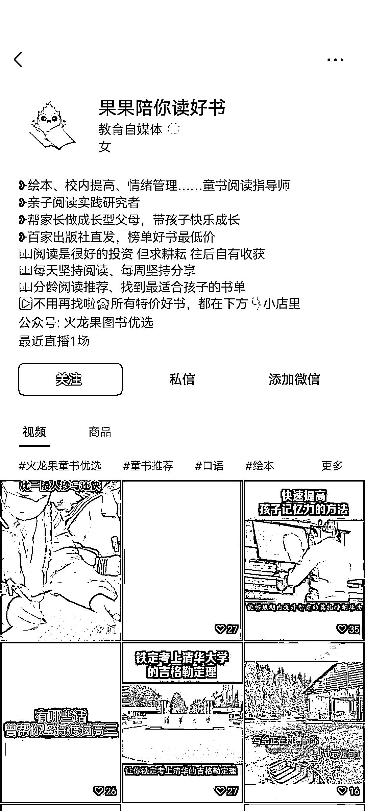
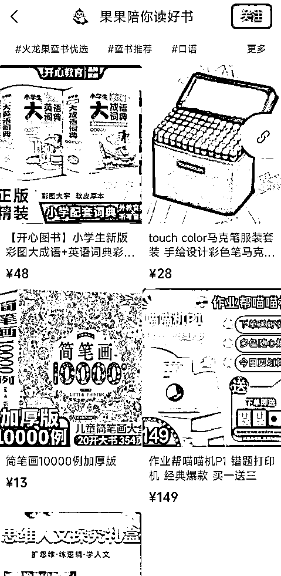

# 【案例九】账号：果果陪你读好书

账号属性：金 v 达人认证

案例主页：

1\. 流量怎么来

【内容形式】励志视频混剪 + 带货视频引导

【渠道】平台自然流量

【方法】账号名称及介绍突出标签，介绍资料有引导用户去橱窗购买

【特点】添加了企业微信客服 2 个引导，金 v 达人认证，挂了公众号

2\. 变现产品是什么

【形式】直接带货

【品类】学习相关产品，词典，点读笔，教辅书籍等等

【货源 / 渠道】卖第三方的货，第三方合作店铺（微信小商店、魔筷、有赞店铺都有）

【价格】客单价 9.9 - 59.9，佣金 30%+

3\. 变现怎么做

【载体】平台成交

【方法】

【工具】微信视频号橱窗，企业微信

【第三方工具】蝉妈妈、考古家、飞瓜等