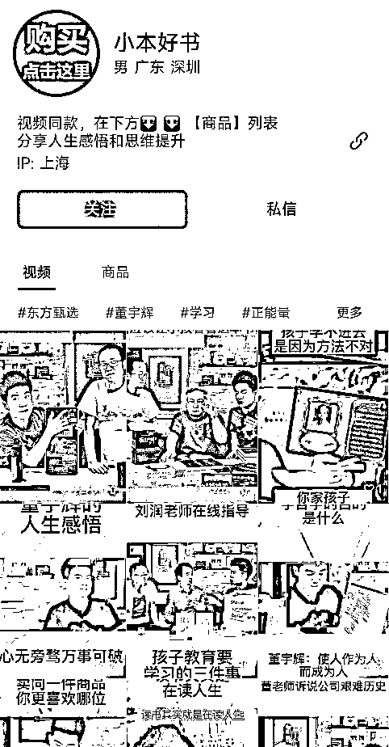
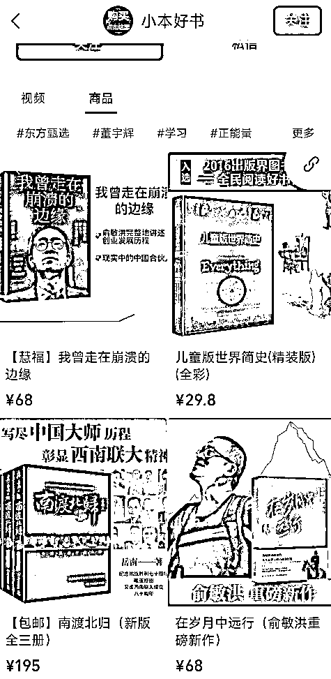

# 【案例十】账号：小本好书

账号属性：无

归属地：上海

案例主页：

1\. 流量怎么来

【内容形式】混剪新东方直播间切片

【渠道】平台自然流量

【方法】账号名称及介绍突出标签，介绍资料有引导用户去橱窗购买

【特点】新东方素材自带流量

2\. 变现产品是什么

【形式】书籍直接带货

【品类】教辅书籍、成长书籍、新东方相关传记

【货源 / 渠道】卖第三方的货，第三方合作店铺（微信小商店、魔筷、有赞店铺都有）

【价格】客单价 30+，佣金 30%+

3\. 变现怎么做

【载体】平台成交

【方法】

【工具】微信视频号橱窗