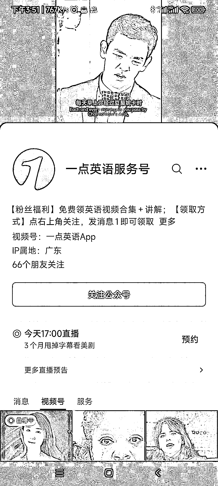
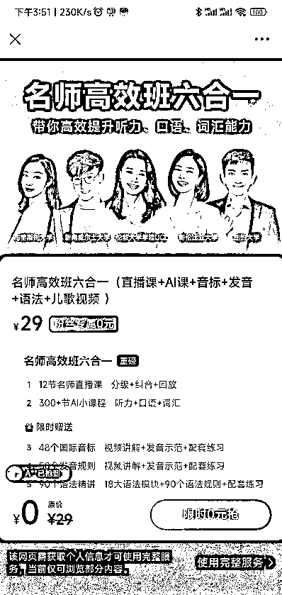

# 【案例十一】账号：一点英语服务号

账号属性：蓝 V 企业号

归属地：广东

1\. 流量怎么来

【内容形式】混剪美剧片段

【渠道】平台自然流量

【方法】用美剧突出英文听说读写和相关俚语，引导点赞转发收藏

【特点】美剧剪辑引导英语培训线上课程

2\. 变现产品是什么

【形式】英语培训

【品类】培训

【货源 / 渠道】自营课程体系

【价格】低转高培训课

3\. 变现怎么做

【载体】平台引流

【方法】