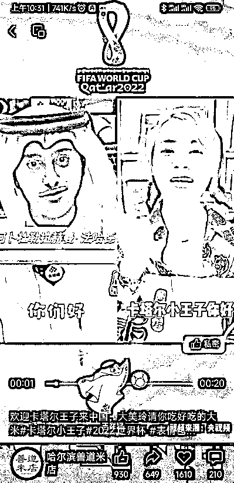
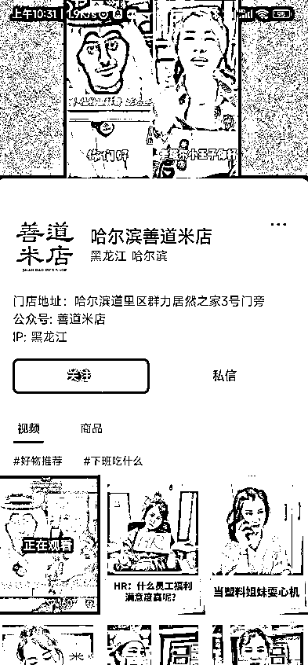
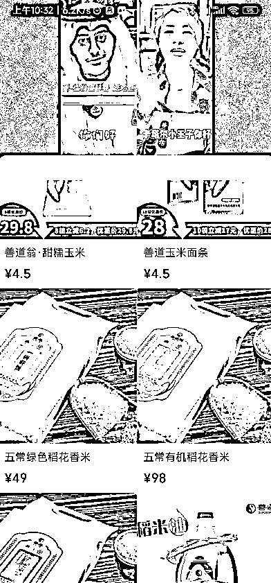

# 【案例十二】账号：哈尔滨善道米店

账号属性：普通账号

归属地：哈尔滨

1\. 流量怎么来

【内容形式】网红段子翻拍 + 网红同框（图 1 卡塔尔王子同框合拍对话）

【渠道】平台自然流量

【方法】用网红段子拉停留，网红对话剪辑做内容引导产品

【特点】段子吸引人 + 真人出镜

2\. 变现产品是什么

【产品】东北大米

【品类】三农

【货源 / 渠道】商家自营

【价格】49 - 198 元

3\. 变现怎么做

【载体】网红段子合拍

【方法】