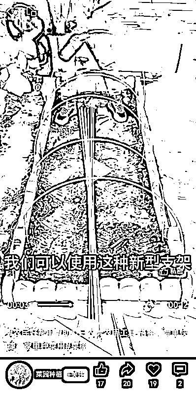
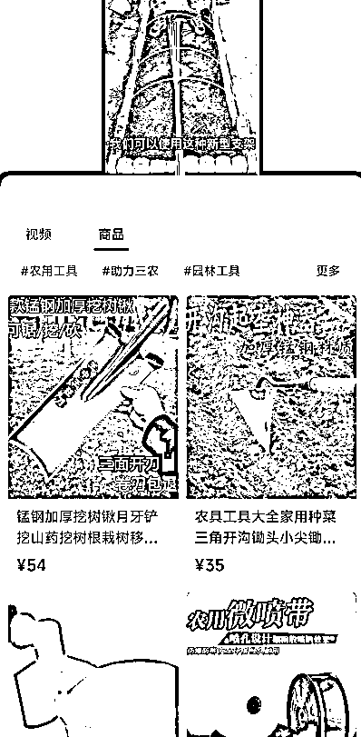

# 【案例十四】账号：菜园种植记

账号属性：普通账号，有留电话

归属地：河南郑州

1\. 流量怎么来

【内容形式】三农工具使用方法和成果展示

【渠道】平台自然流量

【方法】展示产品如何操作和成果

【特点】产品展示 + 真人出镜，留了手机号码，建立私域，养自己的三农粉丝，复购率粘性强。

2\. 变现产品是什么

【产品】三农工具

【品类】工具

【货源 / 渠道】合作带货

【价格】19 - 99 元

3\. 变现怎么做

【载体】带货优选联盟店铺

【方法】