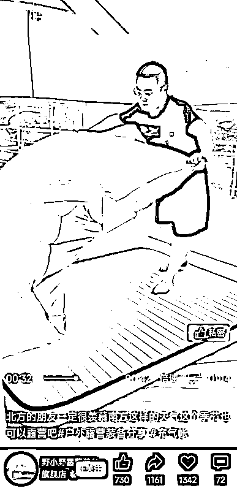
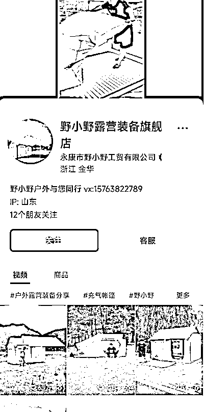
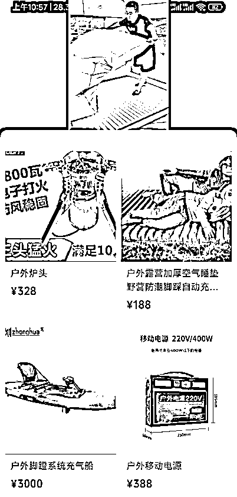

# 【案例十六】账号：野小野露营装备旗舰店

账号属性：蓝 V 企业认证账号

归属地：浙江金华

1\. 流量怎么来

【内容形式】爆款产品展示，多个 10w+ 点赞视频

【渠道】平台自然流量 + 流量投放

【方法】高停留内容吸引

【特点】爆款产品 + 效果展现

【类目特点】且此类用户粘性极强，大概率会一站式购买相关配套工具和周边。总客单价高，复购率高。

2\. 变现产品是什么

【产品】露营装备、充气床垫、帐篷、船、户外炉等

【品类】露营户外

【货源 / 渠道】商家自营

【价格】99 - 3000

3\. 变现怎么做

【载体】爆款产品展示 + 怼量

【方法】