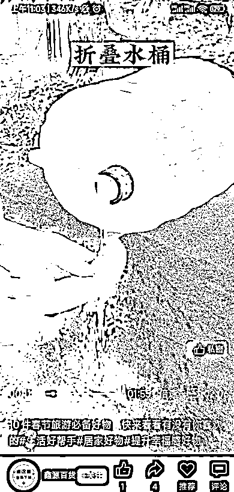
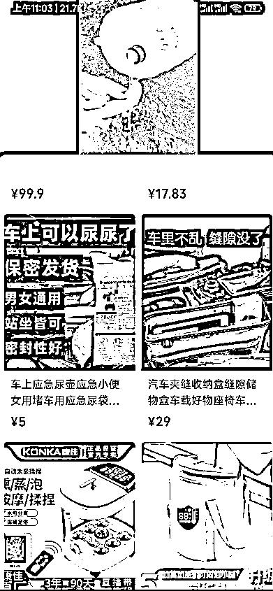

# 【案例十七】账号：鑫源百货

账号属性：普通账号

1\. 流量怎么来

【内容形式】旅行好物搬运仿拍引导下单，车载收纳盒，车载应急尿壶

【渠道】平台自然流量

【方法】抖音快手搬运混剪，仿拍素材

【特点】高爆素材混剪 + 仿拍

此类账号以好物为主，过年附近就卖旅行、车载、老人等相关产品，应季品为主

2\. 变现产品是什么

【产品】车载尿壶

【品类】旅行好物

【货源 / 渠道】第三方带货

【价格】9.9 - 59 元

3\. 变现怎么做

【载体】高爆素材混剪 + 仿拍

【方法】

•抖音快手寻找爆款素材

•拆解素材内容，拍摄相关仿拍或合拍同款

•通过模仿爆款视频和持续输出增加流量

•引导带货