# 视频号分成计划 202312

> 来源：[`remhu1p2pr.feishu.cn/docx/Q36sdOgBooyauKxYz8KcX8wDneg`](https://remhu1p2pr.feishu.cn/docx/Q36sdOgBooyauKxYz8KcX8wDneg)

出品时间：2023 年 12 月 22 日

手册使用说明：本文旨在向你展示一个项目的更多可能性，帮助你更好地理解和实操。

建议：如果需要快速定位到精确内容，可以使用快捷键 Ctrl + F/command + F 的形式，搜索「关键字/词」，查找你想要的内容

写在前面

💡

欢迎大家来到 12 月航海 | 视频号分成计划 | 实战手册，相信在接下来的日子里，我们将在这里见面很多次。

在开始做视频号创作者分成计划项目之前，让我们先来解决几个问题：1）视频号创作者分成计划是什么项目？现在做，有多大机会？

微信视频号「创作分成计划」2023 年 4 月上线，是一种基于视频号生态系统的盈利模式，内容创作者靠发布原创视频即可获得收益。简单点可以理解为视频版的流量主收益，公众号是文字版，视频号是视频版。

在这些视频的评论区，系统有概率自动向用户展示最合适的广告，用户点击广告后，创作者就能获得收益，不用自己额外找广告、挂广告。

项目流程也很清晰简单。前期，我们需要寻找适合的赛道，创作视频并发布，等账号符合平台要求后，平台会邀请符合要求的视频号作者开通「创作者分成计划」，随后我们不断发布原创视频即可。

「创作者分成计划」 获得收益不是平台给，而是商家广告。只要视频号流量增加，商户增加，广告收益就会更多，所以市场比较大。且目前视频号流量很大，有时简单内容就能获得几百万甚至几千万的播放。

需要着重说明的是，这个项目想要盈利，必须先同时满足以下三个条件，加入创作者分成计划：✅视频号有效关注人数（粉丝数）在 100 及以上

✅符合内容规范：平台鼓励发布优质原创、画风精美、真实正向的作品

✅优质原创作者

2）什么样的人适合做视频号分成计划？

如果你能够做到以下 4 点，将有更大几率跑通项目。:

✅每天投入 2-4 小时

✅对微信视频号用户有一定了解

✅至少有 1 个正常使用的视频号✅会简单的视频剪辑，并能在后期逐步提升创作效率

目前「创作者分成计划」 拿到结果的概率很大，只是看你赚多少而已。开始可能是几角钱，慢慢的就是几十几百，甚至几千，最终收益主要还是与你的内容强相关。

如果你是第一次接触，从来没有剪辑过视频，就跟着手册操作，不要乱发视频；

如果你有剪辑经验，觉得自己的剪辑过原创没有问题，就直接剪辑爆火的内容去涨粉，开通权限只是第一步，内容才是这个项目的重点。

最后，希望大家可以在这次航行里收获成果外，结识一群战友。

以下内容由生财有术联合圈友制作而成，仅供航海船员以及生财有术星球圈友学习使用。

同时也欢迎圈友们在实践过程中持续反馈，和我们共同完善，可以联系鱼丸（yuwan387）提供修改建议～

【更新提示】手册使用方式

在开始前，我们来简单了解一下这个手册的正确打开方式，方便你根据自己的情况来灵活使用。

在这里，手册整体的步骤顺序是按照从 0 - 1 跑通一个视频号分成计划项目进行的，你可以参考航线图，按顺序开始实操。也可以根据自己的实际需求选择性阅读。

需要注意的是：本次手册相较于过往航海，进行了较大的改版。之前的手册尽可能的展示更多可能的玩法供大家自由选择，本次改版后的手册，分为必修和选修两个大的章节：

必修篇内容：为该项目从 0 到 1 跑通一个最小 MVP 的所有步骤，即航线图对应行动路径。如果你还在前期摸索中，想先完成一次整体的项目流程，那么建议从必修篇开始认真阅读和实操，不在玩法选择上做过多的纠结。

选修篇内容：则为该项目的更多玩法、案例和项目放大等相关内容。如果你已经跑通了项目的最小 MVP，想进一步了解该项目的更多可能，获得灵感，那么选修篇一定不要错过。

📌如果你还未接触过视频号分成计划项目：

建议在正式实操前，先初步了解下项目全貌👇

✅【项目概述】了解视频号分成计划📌

如果你对项目整体已有大致的了解：

请从航线图第一阶段的步骤开始实操，这个阶段你可以从手册的第二章开始阅读，逐步完成整个项目👇

✅【项目实操 1/3】确定赛道，制作&发布爆款内容

✅【项目实操 2/3】开通分成计划，领取收益

✅【项目实操 3/3】持续复盘优化，提高内容质量&产量

📌如果你已跑通 MVP ，想放大项目：

可以重点阅读以下章节，扩展更多玩法👇

✅【项目拓展】更多运营技巧与经验✅【项目放大】如何在分成计划赚更多钱

✅【实战工具】更高效开展项目

航线图和手册是高度关联的，因此你可以根据自己所在的环节，进行相关步骤的学习：

1.

每天根据自己当前的项目进度，确认自己在航海图的哪一步，接下来要做的是哪一步；

2.

点击对应要实操的步骤，跳转到航海手册的对应模块，即可了解相关实操步骤，并开始行动；

3.

完成当日行动后，完成日志打卡，进行相关行动的复盘，并计划下一步行动；

4.

航线图和项目关键路径强相关，如果你完成了航线图的所有动作，说明完成了最小 MVP ，接下来不要停止脚步，请继续重复第一阶段到第三阶段的动作。

以上阶段中，所有的航线图步骤建议大家在航海前两周完成，完成航线图的所有动作后，建议不断找素材、剪视频、发视频，甚至增加新账号，持续运营，直至赚到第一块钱，甚至赚到更多的钱。

必修篇：跑通最小 MVP

💡章节概要

必修篇中，我们将从认识视频号分成计划开始，一步步带你完成视频号分成计划整个项目流程的学习。你可以根据本篇的内容与步骤进行实操，跑通视频号分成计划的最小 MVP。

如果你是本项目新手，建议在正式实操前，先初步了解下项目全貌：

✅【项目概述】了解视频号分成计划

如果你对项目整体有了大致了解，就可以按照项目核心步骤，开始学习实操：

✅【项目实操 1/3】确定赛道，制作&发布爆款内容✅【项目实操 2/3】开通分成计划，领取收益

✅【项目实操 3/3】持续复盘优化，提高内容质量&产量

必修篇中的内容与航线图内容与顺序相对应，只要按照手册的顺序进行学习，即可逐一完成航线图的每一个任务。

在后续的每个关键步骤的章节概要中，我们也将提到相关航线图，提醒你完成相关步骤。

接下来就正式开始吧！

# 一、【项目概述】了解视频号分成计划

💡

章节概要

本章节中，我们将一起认识视频号分成计划项目。

为了让大家获得更多项目信息，我们会从以下三个角度进行分析：

✅1.1 什么是视频号分成计划：包括项目的基础介绍

✅1.2 项目现状：包括变现空间、优势风险、项目能做多久

✅1.3 项目核心玩法：包括核心步骤、视频号内容推荐机制了解完上述内容后，大家能够对视频号分成计划建立起基本的项目认知，也能在一定程度上找到自己的发力点。

了解项目的过程中，大家会发现，这是一个能借助视频号流量红利入局的新机遇，所以重要的是积极下场。通过本章节建立基本项目认知后，大家就可以根据后文【项目实操】的内容开始实战了。

## 1.1 什么是视频号分成计划？@郭耀天 @流浪虎

「视频号分成计划」是微信视频号今年 4 月新上线的变现方式，视频创作者们不需要出镜也可以操作：

项目前期，我们需要寻找适合的赛道创作视频并发布，等账号符合平台要求后，平台会邀请符合要求的原创视频作者开通「视频号分成计划」：

开通「视频号分成计划」后，我们可以持续发表视频并声明原创，该视频的评论区就有机会自动向用户展示最合适的广告，用户点击广告后，我们就能获得收益，不用自己额外找广告、挂广告。

简单点可以理解为视频版的流量主收益。公众号是文字版，视频号是视频版。

目前分成计划不是全部开放，还在内测期间，想要操作视频号分成计划，视频号创作者同时满足以下三个条件，即可加入创作分成计划：✅ 有效关注人数（粉丝数）在 100 及以上

✅ 符合内容规范：平台鼓励发布优质原创、画风精美、真实正向的作品

✅ 优质原创作者

「视频号分成计划」仍在探索发展期，如果能找到合适的赛道并持续发布视频，我们将有更大概率拿到正反馈。

内容来源：《视频号创作者分成收益怎么赚？追好热点，打造爆款视频》@流浪虎

## 1.2 项目现状

### 1.2.1 变现空间 @流浪虎

「视频号分成计划」的收益如何计算，腾讯没有给出明晰的规则：

根据经验，1w 播放差不多 1 元钱，具体还是根据广告点击率来的。有时候哪怕播放数据再好，但如果没有人点击评论区的广告，视频的收益还是不高。

比如有个视频播放只有 300 多万，但广告收益有 1500 多元；有个视频播放 100 多万，但收益只有 30 元；

昨天爆的一个视频只有 79.6w 播放，但收益却有 122.93 元。

目前为止，收益规律还是拿不准，单就我自己的项目收益情况来说，单日纯创作者分成计划收益最高 1500 元+，累计涨粉 9w+，单视频最高播放 608w，半月收益 3300 元。

但如果能找到合适的赛道，持续发布视频，不断提高创作效率，我们将有更大概率拿到正反馈。

内容来源：《视频号创作者分成收益怎么赚？追好热点，打造爆款视频》@流浪虎

### 1.2.2 优势与风险 @郭耀天

项目优势

目前「视频号分成计划」门槛比较低，只要有微信号，开通视频号就可以操作，获得收益不是平台给，而是商家广告，只要视频号流量增加，商户增加，广告收益就会更多，所以市场比较大。

而且真正操作这个项目相对少，只有前期一直在视频号做原创一些人吃到红利，做的好的伙伴，一个视频就拿到上万的收益。

目前视频号还没有达到应有的增量，商家还没有完全的进入，所以现在进入是比较不错的机会。尤其现在视频号对新账号都有扶持期，特别是前三个视频，就算你是 0 粉丝账号，也有可能获得推荐，获得流量。

项目风险

「视频号分成计划」的门槛比较低，你有微信号、开通视频号就能做。如果你能够每天投入 2-4 小时，对微信视频号用户有一定了解，有至少 1 个正常使用的视频号，会简单的视频剪辑，并能在后期逐步提升创作效率，将有更大几率跑通项目。

所以与其「视频号分成计划」说有什么门槛，不如来聊聊它的风险：

风险一：账号可能一直不符合要求，无法开通创作分成计划

应对建议：提高原创视频质量，或尝试申诉开通，详情👉「3.1 如何开通分成计划」风险二：开通创作分成计划后被取消

应对建议：根据官方通知整改内容或账号，或进行申诉，详情👉「3.3 分成计划被取消，如何恢复？」

风险三：赛道玩法调整或人数变多，创作难度变大应对建议：积极关注更多赛道玩法，及时调整详情👉详情「6.4 尝试多种赛道」

### 1.2.3 视频号分成计划能做多久？@白丁

一个项目能不能做长久就看是赚的谁的钱，如果这个项目是腾讯直接发钱，大概率是不会长久的。不管哪一家公司做一个项目，一定会有一个止损点，达到止损点就停止发钱。

而视频号分成计划属于广告投放商的钱，这个钱腾讯也在赚，为了激励作者持续发内容必须分钱，钱才是一切的源动力。这种钱只要视频号流量一直大，广告商是不缺的，这个分成计划就一直有钱赚，无非就是赚多赚少的事。

所以，我们在评估项目能不能长期做，就看赚的什么钱，赚的是谁的钱。

就像 7 月出的支付宝分成计划为什么没人做了，刚开始有收益，后来收益越来越少直到为 0，因为支付宝分成计划作者收益是

图 1

图 2

上图圈起来的就是主要收益来源，即评论区广告展现，点击的人越多，收益越多，视频号分成计划的收益就是来源于广告点击收益。

作者开通分成计划后发视频，只要发布时标注了原创，系统会通过大数据给每个浏览者匹配广告，同一个人每次点击同一个视频的广告也是不一样的，这个广告基本都在评论区的第三到五条评论区，有人点击了这条视频就有收益。

因为是广告，所以这属于推广费，视频号、作者、推广方三赢。例如上图 2，游戏厂商拿点击卡片广告进去玩游戏的充值钱，腾讯拿游戏厂商的广告费，作者拿腾讯分给的广告费，其中腾讯拿 6，分给作者 4。

只要视频号流量一直大，广告商是不缺的，这个分成计划就一直有钱赚，无非就是赚多赚少的事。

总结一下，这个项目完全可以长期来做，视频号需要作者，作者需要钱。

内容来源：《视频号分成计划娱乐解说玩法，一条视频一天 4815 元》@白丁

## 1.3 项目核心玩法 @郭耀天

### 1.3.1 项目核心步骤

先通过一个简单路径，了解「视频号分成计划」关键步骤：

选择合适/热门视频赛道（重要）> 注册视频号并包装 > 搜集视频素材 > 创作视频内容并发布 > 符合要求后开通创作者分成计划（重要）> 持续发布原创视频 > 产生收益并提现

所以大家能发现，对于「视频号分成计划」来说，找到适合的赛道和开通创作者分成计划，是本项目中最为关键的这两个动作。

如果想做好这两步，大家按照本手册的步骤执行即可，我们分别在以下两章进行了重点讲解：

【项目实操 1/3】确定赛道，制作&发布爆款内容

【项目实操 2/3】开通分成计划，领取收益开通创作者分成计划后，我们要做的，就是不断发布视频（记得点开原创申明按钮）并复盘优化，通过堆量或堆账号等形式，放大爆款概率，放大项目收益。

平台鼓励原创。这里的原创是平台没有的内容，如果你参考其他平台，在视频号上没有的内容，也算原创，所以还是比较好制作的。就算是二次创作，都建议搞原创，不然后期会出现不给推荐、不给流量，甚至关闭流量分成权限的情况，严重的甚至封号都有可能。

制作内容时候，选择那些容易引起评论的内容。有的领域数据很好，播放很好，但是收益不好，比如祝福领域，这个领域流量很大，都是老年人，但是收益相对较低，就是很多广告无法匹配这个领域用户。

建议大家选择一些能引起大家互动评论的内容，评论的数量比转发点赞都还高，这种才是我们研究深入操作的领域。比如那种找不同、看图来找茬，类似这种，你能找到多少处不同的地方，把图片制作成视频，这样的内容互动就很高，很多人都会参与。

评论多，点击广告的几率就大很多，收益显然就提高了。

站在平台的角度思考，多创作一些大家喜欢的内容，这样才能拿到更多的收益与好的结果。

### 1.3.2 视频号内容推荐机制

#### 1.3.2.1 推荐机制

微信视频号不同于订阅号、服务号，而是一个全新的内容记录与创作平台，与公众号不同，视频号是一个非中心化的产品，核心在于推荐。

视频号内容以图片和视频为主，可以选择发布短视频（1 分钟以内）、长视频（1-30 分钟），或者不超过 9 张的图片，还能带上文字和公众号文章链接，而且不需要 PC 端后台，可以直接在手机上发布。

视频号目前就处于红利期，对于视频号创作者来说，想要运营好视频号，如何让自己的视频被更多人看见，最先需要做的就是弄清楚平台自身重要的流量算法推荐机制，会让你轻松精准引流，来助力业绩增长。

社交推荐

在微信生态里，社交是它的先天基因。社交推荐其实就是视频号会根据用户的好友发布、点赞、关注、评论、转发等行为， 为用户优先推荐相关视频。社交、熟人关系链在微信视频号的推荐逻辑中是非常重要的，从微信视频号入口显示的“关注、朋友、推荐”栏目中可以明显看出。

关注栏的内容是你关注的人的视频号所发内容；

2.

社交群推荐的内容是有好友点赞过的视频号所发内容；

3.

兴趣算法推荐的内容，是系统根据你的兴趣爱好所发的内容。

系统会给你推荐一些你的内容，也算是一种猜您喜欢，这一块的推荐算法有些类似抖音的推荐算法：

只要你的作品足够好，同时完播率和互动率比较好，最后就会形成一个社交推荐和系统推荐的强回路。它们二者的关系是密不可分，互相加持的，社交推荐与系统推荐呈正向对比，所以爆款内容就是这样诞生的。然而值得注意的是，要增强这个回路的启动，首先需要的就是引发第一波社交推荐。

同样的道理，要是没有初始的播放量及互动，即使这个作品很好，也会很难被系统监测到。所以这就需要自己要先把视频作品转发到朋友圈、微信群，让微信好友支持点赞、收藏以及评论，给视频积累基础的播放量，为增强回路打下基础。

微信好友相对于其他平台上的用户关系而言，是一种人际互动中的强关系，因此“朋友赞过”实际上是强关系内容推荐机制。

如今视频号首页分为“关注”“朋友赞过”“推荐”三个视频入口，分别对应个性化兴趣、社交分发、系统算法推荐。单独开辟出一个“朋友赞过”栏目，是视频号与抖音、快手最大的差别。

这表明，除一般的个性化算法推荐之外，视频号极其重视“朋友赞过”功能背后的社交分发机制以留存用户。

个性化推荐据分析了解，目前视频号的个性化推荐算法采用“兴趣标签+定位+热点+随机推荐”的方式。

① 兴趣标签

基于微信社交生态，每个用户都会被打上多元化标签，包括性别、年龄、职业、兴趣、城市等。根据个人的标签属性， 从海量内容库中匹配用户可能喜欢的内容进行推荐。这也是社交平台常用的内容推荐机制之一。

比如，你是一个喜欢旅游的人，关注了很多旅游攻略的公众号， 也经常在朋友圈发布相关的内容，那么视频号就会为你推送旅游领域的内容。

② 地理定位发布视频时可以选择附近的位置或者热门城市，这种引流方法可以说是很微妙， 能很好的吸引到本地同城流量。为视频添加定位的好处的好处可不止一点，我们的视频除了可以在本地曝光，同时还会被微信系统筛选出并推荐给感兴趣的本地用户，这有很精准的引流效果。

视频号也会根据你的手机定位信息，优先给你推荐同城的内容。基于地理位置服务，可以衍生很多外延的机会出来。

③ 热点话题

实时网络热点事件、话题，往往最能引起广大用户的关注。然后基于用户的协同过滤（分析用户兴趣，在用户群中找到指定用户的相似「兴趣」用户，综合这些相似用户对某一信息的评价，形成系统对该指定用户对此信息的喜好程度预测）推荐系统，将网络上的热点话题相关优质内容推荐到用户。

系统推荐

系统推荐，这也是最重要的推荐，你的视频数据比较好的情况下，那么系统就会将把你的视频推入下一个流量池，如果你的数据持续增长的话，那么就会进入更大的流量池。

可以归纳为以下三点：

① 当视频创作者发布作品后，首先会推荐给已关注该视频号的粉丝用户，若这些粉丝用户不感兴趣，就不会触发视频号的曝光推荐机制，而该作品仅获得一次浏览量，不会进入更高的流量池，但是未来是有可能会被再次推荐；

② 如果有某些用户感兴趣，而且又对视频进行了点赞、转发或评论，就会触发推荐机制，要是有多位用户对该作品进行了共同评论时，该作品将进入到更大的流量池中，将会获得更高的权重，那么被推荐的机率会更高；

③ 对于联系频繁的微信好友，他关注浏览的视频号大号也会被推荐给其好友，以此循环基于社交、熟人的次数关系链就会产生裂变。

目前视频号流量的这种推荐机制是社交权重是相对较大的。在这样的推荐机制下，那些拥有大量好友、多个社群、有公众号等巨大私域流量池的人，将会成为助力视频号营销推广的重点，也很大可能会比普通人更容易成为头部账号。

#### 1.3.2.2 审核机制

任何平台都有设定视频审核过滤机制，目前都是有双重审核，即机器审核和人工审核，视频号也是同样。

机器审核：提前设置好人工智能模型来识别你的视频画面和关键词，用来审核你的作品和文案是否存在违规行为。

如果视频规则可能会导致作品被：降低推荐、删除作品、自我可见等。

严重违规则直接删除或者设置自我可见，如果无法直接判定违规则会进入人工审核。

人工审核：对机器筛选出来疑似违规的作品，由人工进行审核。

人工审核主要有围绕三块：视频标题、视频封面、视频关键帧。

如果发确定违规，将会进行：删除视频、降权通告、封禁账号等处罚。

# 二、【项目实操 1/3】确定赛道，制作&发布爆款内容

💡

章节概要了解完视频号创作者分成计划的整体情况后，我们就要正式开始启动项目了。本章节涉及 2 个做好本项目的前提，以及 1 个项目实操重点。

前提一：确定一个好的赛道👉2.1 确定赛道本小节中，我们会具体讲讲如何根据视频号用户风格，选择适合下场的赛道。为了减轻大家的选择成本，我们也给出了 2 个推荐赛道让大家先上手尝试。

前提二：注册并准备视频账号👉2.2 视频账号准备与注册本小节中，我们从电话注册、微信注册、登录设备准备、视频号注册方法等 4 个角度给出了账号准备的全流程，新手小伙伴需要注意本小节，打好项目基本功。注册完账号后，大家可以参考同赛道中的其他玩家，布置自己的账号信息，如头像等。

🔥实操重点：根据热门赛道创作视频，并发布👉2.3 创作爆款内容

内容是本项目的重点，它关系到我们是否能开通视频号创作者分成计划，更关系到我们能从这个项目中赚到多少钱。所以在这一章节，我们给出了方法论与实操步骤，大家可以按步骤尝试作出第一个视频。

完成内容创作后，我们就可以在平台发布视频了👉2.4 如何发布内容

开始本章节的学习吧，希望在本阶段，大家能作出满意的视频，获得满意的数据。

💡

本章航线图完成本章节的学习和实操，即可完成航线图第一阶段。

第一阶段：确定赛道，制作并发布内容（约 3-5 天）

刷视频号，选择适合赛道/热门赛道（每天至少 15 分钟）

2.注册至少 1 个视频号并包装账号（约 30 分钟）

建立素材库，持续收集素材，包括音乐、文案等（每天约 30 分钟）

模仿对标素材，每天至少创作 1 条视频（每天约 1 小时）

发布视频，选择内容对应领域，打上视频标签（约 10 分钟）

那么现在，就请开始踏上第一阶段的实操步骤吧。

2.1🔥确定赛道 @白丁

📌小节概要

如果想要在后续项目过程中事半功倍，选择一个适合/热门赛道非常重要：

没有赛道十全十美，比如娱乐赛道可能数据反馈和收益都不错，但难点在于如何找到这种爆款明星和话题，且需要把控话题风险；

没有赛道一成不变，有些赛道可能一开始下场的人不多，竞争不大，但是后续竞争变大，就需要更换赛道。

✅为解决大家选赛道的难题，我们给出了通用方法论，详见「2.1.1 如何选一个好赛道」✅为降低新手下场难度，我们给出了 1 个推荐赛道，详见「2.1.2 新手试水-娱乐赛道」

在此过程中，希望大家能积极举一反三，拓宽赛道方向，找到自己的新大陆。

💡

本小节航线图根据本小节内容，大家可以完成航线图第一阶段的第一点：

刷视频号，选择适合赛道/热门赛道（每天至少 15 分钟）

那么现在，就请寻找你心仪的赛道下场吧。

### 2.1.1 如何选一个好赛道

视频号分成计划这个项目赚钱逻辑一定是选择大于努力，赛道决定收益，赛道决定了收益的上限。赛道选不好，再努力也不会拿到好的结果，赛道选的好拿到正反馈也快，收益上限也高。

针对视频号分成计划选择赛道我们总结了三点：1.收益逻辑

想在视频号里做分成计划，一定要了解这个钱是怎么来的。很多朋友以为只要有流量了，能把流量做起来就能有高收益。这个思路在抖音中视频是对的，放在视频号分成计划上是错误的。

我们来看一张图片：

上图我用红圈圈起来的位置是一个广告，视频号分成计划的钱就是来源于这个卡片广告的点击。只要有人刷到你的内容，在你的内容评论区点了这个卡片广告，就有钱拿，如果有人看了你的视频或者看了评论区没点也不会有收益。

这个就是视频号分成计划的收益逻辑。

我们了解了视频号分成计划的收益逻辑后，就很清晰的明白影响收益的因素有：评论、人群、广告类型。

所以说我们在做视频号分成计划必须要按它的收益逻辑去布局赛道，同样 100W 播放不同的赛道你会发现收益会相差 5 倍都不止。

2.视频赞评比

点赞、评论、收藏、转发在任何一个短视频平台里都是爆款的核心指标，在视频号里也一样，那么在选赛道的时候也要多观察这些核心指标。我在做视频号分成计划的时候主要考核赞评比。

因为点赞是决定内容推流的上限，评论决定了广告的展示量。一个对应的流量上升，一个对应的收益。做这个项目我发现有些赛道数据很好，但是收益却很少，例如老年祝福视频，视频几百万甚至上千万几乎天天有，评论也多，但是收益就是相对较少，这和内容年龄有关。

3.同行数据参考

一个赛道在没有拿到结果的时候不能盲目去做，同行就是最好的参考标准，一个赛道能不能做同行已经给了答案。赛道好不好，只需要搜索一下赛道关键词看一下数据就明白了，流量不好的，评论不高的都不值得做。

视频号分成项目赛道只要满足以上三个条件就是好赛道。

内容来源：《视频号分成计划娱乐解说玩法，一条视频一天 4815 元》@白丁

### 2.1.2 新手试水-娱乐赛道

📌

如何使用本章节新手试水是什么意思？本章节的赛道怎么用？

为了降低行动门槛，本小节推荐一个赛道给大家试手，核心目的是让大家先找找正反馈，建立项目信心。

了解项目赛道的基础玩法后，大家需要积极寻找自己心仪的赛道，勇敢尝试新玩法，你或许就是第一个吃螃蟹的人。

如果故步自封，只在娱乐赛道试试水，跑通项目的概率肯定是远小于「多多尝试更多赛道」的。

为什么推荐娱乐赛道？

娱乐赛道的视频数据表现不错，找到爆款话题有大概率可以做爆款，且受众群体更容易点开评论区，广告收益也不错。

⚠️特别注意：娱乐赛道类视频的真实性需要自己做好判断，避免造谣传谣、触及法律风险，请大家在合法合规范围内创作视频。

视频号能不能爆关键看视频有没有爆点，我们在实操下来发现，娱乐这个赛道爆款明星和爆款话题是有规律的，可以说爆款明星和爆款话题是固定的，难点在于如何找到这种爆款明星和话题。

作视频。视频号能不能爆关键看视频有没有爆点，我们在实操下来发现，娱乐这个赛道爆款明星和爆款话题是有规律的，可以说爆款明星和爆款话题是固定的，难点在于如何找到这种爆款明星和话题。

娱乐类的内容做起来非常简单，把爆款话题拿过来学一学改一改，可以借助 GPT，改完稿用剪映的配音，再添加视频素材即可。

内容来源：《视频号分成计划娱乐解说玩法，一条视频一天 4815 元》@白丁

## 2.2 视频账号准备与注册 @郭耀天

视频号是在微信的基础上注册的，一个微信可以注册一个视频号，所以准备好微信号，就是搞定视频号，能搞定多少微信号，就有多少视频号。

注册微信号需要辅助，这个根据官方提示就可以搞定，可以找身边人辅助注册，电话可以营业厅注册，也可以使用注册虚拟账号。

### 2.2.1 第一步：电话注册

移动可以下载和多号，就可以注册小号，不过注册微信有限制。

联通可以使用小号，电信有的地区也可以用小号，还可以注册，还有中国广电。

一个人在上述运营商分别注册五张卡，就是 20 张，基本够用了。

如果还需要更多的，就直接找身边的家人注册就可以解决这个问题，如果是团队公司的，让团队去注册电话。

### 2.2.2 第二步：微信注册

微信注册现在有点麻烦，需要辅助，注册时候借助身边的人帮助辅助注册，还是可以搞定的，例如找七大姑八大姨帮忙。

缺点是注册后账号需要养号，模拟正常人使用就行，比如刷刷视频、发发朋友圈等。不过不加人，单独注册视频号问题不大，马上注册的微信都可以注册视频号。

团队测试的很多账号都是这样搞定的，现在视频号确实是机会，能多注册点微信就多注册，把视频号开通。

### 2.2.3 第三步：登录设备准备

多账号使用，就需要多个账号登录微信，一个手机可以登录五个微信：

苹果手机可以定制多开，如果是安卓的话，还可以使用别人开发微信多开软件，比如目前我使用的双开助手：

有其他替代工具也可以，只要能解决多个微信登录。不过多开有的会出现封号，最好还是使用多个手机比较安全。

如果使用手机登录，华为可以登录两个，小米手机可以登录两个，摩托罗拉可以登录六个，其他也有一些营销手机可以登录多个微信，比如联想拯救者也可以。这里就不过多说，根据自己的需求。

### 2.2.4 第四步：视频号注册

视频号注册之前，微信号必须实名认证，这个这里就不多说了。

打开微信，“发现”→“视频号”→右上角小人，进入个人主页：

到这一步，视频号创建成功。

创建完成后，点击右上角三个点→"资料设置"，即可修改个人信息以及完善视频号简介：

这里需要注意的是，视频号的名字和公众号一样先到先得，不可以重名。

每个帐号每年有 5 次机会可以改名，如果你需要的名字被人使用了，可以申述，或者在名字后面加点、加符号，就可以申请。

如果实在需要用自己的名字，且你有这个名字的使用权，可以尝试申请，比如有商标、有注册比较早的公众号，或者是有著作权都可以申请。

正常情况下，大家根据对标赛道的对标账号，简单设置视频号信息就好，不用耗费过多时间。

2.3🔥创作爆款内容💡

小节概要

内容是创作者分成计划的核心。如果找到合适的内容方向，不仅能够更快达成开通分成计划的要求，更能在开通计划后更快实现盈利。根据实操经验，好的内容，十几秒就能带来上千收益。

目前视频号的内容算法并不透明，但是容易出爆款的内容一般包含六大原则：

大白话、明确刺激、情感共鸣、价值体现、真实靠谱、热点相关。

大家在寻找素材、创作内容的时候可以核心关注以上几点。

为让大家对好的内容有更强感知，本小节我们会从以下 3 个角度切入：

✅了解内容形式

✅了解热门内容的关键

✅创作热门赛道视频开始创作你的爆款内容吧～

💡

本小节航线图根据本小节内容，大家可以完成航线图第一阶段的第三点、第四点：

建立素材库，持续收集素材，包括音乐、文案等（每天约 30 分钟）

模仿对标素材，每天至少创作 1 条视频（每天约 1 小时）

那么现在，就请寻找你心仪的赛道下场吧。

### 2.3.1 了解内容形式 @郭耀天

视频号目前可以发视频，也可以发图文。

视频视频有分为很多种，有真人出镜、混剪、二创、AI 生成等，对于大多数人，主要是操作混剪、二创、AI 制作等不需要真人出镜的形式。

图文图文也是视频号一种内容的展示形式，目前视频号最多可以发布九张图片。有些视频只是几张图+热门 BGM，也能成为爆款。

### 2.3.2 了解热门内容的关键 @郭耀天

在做视频号内容的时候，我们一定要做垂直细分领域，切忌什么内容都发，那样会让你的账号很乱，粉丝很杂，不利于后期的变现。

就像我们要买衣服，首选服装专卖店，如果这家店衣服、鞋、首饰都有，很多人可能不去选择，因为看到的类目太多，会感觉不专业。

我们做内容也要专一，求精，而不是求多。所以，做视频号内容和开一家店铺一样，尽量选择一个垂直领域的方向。

热门的内容怎么打造？这个很难说，优质是基础，主要看运气。

“基础”优质内容打造，先说心态和更新节奏。

坚持，是做内容必不可少，也是最重要的心态。有人总结得很好，上班实习期是三个月，开实体守店得一到三年，凭什么你发几条视频就能火？

既然热门算法不确定，我们可以用数量去“碰”。能日更就坚持日更，能发 5 条的就不要发 3 条。

内容策划也是“基础”打造的关键条件。

短视频平台有个铁律，即三秒决定生死，用户划走一个视频的成本太低了，能否在前三秒吸引住用户就显得尤为重要。

内容优质与否，有两条评判标准——用户标准和平台标准。

用户标准是内容要具备故事性且通俗易懂，画面观感强。

平台标准是指内容不能出现同质化，要和账号标签垂直，价值导向正确，最重要的是要让用户看的时间尽可能的长。

容易出爆款的内容一般包含六大原则：

大白话、明确刺激、情感共鸣、价值体现、真实靠谱、热点相关热门短视频一般都很容易理解，用户看起来不用动脑子，而且视频里有未知的惊喜刺激，比如前三秒抛出悬念、放出易造成误解、产生冲突的对话。

另外，热门短视频往往都能带给用户情感共鸣，在真实 or 真诚中，把快乐或悲伤的情绪传递出来，提供给用户价值。

这里的价值不是说高大上的立意，能让用户消磨时间、获得认知、寄托情感的，都是价值。

每个领域能爆的话题和素材类型都是固定的，能挑动人的情绪价值就是爆款秘籍，其他平台爆的话题，在视频号爆的概率也比较大。

最后再给大家分享一下，最近视频号中比较受欢迎的内容类型：

### 2.3.3 创作热门赛道视频-娱乐赛道

⚠️注意：娱乐赛道类视频的真实性需要自己做好判断，避免造谣传谣，涉及法律风险，请大家在合法合规范围内创作视频。

以下是娱乐赛道的视频创作流程。看都是问题，看再多，不如去做一次，行动很重要。

#### 2.3.3.1 创作步骤 @流浪虎 @白丁

第一步：确定当日热点找热点的方法，生财有很多教程，这里不展开讲，主要为围绕抖音热榜、微博热榜来看。

看多了，热点其实很好把握的，比如前段时间李佳琦相关的 79 元眉笔、西门子报警、蜂花商战捡粉；华为 mate60 发布，华为自主芯片；日本核废水排海；国足守门员喝水等等。

和政治军事有关的热点不要追，比如三胖访问俄罗斯；

擦一点边的也不要碰，比如深圳北极鲶鱼事件。

一不小心就触碰到红线了，丢号是小事，弄不好就喝茶。

第二步：找热点文案

确定好热点之后，接下来就是找文案。可以自己写，也可以二改。

下面给大家 3 种方法。

方法一：

抖音上找热点爆款视频，最好是口播形式的，用工具提取文案，比如轻抖，然后稍微修改下，换成自己的文案。

方法二：打开 360 浏览器，主页内容基本都是热点，但别人是长文章，需要二改为短文案，可以用 ChatGPT 改，也可以用度加剪辑（官网链接：https://ducut.baidu.com/）的 AI 成片——AI 改写这个功能。

方法三：

直接从微博上找热点文案，修改下变成自己的文案。

文案长度 200-300 字就可以，最好不要超过 500 字。

第三步：创作视频有了文案，接下来就是创作视频。我们追求的是批量操作，用数量对抗概率，所以不会去精细化剪辑，制作一个视频的时间尽量在 10 分钟以内。

方式一：口播这种形式做视频最简单，户外，边走边播。但对表现力还是有要求的。

方式二：图文

图文可以是简单的一张图片，配个音乐，这种也有很多大爆的，对文案的内容就要求比较高了。

这种形式做视频最简单，户外，边走边播。但对表现力还是有要求的。方式二：图文图文可以是简单的一张图片，配个音乐，这种也有很多大爆的，对文案的内容就要求比较高了。

方式三：制作视频

① 把准备好的文案在剪映里配音，加入到音频轨道，再配上符合视频的热点素材：

② 去重处理，例如添加特效、贴纸、调节参数：

比如对比度、饱和度 10、锐化 30，这是我们常用的参数，大家根据自己视频素材的明暗灵活调节就好。

以上就是一个娱乐视频完整的实操流程，按这个方法目前是可以跑起来的。做视频号分成计划这个项目主要是灵活调节，遇到平台政策变化做好调整就行了。

内容来源：《视频号创作者分成收益怎么赚？追好热点，打造爆款视频》@流浪虎 《视频号分成计划娱乐解说玩法，一条视频一天 4815 元》@白丁

#### 2.3.3.2 注意事项：注意原创 @郭耀天

对于分成计划的视频创作，能原创是最好的，就算是二次创作，都建议原创，不然后期会出现不给推荐、不给流量，甚至关闭分成计划权限（开通分成计划后）的情况，严重的甚至可能封号。

这里的原创是平台没有的内容。如果你参考其他平台，在视频号上没有的内容，也算原创，所以还是比较好制作的：

✅如果自己本来就是做原创视频，就直接发原创；✅如果你后期想做的是混剪，或者是借鉴同行，就按下文创作视频，先开通视频号分成计划。

对于本项目来说，内容创作的前后期还有几个不同的注意事项：

【前期】未开通分成计划时：平台鼓励原创，不然后期会出现不给推荐、不给流量、甚至封号的情况

注意内容垂直，一个账号专注一个方向或赛道，不要乱发多做视频多发布，能日更就坚持日更，用数量去搏概率

【后期】开通分成计划后：

保持上述 3 个注意点，原创+内容垂直+多发视频制作内容时候，选择容易引起评论的内容

站在平台的角度思考，多创作一些大家喜欢的内容，这样才能拿到更多的收益与好的结果。

## 2.4 如何发布内容 @郭耀天 @黄岛主

很多伙伴认为视频号只能手机发布，其实发布方式有多种，可以手机，可以电脑。

### 2.4.1 手机端发布

手机端有三个发布方式。

第一种：发现页发布

点击微信我，找到视频号，点击进去，就可以看到发布页面

第三种：剪同款发布

一些带特效的视频，可以直接通过剪辑同款发布。有时我们发现很多特效自己不会剪，这个时候就可以使用剪辑同款功能。

需要注意的是，这个功能不是每个视频都有，看到下图这样的视频，就可以尝试改功能，发布出来的就是看到视频的同款特效。

### 2.4.2 电脑端发布

电脑端也可以发布视频，而且可以设置定时发布。

如果视频是电脑制作的，借助电脑发布就比较方便，视频不用传到手机端，直接电脑端发布即可，需要登录视频号助手：

登录上去，首页，内容管理中的视频都可以发布：

### 2.4.3 发布技巧

#### 2.4.3.1 通用技巧

重中之重：后期一定要记得开原创！！！！

划重点：开通「创作者分成计划」后发视频一定要记得打上原创标签，否则没有收益。有圈友视频爆了 600 多万的播放，结果忘了开原创，损失预计 2000 元。

前期也可以打上原创标签，但有的账号可能开始没有原创声明的按钮，所以前期不强求。

发布频率与时间

起号的时候，建议大家一个账号一天发 5 条，测试效果。不要连续发布，一两个小时发布一个视频就行。

如果发了五条没有爆款的情况下，可以补发一、两条。

如果时间精力很多的，建议多开账号，一个手机可以开五个账号，一个身份证可以认证五个账号，不要把鸡蛋都放在同一个篮子里面。

建议白天发流量最好，不建议发布太早或者太晚，早上 7 点到晚上 21 点之间发就可以。太早的话一些人群还没起床，太晚睡觉去了，不会给你点赞，流量会很差。

标签、标题、封面与位置参考同行的写法就行，标题简单明了，标签符合视频主题，再选择视频封面，即可发送。如果愿意多做一步，可以标记位置，提高让更多人看到的概率。

标签添加方法：在「添加描述」中选择「#」，即可添加话题标签。

比如对于早安祝福，选择领域时候选择情感，或者是生活。

用好自己的社交圈拉数据发布视频后，建议主动分享视频号内容到朋友圈或者微信朋友，吸引更多朋友观看和点赞。

有爆款先不发新视频如果前面有一条视频爆的话，视频还在继续爆流量，不建议再发新的视频，不然爆的那条视频很容易就停止推荐。等前面爆流量的视频流量自然停止推荐或慢下来的时候，再发布新的视频。

发布视频后到评论区留言 2 条

开通「创作者分成计划」后发完视频，可以自己评论几条或者用小号去评论，这样广告就早点出现，不然需要等评论有几条后才会出现广告。目前需要两条以上评论才会出现广告。

内容来源：《视频号儿女祝福流量变现副业，起号后单天收益 1000+，实操一条龙玩法分享给你》@黄岛主

#### 2.4.3.2 合理利用推荐机制

视频号作品发布后一共有 6 次推荐，分别为：3+6+18+24+24+24。

什么意思呢？视频作品发布后，基本上每一个作品在发布后的第 3 个小时、第 6 个小时、第 18 个小时、第 24 个小时内得到系统自身的推荐。

其中发布作品后的 3 个小时叫做“黄金三小时”，这期间必须要狠抓执行力，利用好你的社交群，例如朋友圈，互助群，红包群，尽最大的力量去抓这波完播、点赞、评论。

发布作品的 48 小时、72 小时之内，系统会第二次灰度推荐。

如果 72 小时过后，你的作品还能继续收到的播放量、评论、点赞、收藏、那么，恭喜你，你的作品肯定上热门了，接下来还会被平台反复推荐。

目前视频号流量的这种推荐机制下，社交权重是相对较大的。在这样的推荐机制下，那些拥有大量好友、多个社群、有公众号等巨大私域流量池的人，将会成为助力视频号营销推广的重点，也很大可能会比普通人更容易成为头部账号。

#### 2.4.3.3 想不向好友展示视频号，怎么做？

有的伙伴不想让通讯录伙伴看到自己的视频号内容，没关系，我们可以不让他们看到。有的人是想用家人的号，有的家人介意这点，没关系，可以屏蔽他们的通讯录的人。

操作步骤如下：

点开视频号右上角有三个点→找到「在个人名片上展示视频号」，把它关掉，微信好友就看不到你视频号了。

# 三、【项目实操 2/3】开通分成计划，领取收益

💡章节概要

开通创作者分成计划是本项目的核心动作，只有开通计划，我们后续发视频才有机会展示广告，才有可能产生收益。

在前面第一阶段中，我们已经完成了视频创作与发布。不断重复该动作，我们能逐渐达成开通分成计划的要求：① 有效关注人数（粉丝数）在 100 及以上

② 符合内容规范：平台鼓励发布优质原创、画风精美、真实正向的作品

③ 优质原创作者

那么，✅达成要求后如何开通计划？有没有更快开通计划的办法？详见「3.1 如何开通分成计划」

✅视频产生收益后如何领取？提现失败怎么办？详见「3.2 如何领取收益」

✅分成计划被取消，我该如何恢复？详见「3.3 分成计划被取消，如何恢复」

以上关于开通分成计划的核心问题，我们都将在本章节为大家解决。

💡

本章航线图

完成本章节的学习和实操，即可完成航线图第二阶段。

第二阶段：开通创作者分成计划，领取收益（约 5-7 天）

了解创作者分成计划与收益方式（约 20 分钟）

开通创作者分成计划（10 分钟）

模仿对标素材，单日产出 2-3 条视频（建议每天 2-3 小时）

发布视频并开启「原创声明」，产生收益后提现（30 分钟）

那么现在，就请开始完成这几个步骤。

## 3.1🔥如何开通分成计划 @郭耀天

### 3.1.1 分成计划开通条件

视频号起号很关键，如果起号不到位，无法快速开通视频号分成计划，耽误时间，所以掌握快速起号的方法很关键，目前想要开通视频号分成计划，需要满足下面三个条件：✅ 有效关注人数（粉丝数）在 100 及以上

✅ 符合内容规范：平台鼓励发布优质原创、画风精美、真实正向的作品

✅ 优质原创作者

*其他说明：暂不支持企业号、政务号和媒体号加入

项目处于内测阶段，平台将对优质原创作者分批邀请对于粉丝数、原创作者很好搞定理解，但是「符合内容规范」和「优质作者」很难搞定，官方也没有明说标准。

那我们能做什么，去提高符合要求的概率呢？

起号做的视频内容要垂直

2.

内容需要原创，至少平台要觉得你是原创

3.画面清晰 720p 以上，视频不要抖，闪动

如果你是纯原创，只要内容垂就没有问题；

对于做二创视频的，就需要在视频内多加元素，例如配音、多片段拼接、增加贴纸、字幕、转场、特效等。

可能很多小伙伴会担心，如果一直开通不了分成计划怎么办？是不是在浪费时间？

实际上，我们做的每一个项目、分析的每一个赛道、拆解的每一个案例都是在为找到适合自己的项目铺路，分成计划可能是适合你的项目，也可能是你前进道路上的试金石，大家不妨按照本手册的教程先做尝试。

目前来说，蛮多小伙伴还是能成功开通分成计划的，只是看你赚多少而已，开始可能是几角钱，慢慢的就是几十几百，甚至几千。所以先别气馁，爆款往往就在下一个视频。

### 3.1.2 分成计划开通流程

第一步：找到入口，申请加入

方式一：如果你的账号符合平台要求，就能在以下位置看到申请入口。

登录视频号，前往「创作者中心-创作者服务-创作分成计划」查看，点击「申请加入」：

*补充说明：暂未收到邀请的创作者可持续期待，获得邀请后，计划入口即可查看。

方式二：找到开通提醒，特别是内容火了后，平台会给你推送很多信息，这个时候就需要注意查看平台发的私信。

开通提醒在私信里面，如果私信里面看到这样的提示，说明就是获得推荐权限的，点击进入，申请开通权限即可。

这里说下，视频号不存在养号一说，马上注册马上发，我们做的账号马上注册马上发，第一个视频就爆了，第二天分成计划就开通了。如果按照上述方式二申请开通，一天就可以开通分成计划，多发几个视频就过了，前提是内容一定要垂直。

开通分成计划只是这个项目的第一步，核心目的是开通后，多制作爆款的视频赚取收益。

第二步：发表原创视频，自动展示广告

加入创作分成计划后，创作者只需在发表视频时开启「原创声明」，无需其他额外操作，视频评论区下方即有机会展示广告。

成功加入分成计划的视频，可以在「创作者中心-创作者服务-创作分成计划-参与收益中的视频」中查看：

### 3.1.3 快速开通视频号创作分成计划

前文所述是正常情况下开通「创作者分成计划」的流程，有没有其他更快速的开通技巧呢？

有的，本章节我们来介绍一些技巧，大家可以做尝试。

#### 3.1.3.1 优质内容渠道邀请

这种是属于内邀，只要内容做的是原创优质，不管粉丝多少就会被邀请开通，其实只要你真正做内容，100 粉丝基本不是啥问题。

优质标准是画面清晰 720p 以上，时长 15 秒以上，内容垂直，有导向，视频不抖，不晃动。

#### 3.1.3.2 先做优质作者

这种起号模式是目前大多数人使用的方式，虽然起号略慢，但起号比较稳。

先传五到十个随拍视频，传的时候随时查看注意后台提醒，点击创作者中心，找到创作者服务，点击进入，找到收入变现，就能看到创作优质创作者的内容规范是不是满足。

如果显示「满足内容规范」，马上就可以开始剪辑想要操作领域的爆款，发布后完成涨粉就可以快速开通。

发布的视频可以一两个小时发一条。我们测试时一天发 5 条，两天发完 10 条，直接达标。

当然，如果你想更快开通，可以直接找活粉，直接弄 100 粉丝，比如喊人关注，只要粉丝达到 100，马上点击就可以快速开通权限。

但这样有违规风险，如果担心违规，还是老老实实通过内容涨粉。

注意事项：做上述任务的时候千万不要相互关注，一定要记得，一定一定，不然会出现满足了粉丝数，还提示粉丝不足（原因是怕平台检查到刷粉，且互相关注的粉丝重合度太高）。

#### 3.1.3.3 先涨粉起号

这种起号模式是最快的，目前测试下来，新号前三个内容有流量扶持，新号直接发成品内容，粉丝满 100 后，看看原创这些规范是不是达标就行，如果符合规范就可以去申请开通了。

如果没有达标，就去随手拍一些原创视频发布，目的是满足内容规范。

目前我们测试，新视频爆了且达到 100 粉丝后，发一个以上的随手拍的原创视频就过了。

这种起号模式有个不好的就是，开始账号定位就得考虑好，不然后期不好改。

涨粉除了直接制作爆文，还可以通过直播，或者是问一问的形式，切换视频号回答问题涨粉，涨粉一百还是比较容易的，一个视频起来了，涨粉都是几千上万，所以速度搞就对了。

如果按照上述模式都显示没有达标，我们就继续拍相关视频，最好是随拍原创视频，再制作成你想要操作领域。这里需要注意是随拍视频最好不抖不晃动，画面清晰 720p 以上，时长 15 秒以上，内容垂直，有导向。

#### 3.1.3.4 同时启动操作

如果你的内容很优质，就直接发布成品内容，涨粉的同时原创优质就会满足，随后就能申请开通创作者分成计划。

#### 3.1.3.5 申述开通

如果发了十多个原创视频还是没有达标，这个时候就可以申述，大部分都可以申述成功。

只要你的内容一直是原创，就可以直接申请，直接申诉。

申诉入口（需要在微信手机端打开，但该链接可能请求异常，无法打开，可以到项目禁言群群公告找到链接并打开）：

https://channels.weixin.qq.com/pandora/pages/appeal/index#account-detAIl

## 3.2 如何领取收益 @郭耀天

### 3.2.1 分成收益如何计算

「视频号分成计划」的收益如何计算，腾讯没有给出明晰的规则：

根据经验，1w 播放差不多 1 元钱，具体还是根据广告点击率来的。有时候哪怕播放数据再好，但如果没有人点击评论区的广告，视频的收益还是不高。

广告分成收入与作者本身的视频质量、视频播放、投稿数量、广告行业选择等多方因素有关。当作者持续创作更多优质原创内容时，获得的广告分成就会更多。

### 3.2.2 如何查看收益

可在「创作者中心-创作者服务-创作分成计划-创作分成收益」查看，创作分成收益页面的收益口径解读如下：

### 3.2.3 如何提取收益

提现路径

成功发表原创视频次日起，创作者可前往「创作者中心-创作者服务-创作分成计划-分成收益」查看每日预计收益。点击「去提现」按钮，可提取收益至个人微信零钱包。

提现与到账时间每月的收益将分为两次结算（如遇法定节假日，将会推迟）：

上半月的收入将于当月 22 日可提现

下半月的收入将于次月 7 日可提现提现后基本即刻到账。

如果是以个人操作，扣税最高高达百分之四十（有老师实操时发现，提现几百的时候不扣税，大家可以自己尝试看看）。有的第二年可以在个人所得税 APP 申请退还，这个根据自己的收入情况而定，如果你的收入太高，没有达到退还的标准，是无法退的。

如果想合理降税，可以学习👉「6.2.1 MCN 统一收款」，一般的公司扣点是百分之三，有的是百分之六。

### 3.2.4 收益提现失败，怎么办？

若遇到提现失败问题，请参考以下《商家转账失败解脱指引》进行操作：

## 3.3 分成计划被取消，如何恢复 @郭耀天

分成计划鼓励优质、原创内容，如不符合要求，可能被要求整改或被取消权益。

如果你收到的是内容整改通知：你需要发布至少 10 条平台认可的优质、原创的内容，平台将为你恢复权益；若你已完成发布 10 条内容，请耐心等待平台审核，结果将以「视频号团队消息」的方式推送给你。

如果你收到的是权益取消通知：若因发表非原创、非优质内容或内容方向发生变动使权益被取消，你可持续发布原创、优质视频内容，符合要求后权益会重新激活，到时可通过邀请私信申请加入。

若因视频号认证身份信息发生变动使权益被取消，你可进行认证信息修改，符合要求后权益会重新激活，到时可申请加入。

如果你觉得平台对你的违规判定有问题，可进行申诉：

如果因内容整改审核失败或发表非原创、非优质内容而使权益被取消，可在通知页面底部点击「申诉」入口，提供相关证明材料：

# 四、【项目实操 3/3】持续复盘优化，提高内容质量&产量

💡

章节概要

完成项目实操的前两个阶段后，项目的基础流程其实我们已经走完一遍了，复习一下：

选择合适/热门视频赛道（重要）> 注册视频号并包装 > 搜集视频素材，创作视频内容并发布 > 符合要求后开通创作者分成计划（重要）> 持续发布原创视频 > 产生收益并提现

但会做并不等于能做好，经过一段时间的实操后，有些朋友可能会产生疑惑：

为什么我的视频数据一直不好？

为什么我开通了分成计划仍然没有收益？

为什么别人能一天剪 5 条视频我却只能剪 1 条？

……

有问题很正常，项目做得好的人，往往就是具备更强的解决问题的能力。

为了帮助大家扫清阻碍，本章节将从以下几个角度展开，聊聊如何更好地优化项目：✅4.1 如何提升项目收益

✅4.2 如何提高内容生产效率

✅4.3 如何更好运营账号与内容

✅4.4 如何处理常见问题经过本阶段学习后，希望大家能在「创作者分成计划」中取得更好的成绩。

💡

本章航线图

完成本章节的学习和实操，即可完成航线图第三阶段第三阶段：持续复盘并优化 （约 7-14 天）

了解如何提升收益（10 分钟）

了解如何提升内容生产效率（30 分钟）

模仿对标素材，单日产出至少 5 条视频（建议每天 2-3 小时）

4.创建更多视频号，发布更多视频放大收益（30 分钟）

了解如何应对常见问题并处理（30 分钟）

那么现在，就请开始完成这几个步骤。

4.1🔥如何提升项目收益

### 4.1.1 收益关键 @白丁

视频号分成计划这个项目是一个特别吃赛道的项目，分成计划的收益都在评论里，评论的点击量基本就决定了这条视频的收益。

所以视频号分成计划的赚钱核心逻辑是：内容+评论。

评论点击量这个很难干预，人为干预数据一不小心就会吃违规甚至限流。

下面我们再来看如何提高分成计划的收益。先看两张图：

这都是已经开了分成计划的，但为什么第一张图没有广告，第二张图有广告？

前面说过，视频号分成计划收益来源于第三到五条任意一位置的卡片广告，其实这只是针对评论条数多的。如果评论数量少，只要有两条评论这个广告就出现了，所以一条评论还不够引出广告。

这里就引出一个小技巧，如果我们发布完视频首先用自己的主号或者小号去评论一下，就能减少流量收益的损失。

就这一个评论小技巧就能提高至少 20%收益。

现在网民已经形成了评论文化，有一个评论总想点进去看一看，如果你的评论做的好就能引导更多的人跟评，评论越多对内容的加热越有利。

其它数据就不要干预了，再来说内容。

内容=视频素材+文案。

一个视频爆不爆和视频素材有绝大的关系，这就需要我们有网感，知道什么样的话题有爆点。这是一种技能，我一直认为一个项目能不能赚到钱和技能有关，技能够了正好运气来了匹配到了这个项目，技能匹配了项目钱也就赚到了。

网感不是天生就来的，通过训练可以提高，最好的方法就是拆解同行，把同行的爆款素材下载下来做档，列出来爆款原因。大量的素材分析下来你会发现很多爆款的因素是一样的，这就是规律，就能知道爆点在哪里，做内容的时候向这个爆点使劲，坚持一段时间就会发现做爆款简直太简单了。

另一个就是文案。视频号对文案的要求非常高，大家可以用开头固定钩子+补充完整内容的方式写稿，这样重复度很低，平台接受度也高。

视频号里你只要有爆款网感，再加上文案想不爆都难。

找到方向和方法后，赚钱最关键的一点就是执行，雷打不动的更新。账号的 80%收益都是来源于 20%的视频，只要方向对了，坚持更新总会爆，视频号爆一次就是上千的收益。

内容来源：《视频号分成计划娱乐解说玩法，一条视频一天 4815 元》@白丁

### 4.1.2 为什么我的收益比别人低 @郭耀天

很多伙伴操作时候，说自己的收益与别人的不一样，想要搞清楚这个问题，先清楚钱是怎么来的，这个收益的钱不是腾讯给的，而是商家在视频号的评论区投放广告，把钱投到平台，平台根据你的账号流量、点击给你结算收益。

因为钱不是平台给的，收益高低就很好理解：选择的领域不一样，收益点击不一样。

比如某个领域的金主比较多，钱比较到位，收益就比较好。而且广告都是智能匹配的，如果给你匹配的广告单价很低，你拿到的收益就低。

再比如刚好你视频火的时间段，商家的预算不足，投放不足，这个时候没有足够多的广告，你的收益也会低。

关于收益高低，我们是无法干预的，唯一能做的就是多做视频，火了收益就越高。或者选择一些高质量的领域，比如财经、美容、酒类，这些都是有钱的主，如果你是泛娱乐领域，收益相应就低了。

### 4.1.3 我该如何提高收益 @郭耀天 @思蒙

方法一：选择年轻人多的赛道拿到分成的伙伴，有的说收益太低了，因为目前视频号分成计划还没有完全爆发。

如果你细心你会发现，现在广告大部分是游戏，或者是腾讯自己的广告、网剧。

比如现在很多人都选择做祝福、早安类的视频，这些视频转发量很大，但是用户都是老人，投广告很少投这些领域，根本不是他们的用户，所以收入就自然低了。

如果想提高收益，我们可以选择一些年轻人比较多的，比如科技、娱乐、情感，这些年轻人多，广告费都会高很多。

方法二：提高视频互动性目前视频号分成计划的收益来源于评论内广告，所以第一就是要做好内容，让内容爆火，引起传播转发，这样才会获得更多的评论。

第二个是可以引导用户去评论，或者可以自己评论几条、小号评论几条，这样广告就早点出现，不然需要等评论有几条后才会出现广告。目前需要两条以上评论才会出现广告。

还有就是我们制作的内容，一定要是互动性比较大的内容，这样的内容容易引起大家的注意与互动。

比如找图中的人物、找图中的动物、问答题，这种都是很不错的，有时候还需要在视频里做点引导，让大家一起参与进来，这样收益才会高。

比如有个伙伴操作的内容，就是一张图里面找头像，用户看完会在评论区打出来答案；

还有的视频是一些写语录，再问观众「说这句话正确吗，请在评论区告诉我」。

上述技巧需要我们多去研究，多去操作，就会发现。

方法三：提升内容创作效率，跑量放大概率

对于门槛比较低的项目来说，比如「视频号创作者分成」，本质上都是用数量博概率的游戏。

所以我们能多发作品就多发作品，能多起账号就多起账号。

在航海的过程中，大家会发现，有小伙伴的作品也许和你差不多，根本说不上多么优秀，但他的账号就是爆了。这就是概率的问题。

在掌握了选赛道和视频制作技巧后，剩下的就是靠【量】了。

发一条视频，能爆的概率是 1%，那发 10 条，或者有 10 个账号呢？每一个都是 1%，加起来是不是能爆的概率就大多了？

为了能更好地搏量，大家需要在实操过程中不断提高创作效率，不管是更快找到素材、更快准备文案，还是更快完成视频剪辑，都需要熟能生巧，大家多多练习就能取得进步。

内容来源：6 月 8 日《短剧 CPS 的进阶技巧及常见问题答疑》@思蒙

## 4.2 如何提高内容生产效率

对于「视频号创作者分成计划」来说，提高内容生产效率可以从以下几个角度考虑：提高素材收集效率

提高文案产出效率

提高视频剪辑效率

如果能慢慢实现一天产出 5 条视频，可以算作生产效率有了阶段性提高。

具体该怎样练习自己找素材、写文案、剪视频的效率呢？以下是一些可参考思路，但具体还是要大家根据自己适合的方式多做尝试。

提高素材搜集效率

最直接的路径是：了解更多素材渠道，活学活用，搭建自己的素材库。

例如抖音、淘宝、小红书、知乎、YouTube 等途径都有充足的素材资源，大家平常闲暇时间就可以刷一刷，找到适合的素材就做好留存，方便下次取用。

提高文案产出效率这里有两个方向可以尝试：

① 参考同行的文案

② 利用 ChatGPT 提效

这两个方法在前文的视频制作过程中也有提到，主要还是熟能生巧，多用多练。

生财也在往期开过 ChatGPT 相关航海，大家可以结合往期手册学习该工具的使用👉《8 月航海｜ChatGPT+自媒体｜实战手册》提高视频剪辑效率

视频剪辑更是一项需要反复联系的技能。

为了帮助大家掌握这项越来越被短视频时代青睐的技能，在往期航海中，我们也开设过剪辑特训航海，并邀请奇杰老师录制了几十个实操教程👉《8 月航海｜剪辑特训｜实战手册》

实际上，在前文的「创作热门赛道视频」中，我们已经提供了简单易上手的操作剪辑教程，但大家如果对自己有更高要求，可以尝试跟着《8 月航海｜剪辑特训｜实战手册》中的初阶到进阶教程进行学习，需要注意的是，学习任何技巧的根本目的，是希望大家能将其应用在自己的实际业务当中，切勿本末倒置。

## 4.3 如何更好运营账号与内容 @郭耀天

关注小技巧

浏览者更喜欢关注内容真诚的、能为他们带来良好体验的视频号。 如果你希望获得更多人关注，你可参考以下技巧：1）定位清晰，营造个人风格，坚持原创

2）持续创作，让更多用户留意到你

3）积极和浏览者互动，提高浏览者的观看体验视频号内容热门技巧

通常，画面清晰、内容完整的原创内容会更受微信用户欢迎，也更容易出现在热门页中。

如果你希望你的动态能出现在推荐页面，你可参考以下技巧：1）发表原创，避免搬运他人创作的内容；

2）视频内容、封面尽量清晰，避免出现拉伸、黑边、卡顿等情况，不过多使用马赛克、虚化效果；

3）视频如果配有字幕，应完整展示字幕，裁切时注意不要有遮挡；

4）内容完整，表述清晰，可以通过配音解说，让浏览者更好地理解你的创作；

5）内容健康，避免发表涉及低俗擦边内容和争议内容。

## 4.4 如何处理常见问题 @郭耀天

以下是项目过程中，大家比较容易遇到的共性问题，我们整理了一些经验给大家。

问题一：如何防止掉广告？

操作视频号分成计划时候，你会发现，哪怕是爆款的纯原创视频都会掉广告，通俗点说就是评论区没有广告匹配，特别是一些几百万、上千万的视频，也会出现这个问题。

分享一些伙伴测试出来的方法，不一定行，不过有几分道理，很多人制作的视频都是通过剪映制作，其实视频号官方也有剪辑工具，叫秒剪（官网：https://miaojian.weixin.qq.com/），使用秒剪剪辑视频流量有概率会高一点。

第一个方法：

从剪映剪导出之后直接过一下秒剪，然后导出即可。

第二种方法：

导入剪好的视频之后，在秒剪里头过一个滤镜，滤镜随意过就行，之后将画质的颜色调到 10 以下，我基本用的参数是 5。

第三种方法：

导入视频之后，过一下那个秒剪里头的模板，模板用治愈调节。治愈调节里边自带音乐，还有滤镜。然后咱们把音乐，把原音打开，它自带的滤镜叫橘子海，把橘子海的参数调节到 10 即可。

第四种方法：

用秒剪的橘子海滤镜，参数调到 10 再调节：亮度 3、对比度 4、饱和度 4、色温 5，以上四个参数均不超过 5；暗角 9，不要超出 10；锐化 14，不要超出 15；贴纸 3～4 个，再加 2 个个性文字即可。

我建议大家不要用 WiFi 去发作品，可以用 4G 发，因为 WiFi 涉及的区域会很小，4G 发的区域会很广泛。

问题二：为什么「参与收益中的视频」数量为 0？

加入计划发表视频并声明原创后，为什么「参与收益中的视频」数量显示为 0？

「参与收益中的视频」，统计的是该账号在过去 7 天有产生收益的视频，如果显示为 0，可能存在以下情况：

1.

该账号发表的视频的评论区没有展示广告；

2.

该账号发表的视频在近 7 天未实际产生广告收益，创作者可持续发表优质原创视频，当视频产生预期收益后就会显示在「参与收益中的视频」专区；

3.

该账号处于内容整改期或创作分成计划权益已被取消，视频无法参与广告分成计划。

问题三：哪些视频不会被推荐？

视频是否会被推荐，可以从视频质量、内容质量、精准关键词等三个方面来判断。

视频质量低

如果你的视频存在声画不同步、分辨率低、卡顿模糊、大面积无画面、剪辑混乱无逻辑等质量问题，总结一句话就是不利于用户观看的视频基本上不会被推荐。

内容质量差

视频号对内容的要求主要有两个原则：热点性和价值性。

追求热点时效以及输出有价值的内容，这跟其他平台对内容的要求是一样的。如果一个视频发布的作品都是无热点、无争议、无传播价值的内容，那么你的账号就相当于另一个信息公开的朋友圈，基于社交推荐机制就你自己和部分好友看看，是不会有流量推荐的。

同时，如果发布的视频内容同质化，旧闻已过时效也不会得到推荐，太多的低质量的内容也不是平台想要的，因此也不会推荐。

关键词关联弱

视频号完善的流量推荐模型会根据视频内容、标题文案、话题标签、地理位置等方面的关键词对视频进行系统的精准推荐，但如果你发布的视频和关键词关联不大也不会被推荐的。

问题四：加入创作分成计划会影响视频流量吗？

加入计划不会影响视频流量：视频流量与视频内容质量、内容主题等因素相关；

广告将在视频评论区展示，不影响视频本身。

问题五：加入创作分成计划后，广告是自动展示吗？

申请加入创作分成计划后，创作者在发表视频时开启「原创声明」，该视频评论区下方即有机会展示广告，无需创作者其他操作。

创作者可在「创作者中心-创作者服务-创作分成计划-参与收益中的视频」查看成功加入分成计划的视频。

问题六：为什么我的视频评论区没有展示广告？

如创作者未加入创作分成计划，仅声明原创的视频的评论区不会展示广告。

加入分成计划后，发视频一定要点开原创申明按钮。发完后自己立马去评论一两句，马上就会出广告。有评论才会有广告，一般有一条他人评论就会出来，你自己再评论一条，这样广告就出来了。

如创作者已加入计划，声明原创的视频的评论区仍未出现广告，可能存在以下情况：

1.

当前暂无广告与该用户的视频匹配；

2.该视频为以下暂不支持展示广告的类型：

非公开浏览状态的视频

信息流广告 / 短视频商品分享 / 视频变现任务 / 互选平台等含有商业推广信息的视频内容不符合《微信视频号运营规范》的视频

3.

该账号处于内容整改期或创作分成计划权益已被取消，视频无法参与创作分成计划。

问题七：发过其他视频的账号，如何养号？

可以直接拍随手拍视频，一直发，我们的老号这样操作也成功了。

如果实在担心，就全部删除，把不是原创的视频，不是同类的视频全部删除，持续更新随拍视频，如果更新几十个，还是没有满足内容规范，这个时候可以考虑把账号注销，再注册新的账号。

问题八：以前发的其他流量不好？发这个是不是流量不好？

可以先发布随拍视频，看看有没有流量。如果有流量，可以直接开通分成计划。

如果没有流量，可以直接换个领域，测试新的领域，测试实在没有流量，就注销，重新开始起号操作。

问题九：满足条件开通了广告分成，以前视频需不需要删除？

最好删除，也可以隐藏，根据自己的情况。

比如以前的视频也完全符合内容规范，视频质量高，且是原创，当然就不用删。

# 选修篇：更多玩法与工具推荐

💡

章节概要完成项目最小 MVP，基本掌握项目的操作流程后，大家可以尝试看看选修篇的内容。

无论是想要进一步放大项目，还是挖掘更多玩法，都可以重点阅读本章节：

✅【项目拓展】更多运营技巧与经验

✅【项目放大】如何在分成计划赚更多钱

✅【实战工具】更高效开展项目

如果学有余力，欢迎大家尝试选修篇的更多玩法，如果尚未学完前文，建议大家优先在必修篇练好基本功。

以下的内容将助力你进一步成长，来吧，开始你的冒险。

# 五、【项目拓展】更多运营技巧与经验 @郭耀天

💡章节概要

在必修篇外，视频号本身其实还有许多有趣的运营技巧，我们找到一些老师的经验，分享给大家：

✅5.1 视频号注销流程

✅5.2 视频号更换管理员✅5.3 如何检测账号是否限流违规

✅5.4 如何恢复账号各项变现权益

✅5.5 避坑经验

✅5.6 其他拓展问题汇总或许你遇到的一些难题，能在本章中迎刃而解。

## 5.1 视频号注销流程

或许你遇到的一些难题，能在本章中迎刃而解。

5.1 视频号注销流程如果你提交注销 24 小时没有注销，或者想马上注销，就点击这个按钮：

## 5.2 视频号更换管理员

操作视频号过程中，有时候需要快速注销账号，其实还有一个快速的方法就是转移管理员。

找一个没有注册过视频号的微信号，直接把视频号更换管理员到新的微信上，也能实现视频号注销。后续就可以重新注册视频号了。

操作也比较简单，前提是找到一个没有注册视频号的微信，目前市面上有这种资源，大家可以自己去找。

你可通过以下 2 种方式进入更换管理员页面：号了。操作也比较简单，前提是找到一个没有注册视频号的微信，目前市面上有这种资源，大家可以自己去找。你可通过以下 2 种方式进入更换管理员页面：点击更换管理员，就可以把管理员更换给其他人，这样就达到注销账号的目的：

注意事项

1.可迁移内容：

账号基本信息（头像、名字、简介、认证），发布动态及动态数据、粉丝；账号相关设置，如隐私设置、运营人员设置等；商品页商品；推广充值费用。

2.不迁移内容：

视频号私信

3.新管理员微信号要求：

微信号没有视频号

微信号两周内未被盗、被封、修改密码

微信号处于安全状态微信号已绑定手机号

微信号未被当前视频号拉黑

微信号已关注当前视频号

微信号与原管理员微信号是微信朋友

微信号处于可被搜索加好友状态

4.迁移过程通常会持续几秒～几十秒不等，期间不能进行发表、评论、直播等操作

## 5.3 如何检测账号是否限流违规

点击进入视频号，进入创作者中心，找到账号诊断，就可以看到自己的账号状态问题：

也可以通过下面链接查询，自查账号状态有没有违规（需要在微信手机端打开，但该链接可能请求异常，无法打开，可以到项目禁言群群公告找到链接并打开)：

点击链接：https://channels.weixin.qq.com/pandora/pages/appeal/index#account-detAIl?appeal_entrance=1

如果是担心内容违规，进入你的视频号后台，点开你要加热的视频内容，点击加热。如果无法加热，说明视频就有问题，能加热说明视频就是正常的。

以下是流程图：

点开后台

点击上热门

进入加热计划页面，如果能成功加热就没问题

遇到视频无法加热的可以隐藏，也可以直接删除掉，反正也没有流量，留着也没有啥用。

## 5.4 如何恢复账号各项变现权益

以下内容来自官方手册。

适用范围：本操作手册适用于短视频商品分享、互选平台、视频变现任务等涉及变现的相关权益因被取消，或被要求内容整改的情况，是对账号的优化建议。

整体原则：平台鼓励账号根据自身特点发布原创、画风一致、出镜人一致的内容，不鼓励账号本身发布某一类型内容，被判定为非原创后，通过发表随拍、风景等内容恢复变现权益。

1.

账号收到权益取消或整改的私信通知后，如何定位自己的问题？

如果账号收到内容整改私信通知，或权益被取消的私信通知，那么账号需要进行优化。

账号收到以上私信，可能是因为账号存在原创问题，也可能为账号质量问题，也可能是原创+质量均有问题。

当收到权益取消通知时，点击私信详情页可以进行申诉，在申诉页面中，可以看到自己的账号状态，并能查看自己的账号是质量问题，还是原创度有问题。

1.

为什么会被判定为原创度有问题？

账号发布的内容除了被平台识别到搬运视频号内其他账号内容、搬运其他平台内容，以下几种情况也会被判定为账号搬运：账号出镜人不一致、账号发布内容画风不一致、账号发布的内容前后垂类不一致（比如此前发美食内容，后面发游戏内容）等等行为，均有可能被判定为非原创的搬运账号。

为什么会被判定为质量有问题？

账号发布的内容同质化严重、重复发布内容、使用一些模版进行低成本创作，发表由图片拼接的 PPT 视频，在视频中留联系方式、二维码等广告信息，发布的视频音画不同步、文字过大影响视频观看等行为，均有可能被判定为质量有问题的账号。

如何才能恢复权益？

如果你收到的是内容整改私信：需要发布至少 10 条新内容，才可恢复权益，这 10 条新内容如何才算符合平台要求，可详见问题 3 和问题 4。

如果你收到的是权益取消私信：如果你觉得平台对你的判定有问题，无需发布新内容，在权益申诉页面，提交能够证明自己的账号是原创或质量无问题的材料，比如作品底稿、作品原件、首次发表作品的证据（首次发表截图）、视频剪辑工程文件等等，平台结合你发布的内容，将重新判定你的账号，帮助你恢复权益。

如果平台对你账号的判定无误，即使你将历史发表的内容全部删除/自见，或快速重新发布 10 条原创内容，平台也不会立即恢复你的权益，需要你继续在平台上持续发表原创内容，并保持稳定一段时间，平台才会酌情恢复你的权益。

发表什么样的内容才算符合平台要求，可以通过内容整改并恢复权益？

如果你是创作者：你可以发布和你的账号风格、人设一致的内容恢复权益，如果你本身是美妆账号，继续发布同 IP 出镜的美妆内容即可，无需发布随手拍风景或自拍，或改发其他内容恢复权益，比如美妆账号改发情感内容，这样平台仍会判定为非原创，无法恢复权益。

3.发表什么样的内容，仍然不符合平台要求，会被关闭权益？

切勿发表和自身账号无关的内容恢复变现相关权益。

本身非随手拍风景、育儿亲子账号的创作者，不要发布随手拍风景、拍摄桌面、拍摄翻书镜头、自拍、拍摄自家儿童玩耍、拍摄宠物玩耍、情感鸡汤等无意义、无价值内容，恢复平台的原创身份和权益。

不要发布和自身账号画风、垂直度不一致的内容来恢复权益，比如美妆账号开始发宠物内容，小剧场账号开始发美食内容，汽车账号开始发音乐内容。

不要发布和自身账号无关的 IP 内容来恢复权益，比如本身账号并无真人出镜，但为了恢复权益，开始发布不同 IP 内容，比如本身账号有真人出镜，但为多个不统一 IP 出镜，被平台判定为非原创后，开始批量发布同一 IP 内容，平台可回溯历史内容，不会因此恢复权益。

通过以上等发表和自身账号无关的内容恢复权益的账号，平台将认定为恶意对抗获取权益并给予处罚，至少 90 天不会恢复权益，请商家、创作者通过正常的创作，恢复权益，勿为了走捷径产生其他平台不鼓励的行为。

备注：不使用变现权益的普通作者、本身就是育儿/宠物/亲子领域的创作者，发布随拍、风景、宠物、儿童等符合平台运营规范的内容，账号不会受到影响，也不会被限流。平台仅不鼓励有明确垂直领域的创作者通过发表无意义、生活化内容恢复变现权益。

## 5.5 避坑经验 @流浪虎

目前腾讯给出的规则并不清晰，大家在推进项目的过程中需要慢慢摸索。以下是一些有实操经验的老师所踩过的坑，大家可以关注一下，避免重蹈覆辙。

1、视频忘了开原创声明

结果视频爆了 600 多万的播放，结果忘了开原创，损失预计 2000 元。

2、账号流量过大，评论区没管理好被关小黑屋一个视频转发 35.8w，评论进来的太多，结果一些评论把风向带歪了，导致很多评论被吞，然后账号也被关小黑屋。大爆的视频，如果出现一些评论不正能量的苗头，建议关闭评论区。

3、一个账号一天发布视频超过 10 条一个账号一天发 30 条，后来账号被关小黑屋一个星期。一个账号一天最好不要超过 9 条视频，5-6 条最好。

4、重复发很久之前爆过的视频发半个月前的爆款视频，然后账号又被关小黑屋了，以前爆过的视频可以重复发，最好 1-2 天内发，间隔时间太长会被系统检测。

5、作品大爆之后，账号会被限流目前几个账号测试都出现大爆后限流的情况，不过限流也不会很久，一般不会超过 7 天，如果超过 7 天还不给流量，可能是内容真有问题，可以考虑换新号。

内容来源：《视频号创作者分成收益怎么赚？追好热点，打造爆款视频》@流浪虎

## 5.6 其他拓展问题汇总

广告的展现形式和出现频次是什么样的？

广告会在视频评论区内以图文或视频等形式展现。平台会平衡用户体验与作者收入等条件，对广告出现频次进行整体调控。

如果暂时不想展示广告，需要如何操作？

已加入创作分成计划的创作者若不想视频展示广告，则发表新视频时不开启「原创声明」即可；若希望退出该计划，已展示广告及后续新发表视频不再展示广告，请整理好详细情况在「视频号 > 右上角人像 > 创作者中心 > 创作者服务 > 帮助与反馈 > 底部意见反馈」进行反馈，平台将跟进处理。

哪些视频会被推荐？

① 视频质量高，当你上传的视频高清无码、字幕与声音同步、画面清晰不卡顿等，首先让观众有个良好的观看体验，进入推荐门槛；

② 内容质量好，内容质量的好坏很难界定，但从平台和用户的角度来看，有热点、有讨论点、有观点的内容更受欢迎，总的来说要么有热点，要么价值感可观看性强，这样的内容可以留住和吸引用户，也更利于账号的长期发展；③ 关键词精准，在精准推送内容方面，视频号会根据不同用户的标签进行推荐，例如地理位置、浏览喜好、关注话题、点赞过、评论过的内容等。因此为了更好地获得推荐，建议运营人员可以从视频内容、标题文案、话题标签、地理位置等方面添加精准的关键词。

我为什么没有“原创声明”？

有的账号可能开始没有原创声明的按钮，养号开通期间，未开通分成计划期间，不用管，即便有也没钱。所以内容直接发，就可以了，但是开通分成计划后，内容必须标原创，不然无法获得收益，这个地方一定要注意。

开通期间最好是发同类型的，画风一致，排版一致，这样开通的几率大很多。

粉丝够 100，为啥没有加入分成计划？

加入分成计划满足 3 点：原创，内容规范，100 粉，需要同时满足才可以。

如果无法加入，说明其他条件暂时没有满足，特别是内容规范这一条很容易不达要求。如果你觉得自己一定都达到要求了，但就是没有收到邀请，可以尝试申述开通👉「3.1.3.5 申述开通」100 粉可不可以让别人关注？

可以，当你原创内容规范了，可以群里面喊人关注，做活粉，是可以开通的。

但是不靠谱的渠道粉丝，建议不要随便刷，特别是僵尸粉，这样的粉丝不仅无法开通，还会直接把账号搞死。

之前发的作品，限流了怎么解决？

发 10 条生活随拍试试，如果官方提示限流多少天，时间限制到了，再去发随拍视频。

不符合内容规范，是继续发作品么？

先去检测账号，把不合格的作品删除掉，点击作品，加热看看能不能加热，如果能加热是可以正常的，如果不能说明作品就有问题。

用过的视频还能二次用吗？或者发小号用吗？

可以的，视频号现在可以授权，如果你希望同一个素材多个账号使用，你就把账号授权，就可以使用，一个素材反复使用，这个就可以达到最大化。

具体教程👉「6.2.2.1 多账号内容授权」我的企业账号怎么没有分成计划

目前，企业蓝 v 账号和媒体账号是没有分成广告的，以后可能会开放，但是目前只是针对个人账号开放。

如何选择发布领域

所有条件符合了就去申请加入原创计划，加入成功后开始发视频，情感文案类，搞笑类，感人类都可以，可以测试下自己的号发哪一种流量好，后面就可以垂直这一种。

# 六、【项目放大】如何在分成计划赚更多钱

💡

章节概要

如果你已经稳定变现，那么是时候考虑通过放大项目，增加收益了。

项目放大的主要方式有：

✅多账号运营，搭建矩阵，以量搏概率👉「6.1 注册多微信号，搭建矩阵」

✅提升项目实操效率，从而提升单位时间收益，如

提升矩阵运营效率👉「6.2 矩阵号如何高效管理」更快获得更多素材👉「6.3 获取更多快捷素材」

✅尝试更多赛道，或许能发现未知爆款👉「6.4 尝试更多赛道」

✅尝试更多变现方式👉「6.5 更多变现途径」接下来就一起了解下具体怎么做吧。

## 6.1 注册多微信号，搭建矩阵 @郭耀天

搭建矩阵的方式其实很直接，就是批量做号，批量发视频，把本手册上文的项目流程复刻到更多账号上。

这里就有一个卡点：每个人最多可以实名 5 个微信号，数量难以支撑我们做矩阵，所以我们要突破这个数量限制。

对于突破注册五个的方法，其实不是突破视频号，而是突破实名五个微信，微信规定一个人只能实名 5 个微信号为上限， 超过 5 个就要换人实名了。

但咱们自己就要想办法，肯定不能一直找人实名，实名在别人那边，熟人还好，如果不熟的人给你冻结了，解冻相当麻烦，可能这个号都废了。

其实突破注册的原理就是，把不需要支付功能的号码进行冻结，冻结后就自己微信名下多一个可实名的坑位。

这里需要注意是，冻结之前要把视频号先注册了，冻结的号码不在 5 个坑位中。目前还没有测试冻结后是否可以注册账号，但目前按照上述操作是可以直接注册的，这里注册有个前提：

一定要保证账号有余额，几分钱都可以，有余额清除才是冻结，没余额清除就是注销。

操作路径如下。

通过进入微信我的，进入钱包，底部有个帮助中心，点击进入，找到实名问题：

也可以通过腾讯客服进入：

后期提现时候需要账号激活后才可以提现，其实也简单，冻结的账号是无法提现的，把其中一个账号冻结，就可以解冻其他账号了。反正随时可以让五个账号不冻结，剩下的全部冻结。

解冻方法也很简单，找到冻结的微信号，按下图操作即可：

如果账号是员工信息实名注册的，离职之前，一定要先把实名换过来，一定要第一时间把他/她实名的号码全部解除实名，注销微信支付。

如果需要继续使用，第一时间找现有的人员实名补上，操作就按照上面说的无限实名的方法，不耽误支付。

再分享一个记录微信号实名的文档模板：

而且在这个过程中你会发现，有的号一开始流量就好，有的号却一直奄奄一息的样子（当然前提是质量都过关，作品水平一致），这就是账号体质和概率的综合。

我们在矩阵中，可以筛选出一些素质好一点的号继续培养，差的就可以注销另换了。

## 6.2 矩阵号如何高效管理 @郭耀天

矩阵的高效管理主要从两个方面来说，一个是借助 MCN 收款降低扣点，另一个是批量发布，这两点都能帮助我们提高单位时间内的收益产出。

### 6.2.1 MCN 统一收款

对于批量做分成计划的，如果是以个人操作，扣税比较高，最高高达百分之四十，有的第二年可以在个人所得税 APP 申请退还，这个根据自己的收入情况而定，如果你的收入太高，没有达到退还的标准，是无法退的。

所以如果想合理降低扣点，我们可以借助 MCN 收款：

以下为注册 MCN 机构的流程，注册完成且视频产生收入后，申请结算，按照要求寄送发票，就可以按 3% 或 6% 的比例扣税了。

第一步：打开 MCN 申请网站

申请也比较简单，浏览器搜索视频号 MCN，或者直接打开这个链接👉https://channels.weixin.qq.com/mcn/login

第二步：上传信息，开通 MCN

登录以后，按照要求填写公司信息，对公信息，验证，很快就可以开通，具体注册要求可以看官方文档👉https://support.weixin.qq.com/cgi-bin/mmsupportacctnodeweb-bin/pages/YC5kUcvysXxktmMx 第三步：绑定账号

登录 MCN，点击作者管理，点击视频作者，点击邀请作者，按照邀请邀请需要绑定的账号，即可绑定👇

第四步：开发票目前结算是本个月结算一次，会把前半个月结款的给你登记出来，有收入后，申请结算，按照要求寄送发票，就可以结算了，这样收益就高了。一般的公司扣点是百分之三，有的是百分之六：

### 6.2.2 如何高效发布内容

#### 6.2.2.1 多账号内容授权

爆款视频可以给别的账号开白名单，多个账号重复发爆款。操作如下：

内容授权是上线不久的功能，有这个功能，可以把素材给其他五个账号发布，这样其他账号发布的内容与你的内容相同也不会

#### 6.2.2.2 授权管理员发布

如果你是亲戚微信，或者是其他微信号绑定发布，不经常登录的话，可以添加管理员发布。

操作路径：电脑登录视频号助手，找到设置，点击人员设置，绑定运营者，绑定后，后面登录用绑定运营账号，就可以直接发

当我们电脑登录时候，就会提示选择，选择需要更新的账号即可：

#### 6.2.2.3 第三方授权发布

目前市面上有一些第三方的登录账号，可以把视频号授权给第三方，可以实现自动回复这些信息，所以比较到位。

比如快视（官网：www.timexxs.com），不过很多账号都平台需要开通会员才可以，如果有需求的，可以通过工具箱找到一些需要的第三方，登录，特别是多账号登录的伙伴：

## 6.3 获取更多快捷素材 @郭耀天

国内的很多素材都被人使用了，我们可以从国外找素材。

但国外素材的寻找路径还是有点门槛的，比如怎么打开，怎么使用，怎么下载，怎么分割？

海外目前代表平台有 YouTube，TikTok，Instagram ，Triller，Snapchat，其中最有代表的是 YouTube，很多素材都是上面获得的，比较高清。

以下为 YouTube 为例，来看我们如何获得更多素材。

由于国外平台需要特殊的登录，需要魔法上网，这里的网络问题需要大家自己解决。

### 6.3.1 登录 YouTube

登录 YouTube 需要魔法上网（科学上网），这个比较敏感，自己去研究下。

打开链接：https://www.youtube.com，或者浏览器搜索 YouTube 就可以打开：

如果没有安装翻译软件的伙伴，进去可能是英文的，看不懂，可以使用网页翻译，或者安装一个浏览器插件，这样插件也很多。

我比较喜欢使用火山翻译，搜索安装就可以，免费的：https://translate.volcengine.com/使用教程：火山翻译浏览器插件使用说明书

安装后点击网页任意页面，点击右键，点击使用火山翻译就直接翻译了：

YouTube 可以直接使用中文搜索，不过用英文搜索更好：

### 6.3.2 如何下载视频

第一步：获得视频链接

登录 YouTube 后，找到你想要的素材，点击分享按钮，获得视频链接：

第二步：根据链接提取视频这里需要借助 YouTube 视频下载器，目前这样的软件很多，有付费的免费的，免费的足够，这里推荐可以直接使用的几个免费工具：

https://ytshorts.savetube.me/https://wzds.llsbcq.com/

https://www.videofk.com/zh-CN/YouTube-video-downloadhttps://y2mate.la/zh-cn18/

Gihosoft TubeGet

百度网盘链接：https://pan.baidu.com/s/1fuigBg90Sw8_YNpVnu6BOg?pwd=iiq7 提取码： iiq7 夸克网盘链接：https://pan.quark.cn/s/450d56dcd10e

还有其他工具如下：

选择需要下载的格式，一般选择高清的，1080，点击右下角即可开启下载：

安装好插件，我们打开 YouTube，如果能下载的是视频，在视频底部就可以找到下载按钮，直接点击就可以下载

第三步：网页下载视频这里我们以该工具（https://wzds.llsbcq.com/）为例，演示下下载流程，通过上面一步获得视频的下载链接，复制到下载网站 ：

翻译后是这样的，点击获取链接：

点击下载按钮，就会自动下载了：

YouTube 上面的视频比较大，都是几个小时，甚至是十多个小时，对这样的素材我们需要分割处理。

### 6.3.3 分割视频，留以备用

对于视频分割，网上有很多软件：

LosslessCut:百度网盘链接： https://pan.baidu.com/s/1q9yYIxRJB30WlFkOJ7yfig?pwd=qycw 提取码： qycw

夸克网盘链接：https://pan.quark.cn/s/594de39665f3BoilsoftVideoSplitter:

百度网盘链接： https://pan.baidu.com/s/1gTH5B4GMHQtF8wxL2v_ZbA?pwd=29eg 提取码： 29eg

夸克网盘链接：https://pan.quark.cn/s/cd0de8040d70BoilsoftVideoSplitter 中文版：

百度网盘链接： https://pan.baidu.com/s/1VhoFXiM9qN4UUrldE1LUbA?pwd=aqkh 提取码： aqkh 夸克网盘链接：https://pan.quark.cn/s/82cd8e7df29a

在线切割：https://split-video.com/zh/

以下简单介绍其中 2 个工具的用法。

工具一：LosslessCut

下载解压软件，点击运行软件：

如果安装打开是英文的，点击这里修改语言，设置成为中文：

把下载的视频导入，或者是拖入，点击编辑：

进入编辑页面，选择分段，创建 n 个分段：

这个时候就可以设置你需要分段的素材，这个软件目前最多支持分割 300 段，如果是时间太长，建议多次分割，这样就达到制作视频的目的：

分割前还可以设置一些基础，比如保留音频，编辑轨道这些。

工具二：BoilsoftVideoSplitter

BoilsoftVideoSplitter 中文版这个版的也比较可以，切割没有限制，可以直接切割，解压后打开软件：

点击打开导入需要切割视频 ，这是一个 11 个小时的视频，可以直接切：

比如我这个 11 个小时的，我就 可以直接分割成 600 段，点击设置分割：

点击分割会让你设置存储分割视频：

系统就开始分割了：

素材分割后，就可以把素材拿去加工处理，作为视频号素材发布。

## 6.4 尝试更多赛道 @郭耀天 @流浪虎

目前视频号的哪些内容比较容易爆的？

爱国，爱国类太敏感，这里不展开说，大家选择该类素材的时候也要非常谨慎，注意视频的方向与立场。

视频号上比较火的比如新疆西藏修铁路，珠港澳大桥，邮政跋山涉水骑马骑骆驼送快递等。参考新闻联播体，后半小时的内容英勇救人，视频号的群体主要中老年人，就喜欢这种社会正能量的视频：

婆媳矛盾，很好理解，不多说：

可参考模仿账号如下：

美摄安然；L 航拍；小啾啾 1987；九儿；感恩有爱小木屋；禅缘智慧；党史博采；小茹观世界；琨少说说；心心的念叨；宝珠书道；玩玩娱乐；古董那些事；

王耳朵先生；红尘 7666；今古奇谈；12 月 ya。;杰哥看历史；罗兰妹妹；浅笑情感驿站等。

展现形式可以是视频，也可以是图文震惊版，图文类的制作更简单，在视频号效果反而更好。

接下来，我们来看一些热门赛道的具体做法，很多赛道的视频创作流程其实都大同小异。

内容来源：《视频号创作者分成收益怎么赚？追好热点，打造爆款视频》@流浪虎

### 6.4.1 真人拍摄类

能真人出镜是最好的，也是最稳定的，只要内容没有问题，不仅可以做分成计划，还可以很多变现模式，比如直播带货、短视频带货、收徒、开课程、做社群、做服务。但不是人人都能拍视频，能出镜，目前真人出镜比较爆火的领域，三农视频，搞笑视频，经典娱乐，人性哲理，情感生活，生活百态。

这类视频如果能拍，就直接拍，收益不错，后期变现的玩法也比较多。无法直接拍的，可以看下面的几种玩法，不用出镜也可以直接操作。

对于真人出镜，有这方面的特长的真的得好好研究下。

### 6.4.2 聊天搞笑类

搞笑类的视频图文在各大视频平台都比较火，这里重点分享是聊天图文，或者是聊天视频，就是通过制作搞笑，经典的对话聊

目前这种有直接发图文的，有制作成为视频的，都有对应的软件可以制作，有付费软件，也有免费软件，相对来说这种制作是比较简单的，手机上可以制作，电脑上也可以制作。

获取文案

获取音乐

目前聊天内容图文不需要音乐，视频一般是加入一些音频特效，搞笑的那种，有的也可以适当插入音乐，一般都不需要，直接是聊天视频。

这个可以直接模仿同行去制作就可以，重要还是文案，这个项目重要是文案，通过文案折射出一些大家相互讨论的话题，带来转发的内容。

制作软件网站

制作聊天图文的软件比较多，很多编辑都有这个功能，比如 135 编辑器，96 编辑器都有这个功能，很多网站还是免费的，也有付费的。

这里推荐几个网站，免费的，制作聊天图还算可以，实在找不到，去淘宝拼多多搜索聊天制作也有人卖。

很多截图软件也有这个功能，比如微截图，选择一个适合自己的就可以。

免费网站：

http://www.11fx.cn/tool/wx/ （可以制作视频）

https://www.yeyulingfeng.com/tools/wx/

https://www.bAItuling.com/chat/

http://www.12tool.com/wxduihua.html

https://wx.gravityengine.cc/

http://sc.appbs.cn/1.html 付费网站：

https://vjietu.pro/

https://www.quduihua.cn/（可以做图文，视频，算是目前比较专业一个平台，价格小贵，有手机端，有电脑端）

https://weixinduihua2.com/index/wechat/chat.html 制作软件

https://wwhe.lanzoue.com/iF1c40k9p3qj

点击编辑页面，进入跟着操作就可以，不是很难：

制作好对话后，直接点击下一步，就可以看到导出，可以导出视频、长图、课件都可以：

这样聊天内容制作就完成了，剩下的就是发布。

### 6.4.3 自愈音乐类

音乐类在视频号很火，各种音乐、怀旧、流行、轻音乐都比较火，这个可以根据自己的情况选择。

目前玩法比较多的是，一首音乐，加上随拍视频，或者是加上多张图片（AI 图片），加上特效，最终爆火：

音乐号想要火，重要是音乐，其次是素材，素材与音乐相互搭配，达到一种减压、娱乐、欣赏。

再次就是文案，文案与音乐相互配合，火的概率就很大。

搞音乐号有个好处，一首音乐可以无限制使用，目前研究的几个账号，所有的视频都是同一个音乐，只是把素材换掉，一样的火。

获取素材

制作音乐的素材有很多，可以是随手拍视频，自拍图片，AI 生成图片，表情包，朋友圈截图，总之展示多种多样。

这里需要告诉大家的是操作的时候选择一个模板，后期就跟着这个模板操作，不要总是切换风格。

随手拍视频就是每天出门随时拍摄一些生活中视频，夜景、车流、风景都可以，高清图片也可以，还有借助 AI 绘画制作图片，可以是 MJ 绘画，或者是 SD 都可以，很多自愈音乐是借助图片制作的视频。

音乐获取

音乐获取途径就比较多，各大平台音乐爆过的音乐，学习过来爆的概率很大，可以去小红书、抖音、快手、视频号，获取最新比较爆火的音乐。

选择好后，下载素材，可以使用软件直接提取音频，很多软件都可以实现提取，如果是下载好的视频，可以使用这个软件提取音频：https://www.AIgei.com/tool/video/audio

正常情况下，一般使用是剪映的分离，直接导入使用别人的视频，点击分离音频：

这里想要说一点的是，爆火的音乐可以重复使用，只需要换素材，直到这首歌没有流量为止。

视频制作 a：模板制作

对于音乐号制作，其实在视频号火的音乐，基本在抖音都火过，这个时候我们直接找到抖音相关的视频，直接学习他们的模板即可。

点击进入第一个模板，进去可以看到有一个剪同款的按钮：

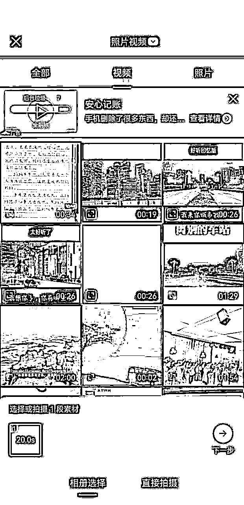

点击上传素材后，点击下一步，就会生成一个与原模板一样的视频：

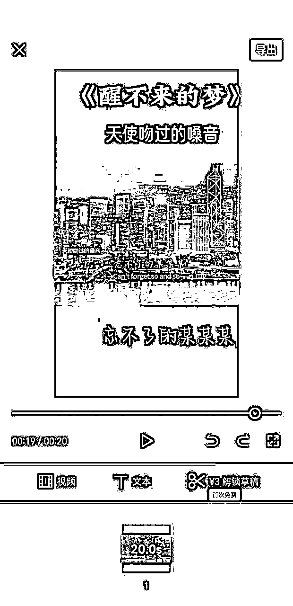

由于我添加视频是做好的视频，所以看起来不是很美观。如果你是会员，还可以对同款的视频进行修改，比如可以加特效，在别人的基础上优化新的视频，加入转场、特效、新的片段，这个就可以发挥自己的想象力了。

制作好内容后，直接点击右上角的导出，就可以把视频导出来，放到视频号发布。

这个方法不仅适合音乐，其他领域也一样适用。

下方视频就是用这个方式，两分钟制作的视频，火了，十万加点赞，这个视频收益几百到上千，所以操作不是那么的难，这样的视频一个人一天可以制作无数，批量操作账号做就可以。

看到视频号火的歌曲，就可以按照这样的模式去制作，是比较简单的一种制作方式。

b：原创制作

原创制作就是根据自己的喜欢，借助剪映，或者是其他剪辑工具，对素材进行加工，制作成新的视频。

这个时候我们可以选中素材，点击分离音频：

分离后，我们就可以获得视频的音频，再把原视频的画面删除，只剩下音频：

这个时候我们就可以添加需要制作的素材，可以是我们拍摄的视频，也可以是剪映里面的素材，其实制作视频的很多素材，都比如下图的素材「夜景车流」，直接找到剪映的素材库，搜索夜景车流，就可以找到很多素材：

选中其中几个你觉得不错的素材，插入编辑轨道。为了让视频的原创度变高，这里我们多选择几段导入，我选择了四段。

导入后可以对这些素材加入特效、画中画、调色，目的就是去重，因为这些视频被很多人使用过：

还可以选择一些自己比较喜欢的特效，转场。这里我加入转场，不同的片段时间可以加入不同的转场。如果你想全部设置一样，就点击应用全局。

如果想要短时间提升自己的审美或能力，最好的方式是找一个厉害的同行，根据他的视频 1:1 制作几个，感觉慢慢就起来了。

标题字幕

做上面的这些，这个时候就可以给视频配字幕了，点击音频按住，选择识别字幕与歌词，这样很快就出来了：

字幕出来后，就可以对选择喜欢的字体与大小：

同时也可以设置标题，点击添加文本，同样可以设置大小字体格式。如果标题是整个视频都需要使用，就把长度拉到与视频对齐，这样视频标题就一直出现了：

这些做好后，可以给视频做封面和片头片尾。制作过程中，还可以给视频加入一些特效，比如钢琴这些。

下面是两个钢琴特效，目前很多音乐视频都可以植入到里面，使用剪映的蒙版，或者是视频混合模式，就可以把电子琴植入到视频中，需要点击下面下载👇

百度网盘链接： https://pan.baidu.com/s/18TtPOLfPI8c1SXVW8NSaLQ?pwd=andr

提取码： andr 夸克网盘链接：https://pan.quark.cn/s/1be8ee83765d

视频发布视频可以直接发布，但是目前视频号有的特效是剪映无法制作出来的，比如下面这个特效，目前视频号音乐号很多都在使用开场就是电影效果，看看下面的感觉：

16baffbddb4049295a1820200fa2d893.mp4【在线播放】

### 6.4.4 文案鸡汤类

文案鸡汤，不管在哪个平台都爆火，视频也好，图文也好，都爆火，主要是年轻人看。

文案账号其实就一个点，文案中的某个点，某个场景，某句话引起大家的共鸣，对视频点赞、转发、收藏，有的文案会被大量转发，就是说到年轻人的心里话。

这也是比较好制作的一个领域，一张图片、一句音频、一个画面，就可以成为爆款：

获取素材

对于文案号的素材，多种多样，随拍视频、风景图、AI 图、表情包、动漫、电影、动画，剪映自带的素材都可以。

对于大部分人来说，做随拍视频、风景图是最容易的，这种原创度也是最高的。

其实文案号，重要的是内容文案和标题文案，所以文案很关键，素材有时候只是一个辅助，但是能找到与文案相匹配的素材，就加分了。

获取文案

文案类账号文案很重要，获取优质的文案很关键。

使用公众号的时候，点击文章的底部喜欢，收藏，会再次推荐其他账号的文案给你，这样就可以源源不断的获得文案内容。使用公众号时候，可以用电脑版进去，会比较好用。

还有一些行业网站，或专注语录、文案相关的 APP，也有很多情感语录。我们可以在手机应用商城搜索文案、情感、语录相关软件，下载就可以使用。

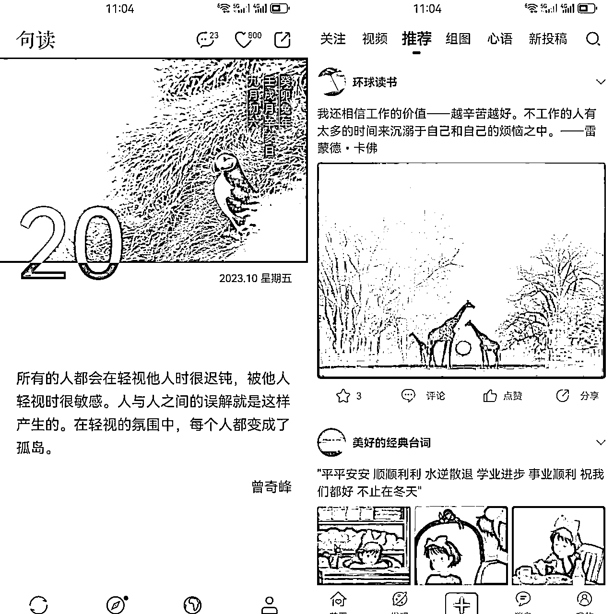

除了上面的渠道，还有一个重要的渠道，就是各大平台文案、情感相关的内容评论，比如公众号夜读的评论，小红书、抖音、视频号相关文案的评论，很多评论写得特别好，特别是那些点赞比较高的评论，可以直接转换成视频。

作为视频发布的内容，点赞越高，说明这句话说到大家心坎上，这样的文案大家都喜欢，制作内容爆的概率也很大：

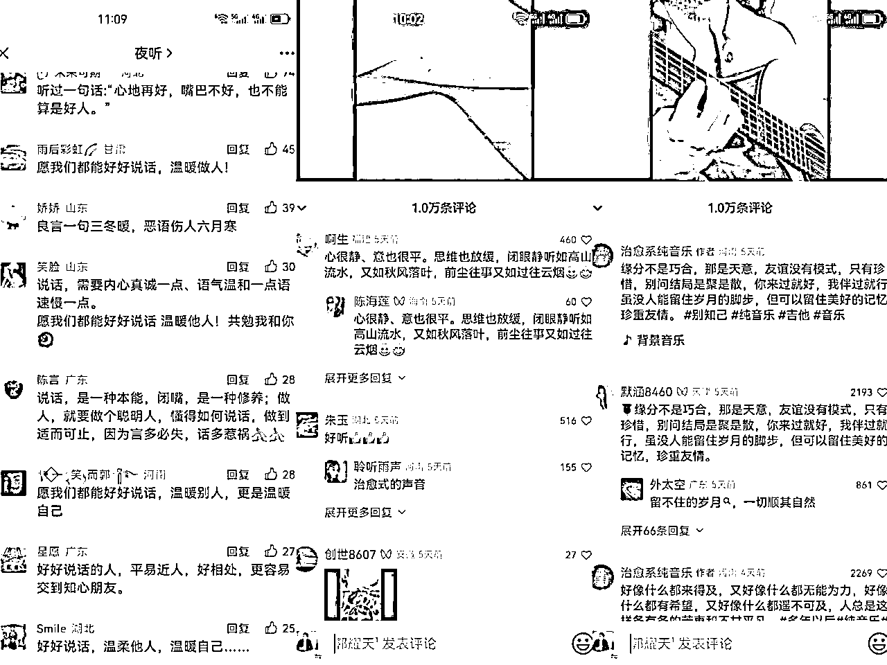

文案获取还有很多方式，方式不重要，重要是结果，希望大家操作的时候，多去测试，多去找。

获取音乐

文案类音乐，这个就需要平时多刷，还有就是使用最新热歌，可以问问身边的小哥哥小姐姐，他们平时都喜欢那些音乐。最好的方式是各大平台刷到这样的音乐时候直接收藏，后期可以使用。

文案配音配音这块，如果自己的声音比较不错，可以自己录制，或者找人做，但是成本比较高。

这里我们使用是配音软件-配音神器，价格便宜，配音效果也不是很差，现在我们一些领域账号都是配音神器制作的，扫描下面的二维码加入，开通会员，99 元永久会员，也可以使用其他配音软件，觉得不错的就可以。

电脑端比较方便，选择你喜欢的声音，或者是模仿同行的声音，建议是 1.1 倍的声音，这个可以调节的，调节后点击生成音频，下载即可使用：

制作内容

制作内容找到这个素材以后，点击打开，点击底部的剪辑同款就会进入相册，素材可以直接添加，然后我们可以选择适合的素材点击进去，根据自己的情况调整：

除了剪映可以做剪同款，其实快手也可以，可以找到更多的模版，特别是同类型的其他模版。

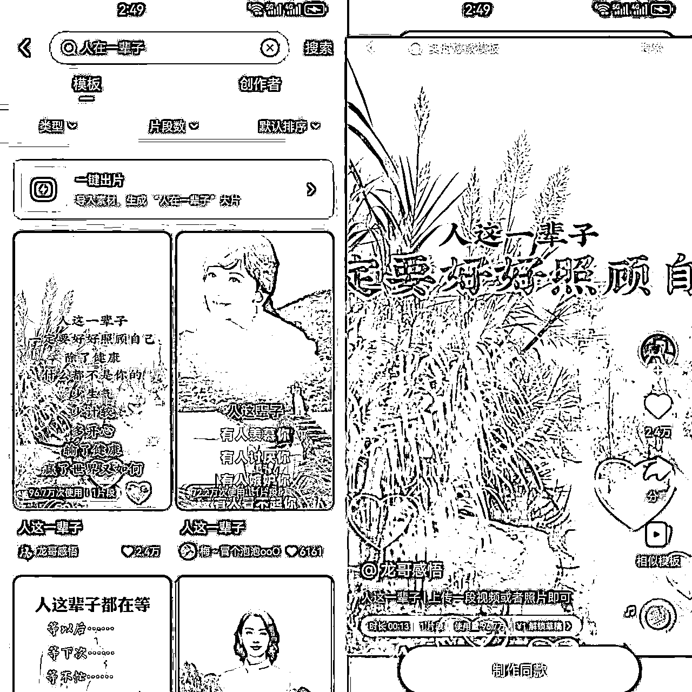

点击制作同款，进入选择素材，把素材导入，可以对素材重新编辑。如果需要一些高级编辑，就需要开通会员，这个根据自己的需求，一般不用编辑也是可以的：

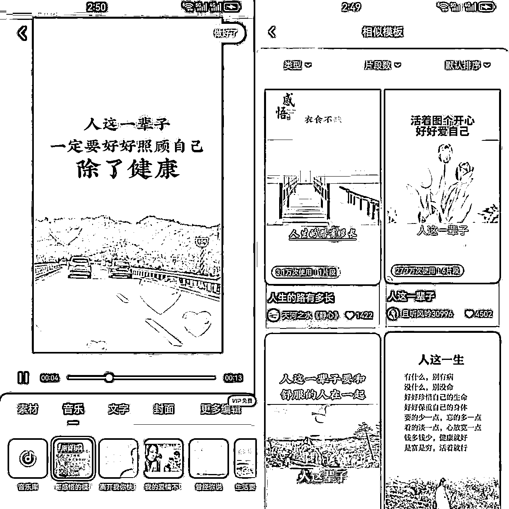

这里需要重点说一个功能，这个功能剪映没有，叫相似模版：

二创某个系列的模版时候，不可能一直参考同一个，还需要参考其他同类模板，这个时候我们可以在快影看到「相似模版」，点击这个可以找到很多与套用模版一样的素材。

在此基础上，我们可以直接对这些素材进行二次加工，这样就可以源源不断的获得同类素材了。

这样一个视频基本就做完了，准备好素材，一个视频就是五分钟左右时间就搞定。

打卡剪映，或者是快影，我喜欢剪映，这里就剪映演示，由于原创制作与其他赛道类似，直接套用其他制作流程。

在打开电脑端剪映，导入配音好的音频，或者是别人的音频素材，如果是视频素材，点击分离音频：

这个时候我们可以选中素材，点击分离音频：

分离后，我们就可以获得文案音频，再把原视频的画面删除，只剩下文案音频：

这时就可以添加需要制作的素材，导入拍摄的视频，也可以是剪映里面的素材，其实制作视频的很多素材，都可以在剪映里面找到，进行二次加工就能用，当然能原创就更好了。

比如我现在搜夜景车流，直接找到剪映的素材库，搜索夜景车流，就可以找到很多素材：

选中其中几个你觉得不错的素材，插入编辑轨道，为了让视频的原创度变高，这里我们多选择几段导入，导入后可以对这些素

可以选择一些自己比较喜欢的特效和转场，不同的片段之间可以加入不同的转场，如果你想全部设置一样，就点击应用全局：

如果想要短时间提升自己的审美或能力，最好的方式是找一个厉害的同行，根据他的视频 1:1 制作几个，感觉慢慢就起来了。

### 6.4.5 生活热点类

生活热点类领域比较广，其实还可以分为很多小类。这里就简单说下这个领域的操作玩法。

这个领域的内容大，有时候一句话、一个视频、一个配音就很火，就是那么一句话引起大家的参与、评论，所以这个领域重要的是找到相关的素材，还能找到比较好的文案，单独有素材没有好的文案不行，有好的文案没有对应的素材也不行。

所以这个领域需要大家平时多看，多收集，多举一反三，才能快速的制作爆款：

例如上图，第一个视频是一个农村孩子回家视频，开车一个豪车，从到家门就拍起，写上一句话，2000 多公里，终于安全到家，文章是说自己的家穷的原因，下面就有很多人评论，有人说确实有出息，有人说装逼，有人说有个车了不起，于是别人火了。

第二个视频，是农村 70 年代接媳妇，现在都是用车，那个时候还有家具，这个视频能让那些 70/80 年代的人有回忆。还有就是标题说的“嫁给爱情，没有公路也一样娶媳妇，再看看现实，就算结了都会离婚，哪里能找到当时那样的婚姻”，所以得到好评。

最后一个是一对农民工夫妻，这样场景很多，反映出来的东西很多，所以火了。

搜集素材这个玩法主要就是搜集素材，把一些经典的素材搜集起来，比如农村办酒、搞活动的，都可以搜集。

再比如生活中一些细微点滴生活，能反映表达某个现象，或者表达某个意思的素材，这种就需要靠大家平时多搜集、多看，能在别人的基础上去发挥，找到引爆点。

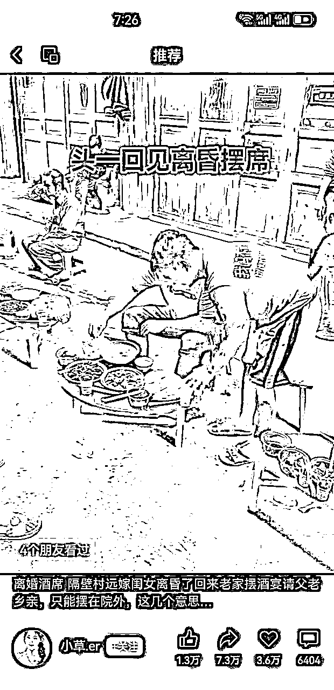

搜集文案

这个领域的文案特别重要，比如上面的这些文案都很经典，日常还是要靠大家多搜集。

所以对于生活一些小领域，真的可以好好研究，好好制作，很容易出爆款，一个爆款就可以搞不少钱。

视频制作

这个领域的视频不需要太多的特效转场，甚至不需要太多的内容，只需要一些简单的文案，加上素材，就能火，也没有固定的剪辑玩法，这个大家多去看同行，看看别人是怎么做的，可以找到同类素材，同类文案，爆的概率还是比较大的。

风险点

这个领域操作的时候，一定要处理好视频，很多视频都是二创的，很容易过不了原创，还容易掉原创，导致创作者分成计划的收益权限被关闭，所以操作的时候一定要视频去重。

可以借助消重软件，多视频多添加一些特效或模版，让视频原创比重增大，不然容易出问题。

### 6.4.6 冷知识工具

冷知识领域在各大平台都火，冷知识指的是琐碎的、庞杂的事情或知识等，它们无时无刻充斥在我们的生活周遭，却鲜少人会去注意，所以通过视频的方式把这些知识表达出来后，在各大平台都比较火，特别是抖音、小红书、快手目前比较多。抖音上有人做了几百万粉丝。

这个领域不仅可以制作冷知识，还可以分享一些小工具、小神器：

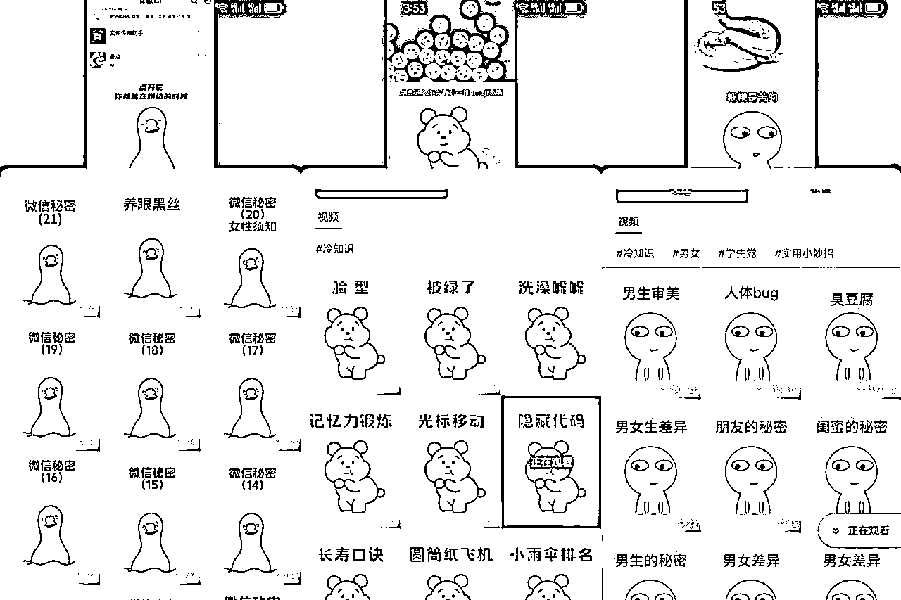

冷知识领域，单独通过赚收益变现估计不会很高，但是对于涨粉，同步分发其他领域价值很大。比如把这些内容发布到其他的平台，如小红书、抖音、快手，如果你的内容很好，特别是在小红书，粉丝 1000 以上就可以接商单，冷知识就是很不错的领域。

如果你做的是冷知识相关的工具，那么还可以把这些粉丝导入私域，做其他项目的转换。

冷知识视频其实制作也简单，片头基本是一个漫画，下文给大家准备了几百个漫画头像，选择自己喜欢的直接使用就行，素材是@耀天老师 花钱找人买的。

其次就是冷知识的素材，很多素材都是直接二创外网的一些东西，把它们与配音相结合，解读某个知识，达到传递信息的目的。配音可以直接学习别人的，也可以使用自己的。

片头漫画刚开始研究时候还不知道这些漫画怎么来，后面发现基本都是找人设计的，所以我在淘宝上联系商家，找他沟通了，把他手里的卡通人物都全部买了，不然大家去淘宝定制一个也需要几十上百元。

目前冷知识都是这样的片头开始，如果觉得我们提供的漫画头像不好，可以找淘宝定制，几十元一个：

百度网盘链接： https://pan.baidu.com/s/1JPG5N7PCSs_mBh-07COJrw?pwd=i226 提取码： i226

夸克网盘链接：https://pan.quark.cn/s/740cf040f997

百度网盘链接： https://pan.baidu.com/s/1BFBNoJwksx4riT8FKoheRQ?pwd=itm2

提取码： itm2 夸克网盘链接：https://pan.quark.cn/s/ef6d92744512

搜集素材素材很多都是生活中的场景，或者是录制一些工具使用的视频，或者是软件操作流程，这个就需要根据自己的操作去选择合适的素材。

比如你介绍是微信某个功能或者某个软件，这个时候就可以通过录屏的方式，把操作这个软件功能的流程录制下来，再配音就可以。

比如下面这个就是对工具的录制：

stodownload (4).mp4【在线播放】整理文案

很多冷知识可以直接学习同行，如果觉得别人的文案不好，也可以自己写。这里推荐几个找冷知识的网站（需要科学上网，挂好魔法后，搜索以下网站名就能找到并进入），可以在上面找不少冷知识。

① List 25

List 25 可以说是《25 件 XX 的事情》这类视频的文字版。网站上可以找到覆盖历史、科学、娱乐等各种不同类别的冷知识。如同网站的名字，这些文章只包含 25 个冷知识。网站上的文章篇幅不长，通常都是一张图配上几句话，非常简单易懂。

如果你只想找些短小的冷知识来打发时间，你可以使用网站上的「Random」功能随机找一篇文章。你也可以在 YouTube 订阅 List 25 的 官方频道。

② Listverse

Listverse 与 List 25 一样，覆盖了人文社会、科学、娱乐等方面，但在文章的内容中却更加克制。如果你觉得 List 25 上一片文章涵盖的内容太多，那么每篇文章只有 10 个冷知识的 Listverse 或许更适合你。

不同于 List 25 只用几句话来传达冷知识，Listverse 的文章篇幅相对较长，并且比起前者更为详细。因此 Listverse 上的内容可以帮助你更加深入地了解某个冷知识，相应的，你需要有一定的英语能力才能流畅阅读。

③ Facts Slides

对于知识而言，最重要的是它的准确性。冷知识也不例外，当我们兴高采烈地与朋友分享刚学到的冷知识，却发现那个冷知识是错的时，我们必然会感到尴尬无比， Facts Slides 宣称在网站上的所有的内容都是 100% 真实的。

打开 Fact Slides，你就会看到冷知识以巨幅幻灯片的形式呈现在眼前。为了确保冷知识的准确性，你可以在每一张幻灯片上找到它的来源。由于网站对准确性的高要求，它所涵盖的内容相对有限，在幻灯片的下方，你可以找到网站上的所有冷知识。

④ Design Facts

如果你正在从事设计行业，或对设计感兴趣，那么专门为设计师提供的 Design Facts 一定会让你喜欢。相比起覆盖面极广的 List 25 和 Listverse，Design Facts 可以称得上十分克制。

在 Design Facts 上，你只能找到一些设计领域的冷知识。除了内容是设计领域的知识外，网页本身也极具设计感。

⑤ Hooked on Facts

打开 Hooked on Facts，你会感觉穿越到了十五年前。自 2003 年建站以来，网站虽然没有更新过界面，但内容却在不断更新。

在 Hooked on Facts 上，黄底文本框会随机显示一条冷知识，你可以点击下方最左侧的按钮来获取其他冷知识。在文本框底部，还会显示当前冷知识的来源是否经过验证。

⑥ Mental Floss

前面介绍的网站大多以短小的文章来传播冷知识，而 Mental Floss 则是以长文章的形式为你深度介绍冷知识。在 Mental Floss 上的文章篇幅都较长，因此，你需要足够的英语能力才能很好地阅读。在文章中，所有的引用都会有链接指向原文，甚至会提供 PDF 文件的下载。

当然，如果你只想要看短小一些的冷知识，你可以点击顶部的「Amazing Facts」来查看篇幅短小的冷知识，对英语能力要求也不算高。

⑦ Trivia QuestionsTrivia Questions 作为一个「走量」的冷知识网站，几乎所有文章都有 50 个以上的冷知识，有的文章甚至多达上百个。网站的文章以问答的形式来介绍冷知识，当你打开一篇文章，它只会显示像是「蜗牛能睡多少年？」这样的问题。只有在你点击问题后，它才会给出答案。

文案配音

冷知识很多文案可以直接参考别人的，如果是长期做，最好是自己配音。

配音这块，如果自己的声音比较不错，可以自己录制，或者找人做，但是成本比较高。

这里我们使用是配音软件-配音神器，价格便宜，配音效果也不是很差，现在我们一些领域账号都是配音神器制作的，扫描下面的二维码加入，开通会员，99 元永久会员，也可以使用其他配音软件，觉得不错的就可以。

电脑端比较方便，选择你喜欢的声音，或者是模仿同行的声音，建议是 1.1 倍的声音，这个可以调节的，调节后点击生成音频，下载即可使用：

制作视频视频制作 9：16，目前冷知识制作，都是一个开头人物开通，视频上部分是内容，下部分是卡通。

下面是我制作的工具类的冷知识相关的视频，可以看看，很粗糙，需要再次优化，下面就把制作的教程告诉大家。

下载 (5).mp4【在线播放】a：打开剪映，选择背景

b：导入素材导入操作软件录屏操作教程、音频、配音，导入卡通人物

c：剪辑视频

这个地方就很关键了，我们需要把操作流程与文案对齐，因为操作录屏时候，未必录制都是好的，这个时候就需要对录屏素材进行删除，分段，留下与文案吻合的片段。

这里有个操作小细节，对于很多视频创作者，特别是初学者，无法把音频与字幕、内容对齐，其实可以根据音频的高低，一般低地方没有声音，没有内容，了解这一点后就很好对齐了：

制作的时候还可以加上特效、转场，这个就根据自己的喜欢去设置。

d：字幕制作

当视频全部处理后，就是给视频配字幕，这里常规流程即可：按照音频识别字幕，对字幕设置喜欢的字体、颜色，再加上标题即可：

这样一个视频基本就做好了，做好封面，做好标题，就可以直接发布了。

### 6.4.7 人性语录类

人性领域是目前视频号里面爆火的一个领域，与文案号不一样，人性相关的视频，是通过一句话，或者是一段话，说出一些人

获取文案

人性文案就很多，通过拼多多、淘宝就可以买到很多，也可以从一些文案网站找素材，或借助 AI 工具生成。

目前我们的操作是，从抖音、快手、视频号找那些比较爆火的人性视频，提取视频文案，简单修改下，再配音制作成一个新的视频。

下面是为大家准备的 25000 条文案，还有几十本人性相关的书，有需要的直接保存下载：百度网盘链接： https://pan.baidu.com/s/1zK0242ZHpsHPlMLbkoiCgw?pwd=4v8k

提取码： 4v8k

夸克网盘链接：https://pan.quark.cn/s/1c0c4317733c 获取素材

关于人性的素材就很多，可以是高清生活图、风景图，都可以，还有一些随拍视频，只要高清就可以，能找到与人性语录相关的视频就更好。还有一些电影电视的片段，比如去 b 站、YouTube 上下载视频都可以。

这个赛道重要的是文案和标题，要看它们能不能给人带去价值，带去思考。

一般参考别人爆火的内容，再次爆火的概率会大很多，所以二创爆款内容是比较快捷的操作方式。

文案配音

关于人性语录赛道，如果你考虑后期带书，能自己做配音还是要配音，这样不会限制后期制作，不然你参考的账号不更新，你就没有更新了。

配音时选择比较磁性稳重声线，直接配音就可以。

配音这块，如果自己的声音比较不错，可以自己录制，或者找人做，但是成本比较高。

这里我们使用是配音软件-配音神器，价格便宜，配音效果也不是很差，现在我们一些领域账号都是配音神器制作的，扫描下面的二维码加入，开通会员，99 元永久会员，也可以使用其他配音软件，觉得不错的就可以。

配音神器可以在手机小程序上使用，也可以下载电脑端使用。

电脑端比较方便，选择你喜欢的声音，或者是模仿同行的声音，建议是 1.1 倍的声音，这个可以调节的，调节后点击生成音频，下载即可使用：

视频制作

a：模版制作

模版制作这个简单，比如你想制作某个领域或者某句活的视频，直接打开剪映或者快影，搜索相关的文字，可以找到一些比较

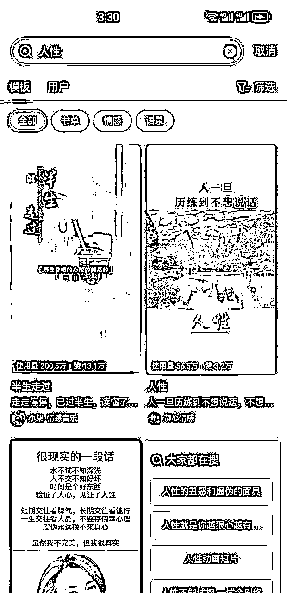

这里还有一个思路，就是看到某个账号的视频制作比较好，可以点击进入他的主页，可以看到更多的相关素材，这些素材是可以直接学习的。

比如这个模版就很不错，直接传图片就可以更新：

随便点击其中一个，这里我使用我生成的 AI 图片制作，看看效果，还是不错的，你还可以在别人的基础再次优化，比如添加特效，更加丰富视频内容：

WeChat_20231024154048.mp4【在线播放】b：原创制作

原创制作可以使用手机，也可以使用电脑剪映，我比较喜欢使用电脑端，方便快捷。

打开剪映电脑端，导入录制好的音频：

也可以先导入需要制作的素材，这里的素材可以是图片、视频、电影片段，或者是表情都可以。这里我选择的是剪映里面素材库的视频，可以搜索风景视频：

字幕出来了，调整文字的大小，选择自己喜欢的颜色，加上标题，一个简单的视频就完成了：

其实很多视频是真的很简单的，操作熟练，几分钟就可以搞定一个。

c：AI 制作

对于人性文案类的视频，其实还有一种制作方式，就是借助 AI 的一键成片功能制作。

比如剪映的一键成片，就可以制作出对应的视频；

快影的一键出片功能，制作出来的内容需要修改下，还是可以使用。

目前正在测试一个软件，生成的质量特别高，就是百度开发的度加：https://AIgc.bAIdu.com/welcome

度加有几个不错的功能，可以根据你的内容写文案、缩写，还有一个就是可以根据热点写文案，不过每天有次数限制，这个问题很好解决，换账号就可以解决。

如果是自己准备的文案，直接复制到这里，直接就可以出相关的内容 ，特别是做热点的，可以借助度加制作相关的内容。度加还有模版直接可以使用，目前很多三农相关的视频文案都是这样制作出来的，确实很不错：

如果觉得系统的素材不行，也可以用自己准备的素材。

下面是我使用俗语文章制作的视频，很高清：

视频发布发布的时候找一些扎心的话做标题就行，或者写一些与内容相关的内容，或者直接发文案，都可以。目的就是引导大家去互动，这样的收益才会高，设置好封面这些，直接发布即可。

粉丝价值人性相关的视频，粉丝质量是很高的，后期可以带书，也可以做相关的社群，目前公众号有不少做人性相关的社群，收费都比较高。特别是关于强势文化、弱势文化相关的内容，现在很多人对这些东西还是比较有兴趣的，所以人性相关的粉丝可以好好研究。

如果你的视频号开通了默认展示功能，那就速度把粉丝引到公众号，再次变现。

### 6.4.8 怀旧经典类

怀旧经典是各大平台比较爆火的一个领域，目前有人单独拍摄这个领域的视频，很多视频是以前的老视频，通过混剪的方式，把不同场景的视频拼凑在一起，制作成新视频。

如果有条件拍摄原创的怀旧视频那就更好，没有条件就是二创，直接伪原创，操作这个领域的分成计划，一定要先借助随拍视

获取素材目前操作怀旧视频，基本都是 80/70 小时候的生活记忆，这方面的视频有几个来源。

首先可以去淘宝、拼多多、闲鱼这些平台找一些高清无水印的视频，或者去抖音、小红书、视频号、快手搜索怀旧相关的关键词，找到相关的账号，看哪些视频没有水印，下载下来使用。

获取音乐

对于怀旧视频音乐，找 7080 年代比较火的音乐，比较有回忆的音乐即可，比如童话。

还有就是刷同行，把同行爆火的音乐直接收藏、保存。还可以找一些自己觉得不错的音乐，直接作为视频的音乐。

最好是用别人爆火的视频音乐，这样爆的概率会比较大。如果是用别人视频音乐，需要借助软件把直接分离音频，一般使用是剪映的分离。

这里想要说一点的是，爆火的音乐可以重复使用，只需要换素材，直到这首歌没有流量为止。

处理素材

处理素材主要整理无水印的素材，把抖音、快手、视频号、小红书这些账号上的视频无水印下载，下载后借助智能分割软件，直接分割，把这些分割的素材保存，后期剪辑视频的时候，选择其中一些片段相互组合就是新的视频。

如果素材全部存储在剪映，可以直接使用剪映的智能切割，唯一的不足，就是素材必须在剪映，目前测试无法直接导出，对于大部分人，这个功能也足够使用。

如果想要把素材保存到剪映外，可以用下面这个工具。

智能切割工具，点击下载👇：

智能场景.zip

夸克网盘链接：https://pan.quark.cn/s/8e4b8622f004 操作后效果如下：

怀旧视频制作其实相对还是比较容易的，火的概率也比较大，转发也大，算是比较稳定的一个领域。

怀旧配音

一般怀旧视频很多都有文案解说，直接配音就可以。

配音这块，如果自己的声音比较不错，可以自己录制，或者找人做，但是成本比较高。

这里我们使用是配音软件-配音神器，价格便宜，配音效果也不是很差，现在我们一些领域账号都是配音神器制作的，扫描下面的二维码加入，开通会员，99 元永久会员，也可以使用其他配音软件，觉得不错的就可以。

配音神器可以在手机小程序上使用，也可以下载电脑端使用。

电脑端比较方便，选择你喜欢的声音，或者是模仿同行的声音，建议是 1.1 倍的声音，这个可以调节的，调节后点击生成音频，下载即可使用：

混剪视频剪辑一般使用是剪映软件，导入素材，导入音频，就可以剪辑。不过剪辑时候尽量去重视频，因为使用基本是别人的素材，或者是购买的素材，这些素材被使用过很多次，需要高度的剪辑，让平台认可你。

不然不能打原创，就无法开分成计划，就无法赚钱了。

注意剪映素材库里素材的声音记得关掉，带 logo 的裁掉。

### 6.4.9 表情包视频

表情包视频是各大平台都比较爆火的内容，特别是年轻人特别喜欢，以前是抖音爆火，现在视频号也比较火。

借助表情包做文案、情感、歌曲、祝福视频都可以，无法细分到其他的领域，所以干脆单独开一个专注表情包制作的领域，我们会把操作过程中收集整理的资料全部整理给大家，根据教程就可以操作。

表情包变现模式也比较多，赚表情包收益只是其中一块，还可以给别人提供表情包、定制表情包、收徒制作表情、收徒制作表情包视频，都是可以的，所以有兴趣的，真的可以好好研究下这个领域。

这次我们就先来看表情包视频怎么做，主要是视频制作起来很简单，熟悉后几分钟就可以制作一个视频，准备好素材即可：

获取素材表情包的素材比较多，可以去各大表情包 APP 下载，不过批量制作还是比较难下载。

其实我们需要的别人都为我们准备好了，花点小钱就可以解决，去拼多多、淘宝、咸鱼搜索表情包就可以搜索到很多，我们在淘宝拼多多为大家准备了几千个表情，可以直接使用，作为素材，使用中把各种素材混合使用就可以，操作还是比较简单。

链接： https://pan.baidu.com/s/19SuOSsa2tGqPJ8ZeTbg0Gw?pwd=idvq 提取码： idvq

夸克网盘链接：https://pan.quark.cn/s/c7cbe3e5b2a1

如果还需要更多的表情包，可以自己制作，也可以网上去搜索，很多都是别人整理好的，直接拿过来使用，基本几元钱就可以搞定。

获取文案

目前表情包可以做的内容比较多，可以做早安祝福，也可以做情感语录，还可以做音乐，可以根据其他领域的操作，找到对应的文案，文案获取也是那几个方式，要么是直接学习别人的，或者是淘宝拼多多获取。

如果自己的文笔比较好，直接写也可以，或者去一些专业的网站 APP 上也可以找到，一句话就是找一些大家有兴趣的文案。

音乐配音配音这块，如果自己的声音比较不错，可以自己录制，或者找人做，但是成本比较高，且别人的配音有个不好的地方，后期他不做，或者是植入广告时候就麻烦。

这里我们使用是配音软件-配音神器，价格便宜，配音效果也不是很差，现在我们一些领域账号都是配音神器制作的，扫描下面的二维码加入，开通会员，99 元永久会员，也可以使用其他配音软件，觉得不错的就可以。

配音神器可以在手机小程序上使用，也可以下载电脑端使用。

电脑端比较方便，选择你喜欢的声音，或者是模仿同行的声音，建议是 1.1 倍的声音，这个可以调节的，调节后点击生成音频，下载即可使用：

视频制作视频制作可以是手机剪映、快影等剪辑软件，适合自己的就好，这里就以电脑端的剪映给大家演示。其实比较简单，导入素材，配音，做字幕就可以搞定。

对于表情包，不需要太多的花里胡哨的特效，加这些特效反而就失去表情包表达的意思。制作视频时候，最好是选择与内容相关的或者是相近的表情包，这样制作出来会比较好。

第一：制作背景，选择背景

可以直接在剪映选择一个自己喜欢的背景，也可以自己制作一个背景，导入背景：

第二：导入音频

这里音频可以直接用第三方导入提取音频，直接导入，也可以使用原视频的，把视频与背景放在不同的轨道。

如果是使用别人视频的，直接导入原视频，导入视频以后，选中视频，点击分离视频：

分离视频后，删除原视频画面，这个时候就看到需要的音频了。

第三：导入表情把我们需要制作的表情下载，导入剪映，如果是手机端可以使用贴纸添加，也可以直接导入，电脑端可以直接把表情拖入剪映，或者是添加都可以。

导入表情的时候需要注意细节，表情都是有动作的，有时间的，需要把完整的表情导入，不然到时候制作出来的视频就是怪怪的。

还有导入的表情有大有小，最好是把表情的大小调整一样，这样看起来比较舒服，这些处理好后，就可以给视频配字幕。

这里需要注意的是，放的表情最好与音频节奏一致，可以看到音频的跌幅插入表情，这样制作出来的效果就很好了。

第四：视频配字幕

如果是单纯的文案，没有音频，直接添加文字制作想要的标题就行；

如果有音频或者歌词，直接按住音频，点击识别字幕，就出现想要的字幕了，对字幕调整，达到自己喜欢的样子，再添加标题即可：

简单修改下，一个视频基本就做完了，下面作为演示简单制作了一个，可以多优化，效果会更好。

10 月 25 日.mp4【在线播放】内容发布

制作好的内容直接发就行，发的时候记得打上标签，参考同行取一个好的标题文案，还有就是封面图，一定要做好，发布时候一定要打上原创，不然没有分成计划的收益。

### 6.4.10 今日话题类 @黄岛主

今日话题类视频在内容形式上和表情包视频有共通之处，文案形式上更贴近热点赛道，需要大家多关注热点、关注对标账号，收集文案。目前赛道收益不错，热门程度很可观，每天基本上稳定 30-50 元左右。

来，先看下今日话题视频案例：今日话题案例视频.mp4【在线播放】

再来看下账号数据效果：

其实这个赛道制作挺简单的，照着下面写的教程去制作，基本 10 分钟就能做完一个视频，收益的话单号平均 30-50/天。当然，如果圈友都去做，后续肯定会因为最近做这个赛道的人太多了最近流量有所下降，这个大家到时候观察下吧！

也就是说，你做的时候，收益也跟我这个差不多，除非你能差异化，有自己的一套玩法在里面，毕竟每个人操作起来都是不一样的，起号效果也是不一样的。

另外，如果要过分成计划的话，这个赛道建议一直发今日话题短视频，粉丝够 100 了，差不多自然就开通创作者计划，所以也没什么快速的方法，就是持续做这个赛道的内容即可。

关于实操的话，我说几点经验，这个仅供参考：1、做这个项目最好用新号（新号爆了后后续数据也会很好），我们部分老号去做，但后续流量一直起不来，而且做这个项目一定要有耐心，运气好的话 3-5 天爆作品，我两个都是 10 天后才爆作品，之前都是几千浏览量。所以，你要忍得住寂寞！先把周期放到 15-30 天左右！

这个赛道有个好处，一旦爆了会随随便便都上百万播放量，而且我建议大家一个号一天就发一个作品，我数据好的账号一天就发一个作品，做得好的同行也是，多发系统会判定你账号质量不行，我第二个号就是多发导致流量一直上不去。

2、素材的图片去微博或者微信找，搜索关键字比如猫、狗、表情包、汤姆猫、壁纸等等，但一定要截图，不要保存图片。

3、同行视频号爆过的作品很容易参考过来，过创作者计划，题目学一下再改改，然后文案可以去评论区找点赞比较多的评论，但千万不要全抄。

4、我觉得这个赛道养号挺重要的的，我就每天都去刷同行视频，关注，点赞，评论。我数据好的那个号就是这样做的。

以上则是我们工作室实操这个项目积累的一些经验吧，仅供参考！

好了，具体操作步骤，我们详细来看下面哈！

获取素材

步骤如下：打开微信，点击我的，点击表情，里面有很多表情包，选择一些比较可爱、好看的添加上，然后在右边放大镜点击搜索想要的表情，在微信对话框搜索想要的表情关键词。

然后我们在使用表情的时候，直接把需要的表情发给他，就会给你下载的链接，点击下载，保存原图到相册就可以了。具体如图：

获取文案

根据你选择的对标素材，直接去抖音里搜索就可以，这个我建议你多去看下对标账号，才能有经验的，你一开始做什么都不去

视频制作

具体制作步骤，我用图文来展现给大家：1、导入开头图片，打开剪映，点击开始创作，先把开头的图片放进去，点击高清，添加，把它往上拉到合适的位置，把比例调成 9:16，添加文字，新建文本，输入“如何优雅的官宣恋爱了”，样式、字体改一下，改成黑色，有很多样式，找一个比较喜欢的就可以，缩小放到合适的位置。

1、导入开头图片，打开剪映，点击开始创作，先把开头的图片放进去，点击高清，添加，把它往上拉到合适的位置，把比例调成 9:16，添加文字，新建文本，输入“如何优雅的官宣恋爱了”，样式、字体改一下，改成黑色，有很多样式，找一个比较喜欢的就可以，缩小放到合适的位置。

2、字幕，点击新建文本，把上文获取到的文案依次输入放进去，字体颜色、样式都可以根据自己的喜欢选择，太长的可以给分成两段，直接复制一层，输入之后的文字字幕就可以了，把文字字幕依次拉动到下方合适的位置。

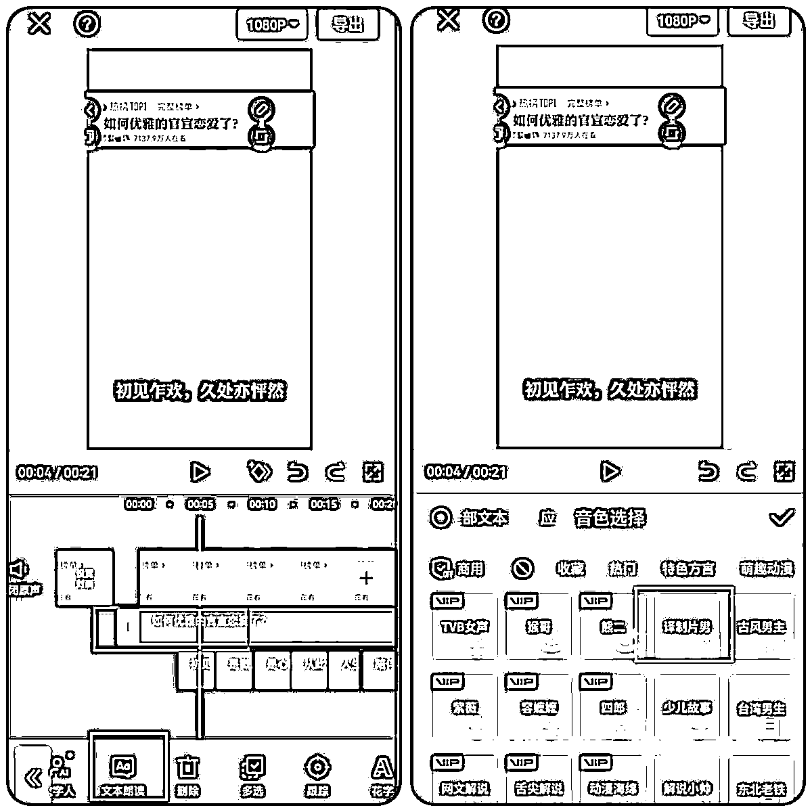

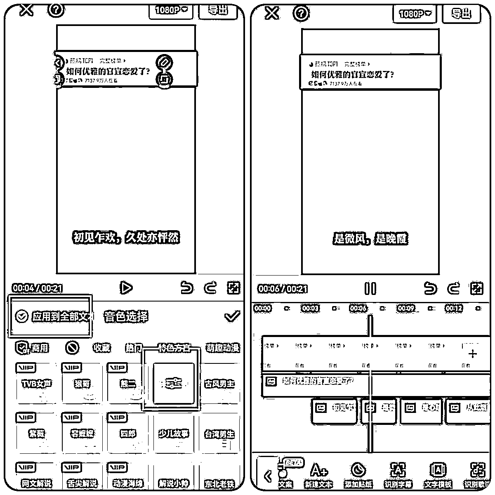

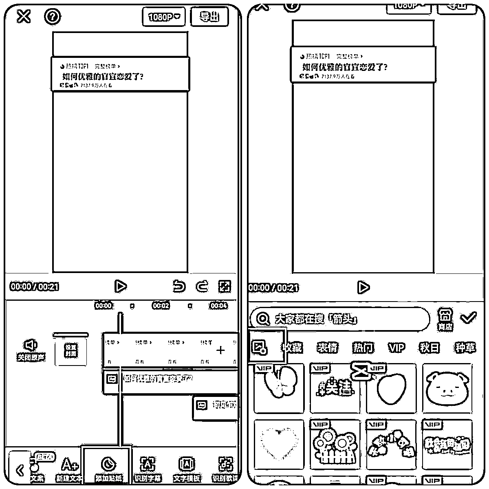

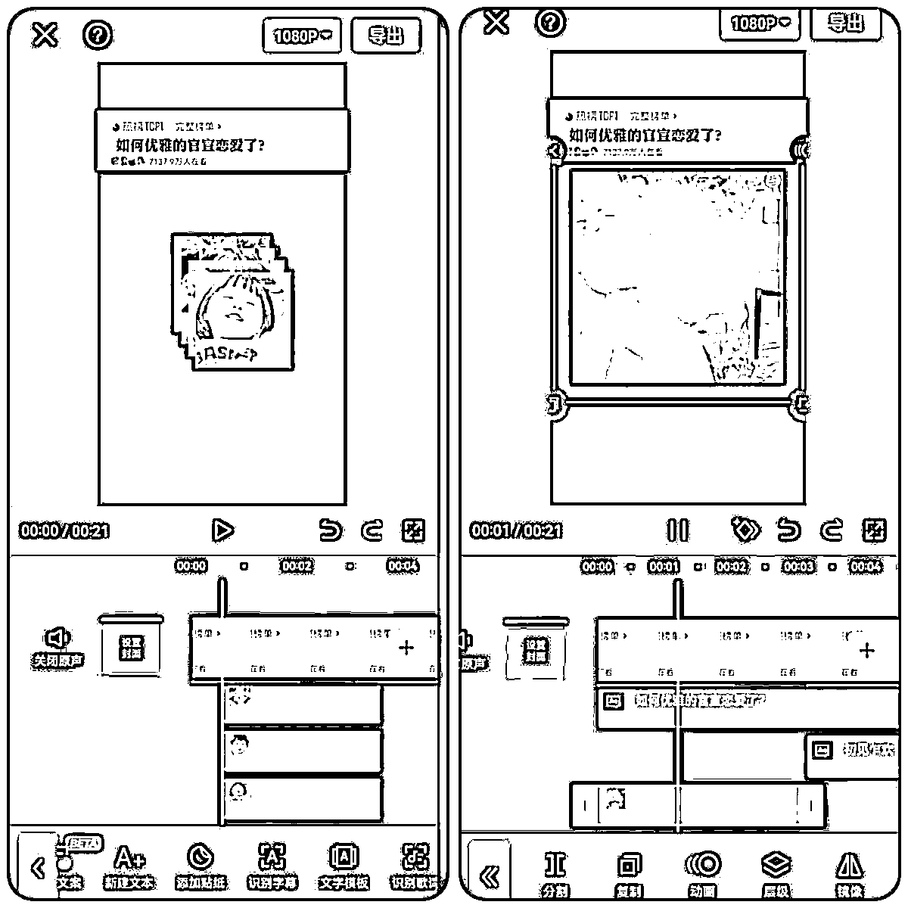

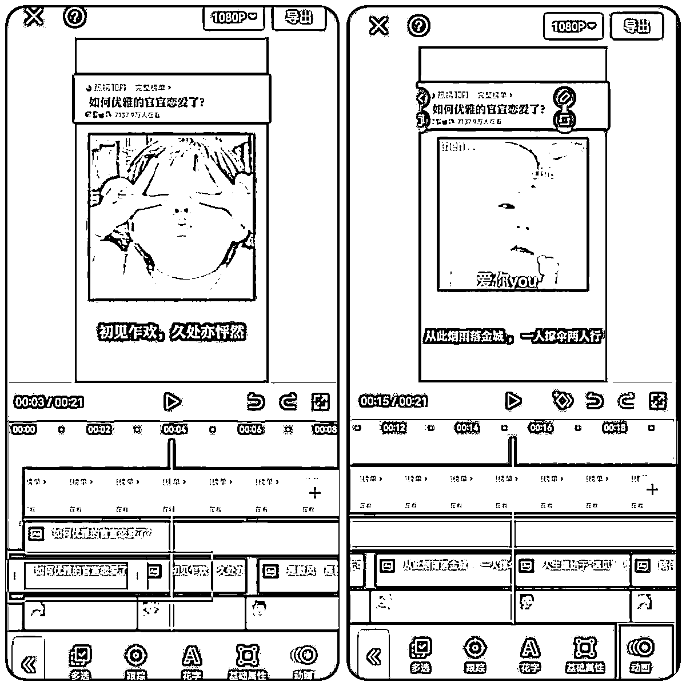

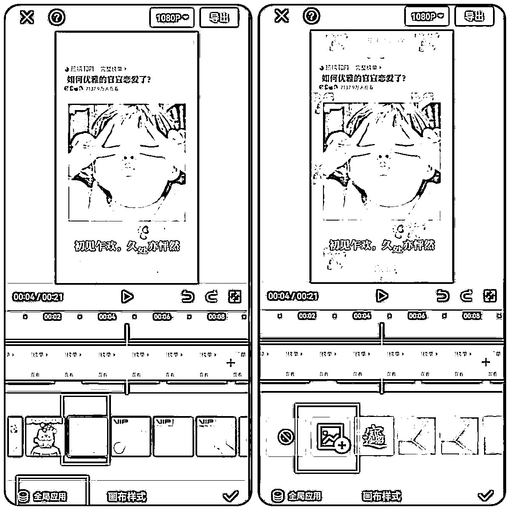

5、背景音乐，背景音乐我们可以提前去抖音里面收藏，点击音频，点击抖音收藏，搜索纯音乐，点进去搜索，找到合适的放上去，点击使用。

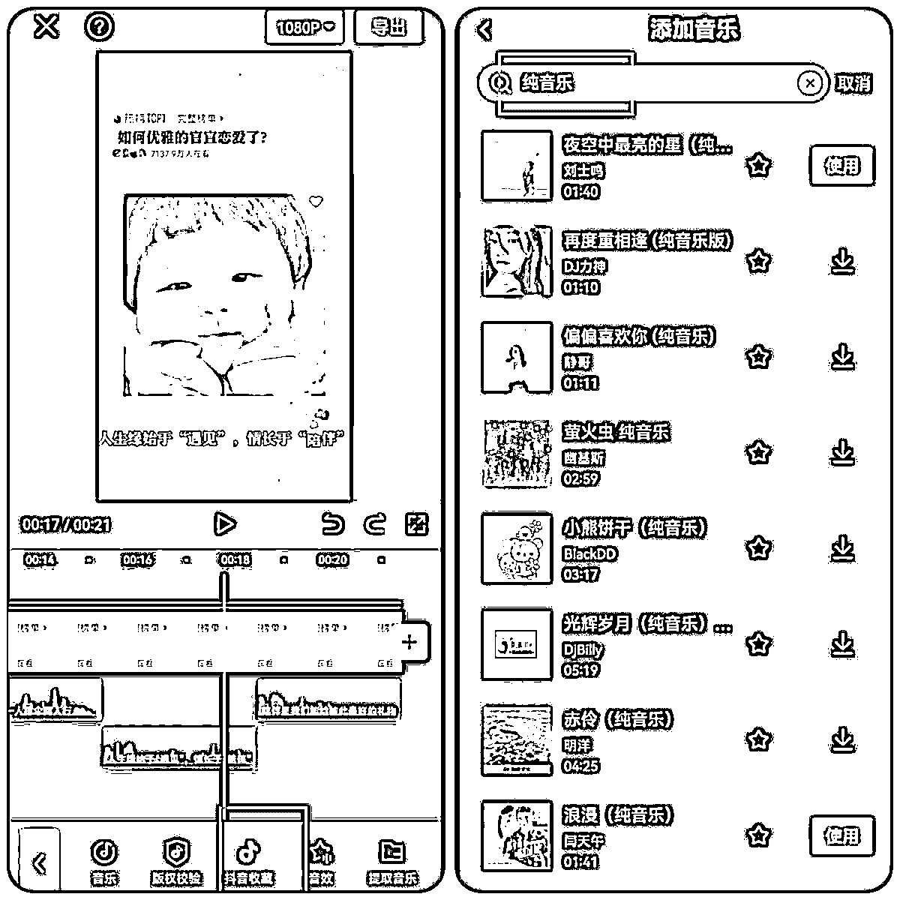

音频拉到最前面，把音量调小，配音音量给他调大，然后把后边多余的配音分割删掉，把整体视频的文本，表情包都拉到对齐，视频就制作好之后，点击上角 1080P，把帧率拉到 60，码率推荐，点击导出就可以，导出完之后去发布，封面的话也可以直接截取视频里一帧比较好看的。

最终就做成成品视频了：今日话题案例视频.mp4【在线播放】

内容来源：《视频号“今日话题”赛道流量主变现，保姆式教学实操一条龙玩法分享给你！》@黄岛主

### 6.4.11 中老年祝福 @黄岛主

由于视频号的用户属性，中老年人群相对较多，所以早安祝福相关的视频就比较多，如果你关注亲人群，就会发现老人大概率转发过类似视频，这个也是一个思路，多去看看老人朋友圈转发是什么，群里面转发是什么，就知道哪方面是老年人喜欢的。

这种视频用年轻人的审美是看不下去的，千万不要按照我们的想法去做，而是要做中老年人喜欢看的视频，才会转发、收藏：

第一步：获取素材制作早安祝福相关视频的素材可以是随拍视频，或者是其他平台下载的，但是要经过二创处理。

推荐最好是随拍视频，或者是一张图片，图片可以各大平台搜索，但是很多平台都被使用过，很难过原创。这里有一个技巧是，可以使用 AI 绘画制作图片。

随拍素材很好获取，大家平时出门的时候，可以拿手机随手拍一些风景视频，或者行车记录仪视频，这样的视频原创度很高，刚开始开通权限的时候，最好不要用搬运、剪辑拼凑的视频，难以开通创作分成计划的权限。

第二步：文案获取文案简单，参考并提取同行即可。

这种文案非常多，随便去百度、抖音、小红书、快手搜一下有很多，提取视频文字就可以。

比如打开抖音或视频号，搜索儿女祝福，随便找一个视频数据比较好的文案。

有的视频标题就是文案，可以直接复制，如果是没有文案的，可以借助提取文案工具。比如使用小程序轻抖小程序，点击文案提取，把复制的链接粘进去，点一键提取文案，复制文字就可以了。

如果是图文类的直接截图，提取文字就可以了，目前提取文案工具很多，我使用比较多是配音神器上的工具。

如果你文案功底很好，还可以借助 AI 工具生成，再次修改下，不过这样的文案就需要测试，最好使用联网的 AI 工具去写。

也可以使用百度文库的智能助手👉点击这里进入智能助手

第三步：配音录制

配音这块，如果自己的声音比较不错，可以自己录制，或者找人做，但是成本比较高。

这里我们使用是配音软件-配音神器，价格便宜，配音效果也不是很差，现在我们一些领域账号都是配音神器制作的，扫描下面的二维码加入，开通会员，99 元永久会员，也可以使用其他配音软件，觉得不错的就可以。

电脑端比较方便，选择你喜欢的声音，或者是模仿同行的声音，建议是 1.1 倍的声音，这个可以调节的，调节后点击生成音频，下载即可使用：

第四步：创作视频

视频制作，目前最常用有两种制作方法，一是视频背景制作，一个是图片制作视频。

制作软件推荐使用剪映（官网：https://www.capcut.cn/），比较方便，剪辑效果也不错，可以手机端，也可以电脑端，制作相对是比较简单的。

📌

类型一：实拍素材制作视频对于拍摄视频，一定不要静态拍摄，而是要移动手机拍。最好是拍摄时候使用远近拍摄，这样拍出来的视频很好感觉，有动态感，制作起来的视频就很不错。不然盯着一个地方拍摄的视频，制作出来的效果会差那么一点。

这个就需要大家在拍摄时候注意细节，不然到时候做做出来效果不行。

拍摄时候，视频尺寸最好是 9:16 格式的，这样拍摄后就可以直接使用，不需要对视频调整。

视频可以拍长视频，可以使用切割软件切视频，分为十秒左右，切割软件，在软件里面去找，会提供一些我们使用的软件。

① 打开剪映，点击开始创作（以手机端操作为例）

② 点击添加音频，然后点击提取音乐

③ 添加背景虚化

可以看到，下图上下是黑色的，怎么调整呢？

④ 添加下面音频字幕

⑤ 添加抬头文字

如何添加上面的抬头文字呢？

把文本拉到上面，调整一下大小和字体样式，一定要拖到中间。随后点击编辑，调整一下字体样式，例如颜色、字体、动画等，大家可以根据自己喜欢的去设置，这里是只是做个参考。

点击贴纸，输入灯笼，选择图上展示的这个，把他放大拉到合适的位置，然后点击层级，把它拉到文字下面去：

⑦ 添加背景纯音乐

可以点击音频，然后点击音乐，可以在这里面搜索一些纯音乐，或者是提前去抖音里面，收藏一些比较好听的音乐，点击使用。

选择音乐后，把音频声音调大，背景音量稍微调小，把音频、视频、背景音乐、贴纸这些轨道都对齐，后面多余的分割掉。

⑧ 导出视频导出完之后去视频号发布，也可以同时发送抖音、快手这些平台，发布的时候参考同行的标题和和标签怎么写。

📌

类型二：图片素材制作视频

① 获取素材图片素材可以用 AI 生成，如果没 AI 工具，实拍就行了，随便风景图片都可以。

获取素材可以在手机上操作，也可以在电脑上操作，一些高清的图片库也可以使用。

这里需要注意版权，一些版权的图片最好不用，不然出问题比较麻烦。图片视频很多文案都是在封面，有的标题有，直接复

如果遇到图文类对标视频，我们基本上是先把视频文案提取出来，直接截屏保存到相册，手机和微信都有识别图片文字的功能，点击识别，复制文本即可。

② 视频配音

配音这块同前文操作，不再赘述👉「第三步：配音录制」③ 剪辑制作

我们打开剪映，导入准备好的素材进去，一定要点击左下角的高清导入。

然后关闭原声，点击添加音频、音乐，选择准备好的配音，点击下方的仅导入声音即可。

随后把视频和音频的长度拉到对齐，如果视频时长不够的话可以把配速调 0.6、0.7，怎么和音频对齐怎么来。

④ 添加字幕我们点击文字，添加文本，一共要添加三层文本字幕。

以下图为例，最上面是「父母再忙，也要为儿子接住」这类引导语，中间就是祝福语，下面是「接住全部祝福」。

⑤ 添加贴纸

⑥ 添加背景音乐背景音乐可以提前去抖音收藏比较热门的纯音乐，或者直接去音乐库里面搜索都是可以的，一般用的比较多的是童话（伤感纯音乐），搜索一下起添加就可以。

使用时把背景音乐音量调小一点，音频音量调大一点，自己去听一下，怎么合适怎么来。

最后把所有图层都拉对齐就可以导出了，分辨率 1080、帧率 60、码率推荐，点击导出去发布就可以了。

选择原创分类的时候，选择"情感”“生活”打原创标签即可。

内容来源：《视频号儿女祝福流量变现副业，起号后单天收益 1000+，实操一条龙玩法分享给你》@黄岛主

## 6.5 更多变现途径 @郭耀天

视频号的变现模式很多，不仅仅是下面这些变现模式，我把目前最常见的几种变现模式整理出来。

### 6.5.1 内容全网同步

视频号目前制作内容简单，这些内容不仅仅可以发布视频号，可以同步到抖音，快手，小红书，在抖音，快手可以涨粉，有的领域内容可以直接带货，特别是小红书。

如果你粉丝达到 1000，可以申请小红书商单，接广告，收益也是比较可以的，所以制作的内容不要发视频号就完事了，还有更多的用途。如果粉丝数量起来，还可以直接转手卖。

目前制作的内容可以发布到今日头条、百家号，收益都不错，我们需要做的是把内容最大化，不让内容浪费，东边不亮西边亮，这个平台不火，可能其他的渠道就火了，同步更新下就是分把钟的事情，一个平台赚几百，多个平台收益就高了。

### 6.5.2 视频号生态内其他玩法

以下具体玩法不做详细展开，仅提供思路，感兴趣的朋友可以在生财有术索引站（👉索引站首页）检索关键词，查看更多详细玩法视频号任务赚钱

目前视频号有不少任务，除去我们这次做的视频号分成计划，还有游戏任务等。游戏任务也多，只需要发视频，在评论区展示广告商广告，就可以获得收益。

广告变现如果你的视频号流量很好，特别是一些细分领域，会有人找你制作相关的广告。

其实很多广告很软，我们看不到，目前平台也提供有视频号互选广告，需要达到 10000 粉丝才有资格，粉丝不达标，可以通过私下接单，比如做工具号，就会有很多单子可以接。

IP 变现

和抖系一模一样的方式，自己做人设，在视频号更新干货，引到私域做自己的产品服务，围绕自己的 IP 做相关服务。目前做的很多，如果能真人出镜，或者在某一方面能持续提供价值的，真的可以干这个事情。

短视频带货

视频号粉丝起来后，发布短视频的时候就可以植入产品，直接带货。目前带货有要求的，根据要求，完成就可以开启带货，目前做这个事情很多，特别是做书相关的视频，直接带货。

直播带货现在随便打开视频号就能看到直播，很多都是带货的。如果自己有粉丝，或者掌握一些玩法，有直播人才资源的，真的可以干。

课程变现课程这个就很多，基本很多做账号的都会开发自己的课程，或者是卖一些课，比如英语口语、驾照考试，还有创业培训，这些都是课程变现。

实体门店变现

现在视频号已经开始玩同城了，你可以拍自己店里一些超火爆的场景，下方带上你门店的链接，直接引流同城客户。

CPS 变现

主要用在游戏或小说内容，在前端输出小说的某个章节，让人看得心痒痒的，点击下方购买付费阅读，就能赚到钱了。

会员服务变现

以前是做社群的，就可以直接在短视频里输出一些干货，吸引感兴趣的这些人，想要继续学习来我的付费社群。

视频号打赏变现

目前视频号中，有一群语录主播就是靠打赏赚钱，我看到一个主播，一天就赚百万以上，如果真的有才艺，有口才，有能力，可以干这个事情。

音乐推广变现

版权方每月都会发放任务，每条能赚 200-2500 不等。做音乐号的就可以通过这种方式来变现。这个是一个很不错的变现模式。目前可以推广的渠道也不少，可以尝试。

# 七、【实战工具】更高效开展项目

💡章节概要

为方便大家更高效开展项目，本章节列举了一些大家实操过程中常用的工具。

磨刀不误砍柴工，趁手的工具能助力我们事半功倍：✅7.1 实战工具包

✅7.2 常用工具

⚠️需要注意：视频号工具来自全网收集整理，请大家根据自己的需求选择，使用方法自我摸索；

工具随时可能过期，链接失效是正常的，大家找到适合的工具后及时下载。

## 7.1 实战工具包

文件：视频号航海｜实战工具包

为方便大家开展项目，在往期航视频号海实战中，我们从各途径搜集到一批实用工具，它们可能来自「航海交流群」中的交流，也可能来自星球帖，或来自各项目教练的推荐。

进入文档后，大家可以在左侧目录查看文档内是否有自己需要的工具，或使用 Ctrl + F/command + F 搜索「关键字/词」，查找你想要的内容，一般来说，每个工具下都有对应的网址/网盘链接或工具压缩包；

部分工具可能有一定时效性，已经过时无法使用，如遇过时工具，大家可以在工具包寻找是否有同功能的其他工具，代替使用。

## 7.2 常用工具 @郭耀天

以下罗列部分较常用的工具，大家根据自己需求选择使用即可。

### 7.2.1 视频号下载工具

以下为不同的下载工具，大家选择趁手的即可。

链接一：https://github.com/lecepin/WeChatVideoDownloader

链接二：https://pan.quark.cn/s/edac9e880758

链接三：超实用工具分享（圈友专享）

链接四：视频号下载器链接： https://pan.baidu.com/s/1MJPbZxju8hg0RDMIBaWyMQ?pwd=mu3f 提取码： mu3f

夸克网盘链接：https://pan.quark.cn/s/6397c860872e

链接五：WeChatvideoDownload 百度网盘链接：https://pan.baidu.com/s/1oFeYR6AzXcGrzh23ONbrmg?pwd=v69u 提取码： v69u

夸克网盘链接：https://pan.quark.cn/s/246bca853c31

### 7.2.2 智能切割

工具压缩包：智能场景.zip

链接：https://pan.quark.cn/s/44c993720746

### 7.2.3 聊天视频制作软件

免费网站：

http://www.11fx.cn/tool/wx/ （可以制作视频）

https://www.yeyulingfeng.com/tools/wx/

https://www.bAItuling.com/chat/

http://www.12tool.com/wxduihua.html

https://wx.gravityengine.cc/

http://sc.appbs.cn/1.html 付费网站：

https://vjietu.pro/

https://www.quduihua.cn/（可以做图文，视频，算是目前比较专业一个平台，价格小贵，有手机端，有电脑端）

https://weixinduihua2.com/index/wechat/chat.html 制作软件：

夸克网盘链接：https://pan.quark.cn/s/d3ec326c3160

百度网盘链接： https://pan.baidu.com/s/1-l1oL5RerecNBc9lH6Em6w?pwd=t6bf 提取码： t6bf

### 7.2.4 剪辑工具

做视频运营剪辑软件必不可少，通常使用手机 app 足够满足大部分视频要求，电脑端软件大部分需要一定的入门基础，当然专业性也更强。

随着智能手机的普及，剪辑软件的使用越来越方便和易上手，既适用于专业制作人员，也适用于运营小白。不管你是习惯用手机还是电脑，下面提供了几种不同的工具选项，以适应不同的运营需求。

手机剪辑 APP：

秒剪 APP、剪映 APP、快影 APP

电脑剪辑软件：

剪映（官网：https://www.capcut.cn/）、会声会影、Premiere

### 7.2.5 热点选题

一个好的视频号选题应该符合目标受众的需求和兴趣，热度高，才能吸引读者，实现内容传播和转化。

即时热榜：http://www.jsrank.cn/

这个网站提供各站热榜聚合，追踪全网热点，不论是微博、微信、B 站、知乎还是抖音，也不论是科技、娱乐、财经、游戏等等，你可以掌握各大平台实时热点。

知微事见：https://ef.zhiweidata.com/

这个网站也是对互联网社会热点进行整合，而且还有深度的事件真相解读，你也可以根据不同的时间段找到对应的热点事件，也能看到热点事件的影响力，类别也是特别齐全。

百度风云榜：https://top.bAIdu.com/

这个网站实时更新网络热点，一站式解读最新最热的人事物信息，根据百度热搜的榜单，可以了解到大家目前想要了解的最新最热的信息，对于我们做内容来说很容易把握大家当下最关注的信息。

果汁排行榜：http://guozhivip.com/rank/可以快速查询各领域权威排名，实时掌握全网最新动态。它把互联网上的各大热搜榜、排行榜汇聚在一起，大家可以查阅搜索实时热点，各领域热门排行榜单汇集在一起，特别全面。

煎蛋：http://jandan.net/

这个网站名字比较特别，它并不是教怎么做煎蛋的，它是分享全球新鲜事的，如果想不到好的选题不如来这里看看，里面有很多特别有意思的发现，给你一些与众不同的思路启发。

Anyknew: https://www.anyknew.com/

这个网站就是为了让你高效率地读新闻，5 分钟遍历全网热点，很适合喜欢快阅读的朋友，让你花最少的时间了解最多的信息，非常的实用！

### 7.2.6 图片工具

https://pixabay.com/

超过 930000 高质量照片、 插图和矢量图形，可免费用于商业用途，不需要署名。

https://unsplash.com/

最知名的无版权图片网站，这家以风景为主，数量足够多，但是很多滤镜感太强，颜色太过厚重。

https://www.pexels.com/

这家也有很多精美的图片，而且比较好的一点是会有「一周精选」

https://visualhunt.com/数量超级多的无版权图片网站，可以根据颜色进行搜索

http://streetwill.co/

优点是图片都比较精致小众，缺点是更新慢 http://magdeleine.co/browse/

有编辑精选，图片也比较厚重

http://www.freemagebank.com

多为日常生活图片，另外简笔画的图质量也蛮高的 http://cupcake.nilssonlee.se/

图片色调厚实，适合做背景图

### 7.2.7 配音工具

不管是什么类型的视频短片，配音都是非常重要，配音的风格往往会成为视频的一种标签，配音的质量也直接影响视频内容的呈现效果。

微信小程序-配音神器：

讯飞配音：http://peiyin.xunfei.cn/

牛片网：https://www.6pian.cn/

变声专家：https://www.bianshengzhuanjia.com/讯飞语记：https://iflynote.com/

### 7.2.8 数据分析

视频号的运营还需要借助数据分析工具，收集用户数据，了解用户喜爱的元素类型、视频长度、主题等。这样可以根据用户的需求，制定有针对性的形式来吸引用户。收集用户评论，借此作出有助于聚集更多用户的改善。

视频号助手

视频号提供基于关键词、话题、日期、地区等多个维度的数据分析服务。内容制作者可以查看自己的视频观看次数，喜欢数，分享数等数据，并通过对这些数据的分析来了解受众的兴趣和行为，进而优化投放策略和视频制作。

友望数据：http://www.youwant.cn/优点是可以快速找到优质的博主，这样你就能够根据这些博主的定位，快速确定自己的定位，榜单数据比较全，分类较细，提供更全面的数据。

新视：https://xs.newrank.cn/data/home/index 这个是新榜旗下的平台，这个网站从专业度和功能的丰富度上应该算是社交行业中分析数据的头部了，优点在于提供热门作品和优质的脚本，能够持续追踪传播的动态。也可以打通公众号的链路，比较适合计划与公众号联通的品牌方。

### 7.2.9 多账号管理

快视

微信扫码链接：https://video.timexxs.com/#/?referralCode=375539420 网站入口：www.timexxs.com

使用手册：快视手册

功能如下：

1.

登录一次授权后，就可以把自己所有管理和运营权限的视频号都在一个页面上管理

2.

支持同时管理多个视频号的视频管理、评论管理、私信管理、通知管理，无需切换账号

3.支持同时发布多个视频（支持定时）

云略：https://www.yunluepro.com/?chl=bAIdujuzhenhao 视小龙：http://www.shixiaolong.net/

矩阵通：https://matrix.newrank.cn/

### 7.2.10 视频批量去重

以下为不同工具。

工具一：http://www.cr-soft.net/crvideomate.html

工具二：咔咔一通剪

夸克网盘链接：https://pan.quark.cn/s/e9239581226c 百度网盘链接： https://pan.baidu.com/s/1YdCtsfJz_crFpG7ps4lF_w?pwd=fsfy 提取码： fsfy

工具三：

百度网盘链接： https://pan.baidu.com/s/1gPr329cC8Rj8ghjG8Tm0Ng?pwd=pcuw 提取码： pcuw 夸克网盘链接：https://pan.quark.cn/s/fe08dc861871

### 7.2.11 手写模拟器

工具压缩包：

手写模拟器.zip 链接：https://pan.quark.cn/s/3e74b5625e3b

使用示例图：

### 7.2.12 视频无损切割

以下为不同工具。

LosslessCut:

百度网盘链接： https://pan.baidu.com/s/1W5eztZb3LnDGYH1OElB3pQ?pwd=q5gd 提取码： q5gd

夸克网盘链接：https://pan.quark.cn/s/7bd2b3c6719fBoilsoftVideoSplitter:

百度网盘链接： https://pan.baidu.com/s/1gTH5B4GMHQtF8wxL2v_ZbA?pwd=29eg 提取码： 29eg

夸克网盘链接：https://pan.quark.cn/s/cd0de8040d70BoilsoftVideoSplitter 中文版：

百度网盘链接： https://pan.baidu.com/s/1VhoFXiM9qN4UUrldE1LUbA?pwd=aqkh 提取码： aqkh

夸克网盘链接：https://pan.quark.cn/s/82cd8e7df29a 在线切割：https://split-video.com/zh/

### 7.2.13 YouTube 视频下载器

以下为不同工具：

https://ytshorts.savetube.me/

https://www.videofk.com/zh-CN/YouTube-video-download

