# 视频号涨粉 202308

> 来源：[`remhu1p2pr.feishu.cn/docx/EJs6dTCjJoUOApxrs4bchRXsnWb`](https://remhu1p2pr.feishu.cn/docx/EJs6dTCjJoUOApxrs4bchRXsnWb)

# 视频号涨粉

出品时间：2023 年 8 月 10 日

手册使用说明：本文旨在向你展示一个项目的更多可能性，帮助你更好地理解和实操。

建议：如果需要快速定位到精确内容，可以使用快捷键 Ctrl + F/command + F 的形式，搜索「关键字/词」，查找你想要的内容

写在前面

💡Hi,

欢迎大家来到 8 月航海 | 视频号涨粉 | 实战手册，相信在接下来的日子里，我们将在这里见面很多次。

不知道你有没有在视频号上刷到过这样的视频？

明明制作看起来不是很精致，甚至有些粗糙，但数据却格外好。像中老年情感号、中老年祝福号、怀旧视频号、励志情感号，都属于这一类。

还有一类视频，它在抖音可能热度不高，但是转移到视频号之后，就变成了炙手可热的爆款，比如英文育儿号。

这些账号涨粉速度很快，比传统的短视频带货号、IP 号要快得多，可能发布三条视频，点赞就能破万，属于异常值范畴。再加上操作难度不大，具有很高的模仿价值。

本期手册的目标，就是告诉大家如何模仿这些赛道视频，实现高效涨粉。

那么，我们的手册应该怎么用呢？

在「一、视频号涨粉介绍」，我们介绍了视频号涨粉目前的现状，适合哪些人去做，有哪些变现方向，以及当下热门赛道有哪些，方便大家了解视频号涨粉是什么。

在「二、视频号核心涨粉思路」中，我们梳理了视频号目前的流量分配机制和用户画像，方便大家构建属于自己的涨粉路径。目前微信把大量的流量倾斜给“问一问”模块，因此建议大家都尝试通过“问一问”导流。

我们希望给到大家尽可能多的赛道，让每个人都有尝试的可能。因此在手册中列举了 8 个目前比较热门的赛道玩法，即「章节三-章节十」。有 0 剪辑经验就能操作「中老年情感赛道」、「中老年祝福赛道」、「励志&情感文案赛道」、「怀旧赛道」、「招聘信息赛道」，也有进阶的「英文育儿赛道」、「 ChatGPT 赛道」、「AI 说话赛道」。

每个赛道的开头，我们都提炼了一份赛道概况，帮助你了解这个赛道的涨粉情况、视频受众、素材来源、视频制作难度、内容特点与注意事项。你可以根据自己的能力，选择相应感兴趣且可以胜任的赛道。

需要注意的是，所有赛道只是提供思路方法，具体细节需要大家在航海期间共同探索。

除此之外，在「十一、更多涨粉赛道参考」里，还列举了一些异常值账号，或许可以作为你的赛道参考。

大部分赛道的操作门槛不高，只要一比一照着做，行动力拉满，坚持一段时间，基本就能成功。相信自己，只要选择自己适合的热门赛道，找到高效的创作方式，专注一个赛道，用数量搏运气，属于你的那波流量，或许只是时间问题。

有流量以后，就会拥有更多变现可能。在手册的最后一章「十二、变现方式」中，我们列举了 6 种视频号变现方式，希望能给你带货之外的变现思考。

希望大家可以在这次航行里收获成果外，结识一群战友。

以下内容由生财有术联合圈友制作而成，仅供航海船员以及生财有术星球圈友学习使用。

同时也欢迎圈友们在实践过程中持续反馈，和我们共同完善，可以联系鱼丸（yuwan387）提供修改建议-

# 一、视频号涨粉介绍

## 1.1 为什么要做视频号涨粉

视频号涨粉是一个比较普遍的需求，原因主要有两点。

一个是粉丝越多，账号权重越高，流量政策可能越好。当粉丝刷到你的视频，给你点赞、转发你的视频，你的内容就会更容易出现在热门信息流，从而进一步增加账号的整体曝光。

另一个是，粉丝量上来以后，可以带给你更多变现空间，比如收徒、卖号，总之不再拘泥于带货。当然，对于想在视频号带货的人来讲，涨粉也是基本诉求，因为千粉也是挂车的门槛。

## 1.2 视频号涨粉当前现状

其实现在在任何一个平台，获取流量都没那么容易了，视频号亦是如此。如果用传统方式起号，比如根据自己的兴趣入手，会发现流量来得越来越慢，涨粉也十分艰难。

但是，近期视频号出现了一批异常值账号，主要有以下特点：

1、制作粗糙，但是播放量很高，涨粉速度很快的账号，比如中老年情感号、中老年祝福号。

2、有一些视频在抖快不好做流量差，迁移到视频号后，效果就很好，比如英文育儿号。

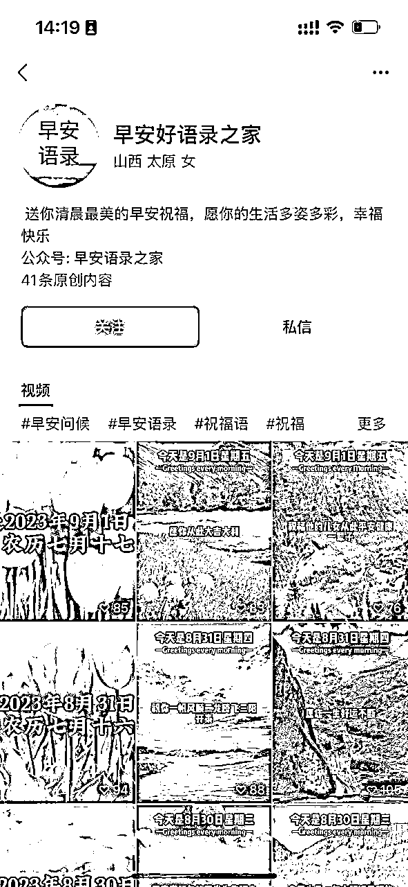

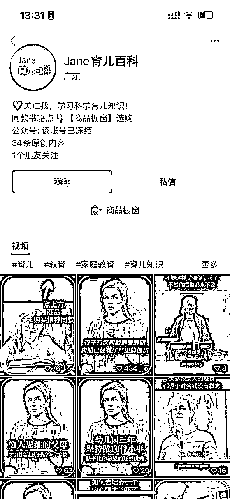

这些账号有很高的模仿价值，视频容易爆，而且操作比较简单，所以其实视频号涨粉并没有想象中的那么难，我们可以选择其中一个类型，先模仿后超越，就能很快实现涨粉目标。

## 1.3 视频号涨粉的变现方向

有了粉丝基础后，我们的变现选择就会比较多了。

目前带货变现依然是视频号最主要的变现方式。除此之外，收徒、卖号、自己找广告主分佣、引流公众号用流量主变现、开通视频号创作分成计划等方式，也有比较可观的变现空间。

具体的变现方式及部分案例，我们会在「十二、变现方式」中和大家详细介绍。

## 1.4 视频号涨粉适合什么样的人

视频号涨粉适合大部分人做，不需要有高超的剪辑技术，或者很强的内容能力。

如果你对视频号感兴趣、目前有涨粉需求，就可以来做。

如果你不想通过视频号带货变现，也不想做个人 IP，就可以来试试视频号涨粉。

如果本身自带私域流量池，也推荐用私域来反哺视频号。

## 1.5 当前的视频号涨粉赛道推荐

本期手册介绍了 8 个赛道的玩法，中老年情感赛道、中老年祝福赛道、励志&情感文案赛道、招聘信息赛道、怀旧赛道、英文育儿赛道、ChatGPT 赛道、AI 说话赛道。

其中，中老年情感赛道、中老年祝福赛道、励志&情感文案赛道、怀旧赛道，本质上都是针对特定群体进行情绪价值的输出，引发他们的共鸣，从而促成传播。这些整体视频制作难度不大，需要注意的是，尽量去重提高原创度。

招聘信息赛道，玩法是把机构公司的招聘信息做成短视频，借助大公司的势能给自己引流。这样的玩法可以进一步升级，例如专门做某一领域的招聘信息汇总，可以吸引来更垂直的粉丝，方便后期变现。风险是，引流的账号容易被封。

英文育儿赛道、ChatGPT 赛道、AI 说话赛道的操作难度会高一些，像英文育儿赛道，难点在外文演讲素材的收集；ChatGPT 赛道，难点在于本身要对 ChatGPT 比较了解；AI 说话赛道，难点在于 AI 图片的生成，以及如何让图片说话。

在「十一、更多涨粉赛道参考」中，也有 8 个近期风向标中，比较热门的赛道案例，供大家参考。

最后需要强调的是，手册中的所有赛道，都只是提供思路，具体细节需要大家在航海期间共同探索。

# 二、视频号核心涨粉思路@大星儿 @盗坤 @小鹿

💡

章节概要涨粉，说白了，就是把流量转化为粉丝。

要想涨粉，就要弄清楚什么样的内容是平台会给流量倾斜的，以及什么是粉丝爱看的。考虑好这两个问题，就能知道要在哪些地方发力，实现高效涨粉。

这一章，梳理了目前视频号的流量分配机制和用户画像，前者是了解平台的流量有哪些、从哪里来，后者是为了知道我们的用户是什么样一群人，他们到底喜欢什么。

除此之外，我们也给出了比较常见的四种涨粉思路，建议新手重点学习「2.2.1 找爆款内容、做爆款选题」指出的路径，并尝试用问一问导流，这样能进一步提升涨粉概率。

希望大家了解清楚以后，最终都能生成一条适合自己的涨粉思路。

## 2.1 视频号现状

### 2.1.1 流量分配机制

本章将介绍三种视频号流量分配机制：社交推荐机制、算法推荐机制、微信生态流量（除视频号外）。

所谓社交推荐，借助朋友圈的力量去裂变，本质上是私域流量。而算法推荐和微信生态流量，则属于公域流量。前者以视频数据、兴趣、热点、地理为指标在视频号内进行推荐，后者则以看一看、搜一搜（问一问）、订阅号为流量入口，引流至视频号。

了解上面的三种流量分配机制，就能知道在哪些地方发力，可以获得更多的流量。

1、社交推荐机制

社交推荐，通俗来说，就是只要有几个朋友关注你，给你点赞了，你们的共同好友会很快知道你的账号，关注到你的视频，这是微信特色，是抖音做不到的。

在抖音上，如果你看到一个小姐姐很漂亮，会点赞，这是最真实的你；但如果是在视频号上，你发现一个明明很喜欢的女生，但是你却不敢点赞。然而如果你看到一个即使没看懂但却显得很深奥的心灵鸡汤，反而会点赞，这是虚伪的你。

所以说，能够在视频号上引起社交裂变的，都是那些能够让人产生装逼和情绪共鸣价值的东西。

接下来，具体说说这种社交推荐是如何实现的。

视频号主页有 3 个板块，分别是“关注”、“朋友”、“推荐”，其中的“朋友”tab 主要是通过“点赞+多位朋友看过推荐”和“好友圈推荐”2 种方式实现社交推荐。

① 点赞+多位好友观看过视频

微信好友点赞过某条短视频后，微信“发现”页面的视频号这一栏上，会显示一个小红点，提示用户有好友点赞了某条短视频，还会将被点赞的微信好友名字和头像呈现出来，如图 1 所示。

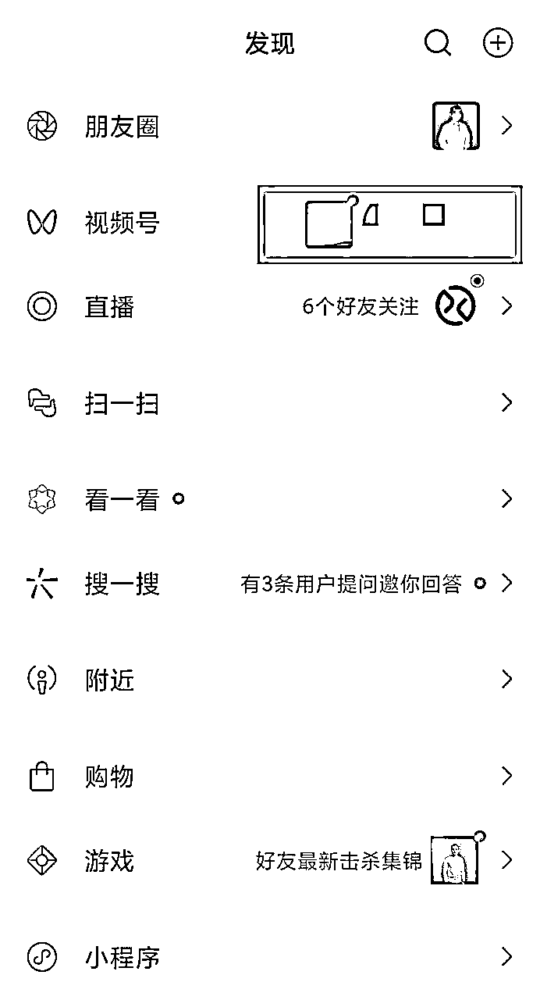

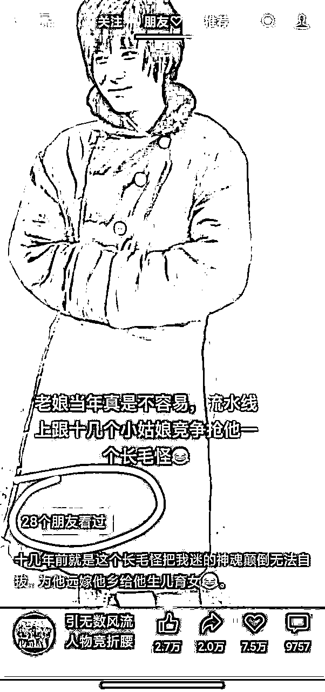

② 好友圈推荐

视频号与本号微信关联，微信如果添加了好友，在视频号运营者发布了短视频作品后，其微信好友能够通过社交推荐机制“刷”到其发布的短视频。

2、算法推荐机制

视频号内的算法推荐机制，主要分为四种，分别是数据权重、兴趣推荐、地理推荐、热点推荐。

① 数据权重

视频号【推荐】流量，通过视频的播放量、点赞、评论、分享、关注等数据指标进行加权推荐，大部分 0 粉爆款作品都是通过推荐实现的冷启动。

② 兴趣推荐

主要根据用户的年龄、职业、兴趣爱好、短视频内容偏好等，归类总结用户标签关键词，给用户推荐他们可能感兴趣的短视频作品，进行有目的的推广。

③ 地理推荐

路径：发现—附近—本地视频/同城直播

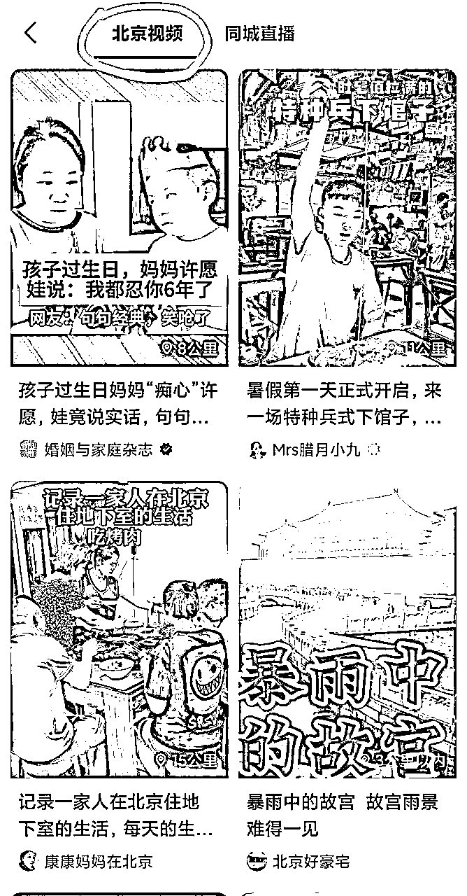

④ 热点推荐

视频号在【看一看】板块中，加入了“热点”栏目，主要用于带有热点话题的短视频作品传播。用户点击观看视频，就会跳转至视频号页面，从而扩大视频号作品的传播范围。

所以我们在创作短视频作品时，可以适当的贴合热点话题进行创作，从而触发热点推荐机制。

3、视频号流量生态

用户除了主动点进视频号界面，还可以在发现页的“看一看”、“搜一搜”、“直播”，以及订阅号中找到视频号的身影。我们可以通过这些入口，把流量引导视频号内。像近期“搜一搜”中的“问一问”，就是不错的流量风口，可以借机引流。

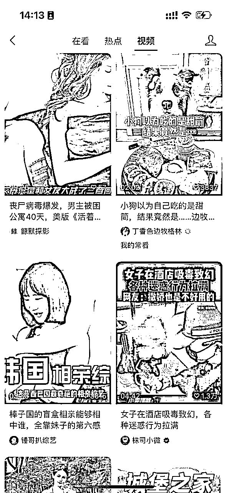

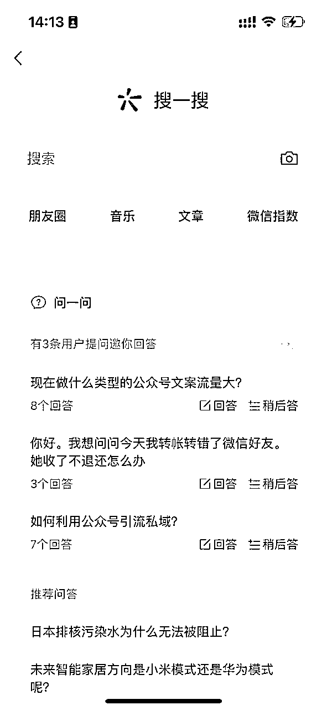

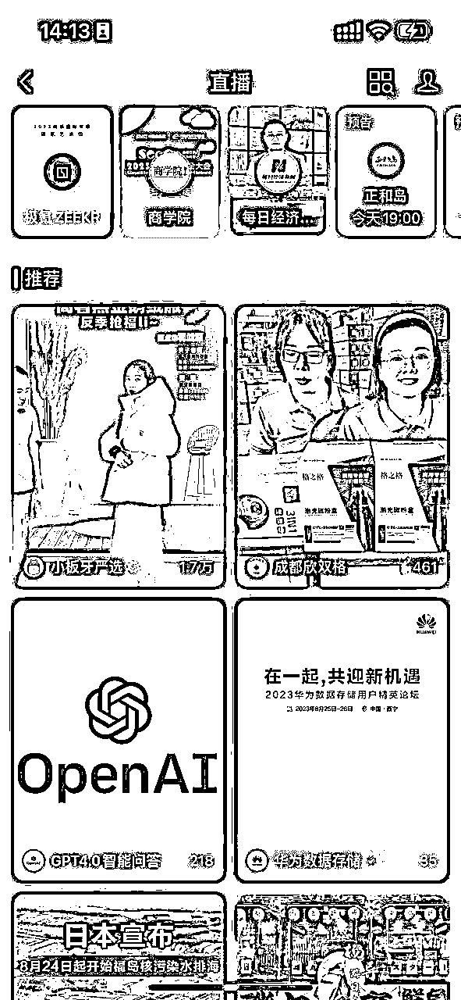

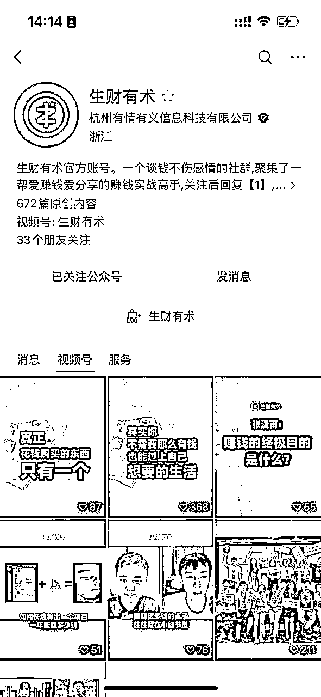

### 2.1.2 视频号用户画像

当视频主要传播形态是通过转发朋友圈、微信群、公众号、朋友点赞等（私域流量）好友关系裂变形式传播的时候，视频号的用户人群就等于微信的人群。当视频主要传播形态就是在视频号体系内的【推荐】专栏的时候，人群主要是三四线偏下沉的中老年用户群体为主，人群占

就像圈友@盗坤 说的那样，流量的核心是人。

很多人都只是把流量理解为一个个点击，一个个 UV，但其实流量的背后是一个个活生生的人。我们要想真正获得这些流量，首先就要搞懂这些流量背后的人。

我们真正需要关注的是：这些人生活在中国的哪些地方？长什么样子？有什么喜好？空闲时间都在干些什么？只有足够了解用户，我们才能做出更加优质和合适的内容，才更可能赚到钱。

内容来源：盗坤-视频号带货分享底层逻辑；单帐号变现超百万，如何在视频号进行流量变现？

## 2.2 涨粉思路

对于从 0-1 的新手，建议先在手册中选定自己合适的涨粉赛道，再去找对标账号和选题素材，进行内容创作。当然，也可以在大量刷视频号的过程中，找到其他合适的赛道。

如果本身有私域流量池，也可以借助私域作为视频账号的冷启动，利用私域反哺视频号。此外，目前微信正在给“问一问”倾斜大量的流量，因此借助“问一问”的势能，也是涨粉的重要方式。

以下是几种比较常见且有效的涨粉思路，希望对你能有一些帮助。

### 2.2.1 找爆款内容、做爆款选题

不论做什么平台，好的内容都是核心的涨粉方法。

而只有那些对用户有用、有趣、有共鸣的内容，才能吸引用户的关注，这也是爆款内容的核心要点。

一开始，你可以借助一些数据平台，如蝉妈妈、考古加，依据赛道关键词，找到对应的对标账号及高赞视频，用已经被数据验证过的视频素材+脚本文案进行二创。

账号稳定以后，也就是掌握了视频爆款的核心要素后，可以尝试自己去改造创作选题，或者针对已经爆发的视频选题，使用 ChatGPT 对爆款文案进行改造。

关于如何找到适合自己的赛道，可以考虑以下几个方面：

1、视频受众是否精准/广泛

2、内容选题来源是否足够多（抖音&视频号）

3、视频制作难度是否适合新手，是否容易“先借鉴后超越”

4、内容是否容易被分享传播出现爆款

### 2.2.2 提升完播及用户点赞互动

制造悬念提升 5 秒完播：

开头黄金三秒，话说一半，吊人胃口

比如：农村一位老人拆迁房子得了 100 万拆迁款，结果一分没留给儿女，这到底是怎么回事呢，大家接着往下看提升用户点赞方法：

引发共鸣—解决用户痛点或调动情绪价值，引导点赞

举例：大家认同 xx 的做法嘛/大家觉得 xx 这样做对嘛，认可的家人点个赞，评论区留下你的说法吧乞讨效应—用示弱赢得用户关注

举例：感谢家人们的观看，麻烦您点个赞吧，祝您阖家欢乐，万事如意～

提升用户分享方法：调动情绪—触及用户内心深处，感同身受

代入感—自我代入感让用户身临其境

共情效应—向往美好，支持正向能量传递

### 2.2.3 问一问导流视频号

问一问的最终目的是为了引流，所以我们在回答问题时，需要注意筛选，并不是所有的问题都适合去回答。

通常将引流分两大类：热点类和专业类

热点类主要是引流泛粉，用于冲数据，优先选择对应受众与自身用户画像重合度高的问题。

专业类主要是引流精准粉，用于转化成交，主要是根据内容赛道对应的关键词选择关注量、回答量高的问题进行回答。

明确「问一问」问题筛选标准后，咱们再来看看爆款答案的写作技巧：1）语句简短，多用短句：标点符号间隔的字数，尽量在一口气不费劲读完为准，段落上不超过 2 行

2）内容幽默，引发共鸣：现在各大自媒体平台主打休闲娱乐，主要提供的是情绪价值，幽默搞笑的内容会让大家开心一笑，促进转发分享给好友；有共鸣的内容则更容易让用户产生情绪上的共情，更愿意点赞、评论

3）内容详实，有趣有料：这个主要是针对“干货类”的账号，避免太过专业的内容，语言表达通俗易懂由于「问一问」与视频号、公众号高度绑定，如果有用户点赞了你的回答，会自动弹出你的视频号/公众号，虽然不能在「问一问」中引流，但可以利用视频号头像、昵称以及简介的曝光，引导用户关注你的视频账号，从而实现视频号涨粉。

内容来源：靠『问一问』精准引流 200+，变现 3999 的爆款问答实操方法复盘

### 2.2.4 建立私域用户池反哺账号

视频号相较其他短视频平台，具备的一个天然优势是可以顺畅的和私域链路打通，以及支持一键转发。

所以如果本身有自己的私域流量池，那可以借助私域作为视频账号的冷启动，再将视频号的粉丝引流沉淀至私域中，后续新作品发布后，一键转发到私域社群中进行宣发，能更快的带动数据增长。

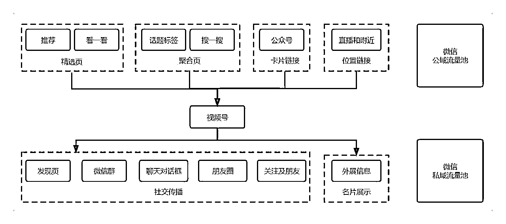

# 三、中老年情感赛道如何涨粉@大星儿

💡

章节概要中老年情感号，顾名思义，是针对中老年用户群体，创作情感类视频，吸引用户关注涨粉。

涨粉情况：账号运营第 3 天，出现第一条大爆款，7 天涨粉 10W+，累计播放 2000W+，在后续运营中还出过多条百万播放视频，通常一条百万播放视频能带来 2000+粉丝关注。

视频受众：50+年龄段的老年群体，其中男女性占比接近 3：7，符合视频号平台画像。

素材来源：抖音&快手&视频号，可用素材足够多。

视频制作难度：适合新手，对画质、剪辑软件的要求不高

内容特点：情感故事更容易引起共鸣，不涉及私密喜好，更易传播注意事项：搬运视频容易违规限流或封号

本章将会从赛道概况、账号搭建、素材收集、视频创作、避坑经验方面带你了解中老年情感赛道的玩法。需要注意的是，这里只提供玩法思路，具体细节需要大家在航海期间共同探索。

## 3.1 赛道概况

中老年情感号，顾名思义，是针对中老年用户群体，创作情感类视频，吸引用户关注涨粉。

我在选择做这个赛道时，主要是考虑平台的用户属性和视频制作难度，结合自己的能力能不能“打得过”。根据前言视频号现状介绍，了解到视频号的主要人群是三四线的中老年用户群体，这类人群平时喜欢看什么内容，可以通过以下 2 个方式验证①根据三方数据平台的公开报告做参考依据

②关注自己身边的中老年亲戚，平时微信点赞、分享的都是什么视频类型

根据一些公开的数据报告，可以明确视频号的内容类型主要还是偏泛娱乐为主，其中情感类型占据内容类型榜 TOP1，再去观察身边中老年的亲戚平时分享在群里的视频，主要是民生资讯、情感视频这两大类，民生资讯一般是官媒较多，情感类型的视频打开看视频内容，对画质要求普遍不高，甚至可以算得上粗制滥造，制作难度比较低。

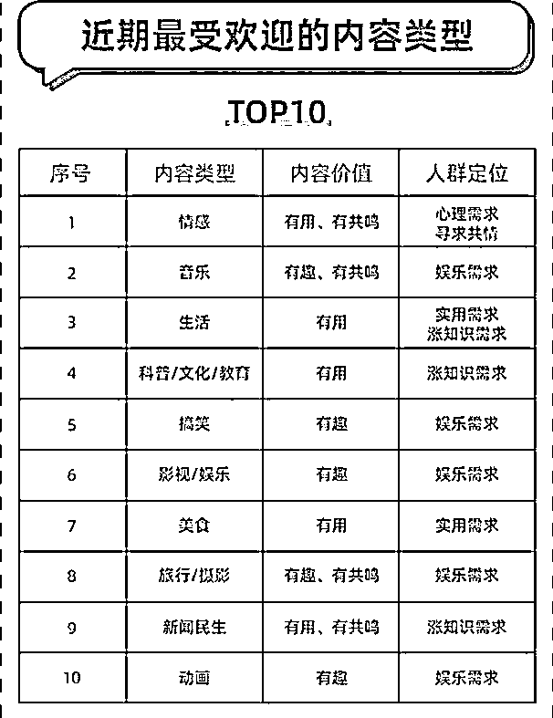

明确内容赛道后，开始着手准备账号，找对标账号，包装账号，完成基本信息配置，账号运营第 3 天，出现第一条大爆款，7 天涨粉 10W+，累计播放 2000W+，在后续运营中还出过多条百万播放视频，通常一条百万播放视频至少能带来 2000+粉丝关注。

以上是这个赛道根据个人经验做出的一些成绩，下文会详细展开介绍中老年情感号赛道该如何做。

## 3.2 账号搭建

### 3.2.1 头像

情感号主要聚焦中老年群体，直接在抖音/小红书搜索老年头像，复制链接——去水印——保存图片，然后上传图片。

具体去水印方法：小红书右上角分享——复制链接——微信小程序搜索：去水印——排名第一个就可以——粘贴链接——下载去水印保存

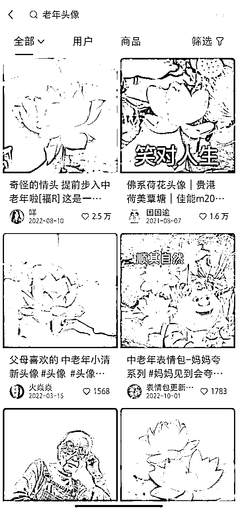

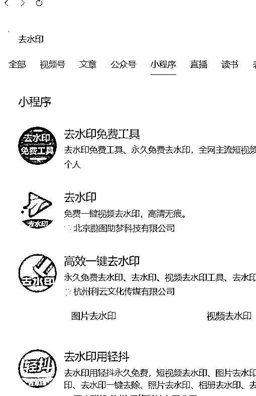

### 3.2.2 昵称

昵称一年只能修改 5 次，建议慎重修改，通常是根据自己要做的账号定位进行包装，常用的方法是采用关键词组合的方式，例如 xx 聊职场、xx 女装、xx 国学、xx 妈妈育儿好物等等。

或直接参考对标账号：xx 故事会，昵称重复就换 xx 部分的文字，或者加后缀加数字。

### 3.2.3 简介

简介能随时修改，可以放一些账号价值提供的介绍，或者是促进成交的内容。

## 3.4 素材收集

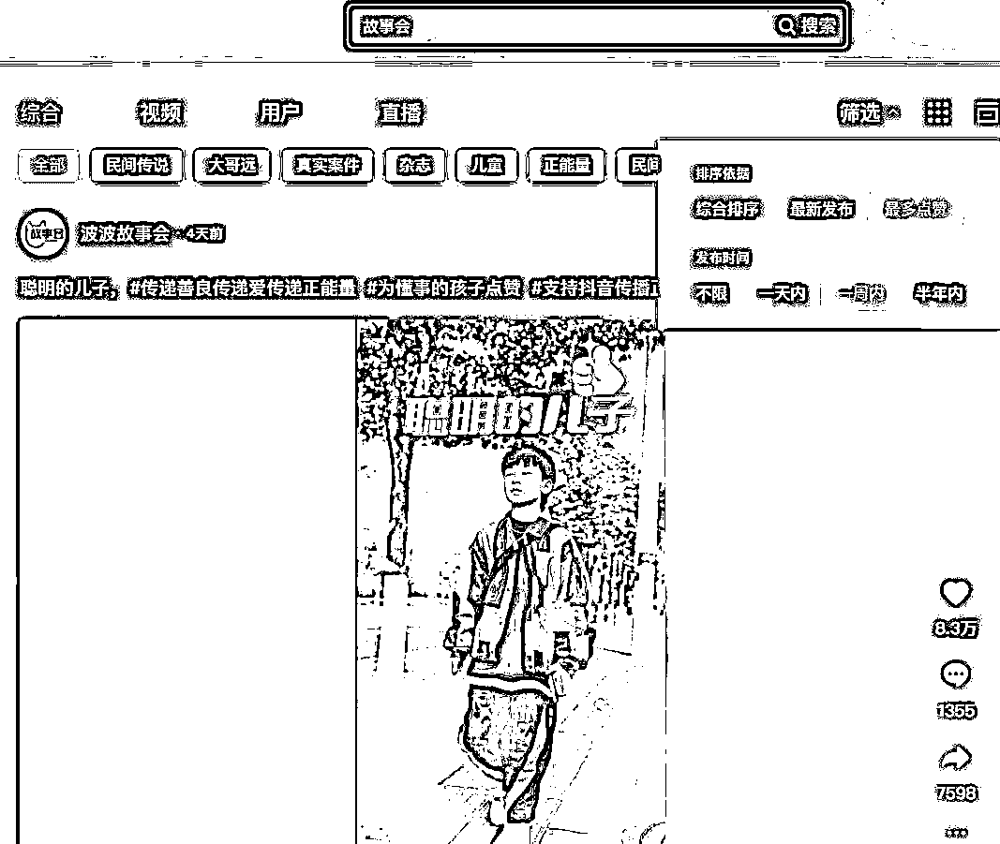

1）账号主页各视频的点赞数据

2）找到点赞量高且近 1-2 天内发布（至多不超过 7 天，因为数据好的视频，时间越长，很有可能已经被 BY 到视频号），点开看用户评论，如果用户的头像明显是中老年人风格（花花草草之类的），那说明该视频及账号的主要受众是中老年人群体

方法 2：蝉妈妈平台搜索+数据验证方式一：蝉妈妈——视频——热门视频库/带货视频库——情感

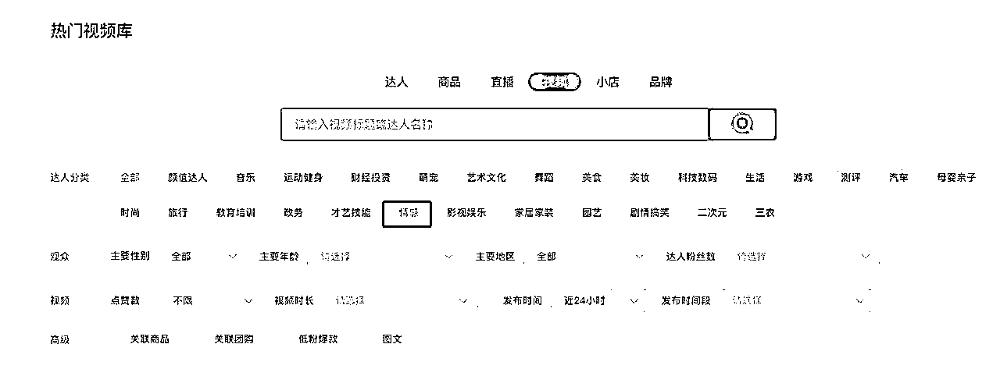

方式二：蝉妈妈——视频——搜索框根据关键词搜索：故事、情感、正能量等，然后视频选择近 7 日内高赞的视频，点击进入账号主页——看数据和视频源是否充足，以便后期能找到足够的视频进行剪辑

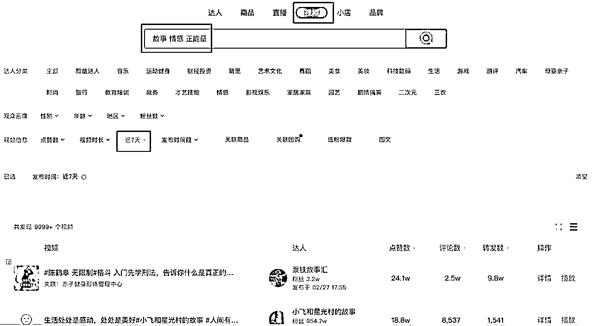

查看该细分类目下的相关账号，点击进入看具体的数据信息，主要关注 2 个核心数据：1）近期涨粉人数，可以判断账号涨粉速度及近期是否有爆款视频

2）账号的视频用户画像，是否符合 50+用户群群体

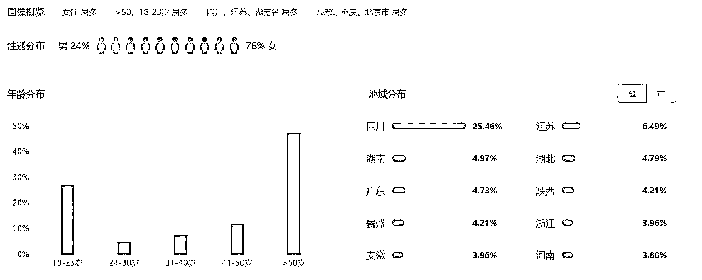

找到相关账号后，搭建账号库，记录核心信息，并用抖音号关注账号，博主发布视频后第一时间接到消息 push，下载第一手热乎视频

方法 3：视频号找对标素材用微信小号，搜关键词，找到类似的账号，完播、点赞、评论，过一会视频主页就会推荐类似的视频，头部账号建议也关注一下，主要分析 3 个点：

1）账号的主页包装设计；2）账号的视频内容类型及视频数据情况，为后续伪原创视频提供选题素材；

3）账号的引流/变现方式，分析同样的用户群体对标账号是如何变现的，需要具备什么资源，你自己做的同类型的话，能否实现“先借鉴后超越”

具体搜索方法：1）发现——视频号——搜索：家庭故事、正能量等关键词，然后会出现视频，看那些封面图一眼就很糙，没有个人 IP 出镜的视频

2）点击进入主页，看账号的昵称，头像和简介介绍，是否挂商品

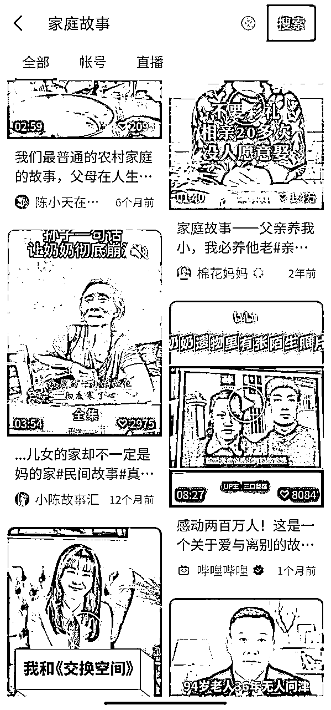

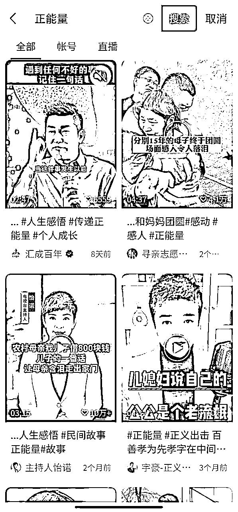

点头像进账号主页，看包装，看视频风格和内容类型

注意：如果是真人出镜的账号直接 pass，一眼看起来视频封面及内容很糙，整体画面像素不高的，就是对标的账号类型（中老年人对视频的画面要求不高）

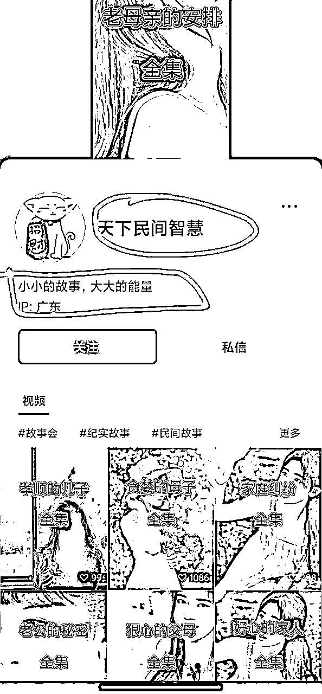

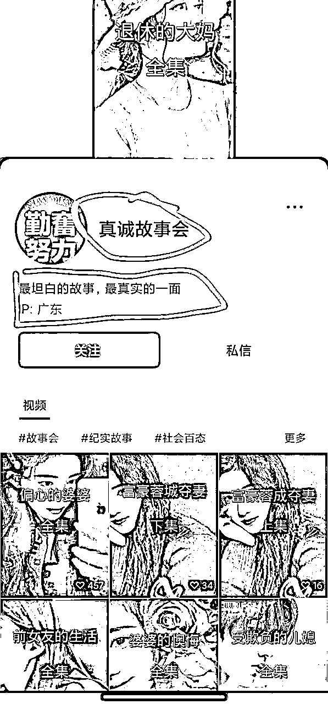

方法 4：公众号爆文+ChatGPT 创作短视频情感号和公众号情感号底层逻辑相通：

前 5 秒：开幕雷击吸引用户继续看下去正文：剧情反转/民族主义调动用户情绪，提升视频完播率

结尾：临门一脚，引导互动转发，促进分享传播具体的创作思路可以参考公众号爆文：8 月航海 | 公众号爆文写作 | 实战手册

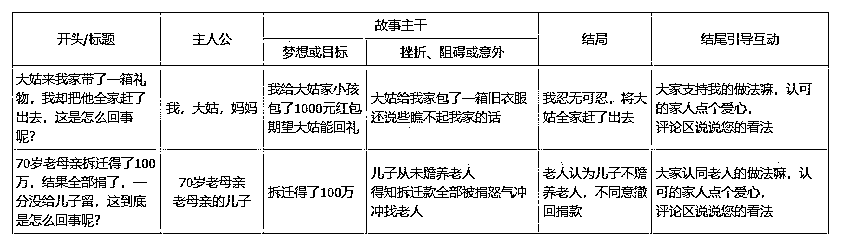

## 3.5 视频创作

方法 1：源视频去重+混剪步骤 1：复制源视频链接

步骤 2：使用圈友分享的去水印视频工具，复制单个/多个视频链接，去水印保存到本地

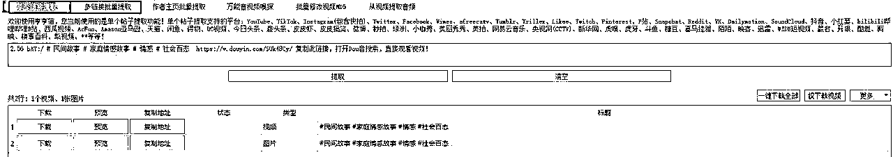

步骤 3：打开剪映，导入视频源步骤 4：导入自拍视频，分离音视频，删除音频

步骤 5：添加背景图，滤镜特效，音频调低音量

这里提供一个模板：源视频+自己拍摄的视频素材库+背景图+滤镜特效+音频调低音量。后续直接替换源视频即可，如果出现低播放（未过重），说明找到视频源被多次使用，需要再深层次多个视频混剪。关于深层次的混剪方法，大家可以在 8 月航海 |剪辑特训 |实战手册。

方法 2：保留源音频，替换视频画面步骤 1：同上先下载视频

步骤 2：将视频导入剪映中，音视频分离

步骤 3：删除源视频画面

步骤 4：添加自己拍摄的视频（或者 YouTube 的视频，主要目的是尽量避免该素材被大量重复使用），作为画中画素材，分离音视频，并删除音频

步骤 5：根据源视频大纲内容，选择合适的人物图片，导入剪映，操作区选中对应的图片，右上角动画——向左/向右滑动——设置动画时长：3.5s 左右即可

方法 3：保留源文案，重新配音+视频画面制作

制作音频：

可以用真人配音或使用 AI 配音网站，推荐配音网站：Text To Speech - 在线文本转语音，可以输入文本，设置语音、语速、音调等。

如果是多人对话，需要根据实际的情况调整更替语音，比如一段脚本文案是老年婆婆和儿媳的对话，那婆婆的声音则选择（女-老年）比较合适，儿媳的声音选择（女-年轻）更符合。

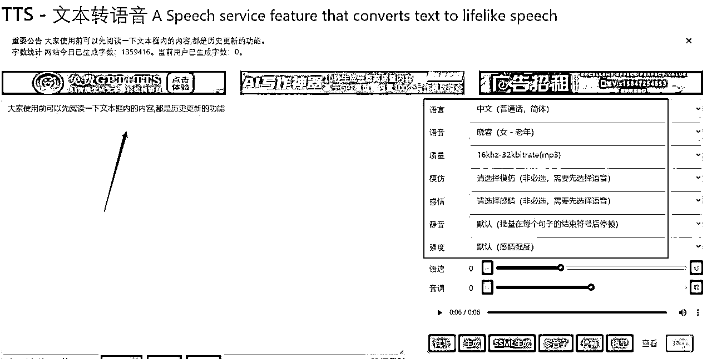

完成基本设置后点击生成，下载音频，并按照自己的文件命名习惯保存到指定文件夹。

打开剪映，图文成片，根据脚本文案输入文本，一键合成。

合成后，对视频画面进行处理：步骤 1：将图文成片中生成的音频替换成提前制作好的音频

步骤 2：设置画面比例为 6：19

步骤 3：选中视频画面，画面——背景填充——模糊——第 2 或第 3 个模糊程度的即可

步骤 4：调整字幕样式

步骤 5：设置主标题步骤 6：添加滤镜、转场、特效等

完成以上步骤，即可导出视频发布，后续根据实际的数据效果调整画面风格

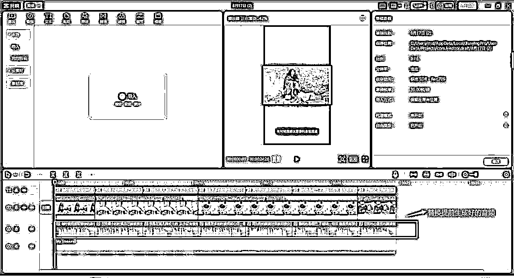

## 3.6 避坑经验

### 3.6.1 准备好再开始

不存在彻底准备好的时候，一直纠结一直准备只会让你在岸上旱死，大概率拖延着到最后不了了之。

所以别犹豫，现在立马就去做，在做的过程中迭代就行，也不用纠结设备好不好，账号头像昵称简介是不是要精心打磨，都不需要！

0 粉爆款主要靠视频公域推荐，账号搜索流量很小，不用纠结。

我第一次搞视频号的时候，各种调研其他账号信息如何包装，用表格记录、分析，断断续续花了一个星期才搞完账号，事实证明这些并没有让我的流量出现爆发式增长；

第二次开新号的时候定下来就立即开号，头像、昵称和简介花 10 分钟搞定，直接就开始发视频，流量也没受到影响。

如果你现在看到这里并打算开始运营视频号，别犹豫，现在立马拿起手机，打开微信，创建一个视频号，头像可以改，昵称一年 5 次可以改，简介也能改，不要总想着一次做的很完美，先做再改。

### 3.6.2 陷入流量数据自嗨

对个人来说，流量一定是为变现去服务，所以当出现非带货类爆款视频后，赶快怼带货类视频，测试选品，有部分用户会通过爆款视频进入账号主页看到其他视频，有利于带货视频曝光。

以终为始想最终的变现方式，到底是什么，在执行的过程要关注自己有没有偏离核心目的，如果明确就是带货变现，那就把更多的精力投入到选品中，数据爆了就开播，想办法用各种可以提升转化的方式去测试，去提升带货佣金。

不要沉浸在爆款视频！点赞、评论、关注这些都是昙花一现的虚假繁荣，账号违规了视频分分钟零播。

### 3.6.3 遇爆款没开播

出现爆款视频，不要拖，抓紧直播，有选品就直接直播带货，没选品先把用户引流到私域（微信号最佳、小程序和公众号触达效果弱），仅存留在视频号上的粉丝很难再触达到。

（因为大部分的视频流量还是来源于公域推荐，即使有几十万粉丝，用户依然没有形成从关注列表中只看你的视频的习惯，基本上是随便刷，刷到你的视频感觉不错再进行后续的动作）

所以抓住机会要么转化，要么留存在可多次触达的私域场景。

下方图片是当时爆款视频的相关数据，不到半小时就能涨几千粉，涨粉速度非常快，但是当时犹豫没有选品，直接开直播不知道讲什么，加上对直播比较畏怯，就一直让这种非常爆的状态持续 3-4 天白白流失掉了。

如果在这种涨粉速度下开直播，通过短视频引流到直播间的用户，也能轻松让自己进入到场观几千人的直播广场中。

所以当视频号出现爆款播放，不管爆的是带货类还是非带货类，先预约直播，下班就开播介绍产品，中途用户互动引导点赞打赏，可以提升直播间互动数据，把自己直播间推到更大的流量池中。

在直播的场景下转化链路更短，互动及时性也强，相较短视频的转化方式，转化效率更高。

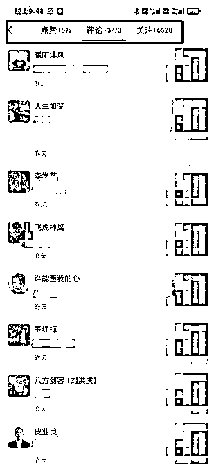

后来还有一次是爆了 200W+ 播放的视频，当时距离视频爆发式增长过去 3 天，流量增速已经慢下来了，大概每半天能涨粉 3000 左右，然后上午预约了直播，下午开播场观轻松过 500。

短视频数据（ 2 月 3 日开始数据有明显增幅）

直播数据

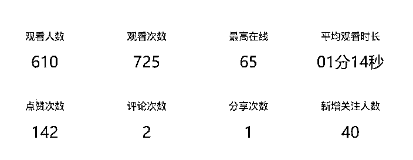

### 3.6.4 重选题轻剪辑

如果一个视频需要你深度的剪辑才能解决审核破重的问题，那这个视频果断放弃二剪抖音上很多该赛道的爆款视频，画面像素甚至不高，大家看了可能会觉得粗制滥造入不了眼，但是不同博主换个视频画面，脚本直接套用，依然可以爆，核心是视频内容引发用户共鸣，破圈传播。

剪辑是锦上添花，不要本末倒置。

中老年情感号大概是唯一一个视频赛道对画质要求不高的类型，有的视频素材甚至摄像头的座机式拍摄，然后结合视频画面配选题文本，依然会有比较好的数据，内容为王（选题）在视频号依然适用。

### 3.6.5 带货雷区新手不要碰

抖音不限制的品类视频号可能会限制，定选品前可以先查查视频号带货类目限制，尤其养生茶、中医书籍、食谱书籍等新手慎入

一是因为这些大众所知的选品已经是红海品类，素材基本被用烂了；二是因为容易擦边、违规，现在平台已经开始管控了，我当时从抖音搬了 2 条养生食谱书带货，直接扣分限流，后续发啥都没流量。

# 四、中老年祝福赛道如何涨粉@大星儿

💡

章节概要中老年祝福号，主要针对中老年用户群体（50 岁及以上），创作祝福问候视频，吸引用户关注涨粉。

视频受众：50+中老年用户群体，男女差异不大，符合视频号平台画像。

素材来源：抖音&视频号&原创 AI 图，可用素材足够多，原创度高

视频制作难度：适合新手，对画质、剪辑软件的要求不高内容特点：文字动画+风景视频+祝福背景音乐；文案+财神/弥勒佛/金币视频动效+财源滚滚音效。祝福问候类视频通常是传递美好的祝愿，很多用户愿意点赞或转发分享到亲戚群，传播度较高。

注意事项：倾向视频原创，二创视频可能会限流违规本章将会从赛道概况、素材收集、视频创作方面带你了解中老年祝福赛道的玩法。需要注意的是，这里只提供玩法思路，具体细节需要大家在航海期间共同探索。

## 4.1 赛道概况

祝福类视频在视频号上传播度较高，比较精准地吸引中老年用户。这类包含的美好祝愿，以及鲜花、美景、财神、金币等意向，都是中老年群体非常喜爱的内容，也很愿意点赞转发到亲戚群内。

以下是几种祝福风格示例：

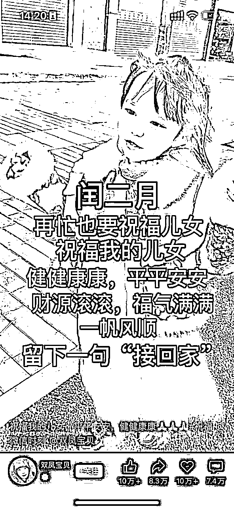

早安祝福&财源滚滚来视频：风景类/金钱类视频素材+文字动画+AI 语音口播+BGM，制作难度低

祝福儿女的视频：核心在祝福文案，结尾引导评论转发接祝福，素材混剪儿童相关的视频即可

在运营方面，我们可以借鉴「2.2 涨粉思路」，重点是优化视频内容，然后尝试去问一问做视频号导流。坚持一段时间，耐心等待，就会有结果。

接下来以早安祝福视频为例，讲讲这类视频具体应该怎么创作。

## 4.2 素材收集

方式 1：抖音搜索关键词：早安、早安祝福、暖心文案、祝福语录等关键词，找到对标账号，下载对标账号的素材，将多条视频素材混剪方式 3：chatGPT+Midjourney 结合，通过 chatGPT 生成花海、风景等绘图描述词，Midjourney 根据描述词生成原创图

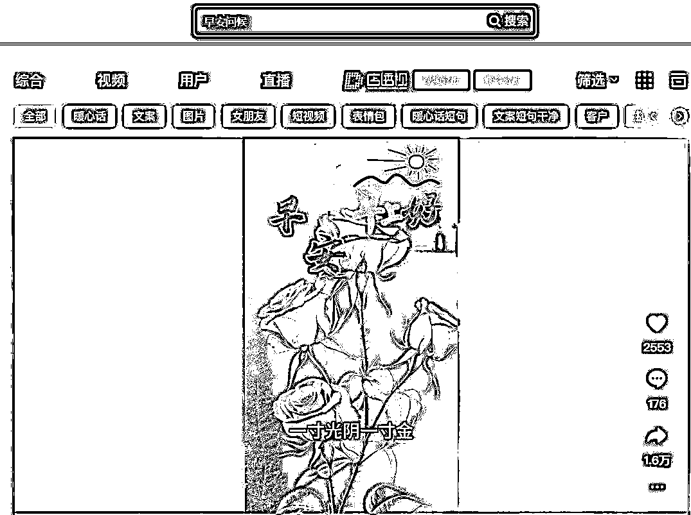

## 4.3 视频制作

类型 1：单图关键帧+文字+BGM

目的：通过为图片打位置关键帧，让图片滑动制作动态视频的效果

步骤 1：将图片和音频导入，并将图片长度拖至与音轨长度一致

步骤 2：在图片的开始位置打一个关键帧

步骤 3：拖动图片，使其图片左侧与画面左侧对齐，并打一个关键帧

步骤 4：识别字幕+添加 BGM

步骤 5：添加贴纸+特效等

类型 2：多图动画+转场+文字+BGM 首先需要掌握基础的 AI 绘图能力，在这里不过多赘述如何绘图，可以了解 8 月航海 | AI 绘画+自媒体 | 实战手册，我们直接讲如何完整的制作一条视频。

步骤 1：文本转音频在配音网站：Text To Speech - 在线文本转语音，输入文本，设置语音、语速、音调等，语音一般选择云希（男-年轻人-抖音热门），也可以尝试试听其他音色。

试听没有问题后，点击生成，下载音频至本地。

步骤 2：打开剪映，点击创作，将 3-4 张原创图导入素材库，并拖至轨道，将步骤 1 中的音频拖至音频轨道，并将步骤 2 中的 3-4 张图长度拖到与音频长度一致

步骤 4：选中图片，添加图片之间的转场效果

步骤 5：选择 BGM，并添加至音频轨道

音频来源 1：从剪映音频库中搜索：早安纯音乐关键词进行添加音频来源 2：抖音搜索：早安祝福纯音乐关键词，复制视频链接，下载音频，然后将音频拖至剪映音轨

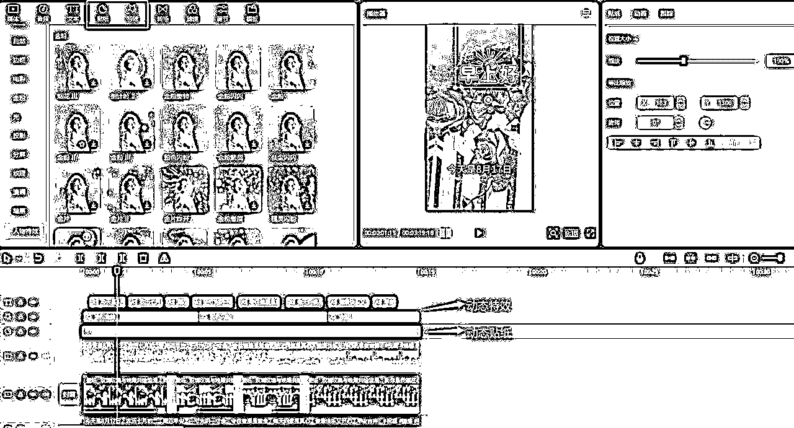

步骤 7：识别音频字幕，设置字幕样式

步骤 8：将预览轴拖至轨道结尾，快捷键 O，选中导出区域，导出视频文件

类型 3：风景视频+文字从抖音、快手、YouTube 等视频网站，根据关键词寻找源视频，视频链接去水印下载保存本地

打开剪映，将多段视频素材拖入视频轨道，进行转场混剪拼接

音频设置同类型 2 的步骤操作

# 五、励志&情感文案赛道如何涨粉@大星儿

💡章节概要

本章把励志文案号和情感文案号放在一个模块讲，主要是因为用户群体相近且视频创作底层原理相通。

视频受众：13-40 岁的女性用户群体，不同的文案风格，对应的用户群体年龄会有所差异。学习、成长、努力、暗恋、失恋、校园相关的文案，人群主要是 13-26 岁偏学生女性群体；成长、努力、独立、女性、家庭相关的文案，人群主要是 27-40 岁的女性群体。

素材来源：抖音&快手&视频号&付费素材库，可用素材足够多

视频制作难度：剪辑难度不高，但需要对视频画面有基础的美感判断内容特点：共鸣文案+优质视频+热门 BGM。这类视频传递的是情绪价值，用户借以视频的文案表达自己的情绪，引发共鸣的视频文案用户会自发转发、评论，传播度较高

注意事项：倾向视频伪原创，原视频去重可能会限流违规本章将会从赛道概况、素材收集、视频创作方面带你了解励志&情感文案赛道的玩法。需要注意的是，这里只提供玩法思路，具体细节需要大家在航海期间共同探索。

## 5.1 赛道概况

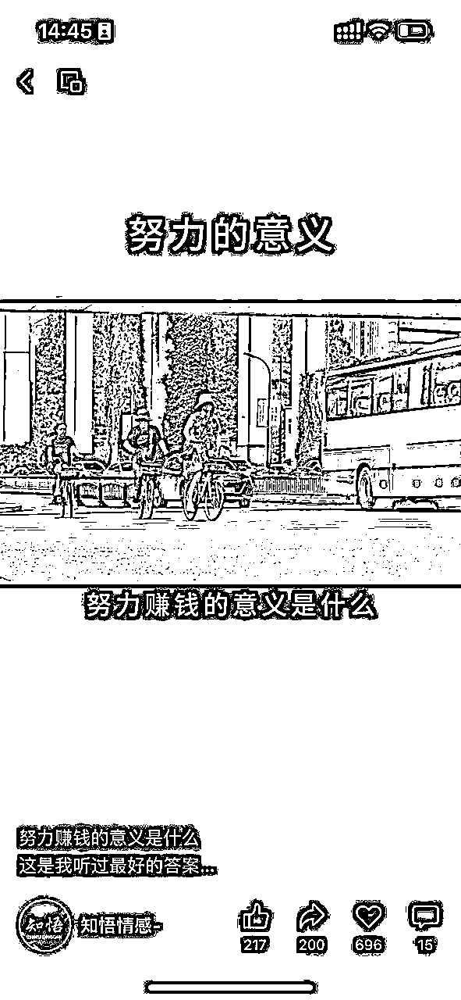

在运营方面，我们可以借鉴「2.2 涨粉思路」，重点是优化视频内容，然后尝试去问一问做视频号导流。坚持一段时间，耐心等待，就会有结果。

接下来讲讲这类视频应该怎么创作。

## 5.2 素材收集

方式一：短视频网站根据关键词搜索：车流、烟花、风景、街拍人流走动素材等，复制链接，使用去水印小程序下载视频保存至本地，并按照分类积累个人视频素材库

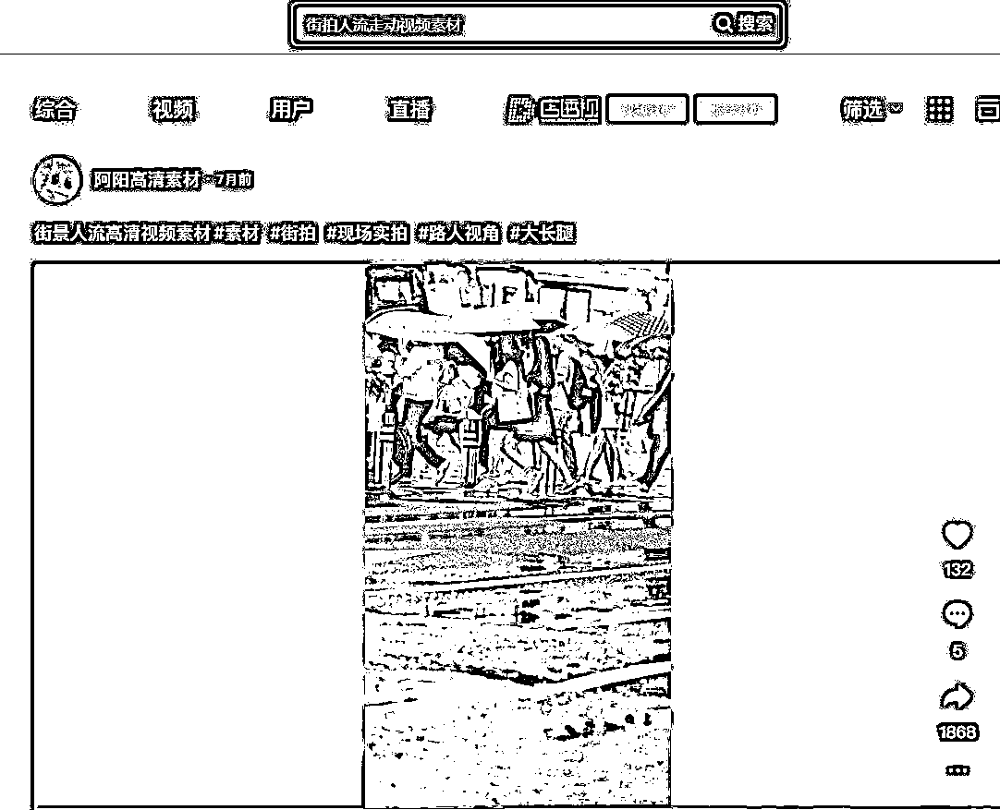

方式二：淘宝、拼多多付费购买视频素材库，一般卖家会按照视频类型整理好素材分类，不过这种方式大家买到的视频素材库差别不大，后续要重新混剪和去重。

## 5.3 视频制作

方式 1：图片（自己制作/截图公众号文案）+热门 BGM+画面特效（去重）

注意：第 3 点中添加的视频主要是为了机器过审，提高原创度，所以在视频选择上尽可能不和平台上已有的素材重复，或者是通过混剪降低重复度，或者直接自己拍摄原创视频

参考效果：

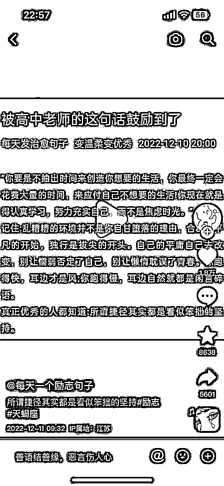

方式 2：语音文案+优质混剪视频+BGM

参考效果：

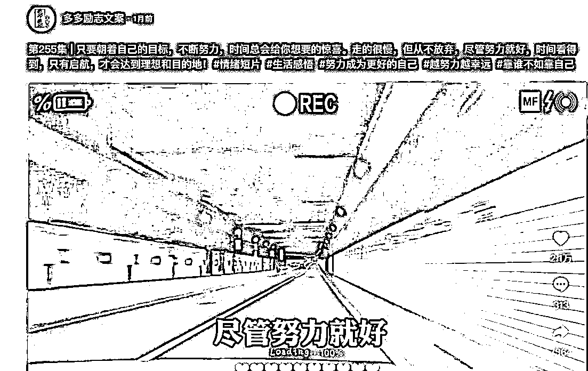

方式 3：自己出镜拍摄+BGM+字幕

优势：视频原创，出镜口播人设更鲜明（参考视频号：笑笑悟）

弊端：需要出镜录视频，很多人对出镜录视频比较抗拒，且录制一般耗时比较长

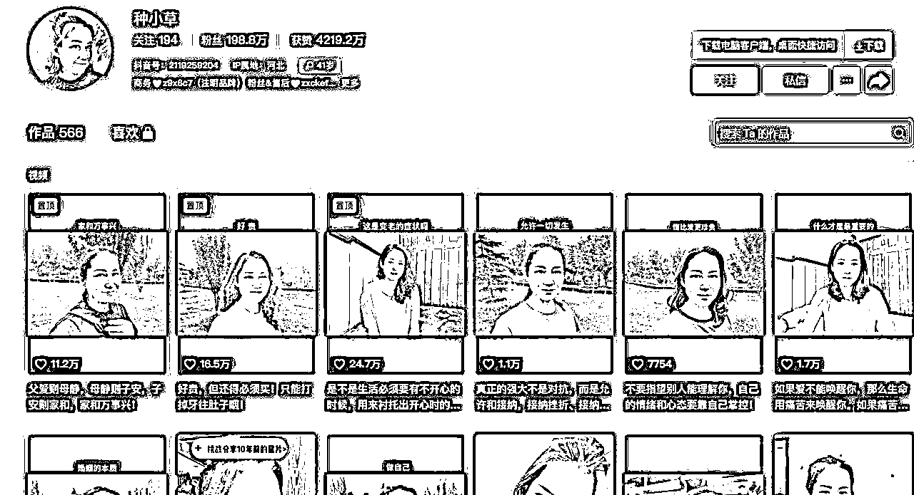

# 六、怀旧赛道如何涨粉@黄岛主

💡章节概要

怀旧号视频，适用于 70/80/90 用户群体，创作怀旧童年时光类视频，吸引用户关注涨粉。

涨粉情况：通过搜索“怀旧”这个关键词，出现大量万赞视频，甚至还有点赞、转发、推荐均破 10w+的视频。一个号，基本第三条视频就开始起量，从几百点赞突破到上万赞。

视频受众：70/80/90 用户群体，符合视频号平台画像。

素材来源：抖音&视频号，可用素材足够多。

视频制作难度：适合新手，对画质、剪辑软件的要求不高内容特点：怀旧视频戳中相关人群的情怀，较易于传播

注意事项：最好注册一个新的视频号，从 0-1 起号

本章将会从赛道概况、账号搭建、素材收集、视频创作、运营动作方面带你了解怀旧赛道的玩法。需要注意的是，这里只提供玩法思路，具体细节需要大家在航海期间共同探索。

## 6.1 赛道概况

怀旧号视频，是指创作怀旧童年时光类视频，吸引用户关注涨粉。这类视频的受众是 70/80/90 用户群体，比较符合视频号的粉丝画像。

加上有很多人都是从农村走出来的，面对这样的视频场景都是比较感兴趣的，如果正在刷视频的时候看到这种，肯定会点击主页多刷几个，因为这个确实是怀念小时候的那种心理哈。当然，怀旧方向的不光这一种，最近也有很多农村神嫲嫲鬼神之类的怀旧视频，都比较吸引人去点击和观看。

以下是视频号案例：

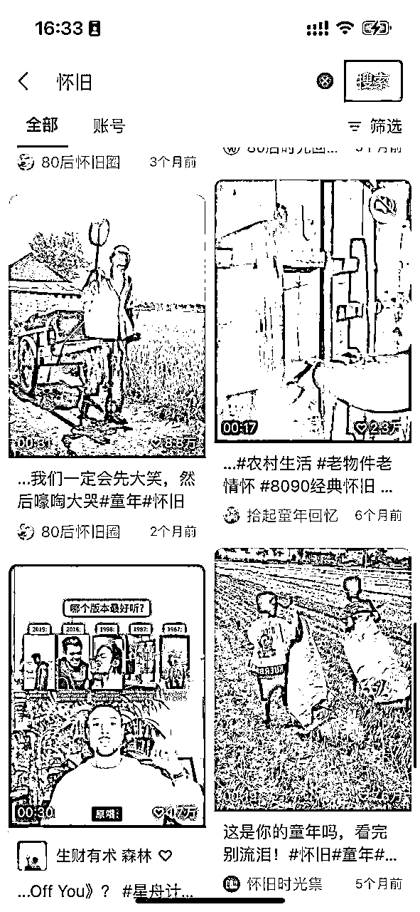

接下来讲讲，这类视频我们应该如何去进行创作

## 6.2 账号搭建

### 6.2.1 开通视频号前的建议

1）建议大家去新开一个视频号。因为从 0-1 会更顺畅，不会有那么多的烦心事，而且新号是有扶持期的。

2）如果你是老账号，譬如做了一段时间其他赛道的账号，再拿来做现在的现在的赛道的话，可能做的效果不是太好，因为之前赛道的标签定死了，垂直度不是那么的号，也过了扶持期。如果真心想做，我建议重新养号。

3）老账号里的视频，我给你这个处理建议：可以隐藏视频，但不要删除，删除会降权，后期在刷领域垂直。如果已经发几百个了也可以隐藏起来，后期刷垂直去测试。

4）如果是之前注册的，从来没发过视频，只是随便刷刷视频的，这种情况你也可以用，但扶持期过了，肯定起号没新号快。

### 6.2.2 账号注册环境：

要一机一卡一号，要在 4G/5G 环境下注册微信，以及运营视频号，不要在 WiFi 环境下注册和运营。

不用 WiFi 的说明：

1、用 WiFi 注册，有可能会导致账号流量减少、限流、风控。

2、安卓手机可以限制 WiFi，只让微信仅使用流量上网，这样以便防止误用无线网！（仅限安卓）

手机卡注册建议：1）推荐用实名注册的卡，不要用虚拟卡、接码的号、物联卡等。

2）有手机号和微信的，跳过

3）没有手机号或重新在注册个手机号，再去注册微信手机卡注册方法：

去营业厅直接注册手机卡，可以注册电信、移动、联通，各五张卡，我建议你去注册移动的卡，跟营业厅说注册个副卡，和主卡流量通用。

流量包的建议：

可以开个流量稍微大一点的套餐吧，因为视频号不怎么费流量，够发视频的套餐流量就行。

### 6.2.3 账号注册流程

1）有微信的或者刚注册号的微信，可以直接开通视频号。（如果开通过的，已经发过视频了，建议换号）

2）注册的时候，会让你填写资料，这个资料大家填写下，我以下指标，大家也可以视频号里搜 80 后怀旧，找到对标参考对标

昵称：80 后童年怀旧、80 后怀旧时光、80 后童年怀旧时光签名：你的青春，我的回忆，致 70-80-90 后

头像：以这个形式去作图，也可以直接拿来用，建议自己改下，这个没什么影响

PS：关于注销的我跟大家说下，现在注销是一年只能 3 次哈！

特别要注意的是：如果以前有绑定过商店，在注销的时候一定要把绑定的商店关联给解除了，还有分数一定不要扣到 60 分以下，不然都会被继承的哈！

## 6.3 素材收集

基本上，找素材我们主要以抖音上的为主，不建议你在视频号上找素材，因为我们后期做好的视频主要发视频号，如果从视频号上找素材，做好的视频，可能会被检测到搬运等。以防万一，我们就 A 平台拷贝 B 平台。

### 6.3.1 手机端下载素材方法

第一步：打开抖音，搜索关键词“80 后怀旧”，会出现很多下拉框，随便点击搜索，能看到很多对标视频

建议：对关注一些对标账号，这些账号都是长期更新的，我们也长期取素材

第二步：找到视频，点一下右下角的箭头，有一个复制链接，复制链接之后去微信里面搜索小程序轻抖去水印，打开小程序后，把链接粘贴进去，提取后保存视频到相册就可以了。

轻抖步骤如图：

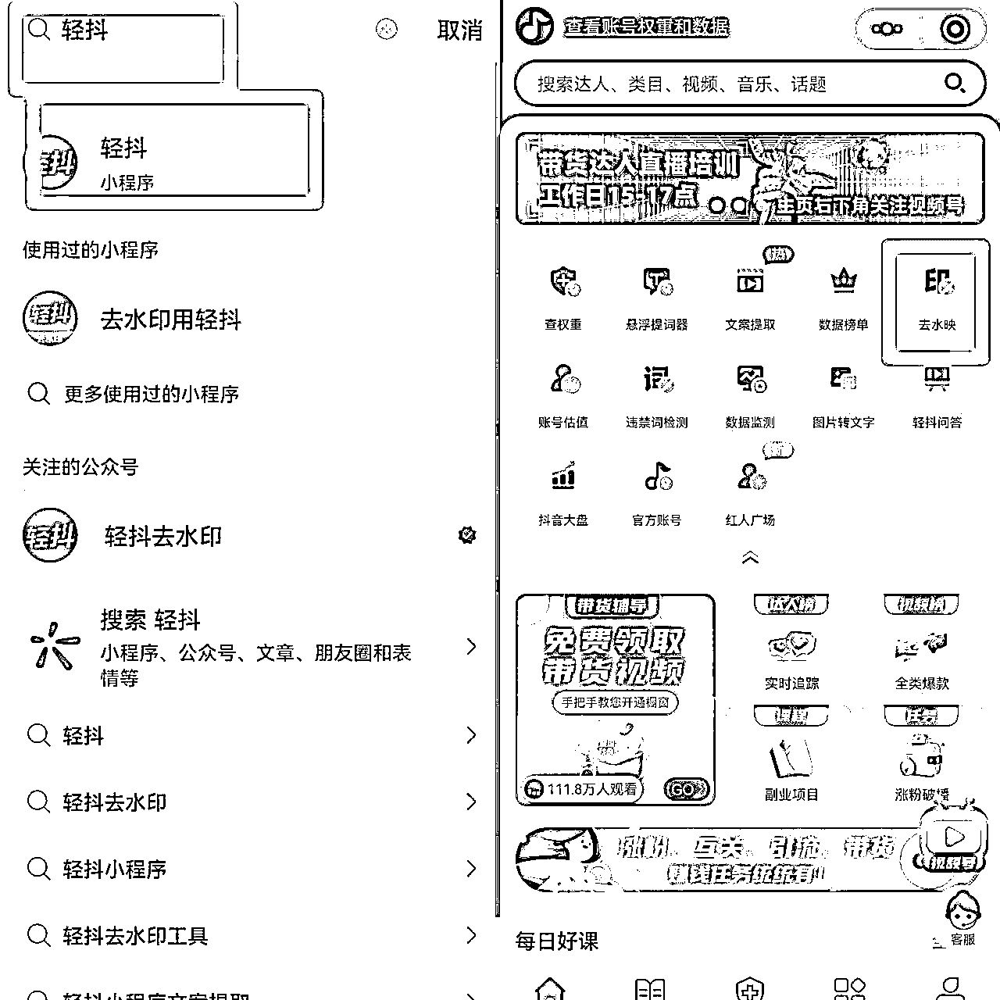

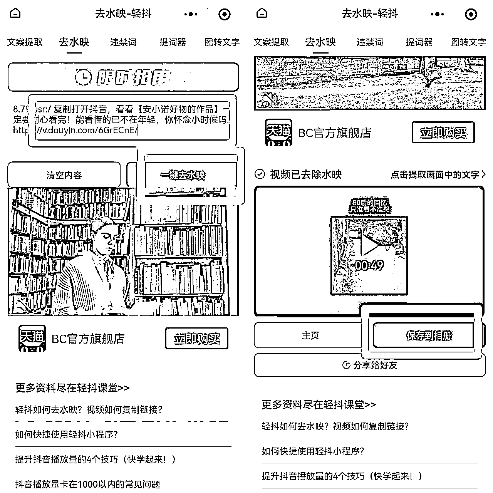

### 6.3.2 电脑端的下载素材的方法：

第一步：打开抖音官网：https://www.douyin.com/

第二步：搜“80 后怀旧”等关键词 找到素材，如图

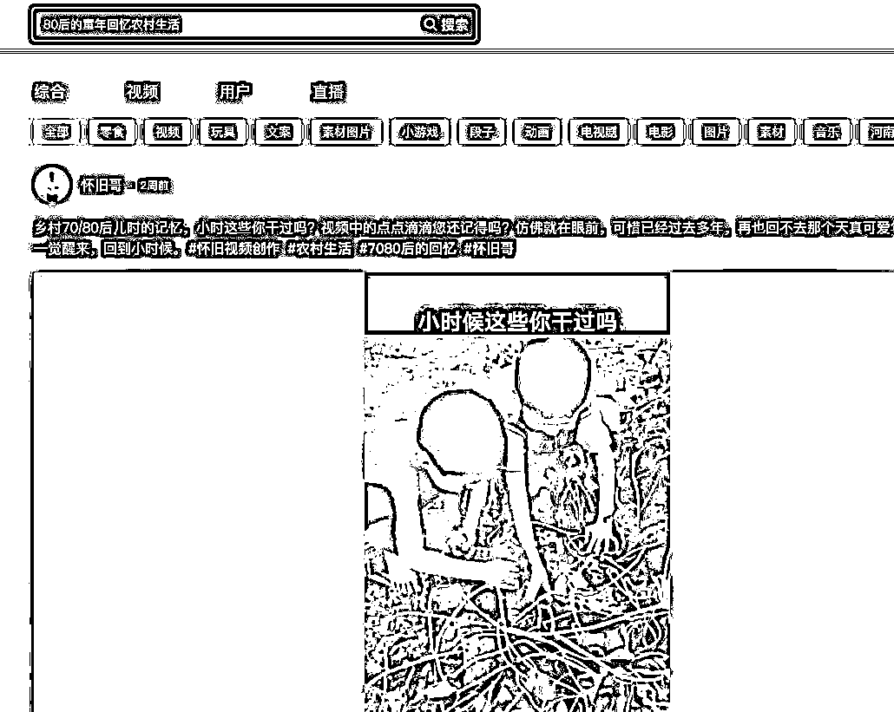

第三步：软件下载视频素材 PC 端：Apowersoft 视频下载王，下载链接：https://www.pcsoft.com.cn/soft/117044.html，打开这个软件，复制链接下载视频即可

步骤如图：1）打开软件

2）点击侦测，输入网址，完了按回车键，访问下

3）网页端就可以获取链接地址

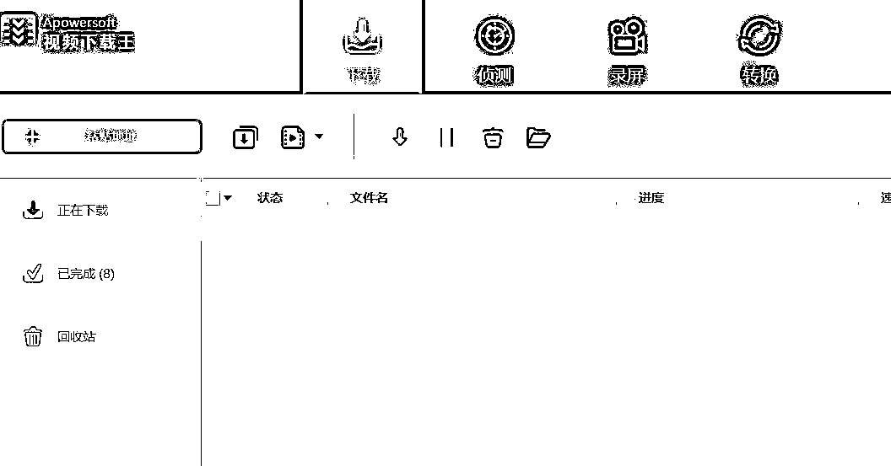

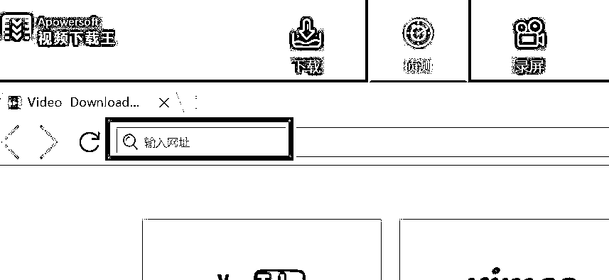

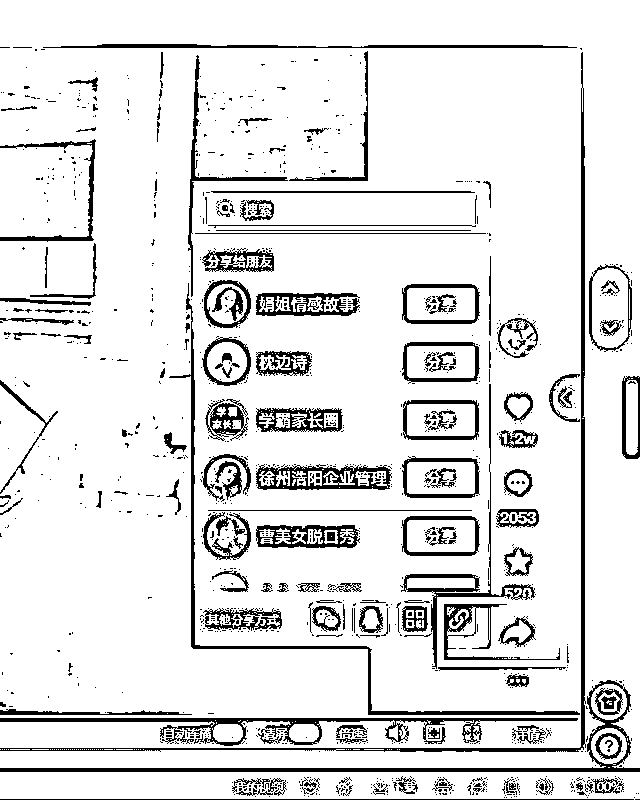

4）网址只保留这段链接，然后点回车键访问，会自动侦测和下载 5）点击下载，点击已完成，找到这个视频，右键选择打开文件夹，就可以看到下载的视频

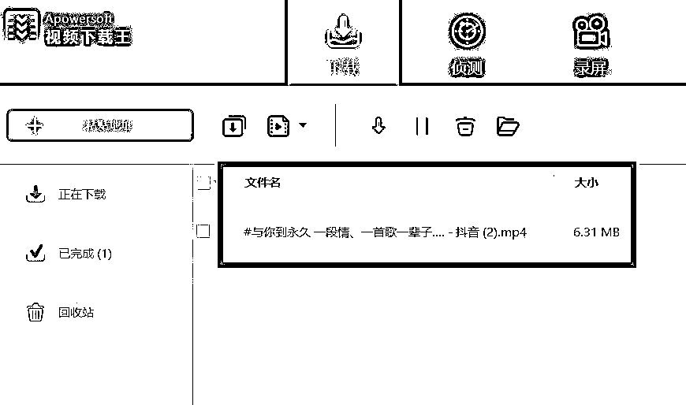

## 6.4 视频创作

素材我们拿到之后，就可以去制作了。

1、直接打开剪映，点击加号选中我们需要的素材

选中之后把几个视频添加到里面去， 然后对视频进行二次剪辑，不是我们需要的开头和片尾直接删掉，把视频剪成一个一个的镜头，不要的镜头删掉，每小段都删掉 1 秒左右。

A：把需要的视频片段出来之后，多余的直接删除

剪出来的东西一定是最精华的，表达最好怀旧概念的镜头，30 秒左右就可以，然后把镜头全部打乱，把后面的几个镜头往前移，或者把前面的镜头往后移，总之完全打乱顺序就可以，打乱到连自己都不知道顺序，只要不影响观看怎么打乱都可以。

B：建议做视频最好得有个主题，或围绕大概的点去做

可以多观察同行，比如过年时候、比如上学时候，意思其实很容易理解，就是最好视频垂直一些。当然，也可以多个情景混在一起，具体我们在孵化。

C：前三个镜头一定是所有镜头中最好的

因为前三秒非常重要，能够吸引用户停留观看才是重点，可以多参考对标视频

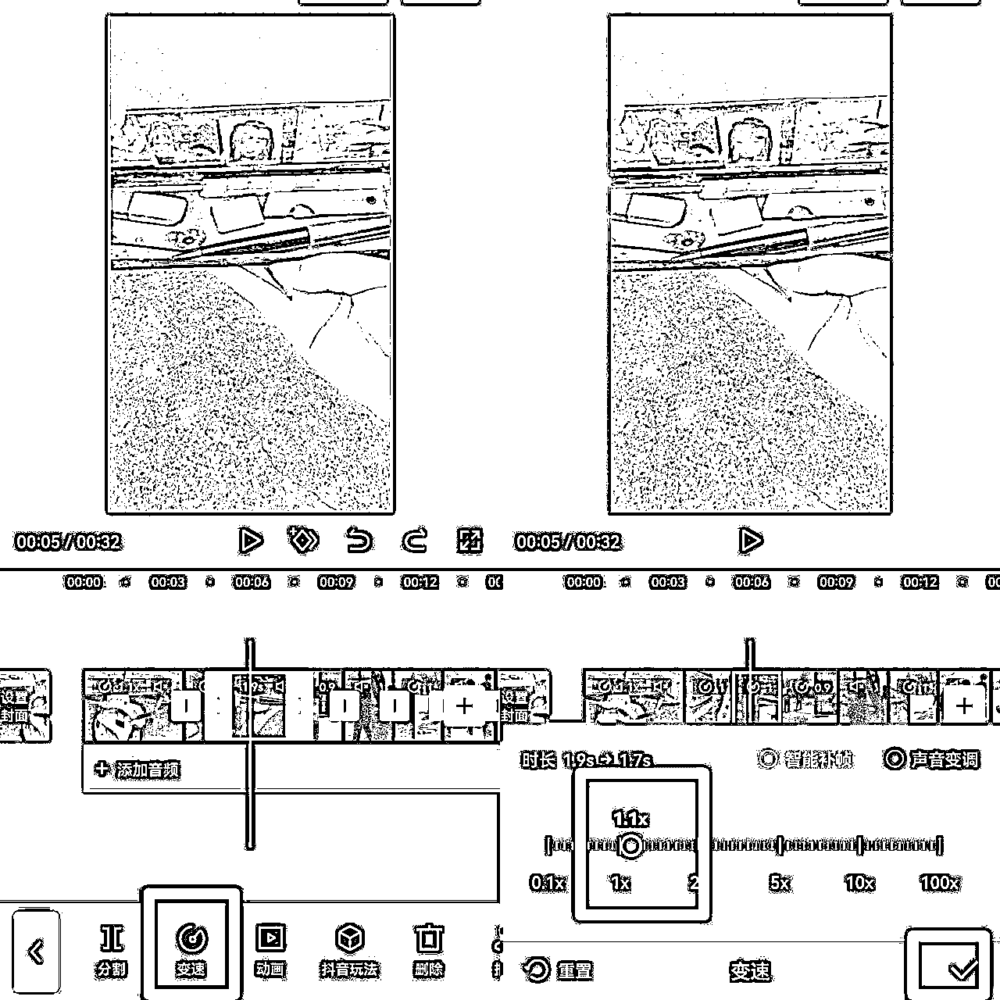

3、单个视频镜头调镜像

调镜像是在编辑里，镜像就是把画面反转过来，如果有字的尽量不调，没有字的尽量把它调过来，有字也可以切掉，镜像一定要做，每个镜头都去调一下。

4、整个视频调滤镜像我们做怀旧的滤镜，用的比较多的是黑白滤镜，黑白里分为牛皮纸、江浙沪等滤镜，这些都可以，可以根据自己的视频需求去选择，自己喜欢哪种就用哪种，调完滤镜之后，把滤镜一直往后拉，拉到和视频末尾对齐。

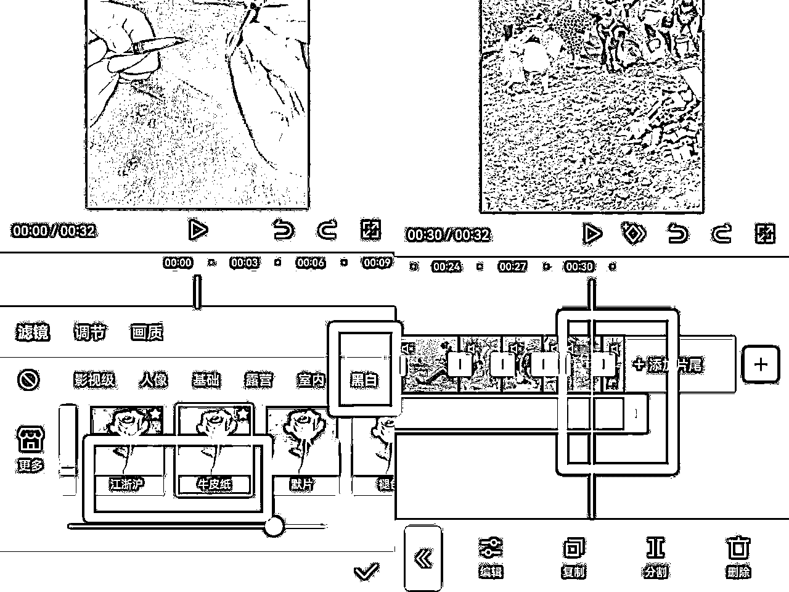

5、整个视频调特效

基本上复古特效，适合怀旧视频的，看了很多对标视频也是这个特效，所以我们一般会用到的特效是黑色噪点、荧幕噪点这两个，这个调完特效之后把特效拉到最后，和视频末尾对齐。

6、调节

调节后，可以把视频做的更清晰，看起来更舒服，颜色更饱满。

我们这里新增调节，调对比度 10、饱和度 10，锐化 20，饱和度让整个画面看起来更有质感，锐化增加清晰度，调好之后一样要拉到最后。

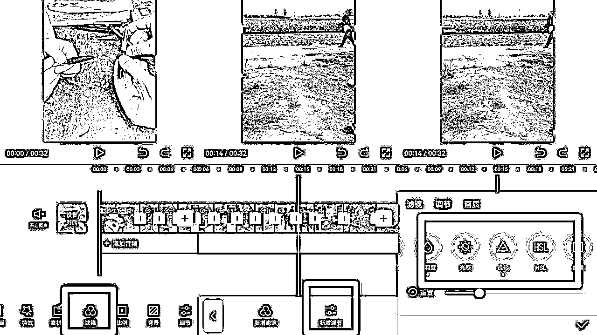

7、添加音频

音频我给大家整理好一个了，大家可以用现成的，另外，每个视频 36 秒左右，也就是跟音频对齐就行。

音频导入剪映方法：先发在 QQ 上，然后从 QQ 导入到剪映，前提是建议里有视频了，才能导入，不然导入不进去！具体看步骤！

当然了，假如觉得其他人的音频文案不错也可以复制过来用先用轻抖去水印下载视频，然后把视频导入剪映，并关闭原声，点击添加提取音乐，仅导入视频的声音就可以了。

暂时无法在飞书文档外展示此内容

视频处理好了之后，我们要做一些文字点缀，具体看下 8、做抬头文字

好的抬头文字，可以留住用户观看视频！

可以这么解释：

如果说刚好刷到一群对视频不太感冒的人很容易刷过去，但是有一个抬头吸引的话可能就会停留一会，假如我写经历过的至少已经 35 岁了，发现我自己 40 岁了，那看一下到底经历过什么东西，会有看下去的吸引力，在完播率到很大的作用。

具体操作：

有一个画中画，点一下新增画中画，新增之后点一下素材库，点到素材库之后有黑白布，点黑布添加上面去，添加之后会把视频遮掉，可以移到上面，移到上面之后发现太小了，可以用两只手往两边拉大，拉到我们需要的位置，拉好之后把长度拉到和镜头长度一样长，选择好合适的位置。

下面没有遮住的话，复制个一样的画中画把它拉到下面来，拖过去叠加一层，拉到差不多上下遮掉了之后就开始做抬头，抬头需要文字，点击添加文本，新建文本，直接输入文字就可以了。

抬头文案弄好之后要拉到跟视频对齐，给字调颜色、大小、字体，编辑字体有很多样式，颜色，用自己喜欢的就可以，通常用比较偏复古的黄色，比较醒目，适合主题，也可以用别的颜色。

抬头文案弄好之后要拉到跟视频对齐，给字调颜色、大小、字体，编辑字体有很多样式，颜色，用自己喜欢的就可以，通常用比较偏复古的黄色，比较醒目，适合主题，也可以用别的颜色。

最后视频做出来了，效果没法展示了，这里没法上传视频，大家可以去视频号搜 80 后童年时光机，看看这个对标账号，我们基本上都是对标他的去操作的。如图：

## 6.5 运营动作

视频发布之后，基本上要去运营了，不能只发不管不问，肯定做不出效果，一点要注意：我们要去做权重，上热门，需要从小一点点的去运营。

这里我简单的跟大家讲下我们是怎么运营的：我们现在主要做的是：公域流量。

要知道，大家都是没粉丝的微信开通的视频号，所以我们在做公域流量。那么，想要发展起来，这个就要看作品质量了。

那么，在视频号里，不断创作优质内容，账号权重有了一定积累之后，官方会给你匹配一定的基础播放量。

例如：最开始的时候，发布视频后，大概是几十人，不到 100 的播放。然后像爬梯子一样往上爬。

到了第二个梯队是 500 播放，第三个梯队是 3000 左右，然后第四个梯队到了 5000，第五个梯队到 1 万，再往上还有一波一波的播放流量。

这里有一个关键数据，用户平均观看时长。这是视频号判定一条视频质量的核心数据，不是大家以为的完播率，也不是点赞或评论这些数据。当然，其他的数据也会影响视频的质量分，只是说，平均观看时长是一个更为重要的维度。

1、每天养号 1 小时虽然，我们前期没让养号，但我还是建议大家每天发布视频之后或之前，都搜下 80 后怀旧等关键词，看看同行的视频，这个等于活跃账号权重

如果你不去看别人的视频，平台可能会认为你的视频号是营销号，而且权重也会下降，刚开始扶持期给推荐，后期就没有了。

所以，我这个建议要每天都按时养号，去刷刷同视频。

2、每个视频发布后，要自己去点赞、评论、完播、转发这样能够破个零，推动视频的推荐量，这个要养成习惯。可以转发你其他有粉丝的账号或者微信群。

3、多准备几个小号，去做点赞、评论、完播、转发

A：大号发了作品，用小号进去完播一下播放，然后再点赞，评论、 收藏、转发。

好处是：系统误以为是用户喜欢这个作品才点赞评论的。

B：小号评论的时候也不是瞎写的，最好设计一个很吸引人的评论这种评论的好处：可以吸引他人给你点赞、跟评。（这个评论就带动了一大堆评论出来），例如，小时候这样的生活，你还记得吗？是不是深有感触，等等。

系统不管他为什么给你评论，哪怕他写了一个句号，系统也会认为是你的视频足够好，他才评论的。

基本上，一个作品，点赞评论的多了，系统就会认 为是个好作品，然后继续给你推送，可能不知不觉就火了。

C： 多关注下对标的大号

同行更新视频，我们也能从关注刷到对标视频。

4、有用户评论了，一定要多和用户互动，这样会提高推荐量

5、删除这两个字不要用永远记住，任何时间，不要删作品，就是设置仅自己可见，隐藏起来就行了

6、视频发布周期 7-15 天，看下这段期间的播放量如何，是否都过 500

前 5 天每天过 500 说明作品质量还不错 7-15 天看下账号的整体数据，我们在做调整。

7、可以用加热投放去快速热门 8、什么时候不用 4G，而用无线网？

我们遵循一机一卡一号，我建议起号之后，可以切换无线网。起号之前，都要 4G 或 5G，IP 不要换。

9、发完之后，没流量，不要隐藏重新发按照标准化，正常发，等 7-15 天，看整体数据

10、老号和新号，看看数据怎么样，在反馈我 11、账号 0 播放的原因，我能想到的说下

视频号出现 0 播放一般有好几种原因，一种是账号违规过，还有的是新号开始很猛突然一下就变 0 了或者数据很差了，还有就是同 IP 下账号登录太多，视频发布的数量过多了，和视频发布的不是原创同质化太多了，没去重好。

按照这个去运营，基本上可以正常起号。

内容来源：80/90 后童年时光怀旧短视频副业项目，从起号再到 10W+ 复盘全过程分享

# 七、招聘信息赛道如何涨粉@郭耀天

💡

章节概要

招聘信息赛道，就是把各大公司机构招聘的信息，整理为短视频，用短视频的形式展示招聘，引导关注公众号获取，从而实现涨粉目的。

涨粉情况：单日最高涨粉几千，几个账号同时操作，两个月时间，涨粉 10w+。

视频受众：主要针对毕业生群体，同时还有一部分关注考编、考公的 35 岁以下的群体。

素材来源：企业网站，公众号，政府人力资源，招聘板块，学校招聘栏，还有一些本地专注招聘人力相关的网站

视频制作难度：文案和视频素材都是现成的，剪辑难度不大，适合新手

内容特点：没有地域限制，不管是大城市还是小地方都可以操作，由于招聘信息是公开的，即使内容重复也没有关系。

注意事项：操作中引流账号容易封号，不过能搞流量，账号解决就可以，目前测试视频号封杀比较少。

本章将会从赛道概况、账号搭建、素材收集、视频创作、运营动作、思路拓展方面带你了解招聘信息赛道的玩法。需要注意的是，这里只提供玩法思路，具体细节需要大家在航海期间共同探索。

## 7.1 赛道概况

每年大学生毕业，不少机构公司都会招聘，很多企业不限时间随时招聘，招聘与我们没有任何直接关系，不过可以借助招聘信息为我们引流，实现涨粉。

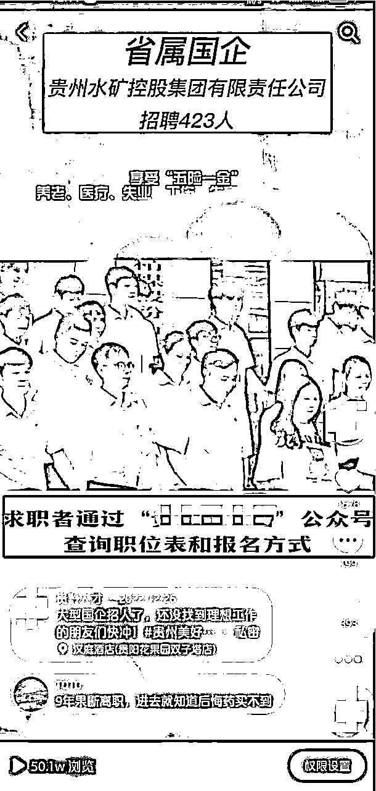

其实玩法比较简单，就是把各大公司机构招聘的信息，整理为短视频，用短视频的形式展示招聘，引导关注公众号获取，从而实现涨粉目的，最后借助粉丝变现，卖广告，卖粉丝，卖教程，卖会员。

目前我们有伙伴，借助这个玩法，搞了四十万左右粉丝，目前还在持续涨粉中，最近大学生刚毕业，流量很大。借助别人的信息搞流量，最后变现，模式是很不错的，获取粉丝也比较垂直，只是这批粉丝付费能力相对弱一点，另外，引流账号容易挂掉。

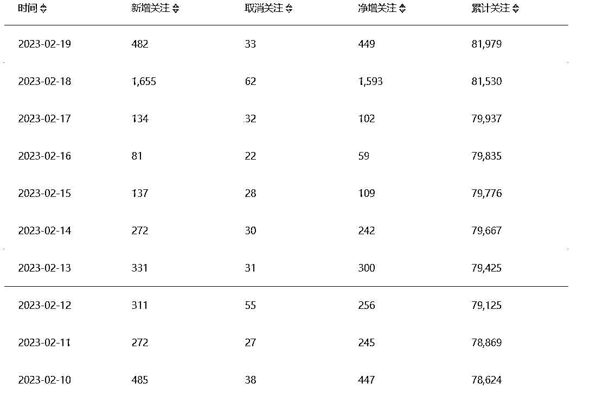

如果有资源的，可以选择矩阵操作，比如有大学资源的，让大学生给你批量操作，多账号多渠道给账号倒流，把玩法复制给别人，别人给你搞钱，可以按进粉丝给钱。

## 7.2 账号搭建

各大平台的短视频账号注册就可以，设置好，能同名最好，不同名也影响不大，不过公众号很关键词，目前对于招聘，兼职类管理很严格，很多人借助个人号操作。

不过个人号也会出问题，最把握的操作是借助人力资源公司，资质有人力资源，招聘业务，能拿到资质最好，这样搞起来账号基本不会出啥问题，平时注意更新内容的真实性，涨粉阅读这些还是比较不错的。

## 7.3 素材收集

企业网站，公众号，政府人力资源，招聘板块，学校招聘栏，还有一些本地专注招聘人力相关的网站，我们本地就有一家比较不错的这样的网站，上面就有很多信息，可以随时获取，有内容就整理视频。

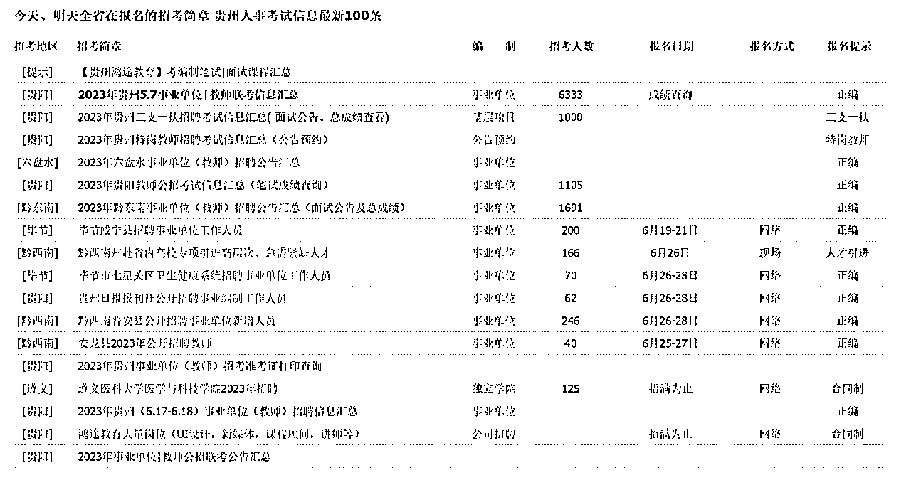

## 7.4 视频创作

对于做视频，去各大平台搜索这个企业或者是单位的视频，是自己的最好，不是自己的类似的视频也可以，官方网站上的宣传片，介绍，一句话就是你招聘企业的产品或者是信息的视频，对视频进行简单的剪辑，实在没有，网上找到一些图片，制作成为短视频也可以，目的是让别人看到是这个企业招聘，在制作视频的时候，在视频最显眼的地方放引流的公众号。

## 7.5 运营动作

有的平台无法直接植入广告，可以在留言，或者是通过私信的方式获取，比如头条就可以设置自动回复，想要具体的招聘信息，可以私信，私信设置自动回复，自动回复中设置公众号关注信息，这样就达到引流的目的，不贵最暴力的还是直接在视频中植入，类似这种。

## 7.6 思路拓展

其实这个思路还可以用到很多领域，不仅是招聘，还有一些领域，只要是一些企业或者是机构赠送的 福利这些都可以借助这样的模式，借别人的资源为自己做事情，不要局限在做招聘，写公众号时候，一个人生美女留言，他们也操作这个玩法，一年做了几十万粉丝，现在每个月搞三五万收入。

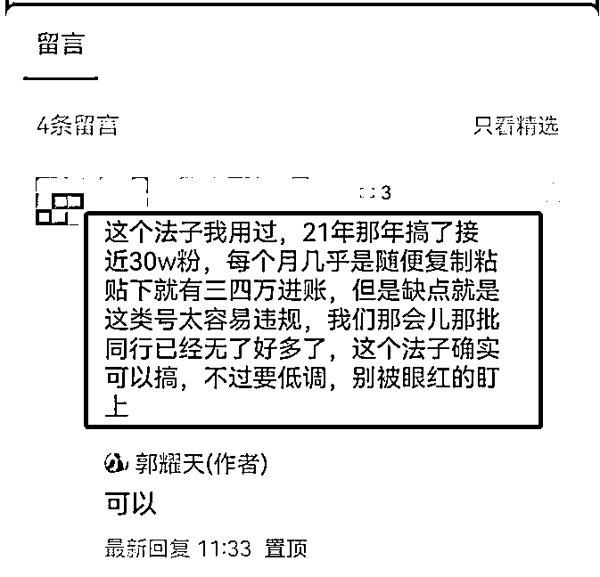

各大平台操作得同行也不错，多找一点案例研究，还能找到一些不错的领域，其实这个思路目前在抖音上还有一种玩法，就是把各大平台的课程项目，玩法，制作成为项目拆解，最后在视频中植入广告，想要视频中提到的资料，可以联系某某公众号获取。很多资料视频可以在拼多多获取，不过这里需要找一些版权弱的。

内容来源：复制粘贴涨粉八万，变现十万元

# 八、英文育儿赛道如何涨粉 @秋海

💡

章节概要英文育儿号，即育儿号混剪+英文解说。具体说来就是将一些育儿专家视频英文化，把人物换成外国人，语言换成英文，然后模仿同行混剪视频获得流量，再利用流量视频带货或其他变现方式。

涨粉情况：圈友@秋海 做了将近一年，起了两个账号，累计粉丝突破 120w，每个月利润 1-2w。

视频受众：家长群体

素材来源：抖音找文案，翻译成英文；YouTube、TED 上找外国人视频

视频制作难度：有一定门槛，要懂一些英语，会剪辑，关键是要会找素材

内容特点：原创会高很多，流量来得快，侵权风险也会更小，存活周期长注意事项：做项目过程中可能会遇到起号慢或者流量不稳定的问题

本章将会从赛道概况、账号搭建、素材收集、视频创作、避坑经验方面带你了解英文育儿赛道的玩法。需要注意的是，这里只提供玩法思路，具体细节需要大家在航海期间共同探索。

## 8.1 赛道概况

简单来说，英文育儿书单号就是中文育儿书单号的英文化。

如果你是一个孩子的家长，刷过育儿短视频，相信你一定看过李玫瑾老师的视频。将像李玫瑾老师这样的育儿专家视频英文化，把人物换成外国人，语音换成英文，就变成了英文育儿书单号。

这类账号的运营方式，是先发流量视频涨粉。等到流量视频爆了之后，粉丝达到开通带货权限要求，再利用爆款视频的流量带


首先，这是一个蓝海项目。我准备做的时候，无论是抖音还是视频号，做到人都不多。

做中老年女装的时候，习惯性每天都刷一段时间的抖音，发现这种模式之后，特意去找对标账号，只找到不超过十个。以抖音的体量，这绝对算得上蓝海了。

其次，相较于搬运混剪而言，这个项目需要一定的门槛。要懂一些英语，要会剪辑，最重要的是要会找素材。如果找到的素材别人没有用过，剪出来的视频，就算原创。

最后，父母一般都舍得给孩子买书。我自己也有一个小男孩，每年都会花不少钱在买绘本和童书上，而且了解到身边不少宝爸宝妈也都愿意在童书上做投入。

还有就是利用「外来的和尚好念经」这个心理，不少人都会觉得外国的育儿理念比较先进，因此更容易引起受众的兴趣。使用外国人的形象，侵权风险也会小很多。

另外，选择视频号平台，是因为当时在视频号上起号最快，第一天发视频就爆了。所以把主要精力放在视频号上，但不是说其他平台不管，也会同时把做好的视频同步到抖音快手。

目前两个账号抖音累计粉丝 10w，快手 8w，跟视频号不在同一个量级。

主要有以下几个步骤：找育儿爆款文案、翻译成英文、AI 配音、找视频素材、合成视频，接下来一个一个说。

## 8.2 账号搭建


## 8.3 素材收集

### 8.3.1 找育儿爆款文案

抖音是目前视频内容最丰富的平台，因此选择在抖音上找爆款文案。爆款文案的标准就是点赞量高，图文和视频都可以，只要文案是育儿相关的就行。

找文案：在抖音首页搜索框输入「育儿」，点击筛选条件，选择「点赞最多」，「一天内」或「一周内」都可以。要是刚开始做，也可以选择「半年内」或者「不限」。


电脑端的操作步骤也一样：


文案提取：如果是图文，要自己打出来，或者用 OCR 网站识别。如果是视频，就先下载下来，用飞书妙记转换成文字。

抖音视频下载工具，可以网上找一个，我用的是 IDM，这里再推荐大家用一些常见的下载工具，如轻抖、哼哼猫，还有其他视频号工具，可以跳转至我们的 8 月航海 | 视频号带货 | 实战手册 下载。

找爆款文案的另外一种方式，就是找到做的好的同行，直接把文案拿过来用，他们的文案一般也是爆款视频提取的，可以直接用。

用视频标题搜索，都能找到对应的中文视频。找到视频后，也下载下来，用飞书妙记提取文案。

### 8.2.2 文案翻译

借助在线翻译网站，百度翻译，有道翻译都可以。

我习惯使用 DeepL，免费使用，而且翻译相对准确。有余力就检查下英文，不然就直接使用翻译原文。


### 8.2.3 AI 配音

使用配音工具，像配音神器、魔音工坊。

我用的是 tts-vue，一款配音软件，集成了微软 Azure 语音助手，各国的英文语音都有，也支持包括中文在内的其他国家语音。

配置好右边的选项，开始转换就能生成音频，点击底部的绿色按钮可以下载音频。


### 8.2.4 找视频素材

素材分为主素材和辅助素材，找的素材最重要的是别人没用过的。

主要素材是外国人口播素材，辅助素材是连接两段口播素材的过渡素材。

既然是找外国人的素材，就要去外国人的网站去找，油管就是最好的选择。上油管需要科学上网，这也是一个小小的门槛。

主要素材要找演讲视频，TED 是个不错的选择。但是为了规避侵权风险，可以在 TED 找到一个演讲视频，用演讲者的姓名在油管里搜，基本上都能搜出其他演讲视频。

如果没搜出什么视频，换一个演讲者再搜。


辅助素材也是在油管上搜，找育儿相关的视频，一般使用 kids、child、family 等关键词。这里有个技巧，在关键词后面加上 stock footage，就能搜到一些无版权高清的素材。

素材下载同样用的是 IDM。


## 8.3 视频创作

### 8.3.1 制作一个流量视频

剪辑用剪映就可以了，具体细节如图，在音乐轨下面还要再加一个背景音乐轨道。

刚开始做，剪辑会比较耗时，因为素材积累不够。等素材积累的多了，半个小时左右就能剪一条视频。

注意事项：视频轨的素材要静音。

主素材的人物的口型要和音频对上。音频有声音的时候，素材里人物也要在讲话，尽量避免出现有声音但是人物没有讲话的情况。

口型对不上的时候，就用辅助素材，辅助素材的作用，就是用来解决声画不统一的问题。

英文字幕可以直接选中音频，自动生成。中文字幕，需要自己输入。

### 8.3.2 制作一个带货视频

如果你要剪一个带货视频，流程和上面的差不多，唯一不一样的地方是要插入自己拍的商品视频片段。

找对标账号的带货视频拆解一下，别人怎么剪，我们也怎么剪。或者找中文育儿书单号的视频，依样画葫芦，用同样的手法剪辑。

要注意的是，商品视频尽量自己买样品回来拍。使用别人的片段，视频有可能会被判定非原创。至于带什么商品，同样学对标账号，他们带什么，我们也带什么。

还有一种方式是通过第三方数据平台，找到销量好的商品，自己买回来拍。

以考古加为例，除了能找到热销商品，还能找到对标带货视频。

选择图书音像，找到适合的商品，点进商品详情页，选择关联视频，就能找到对标视频了。


## 8.4 避坑经验

做项目过程中可能会遇到起号慢或者流量不稳定的问题，这些都是正常现象。

我自己做了四个号就起了两个，爆的两个号一个第一天就爆了，另一个做了快一个月才起来，其他两个号就完全起不来。为了增加起号的概率，刚开始可以多做几个号。

如果只做一个号，账号起得慢会影响心态，难以坚持下去。起号过程也有运气的成分在里面，要解决这个问题，要不就是增加账号，用数量博概率。

要不就是降低期待，将时间拉长，只要路是通的，终归能抵达目的地。

视频爆了之后一天有几十万，甚至几百万的流量。但是爆款视频的流量有衰减期，有的一周半个月流量就没了，大爆的视频可以持续一两个月。

等到流量恢复正常时，账号的流量只剩几万，落差很大。因为出单数量是跟流量成正比的，流量越大，出单越多。

因此心情也会跟过山车一样，在喜悦之颠落与失落之谷之间反复。

流量爆的时候，感觉自己像打了鸡血，可以不眠不休。第一次视频爆的时候，带货权限还没开，连续直播了两天，每天都只睡两三个小时。

当时几乎每分钟都在出单，体会了一把日入过万。

有了这个体验，后面流量恢复正常时，就感觉提不起劲剪视频。

现在做久了心态就比较平和，视频爆了就多剪几条带货视频，把流量充分利用起来。不爆的时候，也保证每天的视频发布。

总而言之，还是要保持平常心，和做其他项目的道理一样。

内容来源：视频号蓝海英文育儿书单带货一年累计粉丝 120W+，月入 2W+，我是怎么做到的？

# 九、ChatGPT 赛道如何涨粉@轻松学长

💡

章节概要 ChatGPT 号视频，适用大部分群体，从青少年到中老年，因为它的题材可以是情感类、热点类、历史类等等

涨粉情况：一个半月涨粉 9W+，运营 6 个月后，仍然可以做到月涨粉 2w 左右。单场直播场观破 20W+，引流私域企业微信/个人微信 8k+，直接变现 2w 视频受众：年龄跨度广，适合大部分群体

素材来源：知乎&微博& ChatGPT，可用素材足够多。

视频制作难度：适合会使用 ChatGPT 的人群

内容特点：可以做比较容易引起热议的话题，话题受限的不多，较易于传播注意事项：不要涉及政治、黑产等话题

本章将会从赛道概况、账号搭建、素材&选题、视频创作、运营动作方面带你了解 ChatGPT 赛道的玩法。需要注意的是，这里只提供玩法思路，具体细节需要大家在航海期间共同探索。

## 9.1 赛道概况

ChatGPT 出来已经有一段时间了，但是热度还没有过，现在还是有很多人不会使用 ChatGPT，也有很多人开始使用 ChatGPT，去搜索 ChatGPT，所以 ChatGPT 是自带热度的。

借助 GPT 强大的问答功能，我们在制作此类视频时，也以和 GPT 展开对话为基础，进行录屏。其中 GPT 的回答会让大家感兴趣而因此逗留。目前的 ChatGPT 账号的视频，，录屏问答类的数据还不错，涨粉情况也很好

所以这边会把录屏问答类的视频展开讲解：

## 9.2 账号搭建

### 9.2.2 昵称

因视频号已经不允许新改名的视频号带有 ChatGPT 的关键字，所以大家可以选择 Chat/GPT 加其他的名字。沾边即可。

比如 Chat 聊天助手，GPTAI 智能机器人等，自己自行发挥，或者让 ChatGPT 给起一个名字。


### 9.2.3 简介

简介部分可以留微信号，方便粉丝或商业合作找到你，然后大概介绍一下这个账号是要干嘛的。

主要尽可能的多堆加一些 ChatGPT 的关键词，可以提高账号搜索权重，多参考同行。


## 9.3 素材&选题

ChatGPT 问答类视频，选题是个关键，能引起情感共鸣或引发争议的选题，往往是最容易出爆款。选题可以从以下几个方向选择：实时热点类

社会民生类其他平台热榜

同行爆款视频

方法 1：实时热点类根据当前实时热点，抓取一些观众关心的点，从这个点切入，可以得到一堆的问题。

比如：最近七夕情人节就要到了，是不是可以围绕情人节产生一系列的选题：情人节怎么向暗恋的女孩表白？

情人节送女朋友什么礼物比较好，推荐一款....礼物。

情人节，女生最不希望收到什么样的礼物？

情人节，要怎么过才浪漫，策划一个有仪式感的情人节方案。

方法 2：社会民生类社会民生，就是我们大家茶余饭后讨论的一些话题，整理一下，就是一个爆款短视频的选题。

比如天价彩礼、996 工作、买房、结婚、教育等角度，去挖掘问题，但注意尺度，一些敏感问题别碰（关于国家政治等），免得违规。

方法 3：其他平台热榜

平台热榜，和实时热点类似，但也不完全是同一类。

主要关注的平台有两个，知乎、微博。

知乎每天的热榜 50 个，从 50 个里面挑选一些大众话题，参考上面第 2 点的那几类问题。

微博也类似，不过微博是只有关键词，需要自己根据关键词针对性的提出问题。

方法 4：同行爆款视频

参考同行，这是做短视频、做自媒体都会经历的一个阶段，选题匮乏时，同行是最好的老师，同行的爆款短视频都是经过观众验证的，是观众喜欢的视频。

日常刷视频号时，寻找爆款短视频时，有两类视频值得关注：

第 1 类：账号内的其他视频点赞数平平无奇，而有一两个视频点赞数远超其他视频，那么这个视频肯定是爆款，再做一次也可能成为爆款。

第 2 类：看点赞数，点赞超过 100，有成为爆款的潜质。超过 500，一个小的爆款。超过 1k，那妥妥的是一个爆款短视频，是观众喜欢的选题。

再分享一点，如果有一些问题，ChatGPT 回答的并不是自己想要的，达不到预期的效果，可以先将答案投喂给 ChatGPT，再问问题。


## 9.4 视频创作

### 5.4.1 所需工具

1）剪辑工具

推荐剪映，剪辑视频时使用，网上教程很多，自行学习即可。

2）录屏工具推荐 EV 录屏，下载对应版本，安装完成即可，制作视频时使用。

使用方法：打开软件界面，第一步，选择选区录制，选择需要录制的区域；第二步，点击图标开始，视频录制完成，点击结束。


工具使用很简单，多尝试几次就熟练啦。

### 5.4.2 录屏问答类

根据学长的经验，ChatGPT 主流的短视频类型有两种：图片截图类和录屏问答类，其中录屏问答类又是占绝大部分。经测试，图片截图类的效果没有录屏类的效果好，所以我们这边给大家讲讲录屏类问答制作过程：录制 ChatGPT 回答问题的整个过程，将录制的原视频导入剪映，掐头去尾，且通过视频变速将短视频的时长调整到 30s 内，最后再加标题、背景音乐、音效、贴纸，丰富一下短视频内容。


制作短视频模板：录屏问答类的视频也是可以将背景音乐、音效、贴纸等元素固定制作成模版，把模板的素材点左边小眼睛隐藏，然后每次新的录屏视频就放在模板素材上方进行剪辑就可以。

剪辑时注意调整短视频的大小，通过裁剪，将原录屏文件调整到合适大小，保证用户的观看体验，学长我做的是横屏，选择的是 3:4 的视频比例。

### 5.4.3 关键要素

短视频的制作都很简单，主要是选题，选择能引起共鸣、共情或争论的话题，一般浏览量都不错，比如挣钱、写情

书、写旅游攻略、可能被取代的职业等。

如果自己实在想不到合适的选题，那多刷一刷同行的视频，就知道该做什么问答的视频了。

还有一点就是要做出自己的视频风格，最基本的标题、排版要统一风格，短视频选题都已经很相近了，如果没有一点自己的风格，那粉丝是不是也就区分不了你与同类账号，粉丝粘性不高。

## 9.5 运营动作

### 9.5.1 引导转化

账号简介处要挂联系方式，方便别人有账号需要或问题解答的时候可以加到你。

有精力可以维护好评论区，每条视频下面做好评论引导，且对粉丝的提问做好引导回答，一般是问得多的就是如何下载，如何使用这类的问题。

### 9.5.2 直播预约

一句话：账号主页保证至少有一条直播预约。

挂直播预约是为了在短视频爆了的时候承接短视频的流量，因为我们不知道哪条短视频会爆，所以提前挂直播预约，避免浪费了爆的短视频流量。

可以一周一个直播预约，可以挂个每周五 20:30 的直播预约，每个周四晚上就开下周五的直播预约。

如果挂直播预约后，直播预约的人不多，而且自己也不想播的话，取消预约就可以。

比如我这个直播预约，挂上之后，别人刷到我的短视频时就会弹出直播预约的窗口。


直播预约如何设置，看下图：


内容来源：10 天时间，成为视频号 ChatGPT 类头部账号，我做了什么？

# 十、AI 说话赛道如何涨粉@云天

💡

章节概要 AI 说话号，就是通过一张图片，给他配上思维语录、禅语、创业语录等音频，同时图片的嘴巴是动的视频。常见的思维老者语录、小和尚号，都属于此。

涨粉情况：小和尚号之前在抖音、快手上很火，后续迁移到视频号上，也出现一些千赞的账号。

视频受众：中老年用户群体，男女差异不大

内容来源：抖音&快手找语录；原创 AI 图，可用素材足够多，原创度高

视频制作难度：对剪辑要求较高，需要有一定的 AI 绘画基础

内容特点：视频内容以心灵语录为主，辅以 AI 形象，让中老年人心生共鸣。

注意事项：目前小和尚号在视频号内同质化严重，难以起量，建议换成其他人物形象。

本章将会从赛道概况、AI 图片生成、视频创作方面带你了解 AI 说话赛道的玩法。需要注意的是，这里只提供玩法思路，具体细节需要大家在航海期间共同探索。

## 10.1 赛道概况

AI 说话号是近一个月，在各大短视频上很火的一个项目，涨粉超快。本质上就是让一张 AI 图片动起来，配上各种语录音频。做出来的就是原创视频，不被判搬运和重复，熟练后基本上十几分钟一个视频。

变现方面，起号后可以收徒、卖书、做小程序等，整个项目没有想象中那么难，涨粉又比较快。具体展示如下图，想必大家都刷到过类似的视频。

6 月 25 日.mp4【在线播放】


目前视频号上，小和尚号已经没有那么好做了，没必要扎堆一窝蜂的跑到小和尚和老者的赛道。

简单一句话，别人做小和尚，做老者。你是不是可以考虑做美女，做生肖，做任何和口播有关系的？比如：情感咨询类的，风水起名类的，送祝福类的，交友类的……

制作这样一个视频，需要先生成 AI 图片，再利用 did 这个网站，直接导入我们的图片和音频，一键生成动态视频。一套流程下来，基本上做一个视频大概在 10 分钟内。

接下来我们看看具体怎么做。

## 10.2 生成 AI 图片

关于如何生成 AI 图片，我们提供了两种方法。

第一种是利用 Vega AI 来制作，可以套用小和尚模板快速出图，也可以自己调教风格模板。好处是这个创作平台免费使用、无需翻墙、操作简单，缺点是生成的图片的质量可能不会特别高。如果感兴趣，可以移步「10.2.1 使用 Vega AI，免费无需翻墙」进行学习。

第二种是利用 Midjourney 来制作，「10.2.2 使用 Midjourney，以图生图无需咒语」这套教程可以让你不用操心图片的描述语，直接以图生图，去掉 MJ 的出图等待时间，快速出图。好处是图片质量会更高，缺点是操作难度会更大，也需要付费购买 MJ 账号，成本高一些。

### 10.2.1 使用 Vega AI，免费无需翻墙

玩法 1：套用小和尚模板，生成小和尚图片

第一步：注册并登录 Vega AI 官网 https://rightbrain.art/

第二步：点击左侧菜单栏的「风格模板」


第三步：输入关键词「云天」，选择小和尚模板


第四步：点击「应用」

第五步：在右下角调整图片参数

选择 9:16，4 张，普通画质，就可以了。高清和超清只能做 2 张图片，效率慢我们这里选择普通画质，然后后面我们用高清修复软件变成高清即可。


第六步：在下方输入文案，生成图片

例如输入：光头，在草地，背后是蓝天

就会生成这样四张图片

第七步：选择合适的图片，下载到本地


第八步：利用高清修复软件或者网站把图片变成高清


玩法 2：自己训练风格，制作其他图片

如果希望生成其他 AI 形象，可以选择自己喂图，训练其他图片风格。

第一步：左侧菜单栏选择「风格定制」，点击「开始训练」


第二步：输入风格名称，选择基础模型


第三步：上传我们的其他图片，开始训练


第四步：等待训练完成即可。


### 10.2.2 使用 Midjourney，以图生图无需咒语

1、首先到某宝购买 Midjourney，这里不建议大家自己注册账号并充值，因为自己充值很贵，一个月要几百块。我们到某宝上只需要购买一个月 16-32 元的共享账号即可。跑路也不心疼。

2、登录 https://discord.com/，通过你购买的共享账号登陆进入社区。

3、在下方输入框输入/，选择/describe，在点击红圈区域，选择一张你想要做的（例如你想做小和尚），就去找对标同行的视频截图过来，上传上去。

4、敲击回车，MJ 机器人会给出 4 条对应的描述语 ，这个就是切合这张图的意境。我们随便复制一个到百度翻译。


7、在 prompt 后面粘贴刚才的英文

A bald little monk wearing a robe and holding a candle, with a Confucian style, video montage, Grass Mountain Empire, daz3d, orange and brown, solid color, imitation material --ar 11:18

这里记得把 11:18 改成 9:16 的格式。（这里数字和符号一定要在英文输入法的前提下去修改）

敲击回车等 mj 生成。


8、这样就生产出 4 张类似风格的图片，我们根据自己需求选择图片，或者是重新生成、或者根据某一张再产出四张图片，这样就大量的素材供我们使用了。

在这里给大家解释一下 U1-U4 和 V1-V4 的意思 U1-U4：如果你看中了第一排第二张图片，你点击 U2，机器人会重新给你发送一张这张图的大图版本。

V1-V4：如果你觉得第一排第二张图片不错，那么你点击 V2，机器人会根据这张图的风格再给你生成四张图片

右边的刷新按钮：对着四幅图都不满意，点击刷新，会根据这个描述重新生成图片。


9、我那第一张举例，我点击 U1，就出现了 U1 的高清大图。

10、点击图片，会出现大图，右键另存为桌面。

## 10.3 视频制作

1、打开 www.d-id.com。注册账号。我们利用邮箱注册，每个账号可以免费做几个视频。这里为了节省注册邮箱的时间，推荐大家使用——无限邮。如下图这个邮箱。


注册 DID 的时候，@符号前面和名称中间加上如上图数字。收到的验证，去主邮箱登录即可获取验证。


到这里就注册完成了，接下来就可以登录了。

1、创建视频


点击加号，上传我们做好的图片。


这里导入音频


这样视频就做好了。

### 10.3.2 后期制作

我们再去剪映加字幕。因为视频有字幕。我们要把视频稍微放大，把水印遮盖掉就可以了

然后我们加字幕，选择合适的字体就可以。


具体看成片。

7 月 13 日.mp4【在线播放】关于文案，可能有的人怕用同行的违规。你可以找一款配音软件，现在市面上有很多，你把文案二次原创，再重新配音即可。

最后，送上视频教程，如果看了文字教程还不懂的人，可以下载视频教程观看

链接：https://pan.quark.cn/s/46c2abd1ea0e 内容来源：小和尚、老者图片会说话升级版教程；小和尚说话教程，7 天万粉（第 3 版教程）

# 十一、更多涨粉赛道案例参考

案例一：高考励志语录@每天晒白牙

一张图带点有道理的文字，配上背景音张雪峰、高考这种热点话题很匹配视频号用户群体-中老年人，也就是大多数是家长

链接：https://t.zsxq.com/119NTCsEk


案例二：学生课堂语录@单手劈榴莲

乍一看好像在教室里，实际上是虚拟背景加视频，内容制作也简单，家长看到却会停留，可以发各种语录类内容。

可以卖亲子沟通课，家庭教育课等，单价 19.9-399，也可以引流到私域卖书包文具。

链接：https://t.zsxq.com/11TZyXhtk


案例三：针对小孩的情景剧式科普@念念无住小孩爱看这种视频的原因：

第一，这是讲科普的。“小朋友都爱看科普类知识嘛”。第二，阿基米吴用悬疑、一个一个故事的方式讲科普，很吸引人。

第三，他讲得很通俗，不会听不懂。

链接：https://t.zsxq.com/114ziRZ7A

案例四：剧情带货号@will 阿伟

这类服饰店场景的剧情视频，在视频号上有很多爆款 10 万+赞。它可以通过视频流量引流到线下实体门店定位地址，视频号商品橱窗和视频号直播间卖货。

链接：https://t.zsxq.com/11iXoxUHI

案例五：中老年情感语录号@鸡蛋面

“一辈子不结婚真的可以吗？”中老年看到这个视频，通常都会转发给子女。

下面两个号的形式，内容可以说基本一样，流量相当好，10w+，这种精准切中中老年人想法痛点的内容，几个月爆后还会再爆，照着做就行了。

链接：https://t.zsxq.com/11XePdVIv


案例六：英语启蒙动画视频号@枫晓陌视频号英语启蒙动画视频带货，两个月卖了 5.1W 单。单价 59 元，佣金 50%，两个月单号赚了 150W。

视频制作：去拼多多或者同行那里购买，几十块几千 G，用剪映智能分割将几分钟的长视频切成几十个几秒钟的视频，而后随机组合。

配音：可以直接下载同行的视频，放到剪映上进行音频分离。

将视频切片+音频重新组合，配上字幕，就是新的作品了。

链接：https://t.zsxq.com/11JvsLY2A


案例七：年轻人追星小卡视频号@星辰之前以为视频号基本上都是中老年人，最近发现年轻人越来越多了。

比如这个卡片，最近总刷到，而且点赞评论的人都很多，有的好几万赞。刚开始看不懂到底是啥，评论区也总是一些行话，根本看不懂，什么冬卡，什么 XX 卡之类的。

研究了半天才发现，原来是卖追星小卡的，而且都贼贵。

比如冬卡，其实就是 winter 的卡，而 winter 则是一个韩国组合 aespa 的成员。

链接：https://t.zsxq.com/11yIzWFZQ


案例八：视频号情感赛道@肆零柒

视频号 7 月情感榜的榜首账号，视频内容是以聊天记录的形式，制作方式简单，引流到小程序


# 十二、变现方式

💡

章节概要虽然目前带货仍然是视频号最主流的变现方式，但一旦拥有一定数量的粉丝，还可以尝试许多其他的变现方式。

这一章列举了 6 种视频号变现方法，包括带货、收徒、找广告主分佣、引流公众号流量主、卖号、加入创作分成计划，希望能给你提供一点变现思路。

## 12.1 带货变现@大星儿

视频号带货依然是现在的主流变现方式，上述提到的赛道类型，主要是迎合用户的内容喜好，创作“娱乐型”视频，不涉及到具体的带货产品，所以本质是吸引流量

当某一条视频出现爆款时，快速跟上带货的视频，通过挂车和引导橱窗成交的方式，实现短视频变现；同时还可以尝试开直播，短视频的爆发流量会在短期内将更多看到视频的粉丝推进直播间，且直播间可以直接挂小黄车，成交路径更短。

仅存留在视频号上的粉丝很难再触达到（因为大部分的视频流量还是来源于公域推荐，即使有几十万粉丝，用户依然没有形成从关注列表中只看你的视频的习惯，基本上是随便刷，刷到你的视频感觉不错再进行后续的动作），所以抓住机会要么转化，要么留存在可多次触达的私域场景。

下方图片是当时爆款视频的相关数据，不到半小时就能涨几千粉，涨粉速度非常快，如果在这种涨粉速度下开直播，通过短视频引流到直播间的用户，也能轻松让自己进入到场观几千人的直播广场中。

所以当视频号出现爆款播放，不管爆的是带货类还是非带货类，先预约直播，下班就开播介绍产品，中途用户互动引导点赞打赏，可以提升直播间互动数据，把自己直播间推到更大的流量池中。

在直播的场景下转化链路更短，互动及时性也强，相较短视频的转化方式，转化效率更高。


后来还有一次是爆了 200W+播放的视频，当时距离视频爆发式增长过去 3 天，流量增速已经慢下来了，大概每半天能涨粉 3000 左右，然后上午预约了直播，下午开播场观轻松过 500。

## 12.2 涨粉收徒教学变现@大星儿

### 12.2.1 如何引流到微信

方式 1：绑定企业微信

账号开通企业认证，绑定企业微信，用户点击头像进入主页，可以在主页看到企业微信的入口，在简介中介绍添加企业微信的有什么用，提升添加率

开通直播，可以挂企业微信卡片链接，在直播过程根据直播话术，引导添加企业微信

方式 2：账号昵称+简介留个人微信


### 12.2.2 变现方式

80 分可以教 50 分的学员，50 分教 30 分认知的学员，有能力就教比自己认知低的人如何做账号，靠收徒付费变现。

可以把自己做号涨粉的过程整理成保姆级操作手册，或者有能力的以视频录课方式，在抖音和小红书发布笔记招徒，或者开直播教学，引流到微信私域成交，后端主要提供答疑服务。

关于如何做一门课，我们在 生财有术抖音商业 IP 大航海 2.0｜课程 中，也提供了一些方法。

如果自己没有开发课程的能力，可以联系生财的圈友，按照 cps 的方式进行合作，只需要负责流量引流成交，后端直接交付给合作的圈友即可。

## 12.3 找广告主合作分佣@大星儿

如果你的账号一直是发布内容型视频，并通过这些内容吸引了一波年龄或者人群比较精准的粉丝，但需求不不精准的用户，那可以考虑通过粉丝画像去倒推这些人群可能感兴趣的课程，和圈友或者靠谱机构谈付费合作。

比如我现在有一批中老年粉，主要是通过情感类型的内容吸引用户关注，那我可以和中老年课程机构，如站桩课、老年剪辑课、老年拍照课、中医养生课合作，一种方式是在自己的视频账号上发布对方的课程投放视频，另外一种方式是先将用户引流到微信私域中，按 CPS 合作。

## 12.4 引流公众号流量主变现@大星儿

### 12.4.1 如何引流到公众号

方式一：短视频插入文章链接，文章介绍中提供额外的价值，引导关注公众号


方式二：视频号与公众号关联

视频号与公众号可以通过设置同一超级管理员，实现互相关联，二者互相关联后，未关注的用户在视频号推荐板块刷到热门视


### 12.4.2 如何变现

1、公众号图文流量主

公众号的推送机制最近也一直在迭代改版，之前只有关注的粉丝可以看到公众号推送的文章，今年开始公众号加入推荐机制，会根据文章内容来推荐给更多非粉丝用户。

因此我们可以通过爆款视频将用户沉淀到公众号上，并发布文章，在文章中插入智能广告，获取流量主收益，具体的公众号写作方法及操作流程可以参考 5 月公众号爆文写作航海，这里主要是提供一种变现思路，不做更多的细节赘述。


2、公众号付费阅读

通过短视频引流公众号，文章开付费阅读实现变现，适合开付费阅读的内容特点：有用（剪辑、拍照、做饭、生活常识、纯干货等等）、好奇（魔法、命理、小说等等）

以下是视频引流，公众号付费阅读案例参考：

案例一：视频号表演魔术@one 先生

引流方式：引流公众号魔术付费教学来源：https://wx.zsxq.com/dweb2/index/topic_detail/814512542585242

案例二：结合热点发布热门表情包视频@一念来源：https://wx.zsxq.com/dweb2/index/topic_detail/814214411451882


## 12.5 卖号@大星儿

顾名思义，账号做起来后，根据粉丝价值对接想买号的买方，将账号的管理员和运营者权限转给对方，由于各账号内容类型不同，对应的粉丝价值也不尽相同，市面上没有统一的报价。

具体账号值多少钱需要自己和合作方去谈，或者多找找那些想卖号的同行账号博主，以买号为由，先联系上对方聊聊，大概心里有个预期。

## 12.6 视频号创作分成计划 @白水

这里介绍视频号官方的创作激励——「创作分成计划」。

我们的圈友@白水 加入创作分成计划后，最近一周时间，一个号涨粉 1.1w，一个号涨粉 1.8w。评论区广告还有收益，比公众号流量主简单，最主要的，发视频不限制次数，红利期，可以玩。

接下来具体介绍一下「创作分成计划」。

视频号创作分成计划是基于视频号生态体系，符合一定条件的视频号优质原创作者，可在原创视频评论区通过展示广告内容，获取广告收入的模式。

优质原创作者发表视频内容并声明原创，该视频的评论区则有机会向用户智能展示最适合的广告，创作者无需额外操作。持续创作，平台将自动匹配海量广告。

谁可以参与创作分成计划？

视频号创作者同时满足以下三个条件，即可加入创作分成计划：

✅ 有效关注人数（粉丝数）在 100 及以上✅ 符合内容规范：平台鼓励发布优质原创、画风精美、真实正向的作品

✅ 优质原创作者

如何参与创作分成计划？

第一步：申请加入

登录视频号，前往「创作者中心-创作者服务-创作分成计划」查看，点击「申请加入」。

补充说明：暂未收到邀请的创作者可持续期待，获得邀请后，计划入口即可查看。

第二步：发表原创视频，自动展示广告

加入创作分成计划后，创作者只需在发表视频时开启「原创声明」，无需其他额外操作，视频评论区下方即有机会展示广告。

成功加入分成计划的视频，可在「创作者中心-创作者服务-创作分成计划-参与收益中的视频」中查看。

第三步：提取收益成功发表原创视频次日起，创作者可前往「创作者中心-创作者服务-创作分成计划-分成收益」查看每日预计收益。点击「去提现」按钮，可提取收益至个人微信零钱包。

内容来源：评论区广告来了！视频号“创作分成计划”上线；视频号收益图：一个号涨粉 1.1w，另一个号涨粉 1.8w

