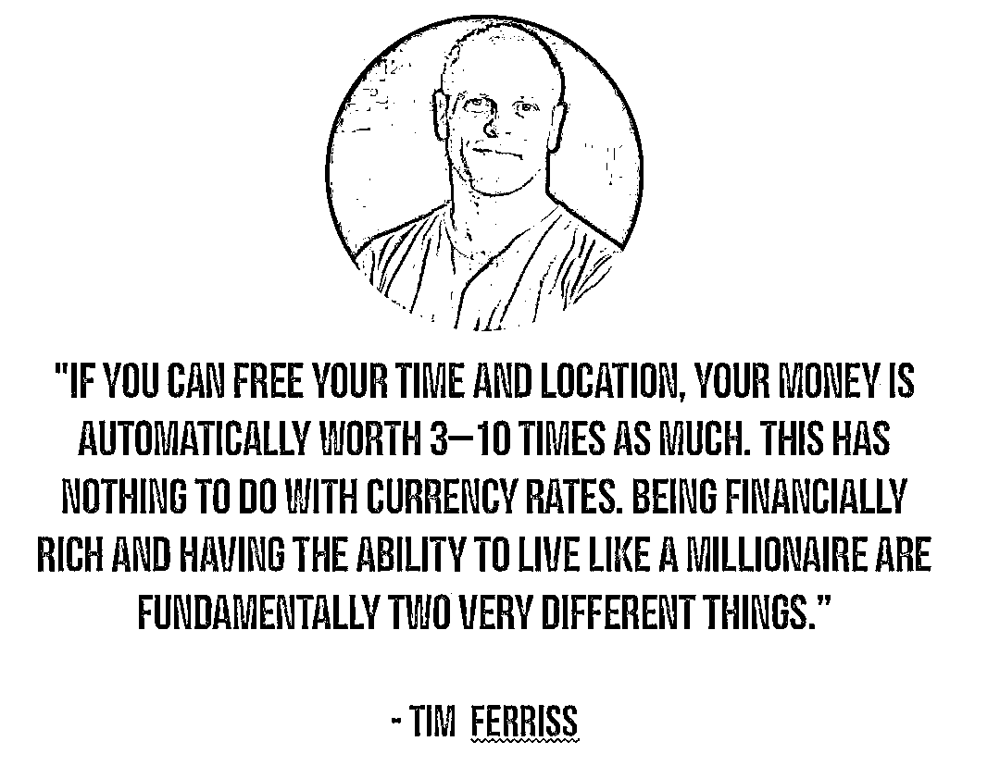
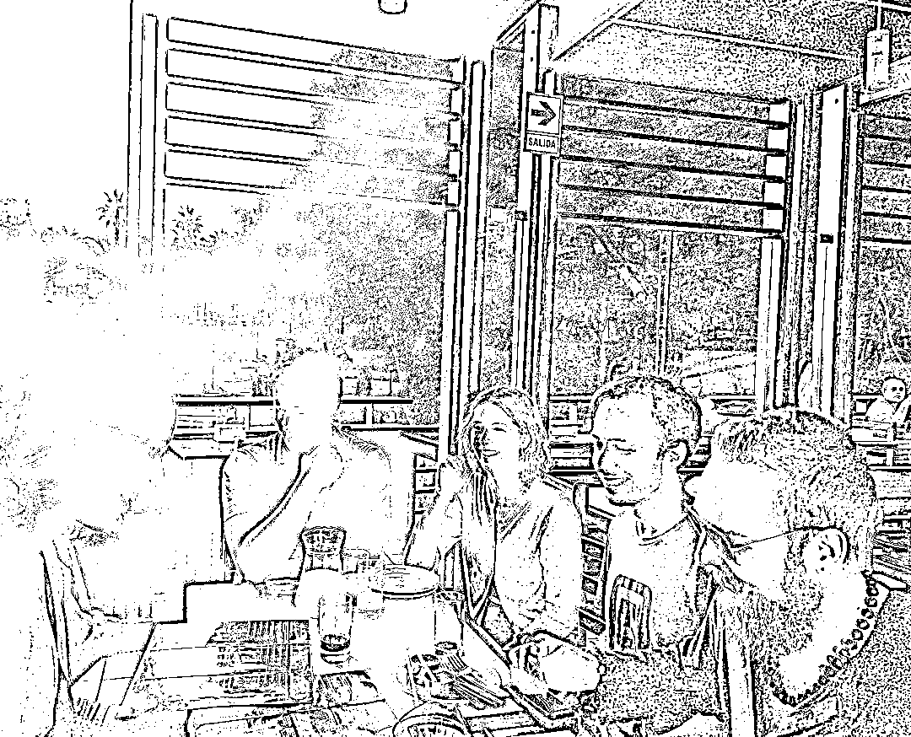
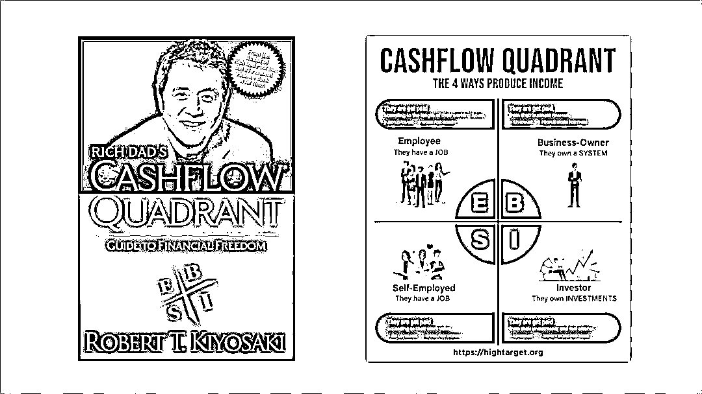
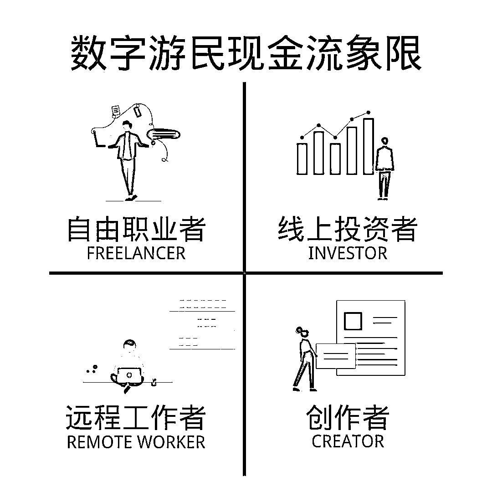
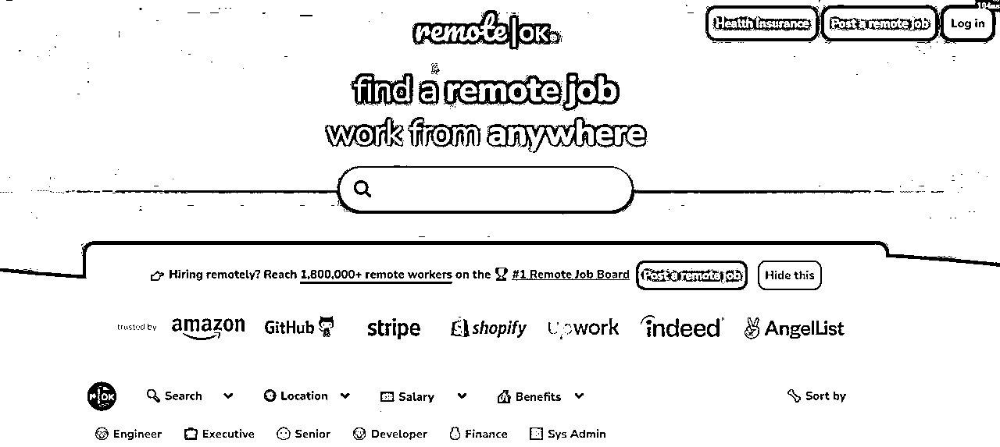
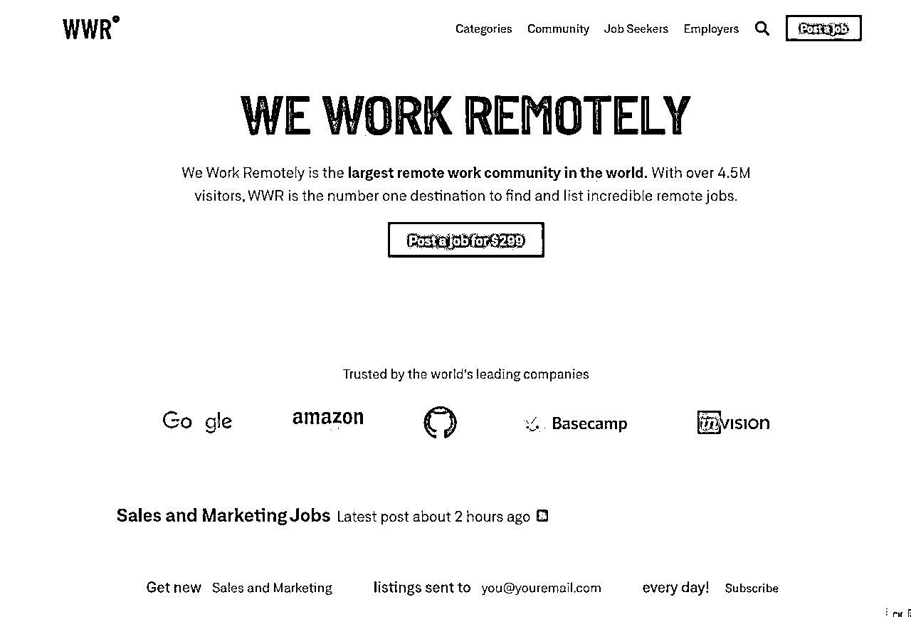
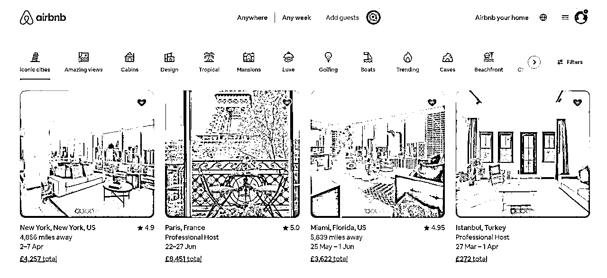

# 数字游民 202308

> 来源：[`remhu1p2pr.feishu.cn/docx/EoEfdChUxokYtJxO9ducUapMnbf`](https://remhu1p2pr.feishu.cn/docx/EoEfdChUxokYtJxO9ducUapMnbf)

# 8 月航海 | 数字游民 | 实战手册

手册出品方：生财有术团队

出品时间：2023 年 8 月 15 日

手册使用说明：本文旨在向你展示一个项目的更多可能性，帮助你更好地理解和实操。

建议：如果需要快速定位到精确内容，可以使用快捷键 Ctrl + F/command + F 的形式，搜索「关键字/词」，查找你想要的内容。

写在前面

💡Hi,

欢迎大家来到 8 月航海｜数字游民｜实战手册，相信在接下来的日子里，我们将在这里见面很多次。

1）数字游民是什么？

数字游民本质是一种生活方式，人们可以利用互联网创收，并在心仪城市旅居。 它的受众，特指那些依靠互联网创造收入，并借此打破工作与地点间的强关系，达成地理位置自由和时间自由，全球移动生活的人群。

数字游民的终极目标既不是单纯为了旅游， 也不是为了发财致富，而更大程度上代表了一种对于更高生活品质和自由度的追求。

2）什么样的人适合做数字游民？

数字游民的生活令人向往，但门槛并不低。

你需要有不错的学习意识、社交能力、生活能力，在旅居各个城市时，需要一定的环境适应能力，并且能够脱离空间与时间的限制，构建稳定的收入渠道，自行找到适合的赚钱方式。

因此，想要维持长期稳定的数字游民生活，需要提高自己对个体生意的了解及对投资的认知，这种模式一旦建立，那么作为游民的你，可以以一种相对松弛的状态去尽情探索世界的某处。

否则，因为生计问题，你无论身处何地都难以做到真正享受当下，探索和体验当地的资源。

⚠️当然，本次航海不会教大家如何赚钱，因为生财中的每个项目都是可尝试路径。我们会为大家展示真实的数字游民生活，从而了解：谁更适合成为数字游民？怎样过好数字游民生活？

3）怎样正确使用这个手册？

如果你从未了解过数字游民或只是听说过，希望你从【一、你适合成为数字游民吗？】开始，了解什么是数字游民？它有哪些门槛？由此判断自己是否真的适合成为数字游民？

如果经过了解，你发现自己确实适合成为数字游民，那么以下章节能够帮助你解决很多问题：

✅【二、如何成为数字游民】：帮助你了解，成为数字游民需要具备什么？

✅【二、如何成为数字游民】：帮助你了解，成为数字游民需要具备什么？

✅【三、如何打造“主动+被动”收益体系？】：帮助你了解数字游民的职业概况，以及数字游民可以尝试的职业

✅【四、如何拥有更精彩的数字游民生活？】：帮助你了解，数字游民如何更好地生活

✅【五、用更健康的心态面对数字游民】：帮助你了解数字游民常见的心态困境，与解决办法

本期手册，我们邀请了诸多拥有不同年限数字游民经验的老师来撰写，会有比较多的观点输出。

数字游民本质上是一种生活方式，每个人都有属于自己的理解。如果大家对某些观点有困惑，欢迎到航海群内交流，或者也可以去豆瓣知乎等社交平台寻找答案。

除了上述内容外，还有个核心就是多提问，多交流，在这里没办法满足你的地方，多问问，我们会一起找到关于难题更多的解法。

希望大家可以在这次航行里收获成果外，结识一群战友。

以下内容由生财有术联合圈友制作而成，仅供航海船员以及生财有术星球圈友学习使用。

同时也欢迎圈友们在实践过程中持续反馈，和我们共同完善，可以联系提供修改建议～

# 一、你适合成为数字游民吗？

💡

章节概要

数字游民是许多人当下向往的一种生活状态，在高楼林立、职场压力倍增的今天，无数人将寻求自由与自我的目光投向了数字游民。

但是数字游民真的适合我们吗？

为避免大家盲目选择，本章节我们就来一起了解数字游民。希望大家能够清楚、客观认识数字游民，了解数字游民的真实状态、优势，以及需要承担的风险：

✅【1.1 什么是数字游民】

✅【1.2 数字游民的优势】

✅【1.3 数字游民要承担哪些风险】

了解这些后，你可能会更加了解，自己当前的状态是否适合成为数字游民。

## 1.1 什么是数字游民 @Jarod Zhang🔥

很多朋友对于数字游民的第一印象是：这是一种能边赚钱边旅游的职业。 然而，经过多年对数字游民生活方式的亲身实践，我数字游民的终极目标既不是单纯为了旅游， 也不是为了发财致富，它更大程度上代表了一种对于更高生活品质和自由度的追求。

数字游民的终极目标既不是单纯为了旅游， 也不是为了发财致富，它更大程度上代表了一种对于更高生活品质和自由度的追求。

生活方式设计教父 Tim Ferriss 在他的成名作《The 4-Hour Workweek》中写下过这么一段话：

如果你能解放你的时间和地理位置，那么你的物质财富将会自动增值 3 到 10 倍。这和货币汇率没有关系。单纯物质层面的富有并不意味着你就能活得像个百万富翁一样，本质上这是完全不同的两回事情。

这段文字非常完美地阐明了数字游民生活方式设计中，最为核心的两个组成元素： 地理位置自由和时间自由。

及其终极目标：Live a rich life

内容来源：《什么是数字游民生活方式？(后疫情时代升级版扫盲贴)》

### 1.1.1 第一要务：实现地理位置自由

毋庸置疑，数字游民生活方式设计的第一重要务是要实现地理位置自由，让自己的工作在任何有互联网的地方都可以完成。

毋庸置疑，数字游民生活方式设计的第一重要务是要实现地理位置自由，让自己的工作在任何有互联网的地方都可以完成。

我们观察到，在当代职场有个怪圈，很多人虽然并不喜欢在一线大城市过拥挤繁忙的生活，但是很无奈，一线大城市强者恒强的马太效应又聚集了最多的高薪工作岗位。

因此为了能够实现自身价值，获得一份体面的收入，他们唯一的选择就是留在一线大城市。

但是资源总归是有限的，人口的大量涌入让一线城市的生活成本水涨船高，很多人因此进入了收入越高，开销越大的恶性循环怪圈，最后不但没有攒下钱，还背上了要用余生偿还的贷款，成了妥妥的负翁。

当数字游民达成了地理位置自由后，「地理套利」就变成了一个非常自然的优质选项。

地理套利，即在全球范围内选择低成本的地理位置，来降低日常开销。比如通过选择居住成本低、环境好、生活舒适的四线城市暂时居住，并通过互联网获取相对高薪的工作机会，完成地理套利。

地理套利的核心理念在于：单纯地追求绝对高收入是没有意义的，如何借助地理位置自由，让自己赚到的钱更值钱，花同样的钱得到更高水准的生活品质，才是最聪明的活法。

内容来源：《什么是数字游民生活方式？(后疫情时代升级版扫盲贴)》

### 1.1.2 第二要务：达到时间自由

数字游民生活方式设计的第二要务是要达到时间自由，提高被动收入比例，停止用时间来换钱，让自己变成一个有「闲」的人。

几年前，中文互联网上曾经就一个终极「哲学」问题进行了热议：月入五万的西二旗人为什么活得像月薪五千？

其实这个问题的答案非常简单，很多传统意义上实现所谓财富自由的高收入人群，并没有实现时间自由。

换句话说，如果时间也是一种衡量财富的标准的话，那这些人其实并没有我想象中那么富有。

为什么 996 这么遭人厌恶？因为它背后的隐含的逻辑是一个人需要用自己生命中最宝贵的，精力最旺盛的三十到四十年来换取足够的积蓄，让自己退休后可以去做自己年轻时候想做但是没有时间去做的事情。

我们不难发现，这个逻辑其实是有问题的，且不说一个人工作 40 年是否能保证攒足够的钱来做这些事情（事实表明，绝大多数人的退休金不足以满足这个条件），如何能够保证自己退休后的身体和精神状态其实才是最大的问题。20 岁时候想做的滑雪，冲浪，潜水，蹦极到 60 岁还有能量和胆量去尝试么？

著名科技评论家 Kevin Kelly 在接受播客节目 The Tim Ferriss Show 的采访时候曾经说过：

“Many, many people are working very hard, trying to save their money to retire so they can travel. Well, I decided to flip it around and travel when I was really young, when I had zero money. And I had experiences that, basically, even a billion dollars couldn’t have bought.” 译：「许多人一生勤恳的工作，赚钱，存钱，期待退休之后能有足够的钱去旅行。我决定把这个过程反过来，在自己年轻还没有钱的时候去穷游，这些在穷游过程中获得的人生体验可能以后十亿美元也买不来。」

基于以上， 我们来尝试给「数字游民」下一个定义：

数字游民是一种被数字信息技术赋能的全新生活方式，它的受众，特指那些完全依靠互联网创造收入，并借此打破工作与工作地点间的强关系，达成地理位置自由和时间自由，并尽享地理套利红利，全球移动生活的人群。

成为一名数字游民，意味着

你将彻底与浪费生命的通勤告别，意味着你可以实现自己想走就走的终极旅行梦想，用更慢地脚步丈量整个地球；

你可以轻松实现「地理套利」，让自己赚到的钱更值钱，逃离拥挤昂贵的一线城市，去那些风景优美，气候宜人，性价比更高的城市居住；

你可以有更多时间陪伴家人和朋友，在当打之年做自己真正感兴趣的事情。

内容来源：《什么是数字游民生活方式？（后疫情时代升级版扫盲贴）》

### 1.1.3 数字游民的常见误区 @饭先生

很多人容易把「数字游民」跟常见的几个概念混淆，比如远程办公、自由职业。

其实数字游民是一种生活方式，而不是一种工作形态，所以它在本质上就与「远程办公」「自由职业」不同。那么具体区别在哪里呢？

远程办公：

远程工作是一直存在的一种工作方式，在一些新兴行业和科技公司中应用较多，口罩时期之后成为了很多公司使用的工作模式，在很多行业中更是成为了一种普遍的形态。

远程办公保障了工作者的稳定持续收入，但本质上仍然是用工作量/工作时间来谋生。但使得工作者摆脱了地理位置的限制。

因此，希望借助远程办公开启数字游民之旅的伙伴，最好选择有丰富远程协作经验的行业和公司，其中大家普遍有共识，同时有较好的协作机制，避免远程办公成为 24 小时待命的工作形态。

自由职业：

很多人将自由职业和数字游民混为一谈，其实两者之间有交集但并不完全雷同。

自由职业指个体作为最小商业经营单位，为客户服务进而获得商业收益。有的自由职业者的工作内容依赖于地理位置或者某些具体客户资源，无法实现数字游民的生活形态。

但也有相当一部分自由职业者由此开启了数字游民之旅。

内容来源：《数字游民的定义》

## 1.2 数字游民的优势 @饭先生

了解完什么是数字游民，我们就能很直观发现，数字游民主要有以下优势。

地理套利，降低生活成本

数字游民可以在全球范围内，选择居住成本低、环境好、生活舒适的城市或地区。在降低日常开销的同时，通过互联网获取相对高薪的工作机会，或通过互联网完成自己的事业。

时间与空间自由度更高

数字游民通常通过互联网上的远程工作或自主创业来获得收入。他们可以在任何地方工作，只要有电脑和网络，就可以完成自己的任务和工作。

只要安排得当，他们可以在家里办公、在咖啡店工作、在海滩度假、在山林中徒步等等。

个人有了更多的闲暇时间，可以去做自己喜欢的事情，把花费在不愿意做的事情上的时间尽量压缩至零。

如果我们在每天的时间安排中过度紧张和排满每一分钟，那么长期以往，很容易就会产生焦虑、抑郁等负面情绪，甚至还可能导致身体健康的问题。而数字游民生活，可以让我们拥有更多的自由时间，从而让我们更好地调整身心状态，保持健康的生活状态。

能够体验多元文化

在不同地区居住和工作，数字游民可以体验不同的文化、语言和风俗习惯，拓宽自己的视野。

在不同城市旅居生活，也有利于数字游民快速适应变化，提高自己的灵活性、适应性和问题解决的能力。

## 1.3 数字游民要承担哪些风险

虽然数字游民生活方式有许多优势，但也存在一些潜在的风险和挑战。以下是一些可能需要考虑的风险——

不稳定的收入：数字游民的收入可能会有波动，特别是在客户或项目变动时。缺乏稳定的工作保障可能会导致经济不稳定。

社交孤立：数字游民通常在家中或独自工作，可能会感到社交孤立，缺乏与同事、同行和朋友的面对面交流。这可能影响心理健康和人际关系。

文化适应困难：在不同城市或国家工作和生活，可能会遇到语言、文化、法律等方面的挑战，需要时间来适应新的环境。

缺乏社会保障：与传统工作不同，数字游民可能缺乏社会保障、医疗保险等福利。他们需要自己承担健康、养老等方面的风险。

缺乏专业发展机会：与传统工作相比，数字游民可能缺乏正规的培训和专业发展机会，可能影响职业的长期发展。

时间管理挑战：自由的工作时间可能会导致时间管理上的挑战，容易陷入工作过度或放松的极端。难以平衡工作和生活。

技术和网络问题：数字游民依赖稳定的网络连接和技术设备进行工作，网络中断或设备故障可能会影响工作效率和客户关系。

人身安全风险：境外数字游民可能需要注意人身安全问题，部分地区、国家的不稳定局势与文化差异，可能会带来一些风险。

对于数字游民来说，重要的是认识到这些潜在风险，并采取适当的措施来减轻这些风险的影响。这可能包括建立健康的工作习惯、购买适当的保险、保持良好的社交生活，以及不断提升自己的技能和专业知识。

如果你了解清楚了「数字游民」的优缺点，仍然对这种生活充满兴趣，那么我们继续——

# 二、如何成为数字游民？

💡

章节概要

如果你已经了解数字游民是什么，也明白数字游民的门槛，在理智思考后，发现自己确实适合且有能力成为一名数字游民，那么本章节会告诉你

我们需要准备多少资金？

需要具备哪些能力？

如何成为数字游民？

⚠️需要明确的一点是：

下文是我们给大家的建议，但每个人的生活习惯和方式不同，有时候不一定要全部准备就绪再上路。

数字游民的状态多种多样，很多数字游民也在前进的过程中不断迭代成长。如果下文的部分能力要求与收入要求，你发现自己暂时无法做到，但是仍然愿意尝试数字游民，或仍然觉得自己能够负担得起数字游民的生活，并有一颗成长的心——

那么现在上路，也未尝不可。

## 2.1 成为数字游民需要多少积蓄？@Jarod Zhang

需要准备一笔足够你三年没有工作收入也不会饿死的安全资金。

拥有这样一笔钱，会给你的生活方式设计之旅提供足够的物质支撑和心理支撑，我注意到很多想要成为数字游民的小伙伴之所以半途而废，都是因为经济上带来的巨大压力。

这笔钱因个人的消费习惯，可多可少，我个人认为 20-30 万人民币应该可以满足绝大多数人的需求。

如果你选择的目标城市，生活消费水平相对较低，这笔钱也可以适当减少，但不建议少于 10 万。

存好自由资金后，我们就可以正式启动生活方式设计之旅了。

内容来源：《有可能是中文互联网第一条全面深度介绍数字游民的视频（内附文字稿）》

## 2.2 核心能力：打造“主动+被动”收益体系 @范米索🔥

这一点是重点。

如果一个人不知道如何依靠自己在互联网获得收益，那么他/她很可能会因“力不足”而放弃当数字游民。

如果你想成为数字游民，却对商业天然排斥、对金钱和财富的态度难以启齿，那么我认为你早晚会在这条路上失败，因为你根本不具体游民该有的特质。

毕竟没有人敢在自己没能搭建成熟的一套商业赚钱体系时，冒然放弃本职工作和稳定收入，冲出去看世界。

不过，很多人同样高估了看世界的成本，而低估了自己的能力。

毕竟数字游民不是财大气粗的旅行达人们，你要尽可能去计算和对比不同目的地的租金成本和消费水平，当你懂得什么是“地理套利”时，那么你就能节约出大量的金钱，同时也能让你享受当游民的快乐。

试想，如果你能依靠互联网完成远程工作，或者你在网络上能够搭建一个属于自己的生意，那么你当然可以大胆地去世界任何你想去的地方，因为你只需要网络和电脑即可获得收入，而此刻的你，是一名远程工作者或是一名网络创业家。

不过，这里同样存在一个问题。

如果你的工作需要挤占你大量的宝贵时间，即便你在马尔代夫，也不代表你在开启一种数字游民们的生活模式。因为你还是没能从工作中解脱出来，甚至你都会因为工作而无法更好的享受和探索当地的民俗文化、风土人情等等。

数字游民们的生活可不是只有“工作”和“职业”，他们非常懂得如何去享受和充分利用好当地的资源。我遇到的游民们，有企业主、投资人、教练、设计师、语言老师、自媒体博主，也有躬身于 Web3 的朋友们…无一例外，他们都有自己的远程收入来源，有自己的商业赚钱模型，有很强大的投资能力，他们除了手里运作的收益以外，还擅长不同市场的投资分析。

比如我遇到过房地产投资和二级市场投资的游民们，而跟他们在交流的过程中，我发现他们很懂得用“资本”的逻辑赚钱。

所以，这里我们要引入两个概念：主动收入、被动收入。

主动收入：

指你通过积极参与某种工作或活动，为此付出时间和努力，然后从中获得报酬的方式。换句话说，你需要自己付出实际的努力才能赚到钱。举个例子，如果你在公司工作，每个月得到工资，这就是主动收入。

被动收入：指你在一段时间内投入一些努力或资金，然后在未来的一段时间内不需要继续付出大量努力，仍然能够持续地赚钱。被动收入就像是把一些工作或投资“放在后台运行”，而你可以专注于其他事情。一个例子是，你写了一本电子书并在网上销售，每当有人购买，你就会获得收入，即使你没有每次都花时间亲自卖书。

总的来说，主动收入需要你不断付出努力，而被动收入则是一种相对轻松的方式，在一段时间内的投入可以带来未来持续的回报。许多数字游民会努力创造被动收入流，以便更好地平衡工作和生活，从而在享受自由的同时也能保持稳定的经济来源。

因此，想要当数字游民，需要去提高自己对个体生意的了解及对投资的认知，尽可能建立“”主动+被动“收入体系，”这种模式一旦建立，那么作为游民的你，可以以一种相对松弛的状态去尽情探索世界的某处。

否则，你会因生计问题，无论身处何地都难以做到真正享受当下，探索和体验当地的资源。

这也是我认为当游民的一个极大的难点，你需要拥有的学习能力可不只是语言，还要理解更高阶层的赚钱方法，商业、投资缺一不可。

内容来源：《成为数字游民的代价》

## 2.3 还要具备哪些“软能力”？@范米索

数字游民的生活令人向往，但门槛并不低。

解决了收入问题之后，你还需要有不错的学习意识、社交能力、生活能力，以及在旅居各个城市时，强大的环境适应能力。

上述这些能力，具体体现是怎么样的呢？

### 2.3.1 具备学习意识

我接触过的游民，个个拿出来可以都是超级个体，一个人能处理几个人才能搞定的问题。这种能力并非与生俱来，他们的学习主动性和积极性远超过普通人。

主动性和积极性远超过普通人。

记得我在拉美时还分享过我认识的一个游民小哥，他是 crypto 相关知识培训的教练，我们俩在学习西语的课堂上相识，我真的快被他“卷”死。

各位要清楚，想当真正意义上的数字游民，语言能力一定是最基础且最重要的能力，语言堪称是数字游民的武器，因为真正的数字游民，他们的战场是全世界。

我自认我是一个学习意愿极强的人，毕竟我也暴力破除过日语，但是遇到他，我甘拜下风。

他无论是在课堂上，还是在外面社交吃饭，都会毫不犹豫地用西语去进行对话。我还在磕磕巴巴的时候，他已经能流利对话，而我有时候状态好，他会夸奖我的语言进步很快，夸完后自己回去会再猛学几个小时要追赶我。

他当时在秘鲁停留时间就一两个月，而他的上一站是巴西、墨西哥，每到一个地方，他都会寻找当地语言学校一周抽出固定时间去学习当地的语言，如果不能线下，他会在线上要求老师继续一对一教授他。

在他离开利马的那天，他对我说：“Misso，你可不能放弃学习西语，我们要一起努力加油，未来希望还能在世界的某个地方和你相遇。”

他的自驱力和学习的意愿远高于我，而他这样人在游民的世界里不是少数，是大多数。

### 2.3.2 具备情报搜索能力

如果你想要成为数字游民，那么你必须拥有强大的信息搜寻、分析和整合能力。

我不清楚各位在去某地旅游时，是否会做攻略？如果你善于做旅游攻略，且能把攻略用你自己的策略安排地井井有条，显然你在这方面的能力只需稍加培训即可。

数字游民们在进入一个陌生的环境，他们首要做的一定是对当地的信息采集，比如

当地气候、温度、语言、宗教、文化、饮食习惯、消费水平、生活成本、安全性、安全范围、货币、汇率、出入境政策、签证停留时长、结识当地人获取情报的活动场、当地网络速度和环境、当地医院及医疗水平、当地对外国人的态度、当地短租/长租平台及价格……

如果旅居范围仅限定在国内，那么至少要了解当地气候、温度、饮食习惯、消费水平、安全性、交通方式等。

考虑完当地因素，你还需要考虑你自己出行必备的清单及相关准备工作，比如

不同国家的电话卡、国际信用卡、保险、海外社交联系方式（Line/what's up）、社交账号（ins/twitter 等）、地图、翻译软件、境外相关保险意外险、相关药品准备等……

否则，如果你带着走马观花旅游的心去当数字游民，那么不过是游了个寂寞，和旅行团在某城市打卡没有本质的区别。因此，需要将游民和旅客稍作区分。

当你希望成为游民的时候，意味着你需要保持相对开放的头脑，你需要深入到你锁定的目的地，尽一切可能去学习和融入当地的文化、习俗及本土社交圈。

而社交圈同样意味着大量的情报、信息，它们能够因为你所接触到的形形色色的陌生人，再带给你视野、思想、认知、商机等多个维度的启示。

因此，游民绝对不可能是闭门造车、走马观花的一群人。

无论你多么内向，只要你想当游民，那么一定需要点亮自己的社交技能，甚至还要懂得如何利用互联网在当地组局，找到当地的游民群体，与他们交流和共享当地的情报。

### 2.3.4 心细胆大享受孤独

道路交织成生命的织锦，道路交织成迷宫，没有尽头，人无法到达终点，人只能停下来，或者被停下来。

数字游民们看似很酷，他们有着狂野的自由精神，是头脑和精神的流浪汉，可他们一样是一群被放逐且随时都要面对孤独议题的灵魂。

环境的变动催生了大量的不确定性，同样催生了许多危险和机遇，要成为数字游民就不得不去面对这层心理的议题。

没有社会意义上的身份认同，没有专属的社会圈层，甚至是游走在社会的边缘群体，不妨问问自己，从心理层面上而言，你是否真的能接受这样的身份认同？这就是你想要的「酷」的代价。

我在走上这条“边缘群体”之路后，我真的对于曾经趋之若鹜渴望的名与利看淡了许多，对社会的头衔也看淡了，你完全可以说“我是得不到才说自己看淡罢了”，可在我心里，我认为追求自己要的工作和人生，其意义远高于社会给我的一层身份认同，因为当我拥有后者时，我同样需要承受和背负相应的枷锁与责任。

相反，这层身份认同到底是什么？会是我想要的吗？其实我都想不到，反而当下的状态给了我一种安定感。

我已经接受了我就是一个漂泊游荡且没有专属社交圈层的灵魂，我不感到羞赧，相反还无比自洽，甚至愿意大方承认，这就是我。

孤独，是常态。

可是这种“孤独”却带给了我无尽对人生的思考和探索的可能，是一种健康稳定的孤独。我需要它，我享受它，甚至没有孤独的存在，我的人生就不会走到现在。

可同样，我也拥有高质量的陪伴，无论我在哪里，总能遇到一群志同道合的人，和他们在一起把酒言欢，听着新朋友们分享自己的经历、思考，而结束陪伴，我必须要一个人呆着，消化他们的信息，记录并思考对我有启发的内容。

内容来源：《成为数字游民的代价》

## 2.4 逐步成为数字游民 @Jarod Zhang

下面我们结合 @Jarod Zhang 老师 的经验，以及老师对其它数字游民的观察和学习，给出一个数字游民生活方式设计基本路线。

第 0 步，如前文所讲，准备一笔「三年没有工作收入也不会饿死」的安全资金

在此基础上，希望你对数字游民有清醒的认知，知道「数字游民」的真实生活，仍对此充满向往，愿意勇敢尝试，并且具备一定「数字游民」所需的能力。

第一步，打破工作和工作地点间的强绑定关系，让自己的工作在任何地点都可以完成。但凡不能的，要么不做，要么外包给别人去做。

如果你为自己选择的谋生工作可以在家里完成，那么它必定也可以在世界的其它地方完成。

第二步，打破工作时间和收入之间的线性关系。

逐渐停止用时间来换钱，主动去创造和购买可以产生复利和被动收入的的数字资产和金融资产，让工作时间和收入的关系从线性的直线变成指数增长的曲线。

性的直线变成指数增长的曲线。

正如著名的硅谷投资人 Naval Ravikant 所说：你永远无法通过租借你的时间来致富。

随着互联网产业的飞速发展，很多人意识到自己写的文字，代码，创作的音乐和画作变成了可以增值和创造被动收入的数字资产。

我们需要做的就是尽可能早、尽可能多地拥有优质的数字资产和金融资产，剩下的工作交给时间就好了。

第三步，利用第一步获得的地理位置自由进行地理套利，去性价比更高/自己更喜欢的地方生活。

目前世界上公认的几个数字游民热点目的地有：印尼巴厘岛，泰国清迈，葡萄牙里斯本，哥伦比亚麦德林，墨西哥卡门海滩，西班牙加那利群岛，保加利亚班斯科等。

这些地方有这么几个共同点，优秀的基建设施，丰富的旅游资源和成熟的旅游业生态，低廉合理的物价，活跃的数字游民社群。

如果你之前还从来没有体验过数字游民生活方式，那么不妨试试从这几个地方开始。

如果你选择从国内城市开始，那么可以选择：云南大理、海南文昌、浙江安吉。

当然，如果你喜欢特立独行，那么完全可以不拘一格，选择自己最喜欢的地方，这个地方可以就是你家的沙发。地理位置自由的核心不在于你可以去很多地方，而是在于你想呆在什么地方就能呆在那里的自由选择权。

第四步，利用第二步获得的时间自由去做自己真正想做的事情。

「自发的，有计划的生产活动是人类的天性」，当你不再需要出售自己的时间来满足生活所需的时候，你就满足了「自发工作」的先决条件。

人只要活着，就总得找点事情做，区别就在于，这件事是你为生活所迫而做的，还是自愿自发地去做的，只有后者才能满足你人生的意义。

内容来源：《有可能是中文互联网第一条全面深度介绍数字游民的视频（内附文字稿）》

# 三、如何打造“主动+被动”收益体系？

💡

章节概要

从本章节开始，我们会分职业篇、生活篇、心态篇，来为大家进一步描绘：如何更好地适应数字游民生活。

本章节即为职业篇，目的很简单：

如果要维持数字游民生活，我们必须有稳定的经济收入，所以本章节主要想告诉大家，我们有哪些工作可以做？这些工作是什么样的？更适合谁？

⚠️当然，这里有一个需要注意的点：我们并不会在这里教你如何赚钱。⚠️

赚钱这项技能，大家应该从更多其他项目中习得。比如生财有术的每一期航海，都会开放许多实战型项目，大家可以从中选择适合自己的项目。再或者，你可以结合自己的特长与实际生活，找到适合自己的收入来源。

那么本章节会告诉大家什么呢？

✅数字游民的职业一般分为哪几类：【3.1 数字游民收入四象限】

✅数字游民可以尝试的入门类职业，有哪些：【3.2 入门类职业：主动收入型】

✅数字游民可以尝试的进阶类职业，有哪些：【3.3 进阶类：主动+被动收入型】

✅数字游民可以尝试的高阶类职业，有哪些：【3.4 高阶类职业】

如果想要逐渐维持长期稳定的数字游民生活，你需要逐渐理解更高阶的赚钱方法，懂得用“资本”的逻辑赚钱，打造被动收入。如果长期停留在「入门类」职业，比起享受生活，可能焦虑的时候会更多。

很多年前，有一本叫做《富爸爸·穷爸爸》的书畅销全球，帮助很多人开启了所谓的“财商”。作者罗伯特清崎之后又趁热打铁，写了好几本续作，其中一本给我留下了极为深刻的印象，它叫做《富爸爸财务自由之路：神奇的现金流象限》。

很多年前，有一本叫做《富爸爸·穷爸爸》的书畅销全球，帮助很多人开启了所谓的“财商”。作者罗伯特清崎之后又趁热打铁，写了好几本续作，其中一本给我留下了极为深刻的印象，它叫做《富爸爸财务自由之路：神奇的现金流象限》。

在这本书中，作者将一个人的收入用横竖两条坐标轴划分为了四个不同的象限，分别是

左上 Employee（职员）

左下 Self-Employed（个体业主）

右上 Business-Owner（公司老板）

和右下 Investor（投资人）

职员，打一天的工赚一天的工钱，什么时候被炒了或者自己辞职不干了，收入来源也就断掉了，典型的用时间换钱。

个体业主，例如菜市场菜贩子，小型理发店的理发师，出租车司机等，相比职员优势在于没有人能炒他们的鱿鱼，但是依然是用时间来换钱，只要生意一天不开张，收入也就会断掉一天。

公司老板，工作主要由手下的员工来完成，因此他们是不需要拿自己的时间来换钱的，只要公司运转良好，老板完全可以远程操控，花更多的时间打高尔夫球，度假。

在这个图中，所有四个象限的收入均来自于线上。

不同的是，左侧的两个象限，自由职业者和远程工作者，代表了获得地理位置自由的两种现金流。它们也属于我们前面说到的主动收入：你需要自己付出实际的努力才能赚到钱，比如不断投入时间、精力等。

而右侧的两个象限，互联网投资者和创作者，解绑了收入和时间之间的线性绑定关系，可以实现地理位置自由和时间自由兼顾。它们更接近我们前面说到的被动收入：指你在一段时间内投入一些努力或资金，然后在未来的一段时间内不需要继续付出大量努力，仍然能够持续地赚钱。

大量努力，仍然能够持续地赚钱。

下面我们就来简单讨论下这几个现金流的实现逻辑。

### 3.1.1 自由职业者

很多人习惯于把数字游民的职业选择范围等同于自由职业，其实这样的理解并不准确。自由职业，只是由传统工作向线上工作转型的最低门槛切入点之一。

理论上，只要你拥有一技之长或者掌握一定量的信息不对等，能够在网络上为其他人提供有偿的服务，那么你就已经具备了成为网络自由职业者的初始条件。

举例来说，文案，设计，翻译，编程这些技能，都很适合做线上自由职业。相信很多朋友在日常生活中都已经在淘宝或者咸鱼上或多或少地购买过一些这样完全无需发货的服务。

而签证，法务，保险，理财等业务，只要你掌握一定的线下资源或者信息不对等，也非常容易转化为线上付费服务。

很多朋友对于自由职业的一个最大的误区是：自由职业者收入不稳定。

但是相信经历过行业波动和经济危机的朋友一定会理解，现代社会除了极少数体制内的工作之外，几乎没有任何所谓「稳定」的职业。

的职业。

在我看来，虽然不稳定的收入状态可能是大部分自由职业者都必经的一个阶段，但只要一步一个脚印地打造个人作品集，在垂直领域有所建树，建立起良好的口碑和长期的客户群，其稳定性绝不会比传统职场更差。

想要在自由职业这条路上获得成功，一定不要在一开始就把赚钱放在第一位。相反地，你甚至可以在初期通过为别人提供超低价格甚至免费的服务，获取最初的用户基础和创建作品集。

凯文凯利说过，在网络主导的新经济秩秩序下，最重要的问题不是你能卖出去什么东西，而是你能免费赠送出去什么东西。

为了找到答案，这个问题又可以分解成另外两个问题：

① 你能让什么东西的生产边际成本无限接近于 0？

② 你能把什么有价值的东西送给别人而不求任何物质回报？

审慎思考后，你大概率会发现这两个问题的答案是趋同的。找到这个东西，在合适的时间，借助网络的传播力把它免费投放出去，并借此构建一个自我增强的良性循环，此为玩转网络经济的核心诀窍。

你也许会问，不把赚钱放在第一位，那自由职业者吃什么喝什么呢？

有两个解决方案：第一，是在初期把自由职业当做一个主业之余的副业来做，当然，这样做一定会比较累；

第一，是在初期把自由职业当做一个主业之余的副业来做，当然，这样做一定会比较累；

第二，就是我们在前文【2.1 成为数字游民需要多少积蓄？】中提过的，在开始自由职业之前，存一笔能让你在完全没有收入的情况下依然能生活两到三年的安全基金，它能够帮你从容度过自由职业最开始的收入不稳定阶段。

当你的履历逐渐丰富，并获得一定数量的用户口碑后，话语权自然会增强，同时你的薪酬水平和收入稳定性也会得到很大的改善。

### 3.1.2 远程工作者

毫无疑问，我们正处在一个从工厂，办公室向远程云办公转变的历史节点，有三股力量正在快速推动工作远程化。

它们分别是：

① 工厂工作的自动化。流水线和机器人作业解放了大部分在工厂工作的蓝领，越来越多的劳动力开始向在办公室工作的白领职位倾斜，在不远的将来，甚至很多办公室工作的白领工作也将不可避免地被人工智能所取代；

② 企业和市场的全球化。全球经济的发展和融合，让人类产生了大量的跨越地理疆域的协作刚需，国际贸易、开源项目、大型跨国公司以及 Web3 领域的 DAO 等，都是这一趋势的直接体现；

③ 电子设备便携化和工作流程的全面无纸化。我们现在的一台普通笔记本电脑，就可以取代上世纪末一整个办公室的所有设备的工作职能。而电子邮件、即时通讯、协作文档，以及各种线上交易平台、加密货币和智能合约的出现，则让绝大多数的白领工作都可以在一台联网的电脑上完成。

领工作都可以在一台联网的电脑上完成。

最后，还有一个催化剂，那就是始于 2019 年末的新冠疫情。毫不夸张地说，新冠病毒在肆虐全球，造成灾难性的破坏的同时，也在迫使人们更快地向新的工作模式转变。

在我看来，远程工作是所有实现数字游民生活方式途径中最稳妥的一条。因为它既没有自由职业初期几乎无法避免的单打独斗，朝不保夕的不安全感，也没有创业所产生的各种不确定性与风险，在拥有稳定收入的同时又能享受地域不受限的自由。

如果非要找一个缺点，那就是远程工作尚未实现收入的被动化，本质上依然是用时间来换钱。但是，比起在一线城市通勤加班 996，只要安排得当，这样的工作方式仍然可以带来生活品质飞跃般的提升。

如果你想通过远程工作打造数字游民生活方式，那么你可以有两种选择：

说服你现在的老板允许你远程工作，或找一份新的允许远程办公的工作。

对于第 1 种选择，首先你需要判断自己的工作是否具备远程工作的必要条件，这个其实很容易，你可以问自己三个问题：

① 自己去办公室，工作是不是绝大部分时间都是在电脑前完成；

② 自己会不会时不时地把公司办公室里做不完的工作，带回到家里做；

③ 在突发情况，例如疫情，或者极端天气状况发生的情况下，是否在家也可以把工作完成。

如果这三个问题的答案都是肯定的话，那么你的工作已经具备了远程工作的必要条件。

这时候你需要在工作系统框架允许的情况下，尽可能多地为自己创造远程工作的借口和契机，并在远程工作时超额高质量完成任务，向自己的老板证明，远程不但不会影响你的工作，还会让你更高效的完成工作。通过这样循序渐进的策略，慢慢地说服你的老板。

当然，如果老板还是顽固不化，那你就该严肃考虑第 2 个选择了。

我们看到，为了能够把人才招聘范围拓展到全国甚至全球，越来越多的公司开始招聘远程职位。一些远程工作搜索引擎和聚集平台也应运而生，比较有名的有国外的 RemoteOK， Remotive，以及国内的电鸭、V2EX 等社区。

如果你是一位公司老板，我想对你说：

时代正在改变，互联网和云计算、VR、AR 等技术的普及，正在让地理位置成为工作中最不重要的因素，员工并不是非要在自己眼皮底子下才会好好干活。及时拥抱远程分布式办公的先进管理模式，才能招到并留住最优秀的人才，才能在变革的潮流中立于不败之地。

### 3.1.3 创作者

「创作者经济」（Creator Economy）可能是近几年互联网上最火的一个词之一。

维基百科上说，「创作者经济」这个词指的是在软件和网络的辅助下允许创作者通过他们创造的数字内容赚取收入的一种新型经济模式。

而「Creator」（创作者）这个词则首先在 2011 年由全世界最大的视频平台 Youtube 提出，当时初衷的是为了用它取代「Youtube Star」（油管明星）这个听上去不太专业的称谓。

创作者是四个数字游民现金流象限中门槛最高的一个，也是我本人最为推崇的一个打造数字游民生活方式的赛道，因为它不但具有无上限的可能性， 而且通过创造价值带来的成就感也是其它赛道无法比拟的。

成为一名创作者，本质上也是一种形式的草根创业，互联网的出现极大地拉低了草根创业的资金门槛。

不夸张地说，只要你拥有一部能上网的智能手机，就已经具备了互联网草根创业的启动资本。如果你想更奢侈一点，买一个服务器加一个属于自己的网站域名也只需要人民币 200-500 元/年左右的成本，这要比传统意义上的开店做买卖，甚至摆地摊的资金门槛都低多了。

硅谷著名投资人 Naval Ravikant 在 2018 年底曾经发布了一条名为"How to get Rich（without being lucky）”的长推特。在这条长推特中他说道：

资本和劳动力是旧时代撬动财富的杠杆，而在互联网时代，撬动财富的杠杆变成了代码和内容。

人工智能技术让你可以不花一分钱就能拥有一支永远不会偷懒的机器人“团队“，它们分布在全球各地的数据中心里，随时待命。

命。

如果你不会写代码，你至少可以写书，写博客，录视频和播客节目。

我们看到，上个世纪，世界上最大最有影响力的公司还都是一些汽车公司和石油公司，到这个世纪，科技和信息产业变成了引领时代潮流的中坚力量。而移动互联网和人工智能技术的发展，让一个人单枪匹马，四两拨千斤式的创业模式成为可能。

我们看到越来越多的“Company of One”不断地涌现出来，而且它们中的绝大部分都是基于软件服务业，内容自媒体，或者电商。

历史上没有任何一个时代比现在更适合创业，而且互联网时代的创业，特别是基于代码和内容的创业形式，让创造被动收入成为可能，从而让数字游民们拥有了时间和地理位置两个维度的自由，也让财富自由变成了一个不那么虚无缥缈的概念。

### 3.1.4 线上投资者

对于数字游民而言，学习如何在网上赚钱固然很重要。但是假如你手头本身就有一笔来自之前工作的积蓄，或者来自互联网的收入已经完全能够承担自己日常开销，并且略有结余的时候，就是时候考虑如何把钱投资出去，让钱来帮自己赚钱了。

由于 ETF，REITs 这样的金融产品的存在，可以让所有人以非常低的门槛和费用成本投资全世界各地，几乎所有类型的资产。

当然，其背后隐藏的投资风险也是非常巨大的，我个人并不推荐任何人把自己所有的资产 all in 到加密货币这个尚未被验证的市场中。

对于绝大多数数字游民来说，使用定投或者资产配置的方式购买成熟市场的宽基指数，都不失为一种创造被动收入的稳妥途径。

鉴于投资是一门非常复杂的学问，而我本人也并非这方面的专家，这里我推荐三本有关投资的书，给想在这方面有所提升的朋友作为参考：

### 3.1.5 小结：如何找到更适合自己的职业

也就是说，一个人完全可以只专注一个象限深耕，做到极致，或者也可以狡兔三窟，同时拥有来自多个象限的现金流。

按照【2.1 成为数字游民需要多少积蓄？】中提过的，数字游民生活方式设计路线图，毫无疑问，右侧的两个跟时间脱钩的象限，即创作者和线上投资者，会给你带来更大的自由度。但这并不是说左侧的两个象限，自由职业者和远程工作者就没有追求的意义。

在你喜爱这份工作，且不会伤害到你身心健康的前提下，每一类职业同样可以成为极为优质的数字游民生活方式实现途径。

了解上文中数字游民的职业分类，是为了让大家对这一切有更全局化的认知，不至于片面将自己局限在某一个职业领域。

但如何找到适合自己的「某一个」具体职业呢？从下一个小节开始，我们会从主动收入和被动收入两个维度，为大家简单介绍一些具体的工作，并且将它们划分为入门类、进阶类、高阶类，帮助大家逐步建立起自己的“主动+被动”收入体系。

⚠️需要注意的是：

我们并不会在这里教你如何赚钱，赚钱这项技能，大家应该从更具体的项目中习得；下文的职业展示肯定不全面，我们无法概括所有职业，但希望你能从中找到思路。

下文的职业展示肯定不全面，我们无法概括所有职业，但希望你能从中找到思路。

内容来源：《如何在互联网上赚钱？- 详解数字游民现金流象限》

## 3.2 入门类职业：主动收入型 @元稹

入门类职业的特征：

普遍处于执行层面，需要积极主动寻找工作，维持收入来源；

占用个人时间比较多；

可以短期做，无法长期维系数字游民生活；

基本全部属于主动型收入

入门类职业适合哪些人群：适合刚毕业大学生，或者暂时没有独立职业技能的群体；

适合刚毕业大学生，或者暂时没有独立职业技能的群体；

适合时间较多，但是苦于暂时找不到变现途径的朋友。

从哪儿找到这类工作：

查看本手册【6.1 远程招聘工具】，内含 20+ 个工具网站，可以从中查看是否有适合自己的工作

身边亲朋好友等介绍

### 3.2.1 文案写作

文案写作工作的主要任务是撰写文字内容，以吸引读者、传递信息、推广产品或服务。

可能涉及以下方面：

创作广告标语、宣传口号和广告文案。

撰写网站页面内容，包括产品描述、服务介绍和关于我们页面。

制作社交媒体帖子、博客文章、新闻稿等内容。

创建销售信、电子邮件营销文案和宣传材料。

针对特定活动、促销活动等创作相关文案。

所需技能：

创意思维：能够产生独特创新的想法，以吸引读者。

写作能力：具备流畅的文字表达和良好的语法、拼写等基本写作技能。

市场洞察力：理解目标受众的需求、兴趣和偏好，以便创作有针对性的内容。

情感共鸣：能够通过文案建立情感联系，引发读者的情感共鸣。

传达能力：将复杂的概念和信息转化为简洁、易懂的内容。

发展前景：就业机会：文案写作不仅仅在广告领域有需求，还在网站内容、社交媒体、内容营销等各个领域都有机会。

就业机会：文案写作不仅仅在广告领域有需求，还在网站内容、社交媒体、内容营销等各个领域都有机会。

远程工作：许多文案写作工作可以远程进行，不需要固定工作时间安排。

流量运营：文案写作可以与图像、视频等媒体形式结合，提供更具创意的内容。

具体案例：

如何成为持续创作的机器，分享三个技巧

我的第一桶金 3 万美金，来自于在美国研究生期间做的兼职：英文写作

### 3.2.2 技能出售

在线出售专业技能是一种逐渐流行起来的工作模式，其工作内容会因你的专业领域和技能而异。比如，平面设计、网站开发、语言翻译、音视频制作、编程和开发、数据分析、数字营销等等。

发展前景：通过互联网平台你可以在全球范围内提供服务，实现灵活的工作安排和多样化的收入机会。同时也要不断学习保持竞争力，建立自己的品牌（这是技能出售能否成功的关键），与客户建立信任。

通过互联网平台你可以在全球范围内提供服务，实现灵活的工作安排和多样化的收入机会。同时也要不断学习保持竞争力，建立自己的品牌（这是技能出售能否成功的关键），与客户建立信任。

### 3.2.3 远程工作

远程工作适合那些不需要面对面沟通，可以线上完成的岗位。

比如下面这些岗位：

互联网工作者：程序员、产品经理、运营/营销（尤其是社媒运营与投放）

设计类：平面设计、UI 设计、视频剪辑、插画等

语言类：翻译、文案、线上老师等

在线营销类：投放、流量增长等

所需技能：语言能力：你的同事可能来自全球各地，语言交流能力就是必须项，如果涉及到英语环境，必须可以无障碍全英文沟通；

语言能力：你的同事可能来自全球各地，语言交流能力就是必须项，如果涉及到英语环境，必须可以无障碍全英文沟通；

自控能力：远程工作自由度虽然很高，但不代表你可以懒散度日。保持健康的作息，稳定的工作时长，合理的工作规划，是远程工作很重要的一环；

沟通交际能力：保证日常的定期沟通，有必要时及时联系；沟通时尽量保证高效，能打电话就不要打字，能一次把事情都表达清楚就不要反复对接；

专业技能：除了所必须的沟通技能外，专业技能也是必须的。但具体的专业要求，因岗位的不同略有差异。

## 3.3 进阶类：主动+被动收入型 @元稹

进阶类职业的特征：

有一定的主动权，可以自己把自己当老板

接需求做方案，而非单纯做简单执行工作在精力、技能、资源上的要求都更高，需要具备深厚的专业功底

在精力、技能、资源上的要求都更高，需要具备深厚的专业功底

需要独立、高效地解决复杂的任务和挑战

前期仍然属于主动型收入，后期积累起资源后，可以有一定被动型收入，比如网站博客的订阅费、搭建知识付费体系后卖课卖书等

进阶类职业适合哪些人群：

具有独立职业技能的群体，有更高的专业水准

有一定人脉、资源、经验上的积累

从哪儿找到这类工作：

查看本手册【6.1 远程招聘工具】，内含 20+ 个工具网站，可以从中查看是否有适合自己的工作

通过身边人脉介绍+转介绍等

### 3.3.1 独立开发者

独立开发者是指个人开发者或自由职业者，他们独自或小团队合作，致力于软件开发、应用程序开发或网站开发等领域。

以下是独立开发者的典型工作内容：

需求调研与项目规划：需要与客户或团队合作，确定项目的范围、目标和功能需求，并制定详细的开发计划

界面设计：如果涉及用户界面，开发者可能会设计和开发用户友好的界面，以提供良好的用户体验

编码和开发： 使用编程语言和工具，根据项目需求编写代码，开发软件、应用程序或网站功能

测试和调试：开发完成后需要进行测试和调试，确保程序的稳定性、功能完整性和安全性

变现路径：

订阅费：有些软件的高级功能需要订阅才能使用，所以设计好的付费模式，赚取订阅费是大多数独立开发者的变现模式；广告分成：将产品的流量通过接入广告联盟变现，是常见目前大多数产品的常见做法。目前英文市场大多按照千次浏览 2 美金计价，当然不同的产品、不同的主题的具体价格会有差异。

广告分成：将产品的流量通过接入广告联盟变现，是常见目前大多数产品的常见做法。目前英文市场大多按照千次浏览 2 美金计价，当然不同的产品、不同的主题的具体价格会有差异。

案例：

写给独立开发者：如何快速做出产品 MVP

独立开发者如何快速找到并实现属于自己的“躺赚”小工具 MVP

我是如何通过小程序，每年躺赚 X 万的？

# 8 月航海 | ChatGPT+海外工具 | 实战手册

### 3.3.2 设计师

考虑到不同的细分类别，设计师又分为平面设计师、产品设计师、UI 设计师、室内设计师、时尚设计师等等。所以不同设计师分类，所要求的的技能是不同的。

这里以平面设计师为例，平时的工作内容大致包含：

制作品牌标识、海报、传单、名片等平面设计物料

设计印刷品、宣传材料、包装等

创建图标、插图和插图等

变现模式：

项目委托： 接受客户的设计项目，如品牌标识、海报、宣传册等，通过每个项目的收费获得收入

作品销售： 在设计市场或平台上出售自己的设计作品，如图标、插图、海报模板等，获得授权费或销售分成

设计服务： 提供品牌识别设计服务，包括标识、名片、品牌指南等，通过全套品牌设计获得较高收入

订阅模式： 提供设计资源的订阅服务，客户每月支付订阅费，获取设计模板、图标、素材等

培训： 创建设计教程、视频课程，通过在线教育平台销售，分享设计技能并获得收入案例：

案例：

我是如何找到插画设计这个领域，并从中挣到了人生第一桶金

通过猫狗绘画服务，每个月收入 $5000+

### 3.3.3 摄影师

摄影师的工作内容涵盖了各种摄影领域，从拍摄到后期处理，具体内容取决于摄影师的专业领域和客户需求。

可能涉及的主要工作内容：

拍摄的前期准备： 确定拍摄主题、场景和样式、拍摄设备

拍摄中：在人物摄影中指导被摄者的表情、姿势和动作等等具体内容

后期处理：根据风格需求，对照片进行后期处理，调整颜色、对比度、曝光等变现模式：

变现模式：

项目收费： 接受客户的拍摄项目，根据拍摄类型、规模和需求收取一次性的拍摄费用。

授权费用： 出售照片的使用权，为客户提供授权，如用于广告、出版、网站等，获得授权费。

照片销售： 将自己的摄影作品上传到摄影市场，出售照片的下载权，获得销售分成。

订阅模式： 提供照片资源的订阅服务，客户每月支付订阅费，获取高质量照片。

培训： 创建摄影教程、视频课程，通过在线教育平台销售，分享摄影技能并获得收入。

案例：

索尼中国签约摄影师：技能变现的实践复盘与思考

### 3.3.4 自媒体博主

通过社交媒体、博客等渠道自主创作和发布内容，吸引粉丝和受众，并借此实现变现的人。

通过社交媒体、博客等渠道自主创作和发布内容，吸引粉丝和受众，并借此实现变现的人。

其主要工作内容有：

内容策划： 规划发布内容的主题、频率和形式，确保内容在时间上、领域上和情感上的一致性

内容创作： 创作有趣、有价值的内容，包括文章、图像、视频、音频等，以吸引粉丝的关注和兴趣

社交媒体管理： 管理社交媒体账号，发布内容、互动回复、管理粉丝关系，提高曝光度

变现模式：

广告收入： 在你的平台、内容或产品中加入广告，通过点击、展示或交易获得广告商支付的收入

销售产品或服务： 提供物品、产品或专业服务，通过销售获得直接的货款或服务费用

会员模式： 提供独特或高质量的内容、服务或产品，吸引用户成为付费订阅者或会员，获得稳定的收入

产品销售： 在线上销售产品、数字产品或服务，通过电子商务平台获得收入案例：

案例：

2 年发布 3000+ 视频成为 YouTube 法语区教育类的 TOP1 的复盘分享

我是如何签约 ZYNN 短视频平台，仅用一个月就赚到了 3750 美金

### 3.3.5 博客网站

博客网站站长的工作内容涵盖了网站的创建、更新、维护和推广等多个方面。

主要工作内容：

网站创建和设计：设计和构建博客网站，选择合适的主题、布局和颜色，确保用户体验良好。

内容创作和编辑：编写有价值、有趣的博客文章，为网站提供高质量的内容，吸引读者。

SEO 优化：优化博客内容，使用关键词和元数据，提高网站在搜索引擎中的排名，增加流量。

网站维护：确保网站正常运行，修复漏洞和问题，保持网站的安全性和稳定性。

网站推广：使用各种推广方法，如社交媒体、合作、广告等，增加网站的曝光度。

变现模式：

广告收入： 在博客网站上展示广告，通过点击、展示或交易获得广告商支付的收入，可以通过广告联盟（如 Google AdSense）或直接与广告商合作。

订阅： 提供高质量的独家内容，吸引读者成为付费订阅者，获得稳定的会员收入。

产品销售： 提供电子书、模板、工具或其他数字产品，通过付费下载或销售获得收入。

联盟营销： 推荐相关产品或服务，并获得相应的佣金或分成。

案例：

从传统 B2B 到做 Blog 网站，我是如何转变思维赚到第一个 100 万的？

案例分享：如何依靠博客写作，单月收入 25280 美元？

独立站运营指南

### 3.3.6 电商

电商大类的细分领域太多了，这里以跨境电商为例，主要内容就包括在线销售、营销、客户服务等。

主要的工作内容有：

选品：确定要销售的产品范围，与供应商洽谈、采购货物，并确保库存充足。

上架：将产品上传到电商平台（或者自建网站），创建产品页面、描述、价格等，定期更新库存和信息。

营销：制定和执行营销计划，包括社交媒体宣传、广告投放、搜索引擎优化（SEO）等，提升网站知名度。

管理：协调供应商、仓储、物流合作伙伴，管理库存、配送和退货流程。

变现模式（主要就是产品销售）：商品销售：将实体或数字产品上架并在线销售，从销售额中获得利润。

商品销售：将实体或数字产品上架并在线销售，从销售额中获得利润。

虚拟产品销售：销售虚拟产品，如电子书、课程、音乐、软件等，获得销售收入。

附加服务：提供额外的增值服务，如定制、安装、保修等，从中获取额外费用。

定制和个性化：提供定制化产品或服务，从中获取高价销售收入。

案例：

跨境小白从 0 到 1 通过亚马逊在线套利的实操分享

电商小白实操 Amazon 项目 OA 从 0.1 到 1，我是如何做到的

独立站使用 Klaviyo 做邮件营销，每天 1 万美金额外收入

## 3.4 高阶类职业 @范米索

高阶类职业，需要你有成熟的商业系统和金融思维，适合项目型、咨询类人才，或者拥有更综合的商业能力的人。

高阶类职业，需要你有成熟的商业系统和金融思维，适合项目型、咨询类人才，或者拥有更综合的商业能力的人。

这一类职业通常不是从「某一个途径」找到的，而是在搭建商业系统的过程中，自己逐渐摸索并搭建起来的。

高阶类职业，有部分为主动型收入，如一人公司、咨询顾问等，部分多为被动型收入，如投资者。

### 3.4.1 主动收入型

#### 3.4.1.1 一人公司

一人公司并不是一个人的公司，而是指可以一个人经营和打理的公司。

第一，一人公司局限于知识服务行业，也就是信息产业。

即，它创造价值并不是因为硬件和规模，不是靠数量，而是靠个人的根本价值，靠智慧和知识。

因此，这就决定传统那种依靠人力、蓄力、机械力的企业、第一产业和第二产业、农业和工业都不能是一人公司。第三产业，文化产业，设计策划，出版业，创意产业才能是一人公司。

“一人公司”是未来数字化时代的主要企业形态。也可说，一人公司重点是软件，并不是硬件。

第二，一人公司的第二个前提是，你必须有自己的核心竞争力。

即，必须充分认识自我，根据自己的资源、擅长，从而在了解市场的需求和用户痛点基础上，搭建起自己的业务形态，进而交换价值。

往往一人公司的经营形态更偏公司化的运作模式，即便只有一个人，但事实上依旧有着企业形态的一些特质，营业执照、税收、财务、社保等基本都是缺一不可的，只是在团队协作上一人公司不涉及组织管理，更侧重与他人平行建立合作关系。

#### 3.4.1.2 独立咨询顾问

独立咨询顾问往往拥有较强的专业能力和业内认可的品牌声誉，一般都具有一定时间的工作经验和资源积累。

独立咨询师对人的要求相对比较高：

主要帮助客户分析现状，梳理需求，设计方案，拟定行动方案，在复杂的目标中和长期计划中找到核心要点，推动问题解决。

根据顾问的专业技能，顾问也与不同难度等级：

战略顾问>上市/并购顾问>财务顾问>人力资源顾问>运营类顾问>技术类顾问往往独立咨询顾问以企业或个人外聘形式为主，如果你在某一行过去积累一定的成绩，那么通过口碑介绍或者个人品牌打造，都是一种不错的获客形式。

往往独立咨询顾问以企业或个人外聘形式为主，如果你在某一行过去积累一定的成绩，那么通过口碑介绍或者个人品牌打造，都是一种不错的获客形式。

### 3.4.2 被动收入型

#### 3.4.2.1 投资者

投资类型数字游民可以根据投资品类稍作区分，以主流的一级、二级市场投资为例——

一级市场

一级市场相当于已上市或者未上市公司的长期股东，享受股价波动变化和每年的获利分红，当然具体有没有分红和分红多少，是看公司的情况而定。

一级市场的重点在于看项目的能力，尤其是能早期投对好项目，且后期择时卖出项目，那么自然也能拥有不错的项目回报收益。这类投资者往往会投资诸如餐饮、文娱等消费、地产行业。

二级市场

二级投资对比一级投资，相对来说灵活，玩法很多。主要涉及权益类投资、固定收益投资、衍生品（期货、期权）、另类投资（大宗交易、外汇、艺术品、法拍房等）。

主流二级投资更侧重于权益类投资，股市交易等，通过在二级市场买卖交易获取一定的金钱收益。

通过投资获取收益没有严格的上下限，因为投资存在一定风险，需要取决于市场环境和个人强大的决策能力而定，有时候还需一定的运气。

因此，依靠投资赚钱往往意味着你的确拥有不错的投资实力，且在市场大环境糟糕的情况下，还能做到逆势不亏钱甚至持续稳定盈利，那么可以考虑。

### 3.4.3 主动+被动型收入

#### 3.4.3.1 Web3

Web3 是一个庞大的生态系统，机会与风险并存，希望大家具备一些基础了解和风险意识后，找一个适合自己的方式再入局。

Web3 是一个庞大的生态系统，机会与风险并存，希望大家具备一些基础了解和风险意识后，找一个适合自己的方式再入局。

对于入局 Web3 的朋友们来说，前期基本还是靠主动的方式来获取收入，如空投、打新等，后期有一定资源积累后，逐渐能够接触并搭建起被动收入体系。

我们的《8 月航海 | Web3 | 实战手册》可以作为一份入门参考，其中内容包括：

Web3 是什么？解决的是什么问题？商业模式是什么？发展现状什么样？

Web3 的核心技术区块链以及 Web3 的基建现状

在 Web3 的世界，你的身份是用什么来确定的？资产使用什么来保管？

Web3 的强大应用：Web3 金融、数字藏品 NFT、链游 GameFi

Web3 的组织形式去中心化组织 DAO 是什么？

Web3 在全球面临的监管情况

如何树立正确的投资理财观念圈友实操经验分享

圈友实操经验分享

……

# 四、如何拥有更精彩的数字游民生活？

💡

章节概要

开篇我们说到，数字游民本质是一种生活方式，如果不会享受多元生活，无法在旅居过程中感受沿途的风景与人文，那么并不算合格的数字游民。

其实旅居生活中，我们有许多注意的点，比如进入一个陌生的环境前，需要对当地信息进行采集，如：

当地气候、温度、语言、宗教、文化、饮食习惯、消费水平、生活成本、安全性、安全范围、货币、汇率、出入境政策、签证停留时长、当地短租/长租平台及价格……

如果旅居范围仅在国内，那么至少要了解当地气候、温度、饮食习惯、消费水平、安全性、交通方式等。

在此基础上，我们需要了解「数字游民」中的一个常见概念：地理套利，这也是我们寻找合适城市的重要标准。

本章节主要带大家了解，数字游民如何更好地生活，主要内容有：

✅4.1 什么是地理套利

✅4.2 选择适合环境并适应

✅4.3 环球旅居如何租到适合的房子

✅4.4 如何突破社交困境

✅4.5 注意风险防范

✅4.6 平衡工作和生活的节奏

当然，在实际生活或旅居途中，你可能会发现更多疑惑与问题，我们可以在航海大群中进一步讨论～

每个人都有不同的生活方式，解法可能也大不相同，或许他人的经历也能成为你的新答案。

## 4.1 什么是地理套利 @Jarod Zhang🔥

「地理套利」可以说是「数字游民」最重要的概念之一，它是什么呢？

很多人都听过「购买力」这个概念，它的本意是说同样一笔钱，在不同的地方能买到的东西多寡是不一样的。人们会惊叹一个标准化生产的麦当劳 Big Mac 汉堡，或者一听可口可乐在全世界不同地方的价格会相差如此悬殊。

即便是在国内，不同城市的一碗兰州拉面价格也不尽相同。

这意味着，拿着相对较高的绝对收入，去那些物价低廉的城市生活，可以让你瞬间提升自己的购买力和生活水准。

疫情期间，当硅谷华尔街的高薪大厂们宣布全员永久远程办公后，旧金山和纽约的房租价格应声下跌，因为搬到墨西哥 Riviera Maya、哥伦比亚麦德林、泰国曼谷、葡萄牙里斯本这些数字游民热点城市，可以在生活标准不降反升的基础上，降低至少一半的生活成本，而这正是所谓的数字游民「地理套利」之道。

地理套利的核心理念在于：单纯地追求绝对高收入是没有意义的，如何借助地理位置自由，让自己赚到的钱更值钱，花同样的钱得到更高水准的生活品质，才是最聪明的活法。

中国古语有云，仁者乐山，智者乐水，除了可以省钱之外，地理位置自由更可以让数字游民选择去那些自己最喜欢的地方生活。

我们观察到一些资深的数字游民会选择夏天生活在欧洲，北美，享受阳光充沛且干爽的夏季，然后在入冬之前迁移到南欧，加纳利群岛，东南亚，拉丁美洲这些气候温暖的地方，地理位置自由让数字游民们可以像候鸟一般享受一年不间断的好天气。

「地理套利」，往往也是我们决定旅居城市时，一个需要考虑的重要因素。选择在生活成本低的城市常驻，可在降低和减少生活方面的开销的同时，提升生活品质。

内容来源：《什么是数字游民生活方式？(后疫情时代升级版扫盲贴)》

## 4.2 选择适合环境并适应

### 4.2.1 如何选择适合旅居的城市 @do 小鱼 @元稹🔥

如何选择适合的旅居城市呢？

国内，基本都是社交网络上找信息，比如小红书、豆瓣、微信群，然后可以顺便通过旅游咨询网站了解本地风土人情。

找到相应的社群后，先加入了解。如果幸运的话，可能也会找到一起同行的人。

国外，基本都是 Facebook、Youtube 等社交媒体了。另外还有一些旅游资讯网站、数字游民论坛，或者本地青旅等当地圈子。

这里给大家介绍一个国内的数字游民工具网站，「明日故乡」。

数字游民生活工具站-明日故乡网址：https://guxiang.app/filter-home/

网址：https://guxiang.app/filter-home/

这是一个中国城市数据查询器，它旨在通过建立一个中国版的 Nomad List（数字游民数据库），来为想要逃离北上广深等超大型城市的中国青年做出决策参考。该项目于 2023 年 6 月开始公测。

在这里，你可以通过复杂筛选来寻找自己理想中的旅居地点

比如全年晴天超过 90 天，且夏季温度不超过 30 度的城市；

又或者是城镇居民收入超过 6 万，常驻人口小于 10 万人的城市；

甚至查阅某城市是否有星巴克、麦当劳；

或者查阅全年雨天小于 60 天，最高气温低于 30 度的县城等

……

如何综合考虑是否要前往某一个城市旅居呢？以下是一些可参考的要点。

比较住房租金

住房是日常开销的大头。比较不同城市的租金情况，可以选择价格相对较低但质量仍不错的住房。考虑共享住房、公寓出租等选项，以节省开支。

考虑食品价格

食品开支是日常生活中的重要部分。研究当地的食品价格，包括超市、餐馆和市场的价格。选择食材丰富且价格合理的城市，可以节省不少开支。

交通成本

考虑城市的交通成本，包括公共交通费用、汽油价格等。选择一个交通便捷且费用相对较低的城市，可以减少每月的交通开支。

医疗保健费用

了解不同城市的医疗保健费用和保险情况。选择一个医疗设施完善且费用较低的城市，有助于保护你的健康同时减少医疗支出。

生活质量和环境

除了经济因素，也要考虑生活质量和环境。选择一个适合你生活方式、氛围宜人的城市，可以让你更好地融入社区。

合理利用地理套利，找到生活成本较低的宜居城市需要综合考虑多个因素。通过研究成本、比较不同方面的价格、考虑生活质量，你可以找到一个适合你的城市，以更经济实惠的方式过上舒适的生活。

如果是旅居国外，需要考虑的因素更多，例如：

当地气候、温度、语言、宗教、文化、饮食习惯、消费水平、生活成本、安全性、安全范围、货币、汇率、出入境政策、签证停留时长、结识当地人获取情报的活动场、当地网络速度和环境、当地医院及医疗水平、当地对外国人的态度、当地短租/长租平台及价格……

### 4.2.2 如何更好地环境适应

在交流沟通的过程中，真诚待人接物，尊重当地风俗，不要胆怯，勇敢的表达自己的想法。

当你作为数字游民适应不同城市的环境时，以下这些方法可能会对你有帮助——

寻找适宜的住处：选择一个安全、方便且适合工作的住处，可以考虑先预订短期住宿（比如通过爱彼迎、美团民宿等途径），以便在实际体验后再做决定。

探索社区：加入当地的社交媒体群组、论坛或线下活动，以了解当地人的生活和活动，这有助于你快速融入社区，结交新朋友。

了解当地文化：尊重和遵守当地的习惯和文化，寻找自己感兴趣的博物馆、艺术展览和传统景点等参观，在此过程中逐渐建立对该城市的了解。

寻找共同兴趣：参加一些你感兴趣的活动，如运动、艺术、志愿者工作等，通过这些活动，你可以结识志同道合的人，更容易融入生活。

尝试当地美食：品尝当地的食物是体验文化的一种方式，搜索当地美食攻略，探索当地餐厅。

使用本地交通工具：尝试使用当地的交通系统，包括公交、地铁、共享单车等，这将有助于你更好地探索城市，减少交通问题带来的烦恼。

寻找共享工作空间：如果你习惯在共享工作空间工作，尝试寻找当地的共享办公场所。这不仅有助于工作效率，还可以结交其他数字游民和创业者，比如安吉有数字游民的共享空间。

保持联系：与家人、朋友或远程同事等保持联系，不要因为物理距离而感到孤单，视频通话和社交媒体是保持联系的好方法。

逐步融入：不要急于适应，给自己一些时间去逐步融入新的城市生活，适应新环境需要时间，耐心是关键。

无论你前往哪个城市，都要保持开放的心态，愿意接受新的体验和挑战。每个城市都有独特的魅力，适应新环境的过程也是一个充满成长和乐趣的旅程。

## 4.3 环球旅居如何租到适合的房子 @Jarod Zhang

如果你的旅居城市在海外，那么这篇海外租房攻略应该能够帮上你。

租房是所有数字游民们在海外旅居时都需要面对的一项必考科目，下面跟大伙聊聊，如何多快好省地找到自己的心仪房源。

### 4.3.1 方式一：Airbnb

首先最简单粗暴的解决方案，当然是使用当前全世界最大最成熟的短租平台 Airbnb。

Airbnb 网址：https://www.airbnb.com

Airbnb 的优点是很明显的，例如可以通过评分和评论区前租客的住宿实际体验反馈，快速略过低质房源，也可以通过它的地图模式很轻易地判断房源的所在位置。

此外使用 Airbnb 租房，意味着你可以略过签订租约以及押金这些常规租房的繁杂手续，甚至可以使用微信来进行支付，可以说是一种最为省时省力的租房手段。

但是 Airbnb 的缺点同样也很明显，首先 Airbnb 上绝大部分的房源是同时面向零租（租期一周以内）和短租（租期几周到几个月）两个人群的，这就意味着很多房源除非你提前很早就进行预订，否则是无法承租整个时间段的。

很多情况下，你心仪的房源的心仪时间段会被零租租客的零散租期给分割成碎片，越是评分高且优质的房源，整租到的可能性就越低。

因此你会发现，当你在搜索框里设定租期为一个月以上的时候，筛选到的大部分房源都不是特别令人满意。

使用 Airbnb 租房的另外一个明显弊端是：贵。

我接触到的绝大部分房源，即便算上整租折扣依然会比线下直租贵 20-40%，这里面有房东标价的因素，同时羊毛出在羊身上，Airbnb 收取的服务费也会被计算在内。

当然，Airbnb 也是可以砍价的，特别是新房源或者目的地淡季的情况下，你可以尝试通过私信询问房东的方式砍价，因为绕过了 Airbnb 这个中间商，通常可以砍下至少 20-30%的幅度。但是与此同时，这也意味着没有了 Airbnb 平台的担保，需要自己承担一定的风险。

最后，一个你从来都没有去过的城市，单单凭借网上的信息就付款预定长期租约其实是一件很冒险的事情，且不说 Airbnb 上的照片偶尔会有“照骗”的嫌疑，很多细节的信息，例如房源所在地的安全程度，方便程度，房间采光通风，周边噪音源，家具及相关设施的舒适度，这些都是很难通过片面的线上信息进行预判的。

关设施的舒适度，这些都是很难通过片面的线上信息进行预判的。

而 Airbnb 上绝大多数房源的退改成本都非常高，意味着很大程度上你没有吃后悔药的选择。

因此在我看来，Airbnb 适合那些在一个地方居住不超过一个月，且对预算不是很敏感的数字游民们，如果你不属于这个群体，那么可以接着往下看。

### 4.3.2 方式二：扫街

到达一个目的地前，通常我会在城市的中心地段预订 3-4 晚的酒店/Airbnb 民宿，然后在到达的第一天开始扫街，通过实地体验的方式来判断自己最喜欢的街区是哪里。

在这个过程中我会留意餐厅，便利店，菜市场，超市以及其他生活服务设施的地理位置，与此同时，我会留意各种招租的广告，记录在通讯录里面，然后回到酒店后逐一通过 WhatsApp 进行询价和联络看房事宜。

扫街的好处是，你可以准确地根据个人喜好，判断一个房源地理位置和周边环境的好坏。

另外，这个方式也可以让你发现很多还没有上线的 hidden gem 型房源。

根据我的观察，这类房源的房东都是本地不会/不擅长线上发布信息的老年人，而且他们面向的租客对象都是本国人/当地人，这意味着这类房源的租金定位都会比 Airbnb 更低更合理，特别是在旅游业发达的目的更是这样。

同时这也意味着此类房源的房东大多不会说英语，而且偶尔也会有一些假房源或者黑中介混杂其中，对于租房者的判断力和语言水平有一定的门槛。因此并不是特别推荐新手游民使用这种方式来租房。

跟国内租房一样通过线下租房一样，通常都是需要支付等一个月房租等额押金的。很多情况下，这个押金最后能不能退回来其实是个非常玄学的问题。

虽然克扣押金的杯具目前还没有发生在我们身上，但是通过跟其它游民的交流，我们发现这类事情发生的概率还是很高的，有些黑房东押宝游客语言不通，而且退房后旅行时间紧迫拿他们没办法，会肆无忌惮地耍赖不退押金。

预防这种事情发生的最好手段，自然是在一开始就把租约和押金收据都用尽可能合规的方式进行处理，如果遇到房东索要押金但是又没有合同，也不给收据的情况，一定要多长几个心眼儿。

### 4.3.3 方式三：Facebook

目前为止，我们租到的绝大部分房子都是通过 Facebook 找到的。

目前为止，我们租到的绝大部分房子都是通过 Facebook 找到的。

在 Facebook 上找房主要有两个渠道： Facebook Groups 和 Facebook Marketplace。

先说 Facebook Groups。基本上绝大部分的游民热门城市都会有当地的游民群或者 Expat 群，直接在 Facebook 的搜索框里面搜“城市名+Digital Nomads”或”城市名+Expats“通常可以找到相关的小组。

因为 Digital Nomads 和 Expats 以流动人口居多，所以通常在这类小组的寻租和求租信息也是非常丰富的，很多当地的房东也喜欢在这里发布短租寻租信息。

我通常会在到达目的前的一周左右时间，在目的地相关的游民/Expat 小组发布我的求租信息。

这里附上我常用的一个模板供大家参考：

Hi everyone! I will arrive in （目的地）in （预期到达日期） ， and I would like to rent a fully furnished （apartment/house/spacious room with private bathroom） for （预计租期，例如 3 months）

A few key requirements:

Centrally or conveniently located

A functional kitchen(gas stove and necessary kitchenware)

Desk and chairs for working and dining

Relatively good WiFi(>XXMbs down)Our budget is between （预算租金金额） / month， would like to start with a （预计租期） contract。

Our budget is between （预算租金金额） / month， would like to start with a （预计租期） contract。

Please kindly comment or DM if you have any leads, thanks!

通常在游民和 Expat 比较活跃的城市，例如哥伦比亚麦德林，墨西哥 Playa Del Carmen，你很快就能收到很多回复。

与此同时，你也可以翻阅对应城市小组里面最近发布的一些由房东发布的寻租信息，如果有合适的可以第一时间私信房东，预约看房。

很多城市在 FB 上除了游民群和 Expat 群外，还有专门的不动产群（搜索”城市名+rental“），只不过这类群里会说英语的人比较少，如果你略通当地语言的话也可以一试，只需要把我上面的模板翻译成当地语言在此类群中发布即可。

通过提前在 FB 群中的发布和搜集操作，可以让你在到达目的后扫街更为高效，有的放矢。

Facebook 上找房的另外一个方式是 Marketplace，我也通常把它视为其它方式都失败后的最后一根救命稻草。它有点像内置在 FB 里面的一个 58 同城，会把所有当地的小组内相关分类信息发掘出来，用分类广告的模式重新排列，这样一来就避免了去各个小组里面顺着时间线看信息的麻烦。同时 Marketplace 的搜索引擎也内置了一系列的搜索过滤条件，例如租金的价格范围，房源类型，卧室数量，以及地图模式等。

找到目标房源后，也可以直接通过内置的 Facebook Messenger 联系到房东，预约看房。正是借助这个功能，让我两次在近乎绝望的边缘找到了合适的房源，一次在墨西哥 Playa Del Carmen，另一次在墨西哥 San Cristobal de las Casas。

当然，FB Marketplace 上的房源主要面对本地人，因此在上面扫街部分提到的黑中介和黑房东和语言门槛等劣势同样存在，其实不太适合 0 零经验的游民使用。

以上，就是我根据个人经验总结的数字游民租房攻略。希望这份攻略能为各位游民们在日后海外旅居生活中，起到避坑排雷的作用。

内容来源：《数字游民环球旅居终极租房指南(附 FB 小组求租信息模板)》

## 4.4 如何突破社交困境

数字游民生活虽然充满自由，但与人分享经验和建立社交联系同样重要。寻找合适的数字游民社区可以为你提供支持、友谊和宝贵的资源。

以下是一些可参考的路径——

在线社交平台：现代科技使得寻找数字游民社区变得更加容易。许多社交平台和论坛专注于数字游民的生活方式，如豆瓣、小红书、微博、Nomad List、Digital Nomad Facebook 群组等。这些平台允许你与有着相似经验的人们交流和分享见解。

Nomad List、Digital Nomad Facebook 群组等。这些平台允许你与有着相似经验的人们交流和分享见解。

数字游民集会和活动：参加数字游民集会、会议和活动是与其他数字游民面对面交流的好机会。这些活动通常在全球各地举行，可以帮助你建立真实的社交网络。例如，共享你的旅行经验、职业灵感和文化见解，可能会为你带来宝贵的建议和联系。

本地社群：当你定居在某个特定地点时，寻找当地的数字游民社群也很有意义。这样你可以与当地居民以及同样在该地生活的数字游民互相联系。参加本地的聚会、工作坊和活动，可以帮助你更好地融入社区，并建立有价值的人际关系。

合作空间和共居社区：数字游民合作空间和共居社区为你提供了一个共同工作和生活的环境。这些地方通常能让你与其他数字游民共享资源、知识和经验。在这样的环境中，你可以轻松建立联系，从中获取灵感和支持。

以上路径如何实现？

大家可以用「具体地名+关键词」的方式，在各类社交媒体中寻找。比如「杭州+数字游民活动」，你可以找到最近期的、适合参与的数字游民活动，并报名参与。

寻找合适的数字游民社区是成功实践数字游民生活的关键一步。无论是在线平台还是现实中的活动，与其他数字游民互相交流、分享和支持，将为你的数字游民旅程增添乐趣和意义。

保持开放心态，保持真诚，从社区中获得的知识、经验和人际关系，将成为你在全球范围内生活和工作的宝贵资源。

## 4.5 注意风险防范 @二三

数字游民的一大典型特征，就是旅居生活。相较于定居在某一城市并从事固定工作而言，旅居生活的不确定性更高，需要采取一些措施做风险防范。比如最直接的工具，就是保险。

按实际用途来分，数字游民在生活中可能用到的保险类型有：社保，以及商业保险中的保障型保险、理财型保险和旅行保险。

社保

可以自己到社保机构的个人缴费窗口，通过自由职业者的身份上社保（养老+医疗）：

① 线下办理地点：当地社区街道的社保服务点，或区县一级的社保局（劳动保障局）；

② 线上办理方式：可以搜索各地的政务服务网或 APP，比如浙江可以在「浙里办」APP 上办理；

③ 所需基本资料：户口本、身份证和复印件，2 张 1 寸照片；

④ 缴费标准：以上一年本地社会平均工资为基础。

需要注意的是，数字游民的「游民」特性，决定了我们无法在一个城市长期定居，所以是否要在某个城市缴纳个人社保，大家需要根据自己的实际情况考虑。

商业保险

如果没有社保傍身，最好的办法就是为自己配置商业保险，或者如果你想为自己的人生上一把安全锁，也可以配置商业保险。

按数字游民的可能使用场景区分，主要可选的商业保险有三大类：保障型保险、理财型保险和旅行保险。

常用的保障型保险有：医疗险、重疾险、寿险、意外险

优先级一般为：医疗险≥意外险＞重疾险＞寿险

医疗险：可以报销门诊医疗与住院医疗费用，性价比较高；

意外险：如果因为意外导致受伤、身故或残疾，可以获得赔偿金，性价比较高；

重疾险：如果确诊保险合同内说明的重大疾病，会一次性获得一笔赔付金；寿险：如果不幸身故，会一次性得到一笔赔偿金。

寿险：如果不幸身故，会一次性得到一笔赔偿金。

理财型保险的功能正如字面所说，主要用于理财，比如商业养老金、教育金、婚嫁金、增额终身寿等，都属于理财型保险。

以商业养老金为例：

可能是你向保险公司一次性或分几年、十几年缴纳保费，最后在约定好的年龄（比如 55 岁、60 岁等），开始领取保险公司给你发放的保险金，这笔钱就可以作为你的养老金。

能领取几年、领取多少钱，都在最开始的保险合同中约定说明。

其他理财型保险同理，可能领取保险金的形式不同，但理财本质不变。比如，如果你想在中晚年领取养老金，但是没有交社保，就可以买一份收益率满意的商业养老金作为代替。

旅行保险主要用于应对旅行途中可能遇到的风险与损失。比如旅客意外伤害保险、旅行救助保险、航班延误险等，都能算作旅行保险。

旅行保险可能包括医疗费用、人身意外、意外赔偿、紧急医疗运送、运返费用、行李延误、旅程延误、个人财产损失等诸多保障责任，但保障时间一般有严格限制，仅限于旅途中的某段确定时间。

上述谈到的保险仅为简单科普，不同保险产品的具体功能会有区别。市面上也存在性价比较低的商业保险，大家在选购时注意甄别。

## 4.6 平衡工作和生活的节奏 @元稹

过分自由的生活，可能会让人懈怠，所以平衡好工作与生活的节奏就非常非常重要。

我的做法便是：

从事占用个人时间比较少的工作，顺带着打造属于自己的被动收入机器。与此同时，养成自律的生活习惯。

先说工作，我本身是程序员出身，所以拥有一台笔记本电脑，在有网的环境下就都能工作。可能是海边、是在车里，或者是在路边的咖啡馆。从某种意义说，生活已经与工作融为一体。

至于我了解到的其他类型的工作（例如文案写作、买手、社媒大 V），基本都是每天抽出一块时间来工作。毕竟工作内容都不难，很快也都能解决掉。

当然，在数字游民生活中，比较忌讳便是懈怠和生活没有规律。

所以，日程安排与工作时间规划就非常重要。

在每周开始前，制定一个计划，包括工作任务、想去的地方、休息时间、锻炼和娱乐等等，并为每个部分的内容分配合理时间。

数字游民并非大众眼中的无所事事，是一群“玩物丧志”的人。通常我们需要自己管理许多事务，从日常生活到工作安排。这个过程中不仅自己的独立性与自我管理能力得到大幅增强，而且还学会了如何制定目标、规划自己的行动，并付出实际行动来促成目标的实现。

这种自我管理与规律性安排，不仅能帮助我保持工作效率，还能从某种程度上实现自己的平衡发展。

在清迈，遇到过一个与我同龄的女生，有幸同游过几天。人家是专门做全球代购的，产品简直可以用琳琅满目形容。有时候可能因为某种产品的需求太多，而不得不专门跑一趟那个国家。看她的日程表，今天去哪里玩，需要去哪里买产品，具体工作安排，全部管理的井井有条。

并且，数字游民经常会在不同的国家、不同地区穿梭，经常在不同的地点生活和工作，这意味着我需要迅速适应新的文化、社会规则和生活方式。

这种适应能力，使我能够在新生活新环境中迅速找到自己的位置，与当地人建立联系，并随时有能力解决可能出现的问题。

还有一点，数字游民生活给我比较大的帮助便是，极大的锻炼了自己的学习意愿。

不同于国内生活，当你在不同国家切换时，你需要主动去了解当地的语言、环境、人文等等。同时，过程中体验的一些新奇点，也会极大的激发你学习的兴趣（尤其是赚钱的那些模式）。

当这种行为养成习惯后，便会在不自然中形成属于自己的信息搜索与整合能力。这些也能进一步辅助你更好完成工作，提升工作能力与速度。

# 五、用更健康的心态面对数字游民

因为一直处于移动状态，所以心态的好坏，决定了一个数字游民能走多远？

如何克服对未知的恐惧、敢于失去、享受孤独、走出内耗，都是数字游民很重要的课题。

## 5.1 敢于失去 @范米索

很多人在当下羡慕数字游民的生活方式，渴望自己也能成为数字游民，我聊过许多想要成为数字游民的朋友们，为什么你们会希望当数字游民？

答案无一不是和当下的大环境相关——想要摆脱朝九晚五甚至 996、007 的生活，想要自己掌控自己的人生，想要去不同地方居住体验不一样的生活，想要边旅游边工作……

想要摆脱朝九晚五甚至 996、007 的生活，想要自己掌控自己的人生，想要去不同地方居住体验不一样的生活，想要边旅游边工作……

这些理由都很合理，可是合理的背后同样有许多潜在的坑——因为我看不到对于“代价”的思考，更看不到人们能为了成为数字游民做多大程度的“牺牲”和“放弃”。

当你想要“在路上”的时候，意味着你本可以有一份可以衣食无忧且光鲜体面的工作，有本地的社交关系圈，还有可以依靠的避风港湾，可以下班回家吃着母亲做得热气腾腾的饭菜，可以陪伴自己的爱人，可以上班划水做着自己舒适圈的工作，也可以结识不错的本地人脉圈…

然而你想要“在路上”，那么你必将面临和这一切的分离，开启一段新的旅程。

因此，如果你此刻并不是数字游民，还有这一份体面的工作和稳定的收入，甚至有着自己的家庭，而你内心还是渴望能够尝试成为数字游民，保持「在路上」的状态，那么不妨问问自己——

你是否敢舍弃当下拥有的一切（社交网络关系、恋人家人陪伴、稳定的收入、社会身份……）而拥抱一个不确定的未来？你是否对此的信念强大到你愿意交出现有的一切？

如果你对未知仍充满期待，你敢于失去当下，愿意用现有的一切去交换那个未知的未来体验，甚至做好一切面对风险带来的最坏的可能性，那么恭喜你，可以踏上冒险之旅了。

坏的可能性，那么恭喜你，可以踏上冒险之旅了。

## 5.2 驱散孤独感 @Jarod Zhang🔥

这是我这些年在推广数字游民生活方式过程中被问到的最多次的一个问题之一。

首先，我们应该知道，人的社交活动分两种：冷社交和暖社交。

冷社交就是完全不存在任何前置社会关系的社交。

例如，你在地铁上看到一个具有吸引力的异性，想要上前去攀谈，要 ta 的电话号码，这就属于典型的冷社交。

人有一种植根于内心深处的对于冷社交的恐惧，这很大程度来源于我们人类祖先的生存演化过程。在人类还生活在原始部落，没有变成掌握语言能力和社交礼节的文明人之前，贸然跟其它部落的陌生人交流可能是一件会丢脑袋的非常危险的事情。

所以说，我们每个人其实都有不同程度的社恐，这是写入我们基因里面无法改变的一个自我保护机制。

而暖社交则是经存在前置社会关系前提下的社交。

例如新生开学，谁都不认识谁，但是你们坐到同一间教室，就自然而然地有了同学这层前置的社会关系，在这个基础上去构建更进一步的社交关系就会相对容易得多。

所以，数字游民们克服社恐，结交新朋友最有效方法，就是把自己和想认识的人置于一个提前预热的暖社交的环境下。

我能想到的暖社交环境包括并不限于以下——

从 2018 年开始我出门旅行的时候都会随身带一个飞盘（是的，远在飞盘运动还没有在小红书上爆火之前）。每到达一个新的城市，我就会尝试在当地 FB 群上发贴召集飞盘活动，并通过这个方法认识了不少新朋友。

你会发现，在一些游民扎堆的城市，大概率已经存在一些针对某种运动的社群，例如泰国清迈的飞盘群在 2018 年的时候就已经有好几千人，而且每周都有两次固定的比赛活动。

只要大家坐到一个教室里上课，那么你们就已经是同学关系了。同学之间，相互交流学习心得，相互合作搭伴完成作业和任务，都是再自然不过的社交行为。

除了学习新技能，结交新朋友外，参加课程有些时候还能帮你获得合法地长期呆在某个目的地的教育签证，例如泰国的 ED Visa，可谓一举三得。

这些年随着数字游民生活方式的兴起，涌现了不少服务于数字游民群体的服务业态。我们不难发现，虽然表面上 Coworking Space 是为了给数字游民提供一个办公空间，Coliving 是为了提供住宿，Conference 是为了分享达人和专家的经验和见解，但是它们真正解决的其实是数字游民的线下社交痛点。

更重要的是，参加 3C 的人都已经是数字游民，在他们中找到三观相符的人的概率会更高。

从旅行体验的角度考虑，一般情况下我是不建议跟团游的。但是从驱解孤独的角度考虑，团队游恰恰是一个能帮你结交新朋友的极佳暖社交环境。

跟一群陌生人，一起乘坐交通工具，一起吃饭，一起欣赏路上的各种美景，想不认识都很难啊。

当然，我这里说的是广义的跟团游，除了那种旅行社组织的付费跟团游外，你会发现在很多游客和数字游民聚集的热点城市，会有自发组织的短途拼团旅行，郊外徒步，森林海滩野餐等活动，这些活动都是认识新朋友的绝佳暖社交场景。

会有自发组织的短途拼团旅行，郊外徒步，森林海滩野餐等活动，这些活动都是认识新朋友的绝佳暖社交场景。

古语有云，人生得一知己足矣。

这句话潜在的含义是说，人这辈子，遇到跟自己同频的人，是一个低概率事件。既然是一个低概率事件，那么我们能做的，大概只有提高事件发生的频次，方能提高自己在路上遇到知心朋友的可能性。

内容来源：《数字游民孤独拯救指南》

## 5.3 走出内耗 @元稹

数字游民往往更渴望拓展自己能力边界，但这样也更容易质疑当下的自己能力不足，陷入内耗

当数字游民面临内耗时，接受不完美和设定可行性目标，可能是我们解决问题的两个重要方面。

很多人（包括我在内），往往都会陷入“完美主义”陷阱，不仅要求自己的收入更加多元且稳定，而且还要求每件事都做得完美无缺。但是，在数字游民的不确定性生活中，这种力求完美的态度会导致无法克服的压力与焦虑。

因为工作环境和生活条件的变化，可能会在某种程度上导致一些事情无法按照既定计划进行。

接受自己的不完美，接受生活的不完美，这就意味着我们要学会在不理想的情况下继续前进。不要让小问题成为影响整体幸福感和效率的障碍，要明白成长是一个逐步的过程。

至于设定可行性目标，通过目标驱动行动，是实现成功的一种重要步骤。但是目标得合理，与自身所处的环境及掌握的资源相符。

数据游民经常在不同的地方生活，环境的不断变化可能会影响到具体目标的实现。

如果设定的目标过大或不切实际（比如，每月躺赚 5 万美金），最终实现不了的话，可能就会感到挫败与失落。这也就从某种程度说明，将长期目标分解为可控且可管理的步骤，每次专注于解决某个小部分的问题，这样才有目标最终实现的可能。

举个例子，假如你现在正在追逐数字游民生活的路上，希望每个月都能有一定的被动收入。

一个追求完美的人，可能会综合考虑各种影响因素，最终得出每月要有一万美金，才能支撑得起自己的理想。但是，务实点的人可能会认识到收入是有波动的，复利是需要长期积累的，因此便会设置一个更加现实的目标，先每个月有一千美金的被动收入，即可启动自己的数字游民之旅。

## 5.4 敢于面对恐惧 @范米索

恐惧是一种普遍的体验，是一种困难的情绪，当它占据主导低位时，足以扼杀一个人的勇气和决心。

在数字游民生活中，因其不确定性，部分朋友在遇到未知或困境时，会产生这类负面情绪。

曾有诗人这样描述过恐惧：

“我们最深的恐惧就像守护我们最深处宝藏的巨龙。”

唯有杀死巨龙，方可找到最深处的宝藏，当你越感到恐惧时，你越接近真相。

回顾我人生每次做出的重大决策，虽然都伴随着对未来的恐惧与不安，可最后战胜恐惧的是一种兴奋的情绪。

恐惧与兴奋的切换，仅在一念之间。

恐惧本身是一种强烈情绪，这种情绪带着一股能量，它可以击退你，也可以被你转化为兴奋，并通过它采取行动，利用它获得你要的东西。

如果你能理解这一点，你的视角能如此切换，那么相信即便外部环境再如何动荡，都无法击碎你。

这个命题早晚需要你自己去解决，自己面对，没有人可以替你走，这是一条己一个人的路。

换句话说，如果你没有勇气去追求你想要的生活，那么你将永远不会得到它。

而当你开始走在路上的时候，路自然而然就在你脚下出现了。

如果你骨子里有着冒险和探索精神，那么当你去往不同国家、城市，你的人生体验会得到极大的丰富，让这些城市的特性、文化的特性会逐渐刻入自己的人格里。

环境会限制对多元的人格、开放的头脑的塑造，而流动性就是为打破脑海里的僵化思维，提供某种可能性带去了深远的意义。

# 六、实用工具

为了让大家能更轻松地在世界各地生活和工作，下文为大家总结了一些数字游民生活中，可以使用的网站与工具。

⚠️部分网站需要借助魔法才能打开。

## 6.1 远程招聘工具

### 6.1.1 国内范围

云工网：http://yungong.com

招聘领域：设计、美工、运营、销售、营销、文案、开发

小蜜蜂：https://www.xmf.com/

招聘领域：开发、产品、设计、运营、市场、人事、销售、媒体、客服

云队友：https://awp.duiyou360.com

招聘领域：设计、文案写作、技术、音视频、运营、市场营销、商业支持

程序员客栈：https://www.proginn.com/

招聘领域：开发、产品、设计、测试实现网：https://shixian.com

实现网：https://shixian.com

招聘领域：开发、产品、设计、运营、测试

圆领超级个体：https://www.yuanling.com/

招聘领域：互联网相关领域

电鸭社区：https://eleduck.com/

招聘领域：开发（80%）、产品、设计、运营、文案

远程 work：https://yuancheng.work/

招聘领域：开发、产品、设计、运营、文案、市场、营销、其他

### 6.1.2 世界范围 @饭先生

We Work Remotely：https://weworkremotely.com

提供世界范围内的远程工作职位，包括编程、设计、文案等，每月有超过 300,000 名求职者访问该网站寻找远程工作机会。

Slasify：https://slasify.com/cn/

招聘领域：开发、产品、设计、市场、运营、会计

其他更多海外工作网站：

https://www.upwork.com/

https://www.fiverr.com/wellfound.com

wellfound.com

dynamitejobs.com

justremote.co

workew.com

remote.co

talent.hubstaff.com

himalayas.app

www.flexjobs.com

weworkremotely.com

remotive.com 部分内容来源：《番外：10 个实用工具助力全球范围内工作与生活》

部分内容来源：《番外：10 个实用工具助力全球范围内工作与生活》

## 6.2 住宿与旅行预订 @饭先生

Airbnb：https://www.airbnb.com

提供全球范围内的短租房源，方便数字游民找到合适的住宿。截止 2021 年，Airbnb 在全球 220 个国家和地区提供了超过 7 百万个房源。

Booking.com：https://www.booking.com

提供酒店、公寓、民宿等各种类型的住宿预订服务。该网站每日处理超过 155 万间房间的预订。

国内住宿，大家可以在类似美团、携程的 APP 上寻找短期住宿，也可以通过自如、贝壳、咸鱼甚至小红书等平台，寻找中长期住宿。

内容来源：《番外：10 个实用工具助力全球范围内工作与生活》

## 6.3 生活成本和居住地选择 @饭先生

Nomad List：https://nomadlist.com

提供全球城市的生活成本、气候、互联网速度等信息，帮助数字游民选择合适的居住地。该网站覆盖了超过 2,500 个城市的详细数据。

Teleport：https://teleport.org

根据个人需求和喜好，为数字游民推荐合适的居住地。该网站拥有全球 200 个城市的生活质量和成本数据。

明日故乡：https://guxiang.app/filter-home/

这是一个中国城市数据查询器。它旨在通过建立一个中国版的 Nomad List（数字游民数据库），来为想要逃离北上广深等超大型城市的中国青年做出决策参考。在这里，你可以通过复杂筛选来寻找自己理想中的旅居地点。

内容来源：《番外：10 个实用工具助力全球范围内工作与生活》

## 6.4 协作与项目管理 @饭先生

Trello：https://trello.com

一款在线项目管理工具，可用于任务分配、进度跟踪等，适合远程团队协作。截止 2021 年，Trello 已拥有超过 5000 万注册用户，并广泛应用于全球范围内的远程团队。

Slack：https://slack.com

实时通讯工具，方便远程团队沟通与协作。2021 年统计数据显示，Slack 在全球范围内拥有超过 1,200 万活跃用户。

内容来源：《番外：10 个实用工具助力全球范围内工作与生活》

## 6.5 时间管理与跨时区协作 @饭先生

World Time Buddy：https://www.worldtimebuddy.com

World Time Buddy：https://www.worldtimebuddy.com

帮助数字游民管理不同时区的时间，方便与全球团队协作。该工具覆盖了全球所有时区，并提供了实时转换功能，帮助用户轻松处理跨时区问题。

Timezone.io：https://timezone.io

显示远程团队成员所在时区的当前时间，便于安排跨时区会议和沟通。该网站支持多个团队和成员管理，使得时间跨度较大的团队更加方便协作。

内容来源：《番外：10 个实用工具助力全球范围内工作与生活》

