# 思维导图特训 202312

> 来源：[`remhu1p2pr.feishu.cn/docx/AR2kdWOw3oYpPcxueebcPm8Gnfh`](https://remhu1p2pr.feishu.cn/docx/AR2kdWOw3oYpPcxueebcPm8Gnfh)

# 思维导图特训

出品时间：2023 年 12 月 10 日

手册使用说明：本文旨在向你展示一个项目的更多可能性，帮助你更好地理解和实操。

建议：如果需要快速定位到精确内容，可以使用快捷键 Ctrl + F/command + F 的形式，搜索「关键字/词」，查找你想要的内容

写在前面💡

欢迎大家来到 12 月航海 | 思维导图 | 实战手册，相信在接下来的日子里，我们将在这里见面很多次。

1）为什么要学思维导图？

思维导图是一种图形化的、组织思维和表达思想的工具，子主题围绕父主题进行展开，形成类似人脑神经网络的放射性结构。

除了做读书笔记，思维导图其实有广泛的应用场景。

它可以让工作有逻辑、有创意。

比如，用思维导图做面试自我介绍，做工作规划，做活动策划、工作复盘，在工作会议中作头脑风暴、创意策划等等。

它可以助力副业、自媒体赚钱。

比如，用思维导图做知识资料包，引流变现；通过思维导图引流，提供思维导图课程变现；为他人做思维导图，接单变现；借助思维导图，结合自己的专业，打造个人 IP 等等。

它可以让生活更轻松。

比如，用思维导图做子女养育准备清单，做生活梳理和复盘、助力个人成长，梳理生活困惑、疗愈个人情绪。

它还可以让学习更高效。

比如，用思维导图带孩子读绘本，学习英语、数学、古诗，建立自己的知识体系库等等。

也有圈友因使用、分享思维导图获得了工作机会、发展了新的副业，找到了新的事业发展方向。

2）本次航海我能收获什么？

思维导图首先是一种技能，它不是一个立即指向变现的项目。

所以，我们的航海也会将教大家掌握思维导图技能作为首要目标。

航海内容以视频、直播等实操为主。

一方面，生产手册的两位老师都是实战派出身，自己的思维导图技能也是通过数年如一日地做一个个思维导图积累来的，而非从书中理论获得的。所以，他们更擅长用真实的案例，带大家实操的方式进行教学。

另一方面，我们也更相信要掌握一门技能，用起来才是最好的学。看百遍理论不如自己实操一遍。

所以，整个航海和手册会从易到难设计多个思维导图实操案例，带着大家从入门到进阶，逐步掌握这项技能。

想要学好这门技能，别想太多，跟着手册设计的任务动手做起来就好！

最后，希望大家可以在这次航行里收获成果外，结识一群战友。

以下内容由生财有术联合圈友制作而成，仅供航海船员以及生财有术星球圈友学习使用。

同时也欢迎圈友们在实践过程中持续反馈，和我们共同完善，可以联系鱼丸（yuwan387）提供修改建议～

【更新提示】新手册使用方式在开始前，我们来简单了解一下这个手册的正确打开方式，方便你根据自己的情况来灵活使用。

在这里，手册的整体顺序是带着大家从 0 - 1 学会制作思维导图，能够使用思维导图解决生活中的问题，提高工作、学习的效率，甚至可以通过思维导图实现破圈。

你可以参考航线图，按顺序开始学习并练习。也可以根据自己的实际需求选择性阅读。

需要注意的是：本次手册相较于过往航海，进行了较大的改版。改版后的手册，分为必修和选修两个大的章节：必修篇内容：从工具准备，到掌握思维导图基础技能，能够模仿老师的模版做出思维导图，最后完成技能进阶，能够独立设计制作各种类型的思维导图，即航线图对应行动路径。如果你从未接触过思维导图，建议从必修篇开始认真阅读和实操，认真跟着老师的操作步骤完成每个机器人。

选修篇内容：如何借助思维导图，发布思维导图式的小红书笔记，探索变现。如果你想要探索思维导图变现，那么选修篇一定不要错过。

📌如果你从未接触过 思维导图：在正式实操前，先初步了解下项目全貌👇

✅【项目概述】了解思维导图

📌如果你对项目整体已有大致的了解：

请开始完成航线图第一阶段的步骤，这个阶段你可以从手册的第二章开始阅读👇✅【项目实操 1/3】思维导图学前准备

完成前期的准备后，即可开始完成航线图第二阶段，学习工具的使用👇✅【项目实操 2/3】基础——思维导图技能入门

经过上一个环节，你已经能够做出思维导图了，那么接下来即可完成航线图第三阶段，提升技能，做出更优的导图👇

✅【项目实操 3/3】进阶——思维导图技能提升📌如果你已掌握技能 ，想探索变现：

可以重点阅读以下章节，扩展更多玩法👇

注意：输出的思维导图，要写上，原作者是谁，内容来源哪里。

# 必修篇：掌握思维导图的制作方法

💡

章节概要

必修部分以视频、直播等实操为主，带着大家从入门到进阶，逐步掌握思维导图技能。

一方面，生产手册的两位老师都是实战派出身，自己的思维导图技能也是通过数年如一日地做一个个思维导图积累来的，而非从书中理论获得的。所以，他们更擅长用真实的案例，带大家实操的方式进行教学。

另一方面，我们也更相信要掌握一门技能，用起来才是最好的学。看百遍理论不如自己实操一遍。

所以，整个航海和手册会从易到难设计多个思维导图实操案例，带着大家从入门到进阶，逐步掌握这项技能。

主要包括：

✅【项目概况】了解思维导图通过老师的真实应用案例，带大家了解思维导图的广泛用途。

✅【项目实操 1/3】思维导图学前准备

选择适合新手的软件，并下载安装。

✅【项目实操 2/3】基础——思维导图技能入门

设计了 4 个实操作业，通过模仿样稿制作思维导图，掌握 Xmind 的所有常用技能，可以完成竖屏思维导图的制作。

✅【项目实操 3/3】进阶——思维导图技能提升

决定思维导图质量的关键有三点：1.内容提取；2.结构设计；3.样式设计。这一部分，会结合实操案例，重点讲解这三个方面的技巧。

注意，本次航海很多重点知识在图片和视频中，一定要认真看图片和视频，并跟着实操，学习效果才更好。

想要学好这门技能，别想太多，跟着手册设计的任务动手做起来就好！

# 一、【项目概况】了解思维导图

💡

章节概要

本章我们会快速了解：

✅为什么学习思维导图？

✅了解竖屏思维导图

✅学习的心态准备

## 1.1 为什么学习思维导图？

### 1.1.1 什么是思维导图？@罗卜

思维导图(MindMap，又译脑图)是由 东尼·博赞(Tony Buzan) 在 20 世纪 60 年代创建的一种终极思维工具。

思维导图是一种图形化的、组织思维和表达思想的工具，子主题围绕父主题进行展开，形成类似人脑神经网络的放射性结构。

这种结构不仅有助于展现事物之间的逻辑关系，还能刺激大脑的联想功能，提高思考和记忆效率。

它利用图形、符号和文字等元素，将思维过程和结果可视化，将大脑逻辑输入和创意输入相结合，完美地跨越了口语和文字的沟通障碍，帮助人们更好地理解和记忆。

### 1.1.2 思维导图带来的改变@罗卜

我是罗卜，学习思维导图 6-7 年。毫不夸张的说，思维导图几乎完全改变了我的人生和职业生涯。

第一阶段，帮助我建立知识体系，快速成长。

我之前做过好几个行业，汽车修理工，手机及数码相关的副业，销售等等。没有一个与文字、与知识付费相关。

直到后来参加了一个读书共读会，开始接触导图，从此感受到导图的魅力。

用导图与团队开会，通过导图梳理读书活动、输出读书笔记。就这么一直坚持了快 7 年，记录自己学习的思考、工作中的应用、生活的困惑等等。

多年的思维导图使用习惯，让我从一个不擅长写作的人，慢慢变得思考有逻辑、成体系。看任何一本书、一篇文章都能很快整理出一张体系化的思维导图。

可以说，思维导图完全改变了我的知识积累和思维方式。

我也借助思维导图慢慢搭建起了自己的知识库。在学习的过程中也积累了不少导图知识。

不过，这个阶段，思维导图对我的帮助还停留在个人的成长。

直到今天加入生财，5 月第一次参加航海，分享了 2 张思维导图，被圈友看到，说非常有用。鼓励了我开始持续分享思维导图。

第二阶段，持续分享思维导图，找到新的职业方向。

在 8 月共读《亦仁益语》活动中，输出 21 份思维导图；

8 月航海活动中，带着导图小组输出 108 份航海介绍的思维导图；

10 月续航，又在【IP 朋友圈运营】航海项目中输出 21 份竖屏导图。

就这样默默坚持分享，被【搞钱女孩】陈雪老师看到，在她的支持下，开展了一期【搞钱の思维】导图训练营。

通过听直播做了一份导图，成功链接到楠姐。

被生财有术邀请制作 11 月内测航海导图，4 份航海导图，22 份高手领航。

就这样，链接到越来越多优秀的圈友......直到 12 月份，居然被生财有术邀请开一期思维导图航海，也就是跟大家认识的这期。

我也逐渐确定了自己接下来的职业发展领域，思维导图知识 IP。

我希望和生财的伙伴、圈友们一起，把思维导图带给更多的伙伴，帮助大家解决生活的困惑、工作的问题，积累、建立知识体系，为自己的人生加码。

但我也要提醒大家，我坚持使用思维导图将近 7 年，才收获这些改变。所以，思维的变化、能力的提升，不是一朝一夕的事情，想要变现更是如此，思维导图在短期是很难帮你赚到大钱。

大家一定要想清楚为什么做导图，坚持使用、分享，才能让你通过竖屏思维导图破圈。

### 1.1.3 思维导图的应用贯穿一生 @熊孩子不差

思维导图可以激发大脑的创意、记忆、兴趣、规划等能力。

它可以应用的场景很多，包括生活、学习、工作的各种场景，我将它命名为“思维导图与我们的一生”，一起来看看他是如何贯彻在我们的一生中的。

思维导图让工作有逻辑、有创意

面试准备我结合自身经验及各大职场书籍中总结了一套面试自我介绍公式，供大家参考：

面试自我介绍=我是谁（基本信息）+我与岗位的匹配度（从三个维度展开）+总结

入职自我介绍

一个好的入职自我介绍非常有必要，不仅可以迅速拉近我们和同事之间的社交距离，同时还能小小地展露一下我们的个人实力。

思维导图做工作规划

思维导图做活动策划、工作复盘

工作头脑风暴、创意

思维导图助力副业、自媒体赚钱

思维导图做资料包，通过引流卖资料变现通过在自媒体平台发一些内容合集，我们发布的时候只发一部分，让别人看到里面的内容，想看完得来找我。

这类人群引流到微信，说不定未来还有机会二次转化。

思维导图引流，提供思维导图课程变现

比如我自己，通过思维导图在小红书引流 1000+人，变现 30W+。通过思维导图各种呈现，吸引 350+人来学习思维导图。

技能变现，为他人制图

我对外也会去接一些商单，商单的费用依据难度而定。

咱们生财圈友许义老师的《小红书变现 7 堂课》就邀请了我们团队制图，新书还在印刷中，我们也刚完成他的思维导图制图交付。

借助思维导图，结合你自己的专业领域，帮你打造 IP

比如，我之前写过的精华贴有提到，小红书有很多博主通过思维导图展示自己领域的知识打造 IP，吸引到私域做知识付费变

以上是思维导图帮助我们在学习、生活、工作、自媒体上的应用思路及案例，希望帮助大家打开对思维导图的全新认识，一起迭代升级。

思维导图让生活更轻松

养育子女的准备清单对于年轻的新手父母来说，迎接一个生命到来，总是手忙脚乱，医院该带什么，家里要备什么，孩子要备什么、妈妈要备什么，这些都是非常细节的工作，但看别人的攻略不能完全记住。

可以拿出思维导图将自己这段时间要买的东西全都记录下来，逐个采购，打上标签，用的时候非常方便。

生活梳理和复盘，助力个人成长

每天、每周、每月、每年的计划/复盘都可以用思维导图进行整理，站在客观的角度思考，哪里不足要改进的，哪里做的好要继

梳理生活困惑，疗愈个人情绪还可以用思维导图梳理生活中遇见的不快，既可以缓解自己的情绪还能照顾他人的情绪。

辅助生活重大决策

2020 年，我顶着疫情从深圳离开定居苏州，买房遇到贷款、资金方面的各种阻碍。家人都不在身边，需要多方沟通买房方案及贷款方案。

我每次都把自己想知道的疑惑点一个个问清楚记录下来，回去再把各家的情况用这张导图记录，直接发给家人，这样大家对选

思维导图让学习更高效

孩子学习绘本用思维导图教孩子理顺绘本故事情节，并调用发散思维。

用思维导图学习英语、数学、古诗及写作以英语为例，我们可以结合不同的方法，搭配思维导图的特性帮助自己更快速记忆。

思维导图有助于学习理解

采用思维导图做读书或者学习笔记，边学习边记录，便于存储和未来复习，当你形成优质的导图笔记时还能传播，为自己链接更优质的人脉。

## 1.2 了解竖屏思维导图 @罗卜

### 1.2.1 什么是竖屏思维导图？

竖屏思维导图是一种适应手机屏幕阅读的思维导图，它以纵向的方式来展示内容要点之间的逻辑关系，方便阅读和分享。与传统的思维导图相比，竖屏思维导图在结构和视觉表现上有一些显著的特点：

垂直布局，适应移动设备：竖屏思维导图沿着垂直方向排列，主要针对手机屏幕进行优化，更符合阅读习惯的同时，有助于突出显示每个分支的主题和子主题，使信息更加清晰易读，用户查看更加方便、体验更加舒适。

简洁明了：由于竖屏空间有限，竖屏思维导图通常更注重简洁和精炼，避免过多的细节和冗余信息。这有助于用户快速获取关键信息，提高阅读效率。

适于分享：竖屏思维导图一般会使用图片进行传播，拥有类似海报的效果，在社交媒体和即时通讯应用中分享时，展示效果更好，便于他人查看和理解，以及裂变传播。

### 1.2.2 哪些人需要制作和阅读竖屏思维导图？

竖屏思维导图适合于需要进行思维整理、学习和记忆的人群，以下是一些需要制作和阅读竖屏思维导图的人群：学生：学生需要记忆和理解大量的知识，竖屏思维导图可以帮助他们将知识点进行整理和归纳，提高学习效率。

职场人士：职场人士需要处理复杂的工作任务和项目，竖屏思维导图可以帮助他们进行思维整理、计划和组织，提高工作效率。

创业者：创业者需要进行创新和创业，竖屏思维导图可以帮助他们进行思路梳理、战略规划和商业计划制定。

学术研究人员：学术研究人员需要进行复杂的研究和分析，竖屏思维导图可以帮助他们进行思路拓展、文献综述和数据分析。

个人爱好者：个人爱好者需要学习和掌握新的技能或知识，竖屏思维导图可以帮助他们进行知识点梳理、技能学习和实践指导。

自媒体超级个体：无论是你文字输出者还是视频输出者，当你把你的内容通过竖屏思维导图进行可视化呈现，又能增加传播效果。如：社群分享/直播分享/播客内容/精华帖/优质内容等。

资料整理需求者：做图文笔记分享在社交平台，让更多人看到导图来链接你。

竖屏思维导图适用于需要进行思维整理、学习和记忆的所有人群，可以帮助他们更好地组织思路、提高工作效率和学习效率。

刚加入的生财圈友也很合适通过制作导图，去了解某个精华帖的内容，同时也能整理一份自己的数字资产。

### 1.2.3 竖屏思维导图和图文、视频相比，优势在哪里？

## 1.3 学习的心态准备 @罗卜

细心和耐心。

做竖屏思维导图需要具备细心和耐心的品质。在制作过程中，需要注重细节和排版，将信息进行分类和整理，确保信息的准确性和完整性。需花费一定的时间和精力进行编辑和美化，让思维导图更加美观和易于理解。

2.

学习和创新能力。

做竖屏思维导图需要具备学习和创新的能力。能够不断学习和探索新的方法和工具，提高制作技能和水平。需具备创新思维和开放心态，能够尝试新的思路和方法，制作出更加实用和有价值的思维导图。

3.热情和专注。

做竖屏思维导图需要具备热情和专注的品质。能够热情地投入制作过程，专注于每一个细节和环节，保证制作质量和效率。对自己的工作成果充满自信和自豪感，不断追求卓越和进步。

这些品质和特点将有助于提高制作水平和效率，为你的工作和学习带来更多的便利和效益。

在你没有开始之前，要想清楚为什么做导图，竖屏思维导图在短期是很难赚到大钱，但可以让你被看见，让你通过竖屏思维导图破圈。

内容来源：《公开制作竖屏思维导图 3 个月后，应邀开办训练营》

# 二、【项目实操 1/3】思维导图学前准备@罗卜

💡

章节概要

了解了思维导图项目的整体情况后，我们就要正式开始启动了。

在这一章节，我们整理了项目开始前需要筹备的事项，包括：

✅选择合适的思维导图工具

✅Xmind 下载

## 2.1 选择合适的思维导图工具

市面上大多数思维导图软件，都可以用来做竖屏思维导图。目前主要使用的是较为主流的 Xmind 和 MindMaster（亿图脑图）。

根据常用的场景，大致对比情况（均以收费的最新版本的功能为例）如下表所示：

项目

XMind

亿图脑图跨平台支持情况

macOS、Windows、Linux 等操作系

本地使用，不支持云同步，不支持多人协作制图

全平台（macOS，Windows，Linux，iPadOS，iOS，安卓，网页版）

有云空间，但个人模板和社区导图均需联网使用模板情况

从图库中新建导图的数量较少

需要下载后使用可直接在导图社区看到大量优质导图

但有些导图可能需要付费使用

分享功能可一键分享到 email 或印象笔记

可投稿免费文件可以一键分享微信、QQ、微博等平台，微信小程序可查看

可以分享链接让他人直接查看导图快照，更新后可以再次点击分享覆盖原有链接，实现分享的更新还可发布到其导图社区，设置 3-20 元的定价

收费情况

大部分功能免费，不限制节点数量收费较贵，AI 功能还在路上

免费版限制 100 个节点数收费较贵，已加入 AI 功能

我个人结合常用的使用场景，主要使用 Xmind，基于以下原因：

1.

界面简洁美观、使用简单、容易上手。

2.大多数常用功能免费，做竖屏导图用免费功能基本都能实现。

有桌面端应用，无需联网也能使用。

可跨平台一键分享，方便他人查看。

可以导出 PDF 及各种形式，打印方便，清晰度也高。

成立时间比较久，稳定性好一些。

本次课程也使用 Xmind 。

## 2.2 Xmind 下载

下载地址：https://xmind.cn/download/

建议尽量使用电脑，操作更友好。

下载需要的版本。

下载安装完成，可直接使用，不登录账号也可使用。

# 三、【项目实操 2/3】基础——思维导图技能入门

💡

章节概要本章我们就要正式进入思维导图的实操学习。

在这一章节，关键在于：通过模仿样稿制作思维导图，掌握 Xmind 的所有常用技能，可以完成竖屏思维导图的制作。包括：

✅了解并熟悉思维导图基础功能区和所有常用功能✅快速入门，制作一份【自我介绍】思维导图

✅了解思维导图的八种结构

✅通过实操练习，掌握竖屏思维导图常用的 3 种结构

✅通过实操练习，能够自由组合多种思维导图结构。

✅通过实操练习，掌握基础的思维导图样式设计。

再强调一下，本次航海很多重点知识在图片和视频中，一定要认真看图片和视频，并跟着实操，学习效果才更好。

赶快行动起来吧！

💡本章航线图

完成本章节的学习和实操，即可完成航线图的第一阶段：学习基础技能，模仿样稿制作思维导图（约 5-7 天）

模仿做 1 个「自我介绍」思维导图（约 1-2 小时）

模仿做 1 个「 Xmind 常见导图结构」思维导图（约 1-2 小时）

模仿做 1 个「Xmind 基本功能」思维导图（约 1-2 小时）

模仿做 1 个「 Xmind 常用快捷清单」思维导图（约 1-2 小时）

那么现在，就请开始完成这几个步骤的筹备吧。

## 3.1 思维导图基础功能区介绍 @熊孩子不差

### 3.1.1 思维导图基础功能

2023-12-31 000347.mov【在线播放】

第一部分：文件区域时间：01：05

内容：Xmind 软件界面文件区域功能介绍

第二部分：顶部工具栏时间：07：11

内容：Xmind 软件界面顶部工具栏介绍

第三部分：右侧工具栏时间：12：11

内容：Xmind 软件界面右侧工具栏介绍

### 3.1.2 制作一个极简竖屏思维导图

制作竖屏思维导图的逻辑与步骤-小熊.mov【在线播放】

## 3.2 快速入门，制作一份【自我介绍】思维导图 @罗卜

大家可以先按照下面这个自我介绍思维模型写一个文字版的自我介绍。

M：ME—我是谁？先建立与他人的联结。主要介绍你的名字，你的职业，你的职业能够给别人解决哪些困惑。

T：Thing—我做过哪些有成就的事件。我的能力优势在哪里，我掌握了本职业哪些方法，这些方法是经过实践证明有效的，可以帮助人们解决哪些问题，最好有数据和事实作为依据。

V：VALUE—我能提供哪些价值。我的这些能力能够给他人提供哪些帮助，能够给别人带来哪些价值。

接下来继续和大家分享，如何将文字版介绍，转变成竖屏思维导图版

### 3.1.1 第一步，填写中心主题&选择逻辑结构

第一步，创建新文件打开 Xmind，可以看到【最近】，点击第一个【新建】导图文件。

点击【新建】后，会出现下图样式，【一个中心主题】和【4 个分支主题】。

接下来，我们就可以开始制作思维导图啦。

第二步，修改思维导图结构。

①鼠标点击【中心主题】②点击【样式】③点击【结构】④点击【逻辑图】⑤选择【向右】，就完成啦！

### 3.1.2 第二步，填充内容

上一节，我们已经选好了结构。

接下来，填写内容。填内容的原则是：总分格式。

先填第一层级也就是【分支主题】的内容。最上面的【分支主题 1 】填标题，【分支主题 2-4】填写 3 个分支主题。

每个分支主题下面，可以填该分支的子主题/内容。

依次在罗卜个人说明书、基本信息、我的成就、我的价值等输入，去掉序号和相关符号，填入到导图对应的 M（Me）、T（Task）、V（Value）等子主题处。

第一步，填写第一层级内容。

分别是：罗卜个人说明书、M（Me）、T（Task）、V（Value）。

【图 1】先分支主题 1 填写：标题“**个人说明书”

【图 2】在分支主题 2-4 填写：M（Me）， T（Task）， V (Value)

第二步，逐个填写子主题/内容。

先填 M（Me）的内容。我分了两个层级，一级子主题和二级子主题。

通常添加子主题有 2 种方式。

1.选中 M（Me），点击快捷键【Tap 键】

2.选中 M（Me），用鼠标点击导图上方【子主题】，即可添加子主题。

添加二级子主题也是同样方法。

这里只用到了 2 个层级，你想增加更多层级都是一样的操作方法。

再填 T（Task）和 V（Value）的内容，只有一层内容，就很简单。

分别选中它们，逐个输入内容就好。

做完之后就是这样的。

### 3.2.3 第三步，样式设计

上一步，我们完成了内容填充，接下来我们就要设计样式，让它得更好看一些了。

接下来，我们就来看看具体如何操作完成样式设计：

第一步，调整宽度。

①设定标题宽度，定导图整体宽度。一般标题的宽度多为 450-700，最长不能超过 1024。

点击【罗卜个人说明书】，宽度设置 450，点击回车键确认。

②其他主题宽度，围绕标题宽度对齐。

原则就是：下面内容的最左边和标题左侧对齐，最右边和标题右侧对齐。文字多的内容可以宽一些，文字少的子标题可以窄一些。

具体怎么操作呢？

接下来，选中【昵称】、【位置】、【职业】、【爱好】，宽度设置为 80。

然后，选中下一层级的 4 条信息，设置宽度 194，保证最后边和标题右侧对齐。也可以用选中信息，按住鼠标不放，向右拖拽

下面的信息是一样的方式，选中他们，设置宽度为 298 ，保持与标题右侧对齐。

设定好宽度后，检查一下，注意每个主题的尾处，是否与上下保持一致，若不一致手动调整（按住鼠标不放，向右拖拽的方式拉长宽度，直到和标题对齐）。

第二步，字体居中设置。

点击中心主题，按住 Ctrl+A 选择所有内容，设置全部字体居中

第三步，添加外框。

依次选中【M（Me）】分支主题和后面的子主题，点击最上方【外框】添加。

依次添加【T（Task】）、【V（Value）】外框，方式如上。

然后，把【罗卜个人说明书】及 M（Me）、T（Task）、V（Value）三个分支主题全部信息选中，添加整体的外框。

须知：中心主题是无法添加外框的。

第四步，选择配色这里以大家常见的生财主题来配色，在系统中选择。

①先选择分支线条配色。

选中，分支主题和子主题，设置好分支线条颜色#007C74 饱和度 100%，分支线条粗细、终点样式。

②然后从标题，到分支主题，子主题依次配色。

选中标题，在样式区找到【形状】选需要【填充】的颜色：此处选 #025A5A 饱和度 100%

选中 3 个分支主题，同样在【形状】处选【填充】的颜色：#007C74 饱和度 100%。

最后，选中所有子主题。填充色选择与桌面背景一致的白色。

点击上图【更新】，图中所有【外框】的填充颜色将会统一调整。

如有你喜欢的配色，也可以尝试更改。

第六步，外框线条设置①设置 3 个分支主题的外框。

依次选中【M（Me）】外框，点击外框，设置边框样式和颜色，点击【更新】，三个边框会统一更新样式。

②设置整体外边框。

为了区分外框，最外一层外框更改实线，边框线条为粗

③设置子主题的外边框

选中还未添加边框的子主题，添加：外框，线条：极细

注：对于重点信息，需要标记的内容，可用加粗或其他颜色突出展示

在去掉线条的同时也会让图中其他线条跟着消失，需要我们再重新添加

选中需要添加的联系线内容，在分支处选择【实线】，点击确认。

第九步，隐藏中心主题（选做）

为什么这里是选择做，因为导图已经做好了，可用截图工具直接选中需要的位置截图，但为了让大家了解更多导图知识，这里还是和大家说明下。

中心主题这几个字又该如何设置：1.直接删除文字；2.把文字更改为 #000000（白色）

第十步，【自我介绍】作品完成

### 3.3.4 第四步，导出导图及分享

先把导图调到 200%（保证图片更清晰推荐截图前调到 200%，再用 F7 截图）

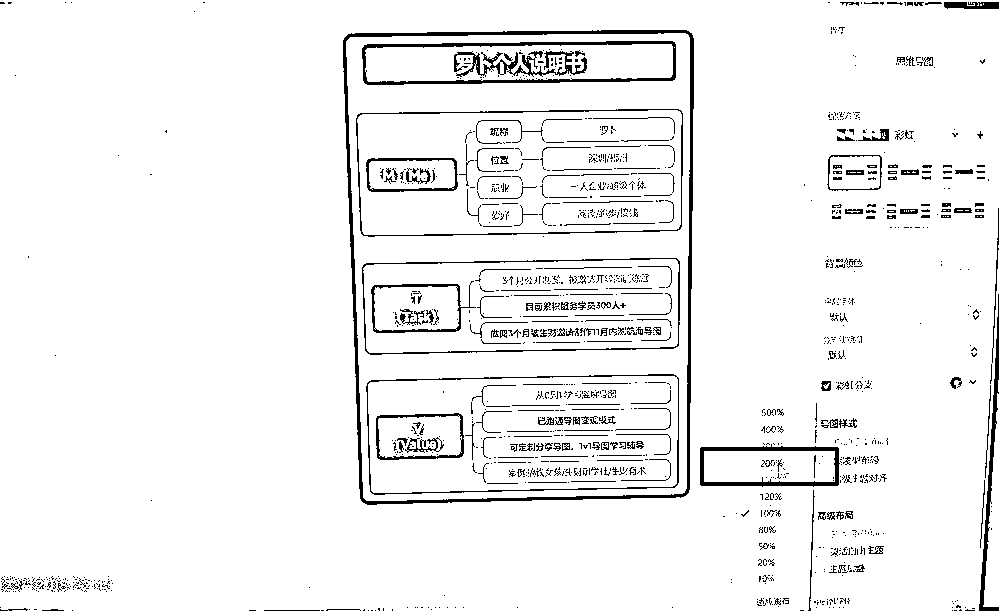

2.点击 F7 保存图片

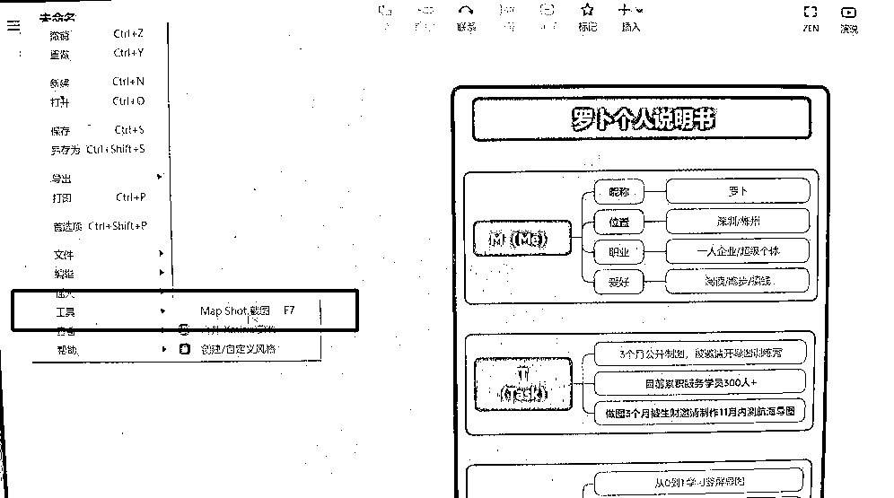

截图保存

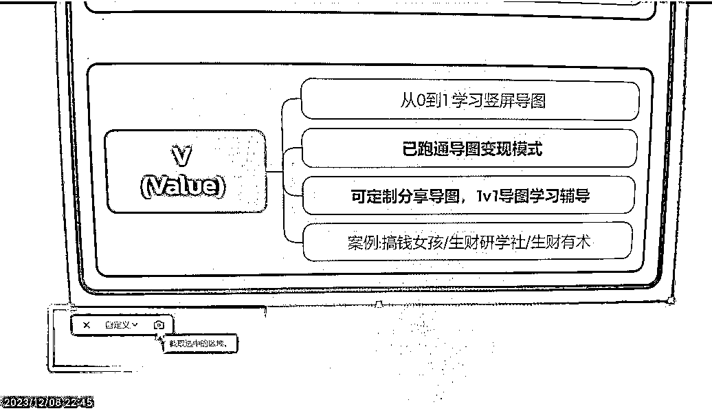

最后成品

通过制作【自我介绍】的思维导图，我们已经练习了思维导图工具的三大核心功能。包括：思维导图的结构、思维导图的样式设计功能以及常用的一些快捷键。

接下来，我们就从这三个方面，更完整地练习一下思维导图的所有常用功能操作。

## 3.3 思维导图的八种结构 @罗卜 @熊孩子不差

确定思维导图的结构，会奠定整个结构逻辑基调。

我们在做【自我介绍】思维导图时，用到了逻辑图，但一共有 8 种结构图。我们该如何选择使用呢？

### 3.3.1 结构一：平衡图

有 2 种结构：不平衡、顺时针。样式分别如下图：

### 3.3.2 结构二：逻辑图

有 2 种结构：向左、向右。样式分别如下图：

括号图：和逻辑图几乎一样，只不过样式是括号型的。

也有向左、向右两种。样式分别如下图：

括号图：和逻辑图几乎一样，只不过样式是括号型的。也有向左、向右两种。样式分别如下图：

有 2 种结构：向上、向下。样式分别如下图：

向上，更强调自下而上的思考：先发散、再总结。

向下，更强调自上而下的思考：结论先行，再发散、拓展。

有 3 种结构：向左、向右、平衡，样式分别如下图：

### 3.3.5 结构五：时间轴

特点：表示时间顺序或者事情的先后逻辑。

有 2 种结构：水平时间轴、垂直时间轴，左右分布的水平时间轴。分别如下图：

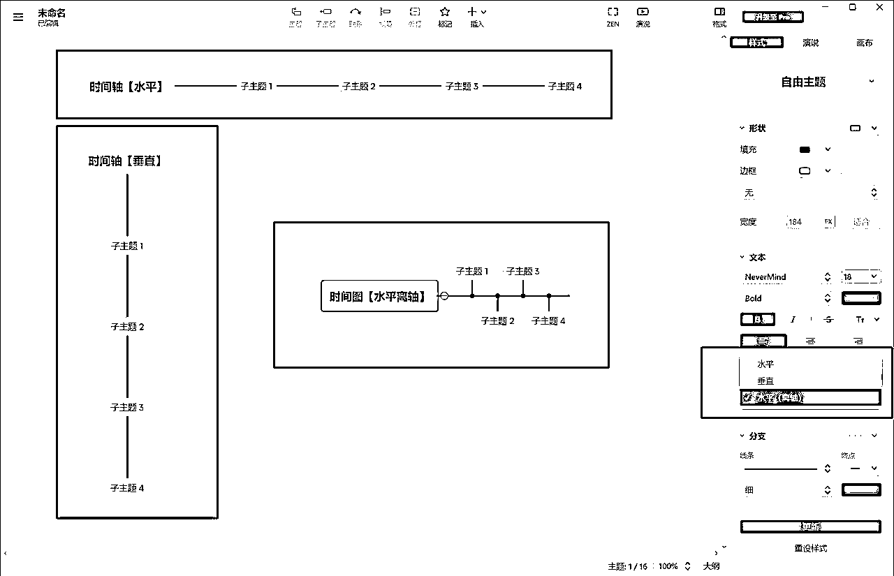

### 3.3.6 结构六：鱼骨图

特点：像是一条鱼的骨头，分支线条是鱼的骨头，分支主题是鱼鳍。

适用场景：适合用来进行事件、问题的决策分析。

鱼头向左解决对策型问题。也就是先提出问题，想具体的解决方案。

有 2 种结构：向左、向右。样式分别如下图：

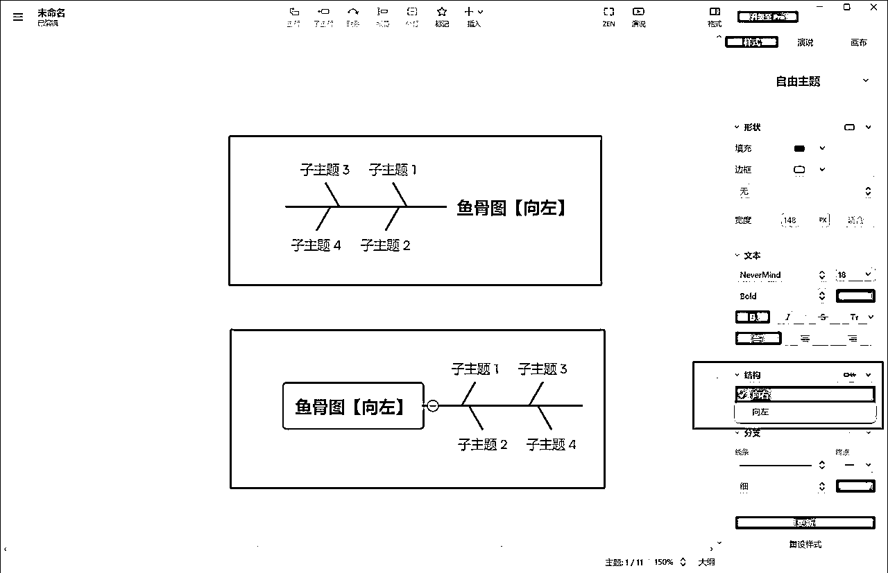

例子：如图所示

有 2 种结构：标题置顶、标题靠左，样式分别如下图：

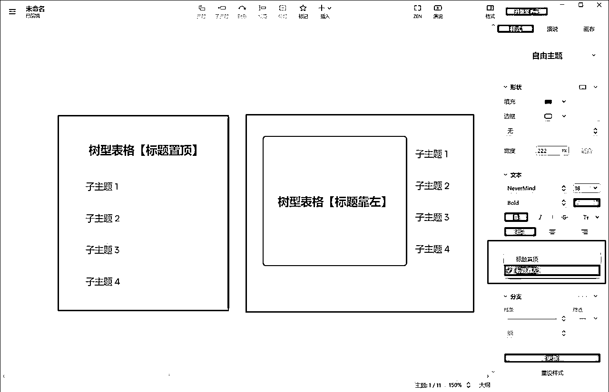

### 3.3.8 结构八：矩阵图

有 2 种结构：行、列，样式分别如下图：

## 3.4 常用的思维导图结构 @熊孩子不差

常见做 竖屏思维导图 结构会用到【逻辑图】【时间轴】【树形表格】。

这里我给大家演示 3 种不同的竖屏思维导图作图方式：

### 3.4.1 逻辑图做竖屏思维导图

样版展示：

实操演示

逻辑图做竖屏思维导图可以参考咱们前面的视频和图文。

### 3.4.2 时间轴做竖屏思维导图

应用案例

这个模版适用于那种几个点，几个步骤的场景，比如：早起的几个步骤，时间管理七步法，类似这种场景，一个分支一个点。

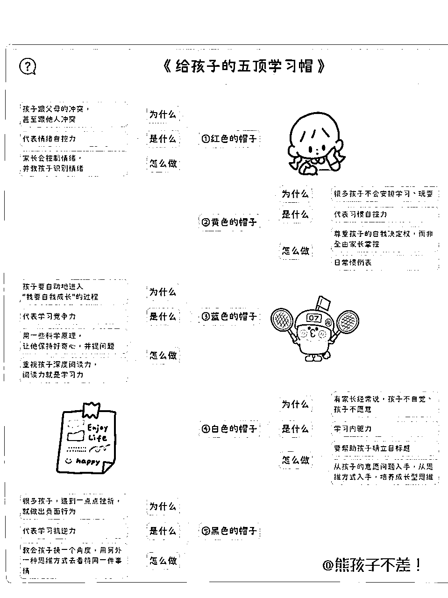

效果展示

接下来是时间轴+垂直组成的竖屏思维导图，我先给大家看看效果，再来分解步骤！

实操演示

这里我们再来看看这个模版是怎么做出来的：

第二步：选择时间轴+垂直

第四步：填充所需内容

第六步：调整配色、边框形式

第七步：为整个导图加上外框，并调整外框的形式

你做好了吗？做好了来比对下你的和我的模版的区别？

### 3.4.3 树形表格/矩阵图做竖屏思维导图

接下来是咱们的树形表格。

效果展示

实操演示

第一步：新建画布，选择树形表格

第二步：为分支主题增加子主题

第三步：留一行做标题，其余继续按第二步操作

第四步：填充内容第五步：调整边框宽度和字号大小

第六步：调整配色

关于颜色的选择，如果你想要一个好看的配色你可以自己调整，如果你觉得配色不那么重要，那就选择系统自带的，节省时间。

如此操作，根据需要继续增加分支主题和子主题，完成我们需要的导图样式。

## 3.5 进阶思维导图结构——自由组合 @罗卜

具体如何操作的呢？可以看下面的视频：

多种结构的组合 步骤操作.mp4【在线播放】00: 55 创建自由主题

01：31 标题 信息栏

01：39 逻辑图-向右

03：18 括号图-向右

03：44 组织结构图-向下 04：36 树形图-平衡

05：10 时间轴-水平（离轴）

06：01 鱼骨图

06：27 树形表格

06：50 矩阵图 07：35 金句

07：50 导图宽度调整

## 3.6 思维导图的样式设计 @罗卜

### 3.6.1 常见样式设计技巧

样式设计参数

下图是竖屏思维导图样式，常用的设置参数，供大家参考。

随着熟练度的提升，大家可以自己灵活应用，进行创作。

样式设计的常用功能

下图是和样式设计相关的，所有基本功能。

大家可以跟着老师的视频演示，做一个一样的思维导图，就可以进一步练习，熟练掌握这些功能的使用！

导图基本功能.mp4【在线播放】视频时间线：

00：12 创建自由主题

00：34 边框形状

01：40 有无填充

02：22 填充深浅 03：08 有无边框

03：54 宽度设置

04：25 字体类型

05：12 字体颜色

06：28 字体大小 07：00 字体粗细

07：26 外框

07：40 概要

07：48 自由主题+联系线

08：22 标记

### 3.6.2 常用的快捷键

要想提升导图设计速度，快捷键的使用很重要。老师把所有的常用快捷键，做成了一张思维导图。

要想提升导图设计速度，快捷键的使用很重要。老师把所有的常用快捷键，做成了一张思维导图。

大家可以跟着老师的视频演示，做一个一样的思维导图，就能轻松掌握这些快捷键的使用啦！

常用快捷键.mp4【在线播放】

视频时间线：00：15 创建自由主题

00：35 标题+信息栏

00：50 增加主题

02：40 编辑内容

05：40 工具 06：35 调整全局宽度

# 四、【项目实操 3/3】进阶——思维导图技能提升 @罗卜

💡

章节概要通过前面的学习，我们已经基本掌握了 Xmind 工具的主要功能，也能使用它制作出简单的思维导图。

想要做出更高质量的思维导图，并且能将思维导图应用到更多领域，关键有两点：

1.

能够准确提炼文章、书籍或者脑中思考的核心内容，并且建立清晰的框架。

2.能够设计美观、且逻辑清晰的导图样式，提升阅读效率和传播度。

接下来就从提炼内容、样式设计这两点入手，教大家继续提升制作思维导图的能力。具体包括：

✅内容提炼技巧✅样式设计技巧提升

✅进阶思维导图实操案例

再强调一下，本次航海很多重点知识在图片和视频中，一定要认真看图片和视频，并跟着实操，学习效果才更好。

💡

本章航线图

完成本章节的学习和实操，即可完成航线图的第二阶段和第三阶段。

第二阶段：选定 1 个内容，制作并持续优化思维导图（约 5～7 天）

提取重点内容，完成第 1 版思维导图（约 1～2 小时）

用 2-3 个以上的结构，完成第 2 版思维导图（约 1～2 小时）

用生财样式设计，完成第 3 版思维导图（约 1～2 小时）

自由设计样式，完成第 4 版思维导图（约 2～3 小时）

第三阶段：持续提升思维导图设计能力（约 5-7 天）

选某家公司 logo，找 1 个内容做思维导图（约 1～2 小时）

选本书作参考配色，找 1 个内容做思维导图（约 1～2 小时）

选某个 PPT 配色，找 1 个内容做思维导图（约 1～2 小时）

以本期航海复盘为主题，做 1 张思维导图（约 1～2 小时）

那么现在，就请开始完成这几个练习吧。

## 4.1 内容提炼技巧

### 4.1.1 方法一：遵循金字塔原则

使用金字塔结构应掌握四个原则：一篇一主题、结论先行，以上统下、上下对应，归类分组、逻辑递进。

一篇一主题，结论先行

一篇文章、一本书、一个思维导图只聚焦一个主题，并且在开头就直接道出中心思想。

举个例子：

美国有一个节目是主持人采访一些小朋友，主持人问一个小朋友你的梦想是什么？

小朋友说飞行员，主持人接着问“那如果你正在驾驶的飞机没有汽油了你会怎么办？小朋友说“我会让乘客都绑好安全带不要动，然后我用降落伞跳下去”!大家哄堂大笑打断了小朋友的说话，大家普遍会以自己的想法认为“这就是人性的恶、自私”，但是故事的结论是：小孩希望跳下去之后去寻找汽油回来救这些乘客。

因此，沟通表达的时候要结论先行（同样适用于导图）。如果一开始给出过多杂乱的信息，会使听者难以理解我们要表达的意思。

用结论先行的方式，小朋友可以这样说：我要找汽油救我的乘客。

主持人问：怎么救呢？

小朋友说：我会让乘客都绑好安全带不要动，然后我用降落伞跳下去寻找汽油。

这就是结论先行。在一开始先表达观点、结论，再阐述具体的理由、或者方法。先总结，后具体。

如何应用：在做思维导图时，一般可以直接将文章标题，或者书籍标题，或者脑中思考的那个问题，直接作为主题。并且直接给出作者的观点或自己观点，再层层下拆。比如，下面这张图。

以上统下，上下对应任何一个层次的思想，应该是对其下一层次思想的概括。下图中的 A 是对 A1、A2、A3 的概括，B 是对 B1、B2、B3 的概括。

举个例子：以下面这张思维导图的内容为例。

STAR 法则是对结果、情景、任务、行动的总结。

情景又是对工作背景、项目背景的总结。

如何应用：在制作思维导图时，有意识地关注目录、章节标题等等，这些都是更上层的内容。

归类分组（分类清楚）、逻辑递进（排序逻辑）

每组中的思想必须属于同一个范畴。并且要符合 MECE 原则，Mutually Exclusive Collectively Exhaustive，即：相互独立 完全穷尽。

也就是 A1 、A2、 A3 必须是同一范畴，并且相互独立、完全穷尽。

每组中的思想，应该按照一定的逻辑顺序排序。比如：时间顺序、空间顺序、重要性顺序等。

也就是 A1 、A2、 A3 可以按照时间（步骤）顺序、结构（空间）顺序、重要性顺序等进行排序。

举个例子：

先看归类分组（分类清楚）：

“什么是自律”，下面的 3 点全部是对自律的解释。

“如何自律”，下面的 4 点全部是自律的方法。

符合分类清晰原则，如果把“找目标”放入了“什么是自律”，就出问题了。

再看内容的逻辑递进（排序逻辑）：

“如何自律”的 4 点：找目标、养成习惯、找到正反馈、自律小技巧，就是按照操作步骤排序的。

如何应用：在做思维导图时，上层的内容一般有标题、目录可参考直接使用，但最下层级的内容一般需要自己提炼，也最容易出现逻辑不清。

所以，提炼完所有内容后，可以对照归类分组、逻辑递进原则进行自查，看是否把同类项合并了，是否有按照一定的顺序排列。

最后，再总结一下，金字塔原则是：自上而下表达。

一篇一主题、结论先行，以上统下、上下对应，归类分组、逻辑递进。

### 4.1.2 方法二：5W2H 分析法

5W2H 分析法，又称为“七何分析法”，是常用“战术”层面分析方法，是第二次世界大战时期的美国陆军兵器修理部首创。

5W2H 分析法既是是一种系统的思维方式，也是一种应用工具。可以帮助我们快速地、逻辑清晰地梳理问题和内容。

其中 5W 分别指：为何（Why）何事（What）何人（Who）何时（When）何地（Where）

2H 则分别指：如何（How）何价（How mach）

WHY--为什么？为什么要如此做？意义何在？根本原因是什么？有此结果究竟是为什么？

WHAT--是什么？此举的目的是什么？具体需要去做什么工作？

WHERE--何处？地点在哪里？从哪处着手？

WHEN--何时？在什么时间完成？最适宜的时机是什么？

WHO--谁？由谁来执行？安排谁来完成？谁对此事负责？

HOW --怎么做？如何提高效率？实施的方法怎样？

HOW MUCH--多少？需要做到什么程度？数量有多少？质量需要达到什么水平？费用是多少？做的成果如何？

这个思考框架，也非常适合我们用来梳理思维导图的内容。

比如，梳理下面的 12 月航海志愿者招募信息。用 5W2H 就可以快速提取出核心信息。

再比如，星球中有很多分享项目经验的文章。也可以借助这个框架：What 项目是什么？

Why 为什么做这个项目？

When 何时何地做这个项目？

Who 谁做的？

How 用什么方式做的？

How much 做的成果如何？

要注意，5W2H 是一种辅助思考框架，不必强求齐全，有些内容只有 5w 没有 2h 也可以，4W1H 也可以，重在逻辑清晰。

### 4.1.3 方法三：关键词提取

前面两个方法，都是用来帮我们梳理逻辑框架的。接下来，看看面对大段的文字，如何快速提取关键词。

“提炼关键词”就是从一段较长的话，提取几个词语来概括总结该段话。直白讲就是“缩句”。

关键词一般以“名词”“数词”“动词”为主。

名词表示特定人物、地点、事件、时期等等。可以快速激发大脑图像，有助于记忆。

数词，用数字表示时间、年份、人数等。

动词，就是代表动作的词。

比如：

北京 房价 每年 上涨 2 万元

名词 名词 数词 动词 数词通过几个词，立刻能清晰地知道这些关键词所代表的信息是什么。

提炼关键词的三项原则：概括性原则。

要高度概括和总结，且能够唤起你充分回忆。也叫做简单原则。你不能简单地把一个事物描述清楚，说明你没有真正的理解它。简单可以让我们秒懂更快地理解。

简单的方法，就是找前面说到的“名词”“数词”“动词”。

举个例子：

大家遇到的第一个卡点会是可能不好判断具体的品是处在爆发期的哪个阶段。

提炼后：

第一个 卡点：不好判断 产品 处在 爆发期哪个阶段

数词 名词 动词 名词 动词 名词

表意清晰原则。

如果省略某个关键词你会对内容产生误解，这样的关键词就应该保留。

举个例子：

文案内容：先在抖音里找对标产品的直播间，用江湖这个软件进行录制，录制时长最好在 2 个小时以上。

如何在抖音上找到对标直播间素材呢？其实很简单，打开小红书对标直播商品，截图，通过抖音以图搜直播的方式。

错误示范：在抖音找对标产品直播间 录制 时长 2 个小时以上

这几个关键词看了就会让人很着急，怎么录制，录什么？改成：

在抖音找对标产品直播间 用江湖软件录直播 录 2 个小时以上

就清晰很多。

一线一词原则

一个线条（节点）只写一个核心信息，不要把多个信息放在一个框里。

举个例子：文案内容：

第三步：OBS 设置

把素材添加到 OBS 中，然后在设置中调一下视频的分辨率”1080*1920”，音频设置成”监听并输出“，素材一定要设置成”循环播放”，最后把虚拟摄像头打开。

错误示范：把整段文字精炼后，放在了一个节点框中。

把素材添加到 OBS 中，在设置中调视频的分辨率”1080*1920”，音频设置成”监听并输出“，素材设置成”循环播放”，把虚拟摄像头打开。

正确做法：这一段话里面有 5 个步骤，按照一线一词原则，每个框只放一个步骤。

1.把素材添加到 OBS 中

2.在设置中调视频的分辨率”1080*1920”

3.音频设置成”监听并输出“4.素材设置成”循环播放”

5.把虚拟摄像头打开

## 4.2 样式设计技巧提升

### 4.2.1 形状和线条的使用

思维导图的样式设计，关键在于巧用形状增加设计感

形状的妙用.mp4【在线播放】视频内容时间线：

1.视频时间：00:00 内容：单横线

2.视频时间：00:55 内容：双横线

3.视频时间：01:25 内容：双层框 4.视频时间：01:38 内容：双引号

5.视频时间：02:00 内容：书名号

6.视频时间：02:17 内容：单括号

7.视频时间：02:47 内容：椭圆形自由主题&联系线的妙用

自由主题的妙用.mp4【在线播放】视频内容时间线：

1.视频时间：00:00 内容：自由主题做标题 or 信息栏

2.视频时间：00:15 内容：自由主题做分割线

3.视频时间：01:55 内容：自由主题做装饰图标

4.视频时间：02:43 内容：自由主题+联系线，做边框 4.2.2 色彩搭配

要做好色彩搭配，首先要了解色彩三要素。

色相：具体的某个颜色，如红橙黄绿，就是四种色相。

饱和度：色彩的鲜艳程度。饱和度数值越高，则颜色越纯。

亮度：色彩的明亮程度。亮度数值越高，颜色的明亮程度越高。

#### 4.2.2.1 色彩搭配原则

深底浅字，浅底深字：这个原则会保障我们出的图至少字迹清晰，不会使读者看起来太累。

#### 4.2.2.2 同类色搭配

在色相环中，夹角 60°以内的色彩，色相对比差异不是很大。如下图的橙与黄、绿与青，这类被称为同类色。

使用同类色进行色彩搭配，这种搭配法呈现出协调、统一的视觉效果，使设计作品的版面细腻、沉稳、平和。

#### 4.2.2.3 邻近色搭配

在色相环中，任选一种色彩，与其间隔 60°~90°的被称为邻近色，如红与黄、橙与绿等。

#### 4.2.2.3 邻近色搭配

在色相环中，任选一种色彩，与其间隔 60°~90°的被称为邻近色，如红与黄、橙与绿等。

#### 4.2.2.4 对比色搭配

在色相环上，夹角 120°左右的两种颜色被称为对比色；例如：黄色与蓝色、红色与青色；

#### 4.2.2.5 互补色搭配

在色相环上，夹角为 180°的两种色被称为互补色，例如 ，蓝色与橙色，黄色与紫色；互补色能体现出强烈的色彩对比和矛盾冲突。

使用互补色也能进行色彩搭配，但因互补色能体现出强烈的色彩对比和矛盾冲突，所以，在设计作品时，应该谨慎使用，否则

#### 4.2.2.6 配色工具

如果刚开始自己不会配色，可以使用配色工具。

网站-配色表：http://www.peiseka.cn/

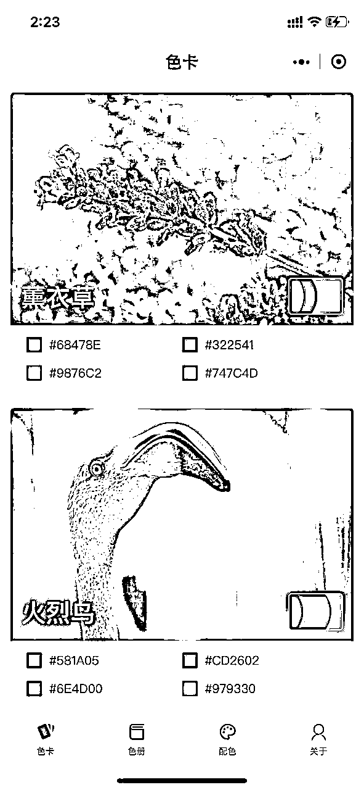

#### 4.2.2.7 进阶配色技巧

用海报或 PPT 配色在海报或 PPT 中，选择一个为主要配色，其他颜色作为辅助配色。通常会选择一个颜色较深的作为主色，再选一个作为辅色，两者组合成导图配色。

比如，我做生财的思维导图配色，就是从生财海报中提取的颜色。

书单类思维导图配色

在书中封面处，选择一个为主要配色，其他颜色作为辅助配色。

比如，我做的这个《认知觉醒》思维导图，就是从书籍封面提取的配色。

用 logo 配色

在其 logo 上，通过 Xmind 填充，用吸管，选取一个为主要配色，其他颜色当辅助色。

比如，我给搞钱女孩栏目做的思维导图。

设计思路：

主题是“中国书法艺术”，我脑中冒出的核心风格元素就是：仿古的中国风配色，飘逸的、自由洒脱的感觉。具体的设计思路如下：

1.结构：为了展现飘逸、自由洒脱的感觉，全篇采用了【自由主题】加弯曲的【联系线】连接，有种书法肆意挥洒的感觉。

但自由≠散乱，逻辑依然要有，按历史时间线从上而下串起所有内容：每个时期的案例、文字、书法图等。

用【自由主题】创建单个内容，然后通过联系线彼此连接。

2.配色：就直接提取了书法书籍的常用颜色。

3.样式&装饰：所有的边框和标题框，都用了偏中国风的款式，最后还搭配了印章装饰，增加了整体感。

案例二：人物关系图——《平凡的世界》

设计思路：

本张导图由组织结构向下+自由主题+联系线；先把书的大概脉络用组织结构图展示，其他相关的用【自由主题】单独展示，然后通过联系线把有关系的两者连接，并在联系线的中间位置说明关系等，最后用自由主题做外框。

主题是“书籍人物关系或影视剧人物关系”，我脑中第一时间浮现的是有点像公司的组织架构图。具体的设计思路如下：1.结构：为了把人物关系梳理清楚，采用了【组织结构图向下】+【自由主题】+【联系线】。

以家庭为单位，用【组织结构图向下】+【自由主题】先建立各个家庭的人物关系。再用【联系线】将各家有关联得人物相连接。

2.配色：直接提取了书籍和影视剧的常用颜色。

3.样式&装饰：这个内容关系比较复杂，线条较多，所以就精简了样式，整体没有用任何装饰、边框和线条也都是简洁风格。

大家在作图时也要注意，内容复杂设计尽量简单，内容简单可以稍微重设计，两者平衡得当整体才耐看。

案例三：记录一周的生活

设计思路：主题是“生活模块”，做一周的生活日常记录。为了让自己看到它就充满活力，我使用了五颜六色的搭配，让每天的生活都充满色彩。具体的设计思路如下：

1.结构：整体采用了【逻辑图-向右】，按照时间排序，统一用小方块对齐。

清晰整齐有仪式感。

2.配色：使用五彩的配色，鲜艳活力。并且把颜色和事项管理结合起来，用不同的颜色代表不同的事项，一目了然。

3.样式&装饰：为了配合五彩的颜色，让整体更加活泼，增加了各种表情搭配，并且用小图标进一步区分不同事项，帮助使用。

每日复盘/周复盘/年复盘，也可参考这种方式。

4.2.4【其他】设计书籍推荐

《写给大家看的设计书·第 4 版》《别说你懂思维导图》

《思维导图》《高效学习法:用思维导图和知识卡片快速构建个人知识体系》

《XMind:用好思维导图走上开挂人生》

## 4.3 进阶思维导图实操案例

《高效学习法:用思维导图和知识卡片快速构建个人知识体系》《XMind:用好思维导图走上开挂人生》

4.3 进阶思维导图实操案例

具体演示，录制成视频，方便大家对照学习。

### 4.3.1 内容提炼

内容提炼 导图初稿.mp4【在线播放】

制作步骤：（左边放置文章，右边放置导图）

视频时间：00:06 1.讲解提炼原则：简单原则/核心原则/关键词提炼。

视频时间：03:40 2.标题/信息栏制作

视频时间：05:23 3.项目介绍内容提取&梳理视频时间：09:05 4.前言部分内容提取&梳理

视频时间：11:16 5.“一. 小红书无人直播赛道选品”部分内容提取&梳理

视频时间：17:30 6\. “二. 录制抖音直播视频”部分内容提取&梳理视频时间：25:50 7.“三. 测品方法”部分内容提取&梳理

视频时间：30:02 8.“四. 注意事项”部分内容提取&梳理视频时间：31:13 9.“五. 小红书无人直播赛道踩坑点”部分内容提取&梳理

### 4.3.2 样式设计

当我们把内容都提炼完成，接下来就说导图的美化及内容进一步优化。

制作步骤：

视频时间：00：05 内容：基础设定：全局字体+分支线条+导图样式紧凑布局

视频时间：01：08 内容：精简内容，再次对全局内容进行调整，添加编号等视频时间：05：00 内容：字体设置 设置全局字体为 12 号；

依次设置标题： 24 号

信息栏：10 号

小标题：18 号分支主题：14 号加粗

二/三级子主题：12 号

视频时间：06：36 内容：设定全局宽度 以标题宽度 600 为标准宽度

标题/信息栏(整个导图宽度) ：600 小标题：600

分支主题宽度：120/140

子主题宽度：根据前后主题调整合适宽度

视频时间：16：04 内容：颜色设置标题填充： #025A5A 字体颜色：#FFFFFF

信息栏填充：#FFFFFF 字体颜色： #000000

小标题填充：#025A5A 饱和度 80% 字体颜色：#FFFFFF

分支主题填充：#007C74 字体颜色：#FFFFFF

子主题填充： 无 字体颜色：#000000 分支线条边框：极细 边框颜色：#025A5A

子主题字体颜色：#000000

视频时间：20：05 内容：全局字体居中视频时间：20：34 内容：添加外框，设置边框。导图分页

外框填充：#FFFFFF 边框线条：极细 边框颜色：007C74

视频时间：23：02 内容：局部优化

从上往下，从主题到分支主题，依次从单个主题，再到整体美化酌情添加表情，图片，字体加粗，内容标记

视频时间：24：18 内容：隐藏线条和隐藏中心主题

### 4.3.3 导图保存&分享

导图保存.mp4【在线播放】

注意事项：

1.

根据导图内容，合理分配 2-3 页再截图导图，保持一张导图刚好可以在一页手机屏阅读。

在导出之前把导图内容放大至 200% 再导出，让内容更清晰。

3.航线图最后一个任务的参考模版：

# 选修篇：

# 五、发布小红书，验证导图内容探索变现 @熊孩子不差

💡

章节概要通过必修部分的学习和练习，相信大家已经掌握的竖屏思维导图的制作方法，以视频、直播等实操为主，带着大家从入门到进阶，逐步掌握思维导图技能。

很多伙伴可能想知道自己导图做得质量如何，也希望能够通过导图带来一些变现。

选修部分，就带大家从比较适合图文内容的小红书平台入手，一起探索变现方式。

主要包括：

✅搭建小红书账号

✅小红书常见的思维导图内容形式✅思维导图账号案例分析

赶快开始吧！

## 5.1 搭建小红书账号

### 5.1.1 为什么选择小红书，验证模式？

小红书是目前各平台中对图文内容最友好的。

现在各平台都以视频为主，做图文内容很难获取流量。唯独小红书 2.

用思维导图做出的内容，很符合小红书用户需求。

思维导图的特点，能体现逻辑能力，能高密度地呈现知识或者框架，给人一眼就觉得是干货的感觉。

思维导图内容呈现的特点和逻辑恰好符合小红书平台的对内容评分权重的逻辑。

所以，我们选择小红书作为探索思维导图内容变现的平台，再合适不过了。

### 5.1.2 搭建小红书账号并完成账号包装

可以参考《12 月航海 | 小红书运营 | 实战手册》中第二章的内容【项目实操 1/3】明确个人定位，搭建小红书账号，完成账号注册和包装。

## 5.2 小红书思维导图内容形式

做内容之前，首先要了解小红书的常用图片尺寸。

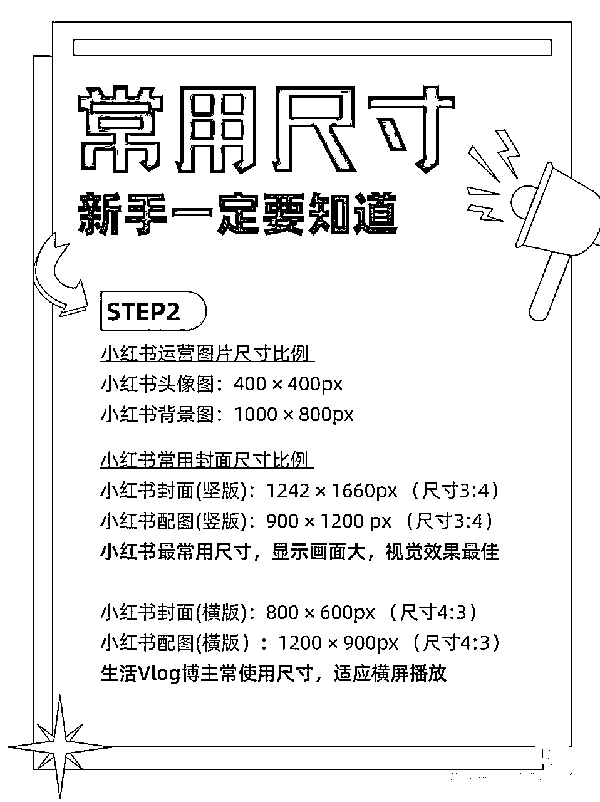

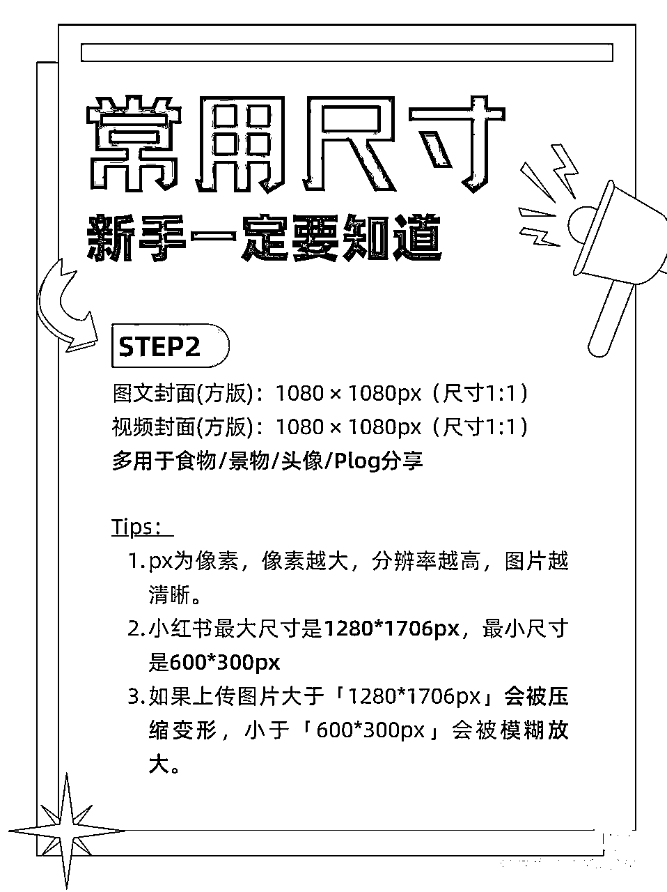

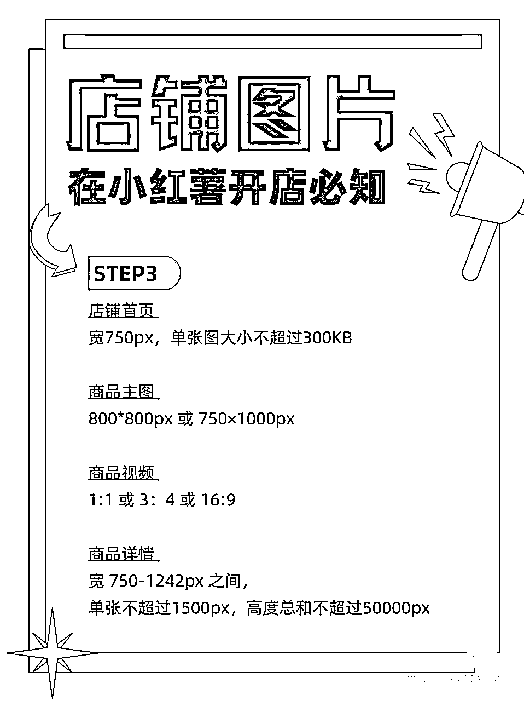

小红书主要尺寸有三种：一种是 1：1，一种是 3：4；另一种是 4：31：1 比例

在截图区域可选择 1：1 或自定义

3：4 比例/4：3 比例需借助一张小红书标准尺寸图片，作为参照物，同时再导图中做调整。

下面介绍小红书思维导图常见的 6 种内容形式，大家可以根据选题，灵活选择不同类型。

形式一：合集型

体现数量多，数量越多越好。

形式二：测评型

对某件东西或景点进行测评，孰好孰坏，一一罗列出来

形式三：科普型可以理解为新手了解某个领域的知识点整理。

比如，咱们的航海手册可以算是一个非常全面的科普手册，是什么，为什么，怎么做，都写得很清楚。

形式四：避坑型

展现一件复杂事情完成过程的各种坑，帮助即将入门的新人成功避坑。

形式五：教程型从多个维度总结一件事情，每个维度要讲全面、清晰，具体要怎么做，要注意什么，这个也是用思维导图罗列再合适不过了。

以上是小红书上比较受欢迎的几大笔记类型，这些笔记都是密集型干货，都可以通过思维导图呈现，帮助用户解决问题，找到解决办法的笔记。

## 5.3 思维导图账号案例

思维导图是工具，所以我们要用借助好这个工具来承载我们的知识，第三节的内容就从一些案例展开，看看我们该如何借助思维导图打造属于我们自己的专属 IP，希望这些案例能够启发一些小伙伴对自己已有的技能应用。

案例一：读书博主

思维导图可以解决一个很大的痛点，那就是帮助我们阅读，很多人看书看完就忘记，用思维导图一边看一边梳理，记忆深刻，同时把你的导图笔记分享出来给他人，可以帮助别人节省阅读时间，或者想看一本书，看下你的笔记就知道这本书值不值得看，或者想看一本书，但是一直没时间看，通过你的笔记了解精华知识点~那如何用思维导图做一个读书博主呢？

定位：用思维导图形式分享读书笔记（我写的是比较概括的哈）

封面：一直用同一款模版，所以提前设计好一款模版，往后就是打开文件改文字，一劳永逸的事情。如同咱们的 PPT 模版一样，你只需要对应在里面改文字。

内容输出形式：

①一条笔记多张图文都和封面同一个模版②一本书输出几张笔记发布一条或者一本书多张图发布多个笔记

③结合输出内容的关键词，找到一些爆款标题，将咱们做的导图改成爆款标题的形式，导图更有诱惑力！

比如，你看《洋葱阅读》这本书，看完之后，提炼出阅读步骤的导图，标题为：7 步骤高效阅读法等

变现形式：

①卖导图模版，开个店铺卖导图模版

②接广告，结合粉丝人群接广告

③引流到私域，做读书会，带领大家拆书阅读做笔记④思维导图代做服务

⑤思维导图训练营产品

适合人群：

①阅读较快，擅长做笔记的人②私域有学习读书产品的人

④逻辑思路清晰，会用思维导图的人

读书博主的思维导图做法和注意点：封面：单张导图或者整本书的导图，加个爆款话题

内页内容上：每一张呈现一个知识点，不要死板的直接把书籍目录或者章节标题写出来，要学会站在自媒体人的角度写思维导图的标题，比如你看《早起的奇迹》这本书，我们可以试着把早起的 7 个步骤罗列在一张导图上，这张导图就可以叫“7 步戒掉熬夜，学会早起自律”等等。

然后围绕这个点，开始展开给大家分享，为什么要早起，早起的 7 个步骤、坚持早起过后的改变或者一些案例，这样我们的分享是可以真的带着粉丝落地实践的，那么你给到粉丝的干货性就更强，不仅仅是在搬运作者的一些观点。

我之前做过一个号分享“思维模型”，每次都会在最后带上一个案例，真正能让人知道这个模型怎么使用的恰好就是这个案例，说了那么多的是什么、为什么，不如教他怎么做。所以我特别建议读书博主可以从书中延伸运用案例出来。

小红书标题：小红书标题也很重要的，有很多书籍压根小红书上没啥搜索，你直接把标题写为书籍的标题，大概率会石沉大海，这时候我们就得运用爆款标题的方法来写，具体大家也可以研究小红书的爆款标题写法。

我自己最喜欢的一种，搜索我想分享的关键词，看看有哪些爆款，随便找 3 个爆款标题重新组合下变成我的标题，简单好用。

定位精准，输出精准，内容风格统一，很容易涨粉的，对你感兴趣的粉丝进入你的主业一看，这个博主有点内容，关注了！

案例二：技能类博主（复盘、英语教学、早教启蒙等等）

这里我分享一个用思维导图做复盘的博主，他就是自己设计了一套思维导图复盘模板，每周每月复盘或者针对自己的一些大事件复盘分享。

定位：用思维导图呈现自己的技能封面：复盘内容集合，比如本周做了四页复盘，那就把这 4 页拼在一起，作为封面，对复盘感兴趣的小伙伴一定想看看这 4 页都复盘了什么，我是不是可以学习借鉴呢，这个博主好自律呀，我要学习下等等，整体来说就是很吸睛。

内容输出形式：③导图色调较多，符合生活的调性~

变现形式：

①引流到私域做复盘/成长类知识付费产品

②引流到私域做其他

③卖复盘模板适合人群：

①有相应的知识付费产品的人

②拥有一个技能且可以解决他人某个问题的人

③会用思维导图将技能呈现技能博主的思维导图做法和注意点：

封面：把技能展现出来，做复盘的，把你的复盘结果展示出来人，让人感受到做复盘的美好和充实。

内页内容：内页内容主要就是展示你这个技能的过程，有的宝妈用思维导图教孩子阅读，那咱们就把思维导图如何一点点教孩

小红书标题：依旧采用咱们上面说到的爆款思路，但是一定要有你技能的关键词：思维导图+技能关键词（读绘本/学英语/复盘）

案例三：私域引流类博主

定位：用思维导图呈现领域/行业专业知识封面：资料/方法集合（对导图技能要求不是特别高，只要能将内容整洁的表达即可，重点在内容）比如：7 大引流获客方法/加微信的 51 个钩子等等

内容输出形式：

①方法一：将封面中的内容一点点放大呈现，就凑成了 4-5 张内容

②方法二：推荐副业项目或者生财赚钱案例（一张卡片介绍项目、一个收入截图、一个思维导图拆解、一个用户证明）

变现形式：①引流到私域，做咨询付费

②引流到私域，卖副业项目训练营

③引流到私域，卖生财的门票等

适合人群：

①某个领域的操盘手/有成功经验的人

②有知识付费产品或可分销可靠的产品的人

③副业第一步分享副业赚钱项目的人私域引流博主的思维导图做法和注意点：

封面：一定要大字突出你的这张导图上的信息很多很全，可以帮助对应的人群解决某些痛点，比如：100 个引流技巧，50 个打造 IP 的技巧，80 个朋友圈发圈技巧，这里就决定粉丝点击，决定粉丝来找你，说白了私域引流博主用思维导图的目的就是引流到私域来要你的这个资料。

内容上：把你的技巧一点点罗列在思维导图上，不要求颜色多漂亮，基本的层级数量一致，每个分支宽度一致就可以的。然后每个技巧也只需要讲基本的做法，简单的做法，不用讲案例。让想要资料的人觉得拥有你的这些资料他也可以轻松的实现某个目标。

标题上：数字是很大的诱惑力，标题中有数字，体现资料集合感。跟封面的方法差不多。

今天关于用思维导图帮你打造垂直 IP 的案例拆解包括但不仅限于此，大家可以根据现有博主在做的事情，继续发散，或者你还有更好的点子让思维导图跟你的技能相结合，让你的技能放大十倍、百倍。

内容来源：《如何用思维导图做小红书》

![](https://search01.shengcaiyoushu.com/upload/doc/Mh20dNTPPoMzsPx1dhscaYHanze/PY22b5IT8oPa3NxMv0lcAMGVnjb_jpeg?_=170452714